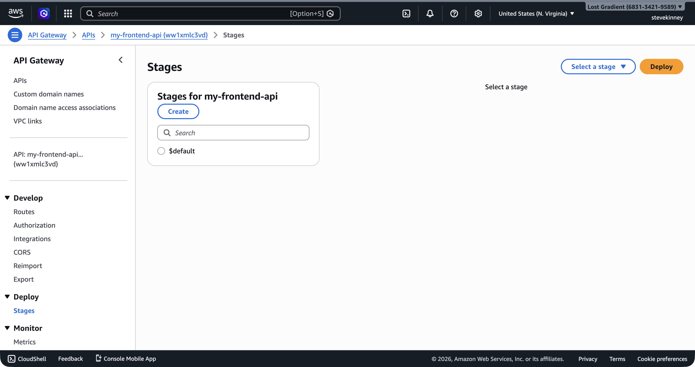

So far, your HTTP API has one stage (`$default`) and one URL (the auto-generated `execute-api` endpoint). That works for development, but production needs more: a custom domain name that matches your frontend, separate environments for development and production, and a URL that doesn't change when you recreate the API. This lesson covers all three.

If you want AWS's official version of the custom-domain behavior while you read, the [HTTP API custom domain guide](https://docs.aws.amazon.com/apigateway/latest/developerguide/http-api-custom-domain-names.html) is the canonical reference.

## Stages: Environments for Your API

A **stage** is a named deployment target for your API. Think of it like environment branches—`dev`, `staging`, `prod`—each with its own URL and potentially its own configuration. The `$default` stage you've been using is the simplest: auto-deploy is enabled, changes take effect immediately, and there's no stage prefix in the URL.

### The `$default` Stage

The `$default` stage is created automatically when you create an HTTP API. It has two special properties:

1. **Auto-deploy**—every change to routes, integrations, or configuration is deployed instantly.
2. **No stage prefix**—the URL is `https://{api-id}.execute-api.{region}.amazonaws.com/items`, not `https://{api-id}.execute-api.{region}.amazonaws.com/prod/items`.

For many applications, the `$default` stage is all you need. If you're building a single API for a single frontend, there's no reason to create additional stages. Use environment variables on your Lambda function to handle environment-specific behavior (like pointing to different databases).

### Creating Named Stages

If you want separate, isolated environments—a `dev` stage where you test changes and a `prod` stage where stable code runs—you can create named stages:

```bash
aws apigatewayv2 create-stage \
  --api-id abc123def4 \
  --stage-name prod \
  --region us-east-1 \
  --output json
```

```json
{
  "AutoDeploy": false,
  "CreatedDate": "2026-03-18T12:00:00+00:00",
  "DefaultRouteSettings": {
    "DetailedMetricsEnabled": false
  },
  "StageName": "prod"
}
```

In the console, the **Stages** section in the left navigation shows all stages for the API. Clicking a stage reveals its invoke URL and deployment settings.



Named stages don't auto-deploy. You need to create a **deployment** and associate it with the stage:

```bash
aws apigatewayv2 create-deployment \
  --api-id abc123def4 \
  --stage-name prod \
  --region us-east-1 \
  --output json
```

Named stages include the stage name in the URL: `https://abc123def4.execute-api.us-east-1.amazonaws.com/prod/items`. This prefix gets stripped before the request reaches your Lambda handler—`event.requestContext.http.path` still shows `/items`, not `/prod/items`.

You can enable auto-deploy on a named stage if you want the same behavior as `$default`:

```bash
aws apigatewayv2 update-stage \
  --api-id abc123def4 \
  --stage-name prod \
  --auto-deploy \
  --region us-east-1 \
  --output json
```

### Stage Variables

Stages can have variables—key-value pairs that you access from your Lambda handler through the event object:

```bash
aws apigatewayv2 update-stage \
  --api-id abc123def4 \
  --stage-name prod \
  --stage-variables '{"TABLE_NAME":"my-frontend-app-data","LOG_LEVEL":"warn"}' \
  --region us-east-1 \
  --output json
```

In your handler, stage variables are accessible at `event.stageVariables`:

```typescript
const tableName = event.stageVariables?.TABLE_NAME ?? 'my-frontend-app-data-dev';
```

> [!TIP]
> Stage variables are useful for pointing different stages at different backend resources—a `dev` DynamoDB table versus a `prod` DynamoDB table, for example. But for sensitive configuration, use Lambda environment variables or Secrets Manager instead. Stage variables are visible in the API Gateway configuration and aren't encrypted.

## Custom Domain Names

The auto-generated URL (`https://abc123def4.execute-api.us-east-1.amazonaws.com`) works but isn't something you want in production. Your frontend should call `https://api.example.com`, not an opaque AWS-generated hostname. Custom domain names give you a stable, branded URL that persists even if you recreate the API.

### Prerequisites

Before you create a custom domain name, you need:

1. **A domain you control**—managed through Route 53 or any DNS provider.
2. **An ACM certificate** covering the domain—created in the same region as your API (for HTTP APIs, that's the region where the API lives, unlike CloudFront which requires `us-east-1`). You set up ACM certificates in [Attaching an SSL Certificate](attaching-an-ssl-certificate.md).

### Creating the Custom Domain

```bash
aws apigatewayv2 create-domain-name \
  --domain-name api.example.com \
  --domain-name-configurations \
    CertificateArn=arn:aws:acm:us-east-1:123456789012:certificate/abcd-1234-efgh-5678 \
  --region us-east-1 \
  --output json
```

```json
{
  "DomainName": "api.example.com",
  "DomainNameConfigurations": [
    {
      "ApiGatewayDomainName": "d-abc123.execute-api.us-east-1.amazonaws.com",
      "CertificateArn": "arn:aws:acm:us-east-1:123456789012:certificate/abcd-1234-efgh-5678",
      "DomainNameStatus": "AVAILABLE",
      "EndpointType": "REGIONAL",
      "SecurityPolicy": "TLS_1_2"
    }
  ]
}
```

The response includes an `ApiGatewayDomainName`—this is the target you need for your DNS record.

### Creating the API Mapping

An **API mapping** connects your custom domain to a specific API and stage. This tells API Gateway: "when a request arrives at `api.example.com`, route it to this API on this stage."

```bash
aws apigatewayv2 create-api-mapping \
  --domain-name api.example.com \
  --api-id abc123def4 \
  --stage '$default' \
  --region us-east-1 \
  --output json
```

```json
{
  "ApiId": "abc123def4",
  "ApiMappingId": "mapping123",
  "Stage": "$default"
}
```

You can also use the `--api-mapping-key` parameter to map a path prefix. For example, mapping with `--api-mapping-key v1` makes your API available at `api.example.com/v1/items` instead of `api.example.com/items`. That's useful for API versioning.

### Creating the DNS Record

Point your custom domain to the API Gateway domain name. If you use Route 53, create an A record with an alias target:

```bash
aws route53 change-resource-record-sets \
  --hosted-zone-id Z1234567890ABC \
  --change-batch '{
    "Changes": [
      {
        "Action": "CREATE",
        "ResourceRecordSet": {
          "Name": "api.example.com",
          "Type": "A",
          "AliasTarget": {
            "DNSName": "d-abc123.execute-api.us-east-1.amazonaws.com",
            "HostedZoneId": "Z1UJRXOUMOOFQ8",
            "EvaluateTargetHealth": false
          }
        }
      }
    ]
  }' \
  --region us-east-1 \
  --output json
```

The `DNSName` is the `ApiGatewayDomainName` from the `create-domain-name` response. The `HostedZoneId` is the API Gateway service's hosted zone for your region—this is a fixed value per region, not your domain's hosted zone. For regional API Gateway endpoints in `us-east-1`, the Route 53 hosted zone ID is `Z1UJRXOUMOOFQ8`.

> [!WARNING]
> DNS propagation takes time. After creating the record, your custom domain might not resolve immediately. Give it a few minutes and test with `dig api.example.com` to verify the record is in place before troubleshooting.

If you use an external DNS provider (not Route 53), create a CNAME record pointing `api.example.com` to the `ApiGatewayDomainName` value. Recall the difference between alias records and CNAME records from [Alias Records vs. CNAME Records](alias-records-vs-cname-records.md)—the alias record is preferred when using Route 53 because it supports the zone apex and doesn't incur additional DNS lookup cost.

## Updating CORS for Your Custom Domain

After setting up a custom domain, update your CORS configuration to include the new origin your frontend will use. If your frontend calls `api.example.com` and your site runs on `example.com`:

```bash
aws apigatewayv2 update-api \
  --api-id abc123def4 \
  --cors-configuration '{"AllowOrigins":["https://example.com","http://localhost:3000"],"AllowMethods":["GET","POST","PUT","DELETE"],"AllowHeaders":["Content-Type","Authorization"],"MaxAge":86400}' \
  --region us-east-1 \
  --output json
```

## Throttling

Every API Gateway stage exposes throttling controls that protect your Lambda functions from accidental abuse. Two values matter: **burst limit** (the size of the token bucket, which caps short spikes) and **rate limit** (the steady-state refill rate in requests per second). The [account-level defaults](https://docs.aws.amazon.com/apigateway/latest/developerguide/limits.html)—**5,000 burst** and **10,000 RPS** steady-state, shared across _all_ APIs in the account—are generous enough to bankrupt a personal project if something goes wrong. Set explicit, conservative limits on your stage:

```bash
aws apigatewayv2 update-stage \
  --api-id "$API_ID" \
  --stage-name '$default' \
  --default-route-settings '{"ThrottlingBurstLimit":100,"ThrottlingRateLimit":50}' \
  --region us-east-1 \
  --output json
```

This caps the stage at 50 requests per second sustained, with room to absorb short bursts of up to 100 requests before throttling kicks in. (Burst isn't the same as "concurrent executions"—that's a Lambda concept controlled separately. Burst is the token-bucket size that lets traffic briefly exceed the steady-state rate.) Throttled requests receive a `429 Too Many Requests` response. For a personal frontend API, these numbers leave ample headroom for real traffic while preventing runaway clients from generating unexpected Lambda invocation costs.

## Common Mistakes

**Using the wrong certificate region.** For HTTP APIs, the ACM certificate must be in the same region as the API. This is different from CloudFront, which requires certificates in `us-east-1` regardless of where the distribution runs.

**Forgetting the API mapping.** Creating a custom domain name isn't enough—you also need an API mapping to connect the domain to a specific API and stage. Without the mapping, requests to the custom domain return 403.

**Stage prefix confusion.** Named stages add a prefix to the `execute-api` URL, but custom domains with API mappings don't. If your stage is `prod` and your custom domain maps to it, requests to `api.example.com/items` route correctly—you don't need `api.example.com/prod/items`.

Your API is deployed, routable, and has a proper domain name. But it's wide open—anyone with the URL can call any endpoint. The next lesson covers adding authentication to your API routes, so that only authorized users can access your endpoints.
