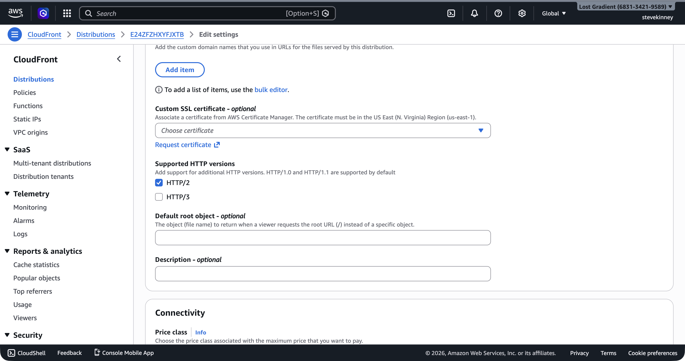

Your CloudFront distribution works, but it's still serving content on a `*.cloudfront.net` domain. That's fine for testing, but you need your custom domain with HTTPS before this is production-ready. This lesson connects the ACM certificate you provisioned in the ACM section to your CloudFront distribution.

If you want AWS's version of the alternate-domain-name rules while you work, the [CloudFront guide to custom URLs and CNAMEs](https://docs.aws.amazon.com/AmazonCloudFront/latest/DeveloperGuide/CNAMEs.html) is the official reference.

If you haven't yet requested a certificate, go back to [Requesting a Certificate in ACM](requesting-a-certificate-in-acm.md) and create one for your domain. You need a certificate in the `ISSUED` state before proceeding.

## The us-east-1 Requirement (Again)

This is worth repeating because it trips people up every single time: your ACM certificate **must** be in `us-east-1`. CloudFront is a global service, and its control plane lives in `us-east-1`. It only sees certificates in that region.

If you provisioned your certificate in a different region, you need a new one in `us-east-1`. There's no way to copy or move certificates between regions. This is covered in detail in [Certificate Renewal and the us-east-1 Requirement](certificate-renewal-and-us-east-1.md).

> [!WARNING]
> CloudFront certificates **must** be in `us-east-1`. If you created your certificate in any other region, CloudFront can't see it. Verify your certificate is in the right region before updating your distribution:
>
> ```bash
> aws acm list-certificates \
>   --region us-east-1 \
>   --output json \
>   --query "CertificateSummaryList[*].{Domain:DomainName,ARN:CertificateArn,Status:Status}"
> ```

## Updating the Distribution Config

Attaching a certificate requires updating your distribution's `ViewerCertificate` configuration and adding your custom domain to the `Aliases` list. This is a two-part change.

First, fetch the current config:

```bash
aws cloudfront get-distribution-config \
  --id E1A2B3C4D5E6F7 \
  --region us-east-1 \
  --output json > distribution-config-current.json
```

Note the `ETag` in the response—you need it for the update.

### Part 1: ViewerCertificate

Replace the `ViewerCertificate` section in the `DistributionConfig`. The current config uses the CloudFront default certificate:

```json
{
  "ViewerCertificate": {
    "CloudFrontDefaultCertificate": true
  }
}
```

In the console, the **Edit settings** page shows the **Custom SSL certificate** dropdown with no certificate selected (using the default `*.cloudfront.net` certificate).



> [!NOTE] Default cert ignores `MinimumProtocolVersion`
> When `CloudFrontDefaultCertificate` is `true`, [CloudFront silently forces the security policy to `TLSv1`](https://docs.aws.amazon.com/AmazonCloudFront/latest/APIReference/API_ViewerCertificate.html) regardless of what you set in `MinimumProtocolVersion`. That's why the default-cert block above doesn't bother with a `MinimumProtocolVersion` field—it would just be a lie. Once you switch to your own ACM certificate (next), the field becomes meaningful.

Replace it with your ACM certificate:

```json
{
  "ViewerCertificate": {
    "ACMCertificateArn": "arn:aws:acm:us-east-1:123456789012:certificate/a1b2c3d4-e5f6-7890-abcd-ef1234567890",
    "SSLSupportMethod": "sni-only",
    "MinimumProtocolVersion": "TLSv1.2_2021"
  }
}
```

Let's break down each field:

- **`ACMCertificateArn`**: The ARN of your ACM certificate. This replaces `CloudFrontDefaultCertificate`. You can't have both—it's either the default certificate or your ACM certificate.
- **`SSLSupportMethod`**: `"sni-only"` means CloudFront uses **Server Name Indication** (SNI) to determine which certificate to present during the TLS handshake. This is the standard approach and is free. The alternative, `"vip"`, uses a dedicated IP address at each edge location—it costs $600/month and exists only for compatibility with ancient clients that don't support SNI. Use `"sni-only"`.
- **`MinimumProtocolVersion`**: `"TLSv1.2_2021"` is the most current security policy for `sni-only` distributions. It requires TLS 1.2 or higher and uses modern cipher suites. Don't use older versions like `TLSv1` or `TLSv1_2016`—they allow weaker ciphers.

> [!TIP]
> `"TLSv1.2_2021"` is the recommended minimum protocol version as of this writing. It supports TLS 1.2 and 1.3, with a modern set of ciphers. Virtually every browser released in the last decade supports TLS 1.2, so there's no practical compatibility concern.

### Part 2: Aliases

CloudFront needs to know which custom domains should route to this distribution. Add your domain (and optionally the `www` subdomain) to the `Aliases` section:

```json
{
  "Aliases": {
    "Quantity": 2,
    "Items": ["example.com", "www.example.com"]
  }
}
```

If the current config has no aliases, it looks like this:

```json
{
  "Aliases": {
    "Quantity": 0
  }
}
```

Replace it with your domain names. The domains listed here must match the domain names covered by your ACM certificate. If your certificate covers `example.com` and `*.example.com` (a wildcard), you can list any subdomain. If your certificate only covers `example.com`, you can only list `example.com`.

### Part 3: HTTPS Redirect

Make sure the `ViewerProtocolPolicy` in your `DefaultCacheBehavior` is set to `"redirect-to-https"`. This was already configured in [Creating a CloudFront Distribution](creating-a-cloudfront-distribution.md), but verify it's still in place:

```json
{
  "DefaultCacheBehavior": {
    "ViewerProtocolPolicy": "redirect-to-https"
  }
}
```

This ensures that any HTTP request to your distribution is automatically redirected to HTTPS. Users never see an insecure connection.

## Submitting the Update

Apply the changes:

```bash
aws cloudfront update-distribution \
  --id E1A2B3C4D5E6F7 \
  --if-match E2QWRUHEXAMPLE \
  --distribution-config file://distribution-config-updated.json \
  --region us-east-1 \
  --output json
```

Replace `E2QWRUHEXAMPLE` with the `ETag` from the `get-distribution-config` response.

Wait for the deployment:

```bash
aws cloudfront wait distribution-deployed \
  --id E1A2B3C4D5E6F7 \
  --region us-east-1
```

## DNS: The Missing Piece

After the distribution is deployed with your certificate and aliases, you need to create DNS records that point your domain to the CloudFront distribution. That's the job of the Route 53 custom-domain-routing section. Until then, your site is accessible at:

- **CloudFront domain**: `https://d1234abcdef.cloudfront.net` (still works, using the ACM certificate for `*.cloudfront.net` under the hood)
- **Custom domain**: `https://example.com` (only works after you create the final Route 53 alias records)

## Verifying the Certificate

Once DNS is configured (or even before, using the CloudFront domain), you can verify the SSL certificate is attached correctly:

```bash
curl -vI https://d1234abcdef.cloudfront.net 2>&1 | grep -A 5 "SSL certificate"
```

Or use `openssl` for more detail:

```bash
openssl s_client -connect d1234abcdef.cloudfront.net:443 -servername d1234abcdef.cloudfront.net < /dev/null 2>/dev/null | openssl x509 -noout -subject -dates
```

This shows the certificate's subject (domain name) and validity dates.

## Common Mistakes

**Certificate in the wrong region**: CloudFront returns an error like `InvalidViewerCertificate` if the certificate ARN points to a certificate that doesn't exist in `us-east-1`. Double-check the region.

**Domain not in Aliases**: If your certificate covers `example.com` but you didn't add `example.com` to the `Aliases` list, CloudFront won't use the certificate for requests to that domain. The `Aliases` list tells CloudFront which domains this distribution answers for.

**Certificate not yet issued**: If your certificate is still in `PENDING_VALIDATION` status, CloudFront rejects it. Complete the validation process first (see [DNS Validation vs. Email Validation](dns-validation-vs-email-validation.md)). (I've definitely made this mistake—submitted the update before DNS validation propagated and then wondered why CloudFront was yelling at me.)

**Domain already in use**: If `example.com` is already listed as an alias on another CloudFront distribution (even in a different AWS account), CloudFront rejects the update. Each domain can only be associated with one distribution at a time. Remove it from the old distribution first.

> [!TIP]
> If you get a `CNAMEAlreadyExists` error, it means the domain is already associated with another CloudFront distribution. This can happen if you're migrating from an older setup. Use `aws cloudfront list-distributions` to find the other distribution and remove the alias from it first.

## The Full ViewerCertificate Object

Here's the complete updated distribution config with the certificate, aliases, and HTTPS redirect for reference:

```json
{
  "ViewerCertificate": {
    "ACMCertificateArn": "arn:aws:acm:us-east-1:123456789012:certificate/a1b2c3d4-e5f6-7890-abcd-ef1234567890",
    "SSLSupportMethod": "sni-only",
    "MinimumProtocolVersion": "TLSv1.2_2021"
  },
  "Aliases": {
    "Quantity": 2,
    "Items": ["example.com", "www.example.com"]
  },
  "DefaultCacheBehavior": {
    "ViewerProtocolPolicy": "redirect-to-https"
  }
}
```

This gives you HTTPS on your custom domain, enforced via redirect, with TLS 1.2+ and modern ciphers. That's the same level of TLS security you get from Vercel or Netlify by default—you're just configuring it explicitly.

Your distribution has HTTPS, a custom domain (pending DNS), and SPA routing. The last piece of the CloudFront puzzle is response headers: CORS configuration, security headers like HSTS and X-Frame-Options, and cache-control directives. In the next lesson, you'll configure a response headers policy that brings your distribution's security posture up to modern standards.
