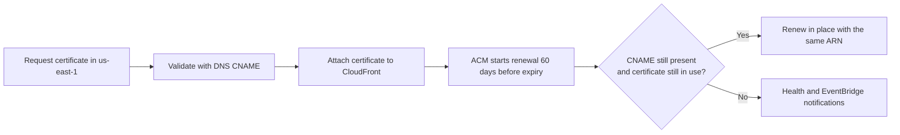

Certificate expiration is one of those problems that doesn't feel urgent until your site is down at 2 a.m. on a Saturday. A valid certificate quietly does its job. An expired certificate triggers a full-page browser warning that tells your users "this site may be trying to steal your information." There's no graceful fallback—the browser blocks the connection entirely. ACM's auto-renewal is the feature that keeps this from happening, but it only works if you set things up correctly.

If you want AWS's official framing for the certificate behavior in this lesson, the [AWS Certificate Manager User Guide](https://docs.aws.amazon.com/acm/latest/userguide/acm-overview.html) is the source of truth.



## How ACM Auto-Renewal Works

ACM public certificates are valid for **13 months** (395 days). Starting **60 days** before expiration, ACM begins attempting to renew the certificate automatically. The renewal process depends on which validation method you used when you originally requested the certificate.

### DNS-Validated Certificates

For certificates validated with DNS, ACM checks whether the original CNAME validation record is still present in your DNS. If it is, ACM validates the domain and issues a renewed certificate. The new certificate has the same ARN as the old one—any CloudFront distribution, load balancer, or API Gateway endpoint using that ARN automatically picks up the renewed certificate with zero downtime and zero manual intervention. It's honestly one of the best "set it and forget it" features in all of AWS.

This is why DNS validation is the default recommendation in [DNS Validation vs. Email Validation](dns-validation-vs-email-validation.md): **the CNAME record is the key to automatic renewal**. Remove it and ACM can't re-validate the domain. Keep it and renewal is invisible.

### Email-Validated Certificates

For email-validated certificates, ACM sends a renewal email to the same addresses it used for the original validation. Someone has to click the approval link. If nobody responds, the certificate expires.

> [!WARNING]
> If you used email validation and the person who originally approved the certificate has left the company, changed roles, or simply doesn't check that email address anymore, the renewal email will go unanswered and your certificate will expire. This has taken down production sites. Use DNS validation.

## The Renewal Timeline

Here's what happens as a certificate approaches expiration:

| Days Before Expiry | What Happens                                                                        |
| ------------------ | ----------------------------------------------------------------------------------- |
| 60 days            | ACM begins renewal attempts for DNS-validated certificates                          |
| 45 days            | If DNS validation fails, ACM sends an AWS Health event and EventBridge notification |
| 30 days            | ACM sends another notification if renewal is still failing                          |
| 15 days            | Another notification                                                                |
| 7 days             | Another notification                                                                |
| 3 days             | Another notification                                                                |
| 1 day              | Final notification before expiration                                                |
| 0 days             | Certificate expires. Browser shows security warning. Users can't access your site.  |

If you have DNS validation records in place and the certificate is associated with an active AWS resource, you'll never see any of these notifications. Renewal happens silently around the 60-day mark.

### What Can Go Wrong

Even with DNS validation, renewal can fail if:

1. **The CNAME record was removed**: Someone cleaning up DNS records deletes the ACM validation CNAME. ACM can no longer re-validate the domain.
2. **The certificate isn't in use**: ACM requires the certificate to be associated with at least one AWS service (CloudFront, ELB, API Gateway). An unused certificate doesn't get auto-renewed.
3. **The domain itself expired**: If your domain registration lapses, the DNS records disappear and ACM can't validate anything.

You can check a certificate's renewal eligibility:

```bash
aws acm describe-certificate \
  --certificate-arn arn:aws:acm:us-east-1:123456789012:certificate/a1b2c3d4-e5f6-7890-abcd-ef1234567890 \
  --region us-east-1 \
  --output json \
  --query "Certificate.{Status:Status,RenewalEligibility:RenewalEligibility,NotAfter:NotAfter}"
```

```json
{
  "Status": "ISSUED",
  "RenewalEligibility": "ELIGIBLE",
  "NotAfter": "2027-04-18T12:00:00Z"
}
```

If `RenewalEligibility` shows `INELIGIBLE`, investigate immediately. Check that the CNAME record is still in DNS and that the certificate is attached to a live AWS resource.

> [!TIP]
> Never delete the ACM validation CNAME records from your DNS. They are small, they cost nothing, and they are the mechanism that keeps your certificates alive. Treat them as permanent infrastructure.

## Why CloudFront Requires us-east-1

This is the constraint that trips up nearly every engineer the first time they use ACM with CloudFront. It deserves a full explanation.

**CloudFront** is a global CDN. Your CloudFront distribution doesn't live in a single region—it operates across hundreds of edge locations worldwide. But CloudFront's control plane, the system that manages distribution configurations, runs in `us-east-1`. When you attach a certificate to a CloudFront distribution, CloudFront looks for that certificate in the ACM registry in `us-east-1` and nowhere else.

This means:

- A certificate in `us-east-1` works with CloudFront.
- A certificate in `us-west-2` doesn't work with CloudFront. CloudFront won't see it.
- A certificate in `eu-west-1` doesn't work with CloudFront. CloudFront won't see it.
- There's no way to copy or move a certificate between regions. If you created it in the wrong region, you need to request a new one in `us-east-1`.

> [!WARNING]
> CloudFront certificates **must** be in `us-east-1`. If you provision your certificate in any other region, it won't appear in the CloudFront console and can't be attached via the CLI. This isn't a bug—it's by design. CloudFront is a global service with a control plane in `us-east-1`, and all global resources (certificates, WAF rules, Lambda@Edge functions) must be provisioned there.

### The "I Can't Find My Certificate" Debugging Flow

If you're trying to attach a certificate to CloudFront and it doesn't appear:

1. Check the region. Run `aws acm list-certificates --region us-east-1 --output json`. If your certificate isn't in the list, it's in a different region.
2. If the certificate is in the wrong region, request a new one in `us-east-1`. There's no shortcut.
3. If the certificate is in `us-east-1` but not showing up in the CloudFront console, check its status. Only certificates with status `ISSUED` can be attached. A certificate in `PENDING_VALIDATION` isn't usable.

```bash
aws acm list-certificates \
  --region us-east-1 \
  --output json \
  --query "CertificateSummaryList[*].{Domain:DomainName,ARN:CertificateArn,Status:Status}"
```

```json
[
  {
    "Domain": "example.com",
    "ARN": "arn:aws:acm:us-east-1:123456789012:certificate/a1b2c3d4-e5f6-7890-abcd-ef1234567890",
    "Status": "ISSUED"
  }
]
```

### Other Services Are Different

This `us-east-1` requirement is specific to CloudFront (and a few other global services like AWS Global Accelerator). If you're using ACM with an Application Load Balancer or API Gateway, the certificate needs to be in the same region as that resource—not necessarily `us-east-1`.

For this course, since your frontend is served through CloudFront, `us-east-1` is the only region that matters for ACM. Every `aws acm` command in this course explicitly includes `--region us-east-1`, and yours should too.

## Putting It Together

The lifecycle of a well-configured ACM certificate looks like this:

1. **Request** the certificate in `us-east-1` with DNS validation.
2. **Add** the CNAME validation record to your DNS.
3. **Wait** for ACM to validate and issue the certificate.
4. **Attach** the certificate to your CloudFront distribution (covered in the next module).
5. **Forget about it**: ACM renews the certificate automatically every 13 months, re-validating via the same CNAME record.

That last step is the whole point. A DNS-validated certificate in `us-east-1`, attached to a CloudFront distribution, with the CNAME record left in place, is a certificate you never have to think about again. And in infrastructure, the things you never have to think about are the things that don't break at 2 a.m.
