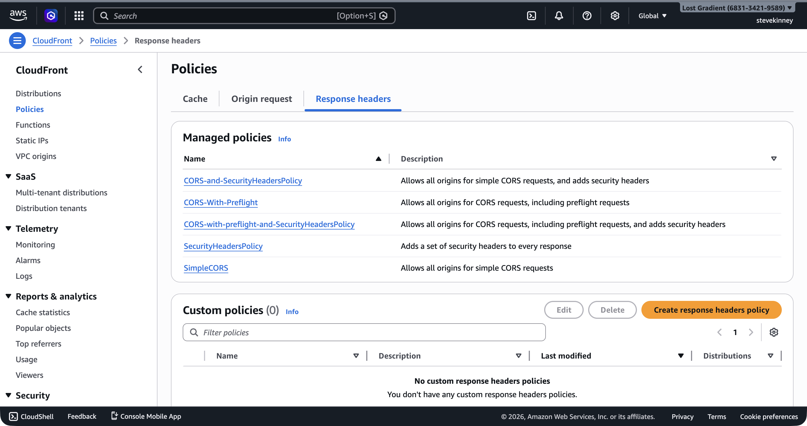
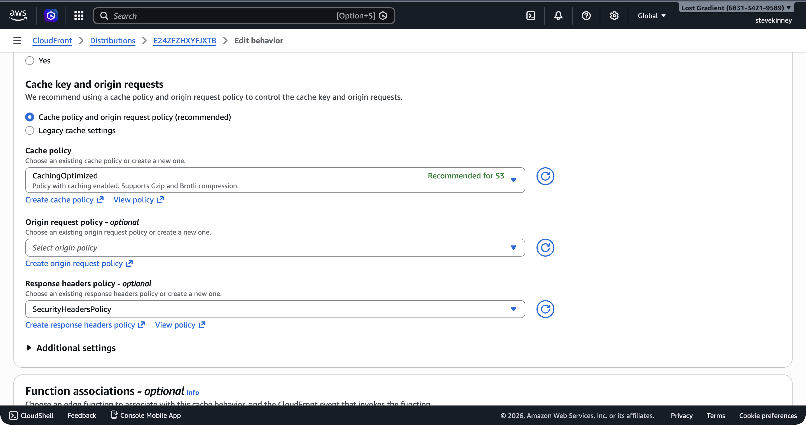

Your CloudFront distribution serves your static site over HTTPS, routes SPA paths correctly, and locks down S3 with Origin Access Control. But open your browser's DevTools, inspect the response headers on any request, and you'll notice something missing: there are no security headers. No `Strict-Transport-Security`. No `X-Content-Type-Options`. No `X-Frame-Options`. S3 doesn't add these, and CloudFront doesn't add them by default.

If you want AWS's version of the response-header mechanics while you read, the [CloudFront response headers policy guide](https://docs.aws.amazon.com/AmazonCloudFront/latest/DeveloperGuide/modifying-response-headers.html) is the official reference.

On Vercel, you configure these in `vercel.json` or `next.config.js`. On Netlify, you use `_headers`. On AWS, you use a CloudFront **response headers policy**.

## Why Security Headers Matter

Security headers are HTTP response headers that instruct the browser to behave in ways that protect your users. They don't replace server-side security, but they close common attack vectors:

- **`Strict-Transport-Security` (HSTS)**: Tells the browser to only connect to your site over HTTPS, even if the user types `http://`. Prevents protocol downgrade attacks and SSL stripping.
- **`X-Content-Type-Options: nosniff`**: Prevents the browser from MIME-sniffing a response away from the declared `Content-Type`. Stops an attacker from tricking the browser into executing a file as JavaScript when it was supposed to be an image.
- **`X-Frame-Options: DENY`**: Prevents your site from being embedded in an `<iframe>` on another domain. Blocks clickjacking attacks.
- **`Referrer-Policy: strict-origin-when-cross-origin`**: Controls how much referrer information is included in requests to other sites. Prevents leaking sensitive URL paths.
- **`Content-Security-Policy`**: The big one. Defines which sources are allowed to load scripts, styles, images, and other resources. A well-configured CSP is the most effective defense against XSS attacks.

Without these headers, your site isn't dangerous—but it isn't hardened, either. Any security audit will flag their absence.

## Managed vs. Custom Response Headers Policies

CloudFront offers **managed response headers policies** that cover common configurations, and you can also create **custom policies** for more control.

The managed policies worth knowing:

| Policy Name                                       | ID                                     | What It Includes                                                                                                                 |
| ------------------------------------------------- | -------------------------------------- | -------------------------------------------------------------------------------------------------------------------------------- |
| **SecurityHeadersPolicy**                         | `67f7725c-6f97-4210-82d7-5512b31e9d03` | HSTS, X-Content-Type-Options, X-Frame-Options, X-XSS-Protection, Referrer-Policy                                                 |
| **SimpleCORS**                                    | `60669652-455b-4ae9-85a4-c4c02393f86c` | `Access-Control-Allow-Origin: *` on all responses                                                                                |
| **CORS-with-preflight**                           | `5cc3b908-e619-4b99-88e5-2cf7f45965bd` | Full CORS with preflight support (`Access-Control-Allow-Origin`, `Access-Control-Allow-Methods`, `Access-Control-Allow-Headers`) |
| **CORS-with-preflight-and-SecurityHeadersPolicy** | `eaab4381-ed33-4a86-88ca-d9558dc6cd63` | Everything in CORS-with-preflight plus all security headers                                                                      |

For a static site that doesn't serve API responses and doesn't need CORS (your frontend and your assets are on the same domain), **SecurityHeadersPolicy** is the right starting point. If your frontend calls APIs on a different domain and those APIs are served through this same CloudFront distribution, use **CORS-with-preflight-and-SecurityHeadersPolicy**.

In the console, the **Policies** page under **Response headers** lists all available managed policies with their descriptions.



## Attaching a Managed Policy

The fastest way to add security headers is to attach a managed policy to your default cache behavior. Fetch the current distribution config, add the `ResponseHeadersPolicyId`, and update.

Fetch:

```bash
aws cloudfront get-distribution-config \
  --id E1A2B3C4D5E6F7 \
  --region us-east-1 \
  --output json > distribution-config-current.json
```

Add `ResponseHeadersPolicyId` to the `DefaultCacheBehavior`:

```json
{
  "DefaultCacheBehavior": {
    "TargetOriginId": "S3-my-frontend-app-assets",
    "ViewerProtocolPolicy": "redirect-to-https",
    "CachePolicyId": "658327ea-f89d-4fab-a63d-7e88639e58f6",
    "ResponseHeadersPolicyId": "67f7725c-6f97-4210-82d7-5512b31e9d03",
    "Compress": true,
    "AllowedMethods": {
      "Quantity": 2,
      "Items": ["GET", "HEAD"],
      "CachedMethods": {
        "Quantity": 2,
        "Items": ["GET", "HEAD"]
      }
    }
  }
}
```

Update:

```bash
aws cloudfront update-distribution \
  --id E1A2B3C4D5E6F7 \
  --if-match E2QWRUHEXAMPLE \
  --distribution-config file://distribution-config-updated.json \
  --region us-east-1 \
  --output json
```

In the console, you attach the policy to a behavior from the **Edit behavior** form. The **Response headers policy** dropdown shows the managed policies alongside any custom policies you've created.



After the distribution deploys, every response from CloudFront will include security headers:

```
strict-transport-security: max-age=31536000
x-content-type-options: nosniff
x-frame-options: SAMEORIGIN
x-xss-protection: 1; mode=block
referrer-policy: strict-origin-when-cross-origin
```

> [!TIP]
> You can verify the headers with `curl -I https://d1234abcdef.cloudfront.net`. If you don't see the security headers, wait for the distribution to finish deploying and try again. You may also need to clear the edge cache by creating an invalidation.

## Creating a Custom Response Headers Policy

The managed policies cover common cases, but you might need custom configuration—maybe you want HSTS with a longer `max-age`, or you need a `Content-Security-Policy` header tailored to your application. For that, create a custom response headers policy.

Save this as `response-headers-policy.json`:

```json
{
  "Name": "my-frontend-app-headers",
  "Comment": "Security and CORS headers for my-frontend-app",
  "SecurityHeadersConfig": {
    "StrictTransportSecurity": {
      "AccessControlMaxAgeSec": 63072000,
      "IncludeSubdomains": true,
      "Preload": true,
      "Override": true
    },
    "ContentTypeOptions": {
      "Override": true
    },
    "FrameOptions": {
      "FrameOption": "DENY",
      "Override": true
    },
    "ReferrerPolicy": {
      "ReferrerPolicy": "strict-origin-when-cross-origin",
      "Override": true
    },
    "XSSProtection": {
      "ModeBlock": true,
      "Protection": true,
      "Override": true
    }
  },
  "CorsConfig": {
    "AccessControlAllowOrigins": {
      "Quantity": 1,
      "Items": ["https://example.com"]
    },
    "AccessControlAllowMethods": {
      "Quantity": 2,
      "Items": ["GET", "HEAD"]
    },
    "AccessControlAllowHeaders": {
      "Quantity": 1,
      "Items": ["*"]
    },
    "AccessControlAllowCredentials": false,
    "AccessControlMaxAgeSec": 86400,
    "OriginOverride": true
  },
  "CustomHeadersConfig": {
    "Quantity": 1,
    "Items": [
      {
        "Header": "Permissions-Policy",
        "Value": "camera=(), microphone=(), geolocation=()",
        "Override": true
      }
    ]
  }
}
```

Create the policy:

```bash
aws cloudfront create-response-headers-policy \
  --response-headers-policy-config file://response-headers-policy.json \
  --region us-east-1 \
  --output json
```

The response includes the policy's ID:

```json
{
  "ResponseHeadersPolicy": {
    "Id": "a1b2c3d4-e5f6-7890-abcd-ef1234567890",
    "ResponseHeadersPolicyConfig": {
      "Name": "my-frontend-app-headers"
    }
  }
}
```

Use this ID in the `ResponseHeadersPolicyId` field of your cache behavior, the same way you attached the managed policy.

## Breaking Down the Custom Policy

### SecurityHeadersConfig

The security headers config gives you control over each header individually:

- **`StrictTransportSecurity`**: `max-age=63072000` (2 years), `includeSubDomains`, and `preload`. The `preload` flag makes your domain eligible for [HSTS preload lists](https://hstspreload.org/), which hardcode the HTTPS-only policy into browsers.
- **`ContentTypeOptions`**: Adds `X-Content-Type-Options: nosniff`. No configuration needed beyond enabling it.
- **`FrameOptions`**: `DENY` prevents your site from being embedded in any iframe. Use `SAMEORIGIN` if your site uses iframes internally (e.g., for embedding preview panels). I default to `DENY` and only loosen it when I have a _definite_ reason to.
- **`ReferrerPolicy`**: `strict-origin-when-cross-origin` sends the full URL for same-origin requests but only the origin (no path) for cross-origin requests.
- **`XSSProtection`**: Adds `X-XSS-Protection: 1; mode=block`. This header is deprecated in modern browsers (CSP is the replacement), but it provides defense-in-depth for older browsers. (It doesn't hurt to include it.)

The **`Override`** field on each header determines whether CloudFront's value overrides a value set by the origin. When `true`, CloudFront replaces any existing header from S3 with the value defined in the policy. When `false`, CloudFront only adds the header if the origin didn't include it. For security headers, you almost always want `Override: true`—you're the source of truth for security policy, not S3.

### CorsConfig

If your frontend application makes cross-origin API requests that are routed through CloudFront (e.g., a `/api/*` behavior pointing to API Gateway), the CORS config tells CloudFront to include the appropriate `Access-Control-Allow-*` headers. For a static site served entirely from one domain, CORS headers are optional but harmless.

### CustomHeadersConfig

Any header not covered by the security or CORS sections can be added here. `Permissions-Policy` (formerly `Feature-Policy`) controls which browser features your site can use—disabling camera, microphone, and geolocation access if your site doesn't need them.

## CORS for API Calls

If your frontend calls an API on a different origin (e.g., your React app on `example.com` calls `api.example.com`), you need CORS headers on the API responses. There are two scenarios:

**API served through CloudFront** (e.g., a `/api/*` behavior pointing to API Gateway): Configure CORS in the response headers policy attached to that behavior. CloudFront adds the headers for you.

**API served separately** (e.g., API Gateway with its own domain): Configure CORS on API Gateway directly. That's covered in the API Gateway section.

For a typical static frontend served entirely through one CloudFront distribution on one domain, you generally don't need CORS headers on your static assets. The browser only enforces CORS on cross-origin requests, and your assets are same-origin.

## Verifying Your Headers

After updating the distribution, check the response headers:

```bash
curl -I https://d1234abcdef.cloudfront.net/index.html
```

You should see your security headers in the response:

```
HTTP/2 200
strict-transport-security: max-age=63072000; includeSubDomains; preload
x-content-type-options: nosniff
x-frame-options: DENY
referrer-policy: strict-origin-when-cross-origin
x-xss-protection: 1; mode=block
permissions-policy: camera=(), microphone=(), geolocation=()
```

If any headers are missing, verify the response headers policy ID is attached to the correct cache behavior, the distribution has finished deploying, and you're not seeing a cached response from before the update (invalidate if needed).

> [!WARNING]
> Response headers policies apply to all responses served by the cache behavior they're attached to—including cached responses. If you attach a policy after content is already cached, you may need to create an invalidation to ensure the headers appear immediately. Otherwise, cached responses will lack the new headers until their TTL expires.

You've got a fully configured CloudFront distribution: S3 origin with OAC, cache behaviors and invalidations for deployments, SPA routing via custom error responses, HTTPS with your ACM certificate, and security headers. The next step is connecting a custom domain in the Route 53 custom-domain-routing section. Before that, the exercise for this section will have you build all of this from scratch.
