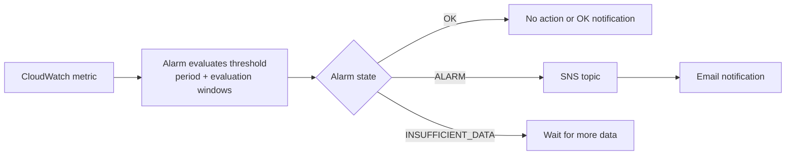

Dashboards are great for when you're actively looking. Alarms are for when you're not. A **CloudWatch alarm** watches a metric and triggers an action when that metric crosses a threshold you define. The most common action: sending you an email through **SNS** (Simple Notification Service). You wake up to an email that says "your Lambda error rate spiked at 3 AM" instead of a user complaint at 9 AM.

If you want AWS's version of the monitoring primitives while you read, the [CloudWatch overview](https://docs.aws.amazon.com/AmazonCloudWatch/latest/monitoring/WhatIsCloudWatch.html) is the official reference.

If you've used Vercel's deployment notifications or GitHub Actions failure alerts, this is the same concept—except you define exactly what "failure" means and how you get notified.



## How Alarms Work

An alarm has three components:

1. **A metric to watch**—for example, Lambda `Errors` for `my-frontend-app-api`
2. **A condition**—for example, "Sum of Errors is greater than 5"
3. **An action**—for example, "send a notification to this SNS topic"

Alarms evaluate the condition over a configurable time window. You specify a **period** (how long each evaluation window is) and **evaluation periods** (how many consecutive windows must breach the threshold before the alarm fires). This prevents one-off spikes from waking you up at night.

### Alarm States

Every alarm is in one of three states at any given time:

- **OK**: The metric is within the threshold. Everything is fine.
- **ALARM**: The metric has breached the threshold for the required number of evaluation periods. Something needs attention.
- **INSUFFICIENT_DATA**: CloudWatch doesn't have enough data to evaluate the condition. This is the initial state of every new alarm. It's also the state your alarm enters when your function hasn't been invoked recently—no invocations means no data points.

> [!TIP]
> A new alarm starts in `INSUFFICIENT_DATA`, not `OK`. This is normal. Once your function receives traffic and CloudWatch has enough data points to evaluate the condition, the alarm will transition to `OK` (or `ALARM`, if you're having a bad day).

## Setting Up SNS

Before you create an alarm, you need somewhere to send notifications. **SNS** (Simple Notification Service) is AWS's pub/sub messaging service. You create a **topic** (a notification channel), subscribe your email to it, and then point your alarms at that topic.

### Create an SNS Topic

```bash
aws sns create-topic \
  --name my-frontend-app-alerts \
  --region us-east-1 \
  --output json
```

This returns the topic ARN:

```json
{
  "TopicArn": "arn:aws:sns:us-east-1:123456789012:my-frontend-app-alerts"
}
```

Save that ARN—you'll use it when creating alarms.

### Subscribe Your Email

```bash
aws sns subscribe \
  --topic-arn arn:aws:sns:us-east-1:123456789012:my-frontend-app-alerts \
  --protocol email \
  --notification-endpoint your-email@example.com \
  --region us-east-1 \
  --output json
```

```json
{
  "SubscriptionArn": "pending confirmation"
}
```

> [!WARNING]
> You **must** confirm the subscription. AWS sends a confirmation email to the address you specified. Click the link in that email. Until you confirm, SNS won't deliver notifications—your alarms will fire, but you'll never see the emails.

### Verify the Subscription

After confirming, check the subscription status:

```bash
aws sns list-subscriptions-by-topic \
  --topic-arn arn:aws:sns:us-east-1:123456789012:my-frontend-app-alerts \
  --region us-east-1 \
  --output json
```

The `SubscriptionArn` should now be a real ARN instead of `pending confirmation`.

## Creating an Alarm for Lambda Errors

This alarm fires when your Lambda function produces more than 5 errors in a 5-minute period, for two consecutive periods.

```bash
aws cloudwatch put-metric-alarm \
  --alarm-name my-frontend-app-api-errors \
  --alarm-description "Alarm when Lambda error count exceeds 5 in 5 minutes" \
  --namespace AWS/Lambda \
  --metric-name Errors \
  --dimensions Name=FunctionName,Value=my-frontend-app-api \
  --statistic Sum \
  --period 300 \
  --evaluation-periods 2 \
  --threshold 5 \
  --comparison-operator GreaterThanThreshold \
  --alarm-actions arn:aws:sns:us-east-1:123456789012:my-frontend-app-alerts \
  --ok-actions arn:aws:sns:us-east-1:123456789012:my-frontend-app-alerts \
  --region us-east-1 \
  --output json
```

Let's break down what each parameter does:

- **`--period 300`**: Each evaluation window is 5 minutes (300 seconds).
- **`--evaluation-periods 2`**: The threshold must be breached for 2 consecutive periods (10 minutes total) before the alarm fires.
- **`--threshold 5`**: More than 5 errors in a single period triggers a breach.
- **`--comparison-operator GreaterThanThreshold`**: The alarm fires when the value is **greater than** 5, not equal to 5.
- **`--alarm-actions`**: The SNS topic to notify when the alarm transitions to `ALARM`.
- **`--ok-actions`**: The SNS topic to notify when the alarm transitions back to `OK`. This is optional but useful—you want to know when the problem is resolved, not just when it starts.

## Creating an Alarm for Lambda Duration

This alarm fires when your function's average duration exceeds 3 seconds—a sign that something is running slowly, possibly due to cold starts or a downstream service taking too long.

```bash
aws cloudwatch put-metric-alarm \
  --alarm-name my-frontend-app-api-duration \
  --alarm-description "Alarm when average Lambda duration exceeds 3 seconds" \
  --namespace AWS/Lambda \
  --metric-name Duration \
  --dimensions Name=FunctionName,Value=my-frontend-app-api \
  --statistic Average \
  --period 300 \
  --evaluation-periods 2 \
  --threshold 3000 \
  --comparison-operator GreaterThanThreshold \
  --alarm-actions arn:aws:sns:us-east-1:123456789012:my-frontend-app-alerts \
  --region us-east-1 \
  --output json
```

Note that `Duration` is measured in milliseconds, so a 3-second threshold is `3000`.

## Creating an Alarm for API Gateway 5XX Errors

This alarm fires when your API returns server errors—meaning your Lambda function is crashing or timing out.

```bash
aws cloudwatch put-metric-alarm \
  --alarm-name my-frontend-app-api-5xx \
  --alarm-description "Alarm when API Gateway 5XX error count exceeds 0" \
  --namespace AWS/ApiGateway \
  --metric-name 5XXError \
  --dimensions Name=ApiId,Value=your-api-id \
  --statistic Sum \
  --period 300 \
  --evaluation-periods 1 \
  --threshold 0 \
  --comparison-operator GreaterThanThreshold \
  --alarm-actions arn:aws:sns:us-east-1:123456789012:my-frontend-app-alerts \
  --region us-east-1 \
  --output json
```

This alarm uses a single evaluation period and a threshold of zero—any 5XX error in any 5-minute window triggers it immediately. 5XX errors are serious enough that you want to know right away. (Trust me on this one.)

## Verifying Your Alarms

List all your alarms:

```bash
aws cloudwatch describe-alarms \
  --alarm-name-prefix my-frontend-app \
  --region us-east-1 \
  --output json
```

This shows the current state of each alarm, its configuration, and when it last changed state.

## Testing an Alarm

You can manually set an alarm state to verify that your SNS subscription works:

```bash
aws cloudwatch set-alarm-state \
  --alarm-name my-frontend-app-api-errors \
  --state-value ALARM \
  --state-reason "Testing alarm notification" \
  --region us-east-1 \
  --output json
```

Check your email. You should receive a notification from SNS. After verifying, the alarm will return to its actual state on the next evaluation period.

> [!TIP]
> Use `set-alarm-state` to test your notification pipeline before a real incident. Discovering that your email subscription isn't confirmed during an actual outage is a bad experience.

## Choosing Thresholds

Threshold values depend on your application. Here are starting points for a typical frontend API backend:

| Alarm      | Metric      | Statistic | Threshold | Period | Evaluation Periods |
| ---------- | ----------- | --------- | --------- | ------ | ------------------ |
| Error rate | `Errors`    | `Sum`     | 5         | 300s   | 2                  |
| Duration   | `Duration`  | `Average` | 3000 ms   | 300s   | 2                  |
| 5XX errors | `5XXError`  | `Sum`     | 0         | 300s   | 1                  |
| Throttles  | `Throttles` | `Sum`     | 0         | 300s   | 1                  |

Start with these, observe how they behave with real traffic, and adjust. If your error alarm fires ten times a day, either your threshold is too low or you have a real problem to fix.

You now have alarms that tell you when something goes wrong. But when an alarm fires, you need to figure out _what_ went wrong. In the next lesson, you'll learn to trace a single request across API Gateway, Lambda, and DynamoDB using correlation IDs and CloudWatch Logs Insights—turning "something broke" into "this specific request failed at this specific step."
