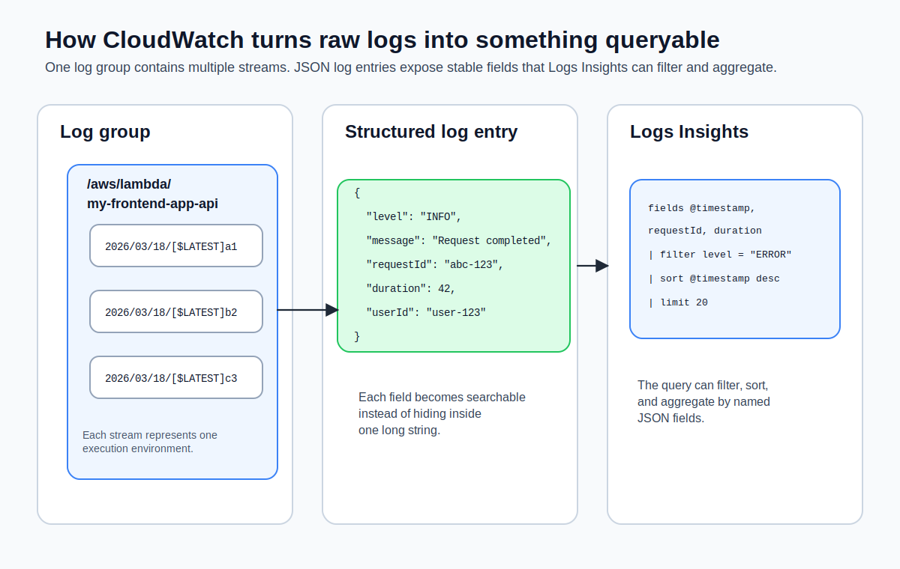

Every `console.log` you've written in your Lambda functions has been landing in CloudWatch Logs since [Deploying and Testing a Lambda Function](deploying-and-testing-a-lambda-function.md). The logs are there—but if you've ever tried to find a specific error in an unstructured wall of text, you know that having logs and being able to use them are two different things.

If you want AWS's version of the logging service surface while you read, the [CloudWatch overview](https://docs.aws.amazon.com/AmazonCloudWatch/latest/monitoring/WhatIsCloudWatch.html) is the official reference to keep nearby.

In this lesson, you'll learn how CloudWatch organizes logs, how to switch from `console.log('something happened')` to structured JSON logging, and how to query your logs with CloudWatch Logs Insights—a SQL-like query language that makes your logs actually searchable.



## Log Groups and Log Streams

CloudWatch organizes logs into two levels: **log groups** and **log streams**.

A **log group** is a container for logs from a single source. Lambda creates one automatically for each function, following the naming convention `/aws/lambda/<function-name>`. Your function gets `/aws/lambda/my-frontend-app-api`. API Gateway can also write to log groups if you enable access logging (covered in [API Gateway Stages and Custom Domains](api-gateway-stages-and-custom-domains.md)).

A **log stream** is a sequence of log events within a log group. Lambda creates a new log stream for each execution environment. If your function scales to three concurrent environments, you'll see three log streams. Each stream's name includes the date and a unique identifier—something like `2026/03/18/[$LATEST]a1b2c3d4e5f6`.

To see your log groups from the CLI:

```bash
aws logs describe-log-groups \
  --log-group-name-prefix /aws/lambda/my-frontend-app-api \
  --region us-east-1 \
  --output json
```

To list the log streams inside a group:

```bash
aws logs describe-log-streams \
  --log-group-name /aws/lambda/my-frontend-app-api \
  --order-by LastEventTime \
  --descending \
  --limit 5 \
  --region us-east-1 \
  --output json
```

## Retention Settings

By default, CloudWatch Logs keeps your logs **forever**. That's almost never what you want. Logs accumulate, storage costs grow, and nobody is reading six-month-old debug output.

Set a retention policy on your log group:

```bash
aws logs put-retention-policy \
  --log-group-name /aws/lambda/my-frontend-app-api \
  --retention-in-days 30 \
  --region us-east-1 \
  --output json
```

Valid retention values include 1, 3, 5, 7, 14, 30, 60, 90, 120, 150, 180, 365, 400, 545, 731, 1096, 1827, 2192, 2557, 2922, 3288, and 3653 days. For development, 30 days is reasonable. For production, 90 days gives you enough history to investigate incidents without paying for years of storage.

> [!WARNING]
> If you don't set a retention policy, your log storage costs will grow indefinitely. This is one of those AWS defaults that silently costs you money over time.

Retention lives on the log group, not on the function. If you delete the function and redeploy it, Lambda creates a fresh log group with infinite retention—your retention setting is gone. Codify retention in your IaC (CDK's `Function` construct exposes `logRetention`), or pre-create the log group with retention set before deploying the function.

### With the SDK

```typescript
import {
  CloudWatchLogsClient,
  PutRetentionPolicyCommand,
  DescribeLogGroupsCommand,
  StartQueryCommand,
  GetQueryResultsCommand,
} from '@aws-sdk/client-cloudwatch-logs';

const logs = new CloudWatchLogsClient({ region: 'us-east-1' });

await logs.send(
  new PutRetentionPolicyCommand({
    logGroupName: '/aws/lambda/my-frontend-app-api',
    retentionInDays: 30,
  }),
);

// Programmatic Insights query — useful for building small status pages
// or dashboards outside the AWS console.
const started = await logs.send(
  new StartQueryCommand({
    logGroupName: '/aws/lambda/my-frontend-app-api',
    startTime: Math.floor((Date.now() - 60 * 60 * 1000) / 1000),
    endTime: Math.floor(Date.now() / 1000),
    queryString: 'fields @timestamp, @message | filter level = "ERROR" | limit 20',
  }),
);

// Poll for completion (StartQuery is async):
let result;
do {
  await new Promise((r) => setTimeout(r, 500));
  result = await logs.send(new GetQueryResultsCommand({ queryId: started.queryId }));
} while (result.status === 'Running' || result.status === 'Scheduled');
console.log(result.results);
```

## The Problem with `console.log`

Here's how most developers log in Lambda functions:

```typescript
console.log('Processing request for user:', userId);
console.log('Database query took', duration, 'ms');
console.log('Error:', error.message);
```

This works. You can read it in CloudWatch. But when you have thousands of log entries from hundreds of invocations, searching for "all errors for user abc-123" means scrolling through unstructured text and hoping your eyes catch it.

The fundamental issue: `console.log` produces strings. Strings are hard to filter, aggregate, and query programmatically.

## Structured JSON Logging

**Structured logging** means writing log entries as JSON objects instead of plain strings. CloudWatch Logs Insights can parse JSON automatically, which means every field in your JSON becomes a searchable, filterable column.

Here's what structured logging looks like in practice:

```typescript
import type { APIGatewayProxyHandlerV2 } from 'aws-lambda';

interface LogEntry {
  level: string;
  message: string;
  requestId?: string;
  userId?: string;
  duration?: number;
  error?: string;
  [key: string]: unknown;
}

function log(entry: LogEntry): void {
  console.log(JSON.stringify(entry));
  // [!note CloudWatch Logs Insights auto-parses JSON, making each field queryable.]
}

export const handler: APIGatewayProxyHandlerV2 = async (event) => {
  const requestId = event.requestContext?.requestId ?? 'unknown';
  const userId = event.queryStringParameters?.userId;

  log({
    level: 'INFO',
    message: 'Request received',
    requestId,
    userId,
    path: event.rawPath,
    method: event.requestContext?.http?.method,
  });

  const start = Date.now();

  try {
    // Your business logic here
    const result = { greeting: `Hello, ${userId ?? 'World'}!` };
    const duration = Date.now() - start;

    log({
      level: 'INFO',
      message: 'Request completed',
      requestId,
      userId,
      duration,
      statusCode: 200,
    });

    return {
      statusCode: 200,
      headers: { 'Content-Type': 'application/json' },
      body: JSON.stringify(result),
    };
  } catch (error) {
    const duration = Date.now() - start;

    log({
      level: 'ERROR',
      message: 'Request failed',
      requestId,
      userId,
      duration,
      error: error instanceof Error ? error.message : String(error),
    });

    return {
      statusCode: 500,
      headers: { 'Content-Type': 'application/json' },
      body: JSON.stringify({ error: 'Internal server error' }),
    };
  }
};
```

The key difference: instead of `console.log('Error:', error.message)`, you write `console.log(JSON.stringify({ level: 'ERROR', message: 'Request failed', error: error.message }))`. Each log entry is a single-line JSON object that CloudWatch can parse and index.

> [!TIP]
> You don't need a logging library. A simple `log` helper function that calls `console.log(JSON.stringify(entry))` is all you need for Lambda. Libraries like `pino` or `winston` add features you generally don't need in a serverless context—structured JSON output is the goal, and `JSON.stringify` gets you there.

## Querying with CloudWatch Logs Insights

**CloudWatch Logs Insights** is a query language for searching and analyzing log data. If you've used SQL, the syntax will feel familiar. If you've used browser DevTools to filter console output, this is the industrial-strength version.

### Basic Queries

Find the 25 most recent log entries:

```
fields @timestamp, @message
| sort @timestamp desc
| limit 25
```

Filter for errors only (assuming structured JSON logging):

```
fields @timestamp, level, message, error, requestId
| filter level = "ERROR"
| sort @timestamp desc
| limit 50
```

Find all requests for a specific user:

```
fields @timestamp, level, message, userId, duration
| filter userId = "abc-123"
| sort @timestamp desc
```

### Aggregation Queries

Count errors per hour:

```
filter level = "ERROR"
| stats count(*) as errorCount by bin(1h)
| sort errorCount desc
```

Get average and p95 request duration:

```
filter level = "INFO" and message = "Request completed"
| stats avg(duration) as avgDuration,
        pct(duration, 95) as p95Duration
  by bin(5m)
```

Find the slowest requests:

```
filter level = "INFO" and message = "Request completed"
| sort duration desc
| limit 10
```

### Running Insights Queries from the CLI

You can run Insights queries from the command line using `aws logs start-query` and `aws logs get-query-results`. The query runs asynchronously—you start it, get a query ID, and then poll for results.

```bash
# macOS
aws logs start-query \
  --log-group-name /aws/lambda/my-frontend-app-api \
  --start-time $(date -v-1H +%s) \
  --end-time $(date +%s) \
  --query-string 'fields @timestamp, level, message, duration | filter level = "ERROR" | sort @timestamp desc | limit 20' \
  --region us-east-1 \
  --output json

# Linux
aws logs start-query \
  --log-group-name /aws/lambda/my-frontend-app-api \
  --start-time $(date -d '1 hour ago' +%s) \
  --end-time $(date +%s) \
  --query-string 'fields @timestamp, level, message, duration | filter level = "ERROR" | sort @timestamp desc | limit 20' \
  --region us-east-1 \
  --output json
```

This returns a query ID:

```json
{
  "queryId": "a1b2c3d4-5678-90ab-cdef-example11111"
}
```

Fetch the results:

```bash
aws logs get-query-results \
  --query-id "a1b2c3d4-5678-90ab-cdef-example11111" \
  --region us-east-1 \
  --output json
```

> [!TIP]
> The `--start-time` and `--end-time` parameters expect epoch timestamps (seconds since January 1, 1970). On macOS, `date -v-1H +%s` gives you "one hour ago" as an epoch timestamp. On Linux, use `date -d '1 hour ago' +%s`.

### Insights Query Syntax Reference

| Command  | Purpose                               | Example                                               |
| -------- | ------------------------------------- | ----------------------------------------------------- |
| `fields` | Select which fields to display        | `fields @timestamp, level, message`                   |
| `filter` | Keep only matching records            | `filter level = "ERROR"`                              |
| `stats`  | Aggregate data                        | `stats count(*) by level`                             |
| `sort`   | Order results                         | `sort @timestamp desc`                                |
| `limit`  | Cap the number of results             | `limit 25`                                            |
| `parse`  | Extract fields from unstructured text | `parse @message "User * performed *" as user, action` |

The `@` prefix denotes system fields that CloudWatch adds automatically: `@timestamp`, `@message`, `@logStream`, `@log`. Your structured JSON fields (like `level`, `requestId`, `duration`) are referenced without the `@` prefix.

## Structured Logging vs. Plain Text: The Payoff

Here's the same debugging scenario with both approaches.

**Plain text logs**: "Find all failed requests for user abc-123 in the last hour." You open the log group, scroll through dozens of streams, `Ctrl+F` for "abc-123", and hope the error message is near the user ID in the log output.

**Structured JSON logs**: You run an Insights query:

```
fields @timestamp, message, error, duration
| filter level = "ERROR" and userId = "abc-123"
| sort @timestamp desc
```

Results appear in seconds, with every field neatly extracted. You see the error message, the request duration, and the timestamp for each failure. No scrolling, no guessing.

The five minutes you spend switching to structured logging pays for itself the first time you debug a production issue at 11 PM. I learned this the hard way—nothing quite like scrolling through unstructured text at midnight wishing you'd spent those five minutes earlier.

> [!TIP]
> If you want the structured-logging wrappers without writing them yourself, **AWS Lambda Powertools for TypeScript** (`@aws-lambda-powertools/logger`, `metrics`, `tracer`) handles correlation IDs, JSON log formatting, and custom metrics emission with a few lines of setup. It's AWS-maintained and the de facto standard in production TypeScript Lambdas.

Now that your logs are structured and queryable, it's time to look at the other side of CloudWatch: the metrics that Lambda, API Gateway, and DynamoDB publish automatically. In the next lesson, you'll build a dashboard that gives you a single view of your application's health.
