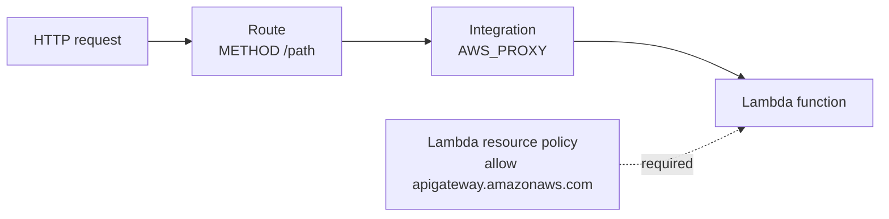
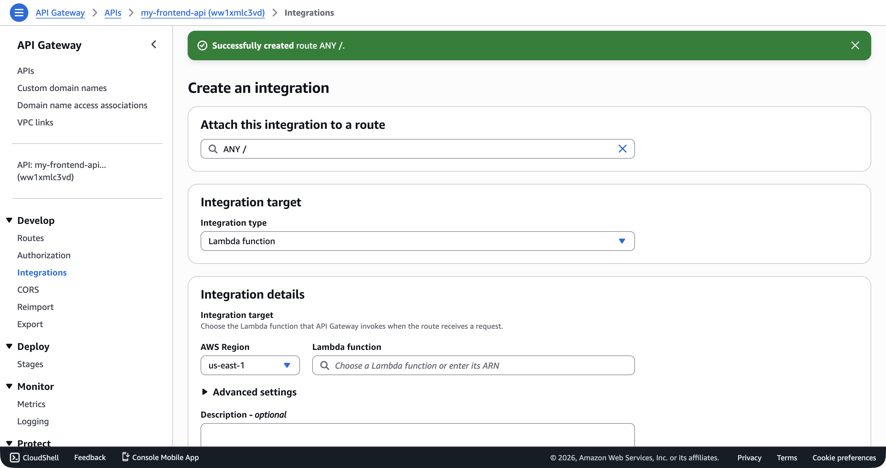
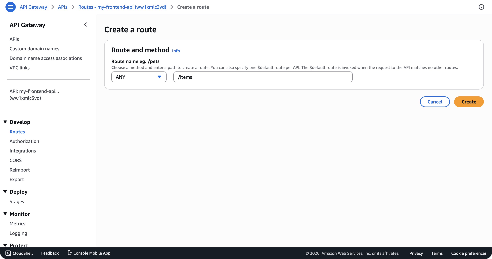

You have an HTTP API with a URL that returns 404 for everything. You have a Lambda function that works when you invoke it directly. Now you connect them. The wiring process has three steps: create an integration, create a route, and grant permission. Skip any one of these and your API returns either 404 or 500 with no helpful error message. I've seen each of these trip people up at least once.

If you want AWS's version of the integration mechanics while you read, the [Lambda proxy integration guide for HTTP APIs](https://docs.aws.amazon.com/apigateway/latest/developerguide/http-api-develop-integrations-lambda.html) is the official reference.

## The Three Pieces

Here's how the pieces fit together:

1. **Integration**—tells API Gateway which backend to call (your Lambda function) and how to call it (proxy integration with payload format version 2.0).
2. **Route**—maps an HTTP method and path (like `GET /items`) to that integration.
3. **Permission**—a resource-based policy on the Lambda function that allows `apigateway.amazonaws.com` to invoke it.



You've already written the handler and deployed it in [Writing a Lambda Handler](writing-a-lambda-handler.md) and [Deploying and Testing a Lambda Function](deploying-and-testing-a-lambda-function.md). Now you're wiring the HTTP layer.

## Create the Integration

An **integration** connects your API to a backend service. For this course, the backend is always a Lambda function, making it a **Lambda proxy integration**. "Proxy" means API Gateway passes the entire HTTP request through to Lambda and returns the Lambda response directly to the client—no request or response transformation.

```bash
aws apigatewayv2 create-integration \
  --api-id abc123def4 \
  --integration-type AWS_PROXY \
  --integration-uri arn:aws:lambda:us-east-1:123456789012:function:my-frontend-app-api \
  --payload-format-version 2.0 \
  --region us-east-1 \
  --output json
```

The response includes an `IntegrationId`:

```json
{
  "ConnectionType": "INTERNET",
  "IntegrationId": "a1b2c3",
  "IntegrationType": "AWS_PROXY",
  "IntegrationUri": "arn:aws:lambda:us-east-1:123456789012:function:my-frontend-app-api",
  "PayloadFormatVersion": "2.0",
  "TimeoutInMillis": 30000
}
```

Save the `IntegrationId`—you need it for the next step.

```bash
INTEGRATION_ID="a1b2c3"
```

In the console, the **Integrations → Attach integrations to routes** page lets you select a route and choose between creating a new integration or attaching an existing one—then pick **Lambda function** from the integration type dropdown.



A few things about these options:

- **`--integration-type AWS_PROXY`**: This is the integration type for Lambda proxy integrations. API Gateway sends the full HTTP request as a Lambda event and returns the Lambda response as the HTTP response.
- **`--integration-uri`**: The ARN of the Lambda function. This is the same ARN you got when you deployed the function.
- **`--payload-format-version 2.0`**: This tells API Gateway to use the version 2.0 event format (`APIGatewayProxyEventV2`), which is the format your TypeScript handler expects. Version 1.0 is the older format used by REST APIs. Always use 2.0 with HTTP APIs.

> [!WARNING]
> If you omit `--payload-format-version`, API Gateway defaults to `1.0` for some integration configurations. This means your Lambda function receives an `APIGatewayProxyEvent` (v1) instead of `APIGatewayProxyEventV2` (v2). The event shapes are different—fields are in different locations, and some fields are missing entirely. If your handler suddenly can't find `event.requestContext.http.method`, check the payload format version.

## Create Routes

A **route** maps an HTTP method and path to an integration. The route key follows the format `METHOD /path`. Create a route for `GET /items`:

```bash
aws apigatewayv2 create-route \
  --api-id abc123def4 \
  --route-key "GET /items" \
  --target "integrations/a1b2c3" \
  --region us-east-1 \
  --output json
```

```json
{
  "ApiKeyRequired": false,
  "RouteId": "xyz789",
  "RouteKey": "GET /items",
  "Target": "integrations/a1b2c3"
}
```

The `--target` value is `integrations/{IntegrationId}`—note the `integrations/` prefix. This is the format API Gateway expects.

In the console, the **Create a route** form shows the method dropdown (ANY, GET, POST, etc.) and the path field side by side.



Create a second route for `POST /items`:

```bash
aws apigatewayv2 create-route \
  --api-id abc123def4 \
  --route-key "POST /items" \
  --target "integrations/a1b2c3" \
  --region us-east-1 \
  --output json
```

Both routes point to the same integration (the same Lambda function). Your handler code is responsible for distinguishing between GET and POST using `event.requestContext.http.method`—the pattern you already set up in [Writing a Lambda Handler](writing-a-lambda-handler.md).

### Path Parameters

Routes support path parameters using curly braces:

```bash
aws apigatewayv2 create-route \
  --api-id abc123def4 \
  --route-key "GET /items/{id}" \
  --target "integrations/a1b2c3" \
  --region us-east-1 \
  --output json
```

In your Lambda handler, the path parameter value is available at `event.pathParameters.id`.

### Catch-All Routes

You can create a catch-all route using `$default` as the route key:

```bash
aws apigatewayv2 create-route \
  --api-id abc123def4 \
  --route-key "$default" \
  --target "integrations/a1b2c3" \
  --region us-east-1 \
  --output json
```

The `$default` route matches any request that doesn't match a more specific route. This is useful when you want a single Lambda function to handle all routing internally—similar to how a Next.js API catch-all route works.

## Grant Permission

This is the step that catches everyone. Your API Gateway can route to the Lambda function, but the Lambda function hasn't authorized API Gateway to invoke it. Without this permission, every request returns a 500 error.

The permission is a **resource-based policy** on the Lambda function—the same concept you learned in [Bucket Policies and Public Access](bucket-policies-and-public-access.md), but applied to a Lambda function instead of an S3 bucket. It tells Lambda: "this API Gateway is allowed to call you."

```bash
aws lambda add-permission \
  --function-name my-frontend-app-api \
  --statement-id apigateway-invoke \
  --action lambda:InvokeFunction \
  --principal apigateway.amazonaws.com \
  --source-arn "arn:aws:execute-api:us-east-1:123456789012:abc123def4/*" \
  --region us-east-1 \
  --output json
```

```json
{
  "Statement": "{\"Sid\":\"apigateway-invoke\",\"Effect\":\"Allow\",\"Principal\":{\"Service\":\"apigateway.amazonaws.com\"},\"Action\":\"lambda:InvokeFunction\",\"Resource\":\"arn:aws:lambda:us-east-1:123456789012:function:my-frontend-app-api\",\"Condition\":{\"ArnLike\":{\"AWS:SourceArn\":\"arn:aws:execute-api:us-east-1:123456789012:abc123def4/*\"}}}"
}
```

Breaking down the `--source-arn`:

- `arn:aws:execute-api`—the service namespace for API Gateway
- `us-east-1`—the region
- `123456789012`—your account ID
- `abc123def4`—the API ID
- `/*`—allows any stage, method, and path to invoke the function

The `/*` wildcard is appropriate here because your Lambda function handles routing internally. If you want to restrict invocation to specific routes, you can use a more specific pattern like `/*/GET/items`.

> [!TIP]
> The `--statement-id` is just a label that identifies this permission statement. It must be unique within the function's resource policy. If you try to add a permission with a statement ID that already exists, the command fails. Use a descriptive name like `apigateway-invoke` or `apigateway-access`.

## Testing the Connection

With all three pieces in place, your API is live. Since the `$default` stage has auto-deploy enabled, your routes are immediately accessible. Test with `curl`:

```bash
curl https://abc123def4.execute-api.us-east-1.amazonaws.com/items
```

If everything is wired correctly, you get back the JSON response from your Lambda function.

If you get a 500 error with `{"message":"Internal Server Error"}`, the most likely cause is the missing Lambda permission (Step 3). Check the function's resource policy:

```bash
aws lambda get-policy \
  --function-name my-frontend-app-api \
  --region us-east-1 \
  --output json
```

If this returns "No policy is associated with the given resource," you need to run `aws lambda add-permission` again.

## Listing Routes and Integrations

To see all routes on your API:

```bash
aws apigatewayv2 get-routes \
  --api-id abc123def4 \
  --region us-east-1 \
  --output json
```

To see all integrations:

```bash
aws apigatewayv2 get-integrations \
  --api-id abc123def4 \
  --region us-east-1 \
  --output json
```

## Common Mistakes

**Forgetting the `integrations/` prefix in the `--target`.** The target must be `integrations/{IntegrationId}`, not just the integration ID. Without the prefix, the route is created but has no target, and requests match the route but return 500.

**Using payload format version 1.0 with v2 handler types.** If your handler uses `APIGatewayProxyHandlerV2` but the integration uses payload format 1.0, the event structure won't match your type definitions. Fields like `event.requestContext.http` will be undefined.

**Mismatched API IDs.** When you're working with multiple APIs during development, double-check that you're creating routes and integrations on the right API. The `--api-id` must match across all commands.

Your API routes are live, but there's a gap between what you see in `curl` and what happens in your Lambda handler. How does an HTTP request become a Lambda event? How does your handler's return value become an HTTP response? The next lesson covers the request and response mapping in detail—the exact shape of the event object your handler receives and the response format API Gateway expects.
