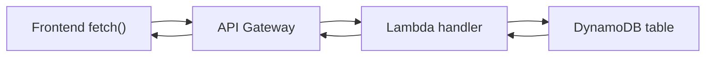
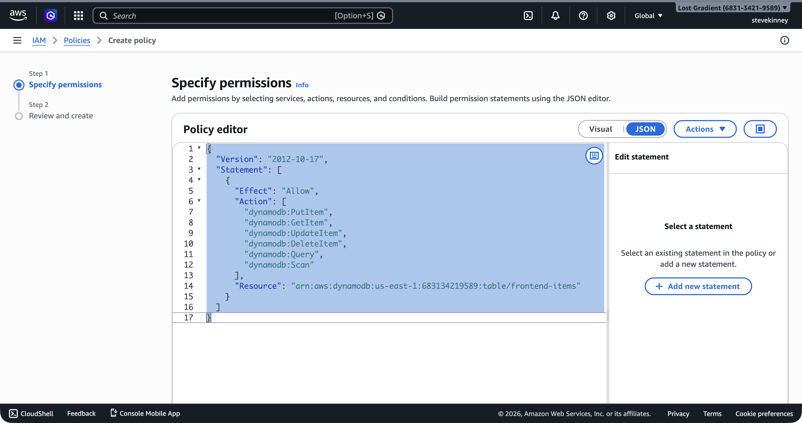
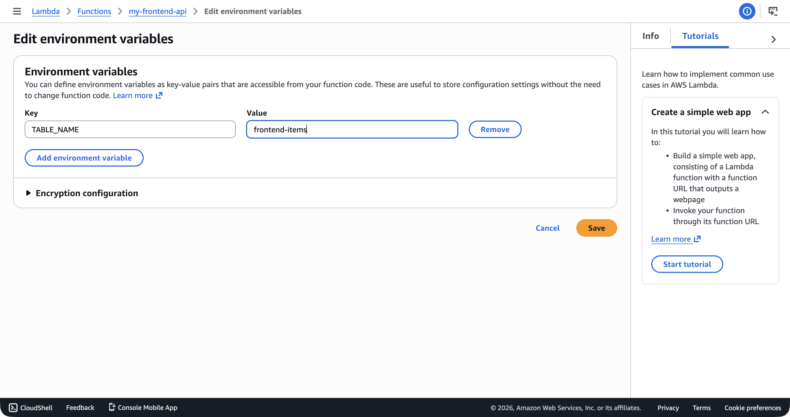

You have all the pieces: a DynamoDB table to store data, a Lambda function to run code, and an API Gateway to expose it over HTTP. Now you connect them into the loop that every full-stack frontend application needs: your React app makes an HTTP request, API Gateway routes it to Lambda, Lambda reads from or writes to DynamoDB, and the response flows back to the browser.

If you want AWS's version of the table access model while you read, the [DynamoDB Developer Guide](https://docs.aws.amazon.com/amazondynamodb/latest/developerguide/Introduction.html) is the official reference.

This is the moment the course goes from "I can deploy static files" to "I have a working backend."

## The Full Request Loop

Here's what happens when a user's browser calls your API:

1. **Frontend** makes a `fetch()` call to your API Gateway URL
2. **API Gateway** receives the HTTP request and triggers your Lambda function (you configured this in [Connecting API Gateway to Lambda](connecting-api-gateway-to-lambda.md))
3. **Lambda** parses the request, calls DynamoDB, and builds a response
4. **DynamoDB** reads or writes data and returns the result to Lambda
5. **Lambda** returns an HTTP response to API Gateway
6. **API Gateway** sends the response back to the browser



The only missing piece: your Lambda function doesn't have permission to talk to DynamoDB yet. The execution role you created in [Lambda Execution Roles and Permissions](lambda-execution-roles-and-permissions.md) only has logging permissions. You need to add a DynamoDB policy.

## Updating the Execution Role

Your Lambda function needs permission to perform DynamoDB operations on the `my-frontend-app-data` table. Create a policy that grants exactly the operations your handler uses—nothing more.

Save this as `lambda-dynamodb-policy.json`:

```json
{
  "Version": "2012-10-17",
  "Statement": [
    {
      "Sid": "AllowDynamoDBAccess",
      "Effect": "Allow",
      "Action": [
        "dynamodb:GetItem",
        "dynamodb:PutItem",
        "dynamodb:UpdateItem",
        "dynamodb:DeleteItem",
        "dynamodb:Query"
      ],
      "Resource": "arn:aws:dynamodb:us-east-1:123456789012:table/my-frontend-app-data"
    }
  ]
}
```

This follows the principle of least privilege from [Principle of Least Privilege](principle-of-least-privilege.md): the function can read, write, update, delete, and query items—but only on this specific table. It can't create or delete tables, it can't scan the entire table, and it can't touch any other table in your account.

In the console, you can create this policy in the IAM **Create policy** JSON editor—the same place you defined the execution role trust policy.



Create and attach the policy:

```bash
aws iam create-policy \
  --policy-name MyFrontendAppLambdaDynamoDB \
  --policy-document file://lambda-dynamodb-policy.json \
  --region us-east-1 \
  --output json
```

```bash
aws iam attach-role-policy \
  --role-name my-frontend-app-lambda-role \
  --policy-arn arn:aws:iam::123456789012:policy/MyFrontendAppLambdaDynamoDB \
  --region us-east-1 \
  --output json
```

Verify the role now has both policies:

```bash
aws iam list-attached-role-policies \
  --role-name my-frontend-app-lambda-role \
  --region us-east-1 \
  --output json
```

Expected output:

```json
{
  "AttachedPolicies": [
    {
      "PolicyName": "AWSLambdaBasicExecutionRole",
      "PolicyArn": "arn:aws:iam::aws:policy/service-role/AWSLambdaBasicExecutionRole"
    },
    {
      "PolicyName": "MyFrontendAppLambdaDynamoDB",
      "PolicyArn": "arn:aws:iam::123456789012:policy/MyFrontendAppLambdaDynamoDB"
    }
  ]
}
```

> [!WARNING]
> If you forget to add this policy, your Lambda function will throw an `AccessDeniedException` when it tries to call DynamoDB. The error message will tell you exactly which action was denied on which resource—use that to fix the policy. Don't solve this by granting `dynamodb:*` on `*`. That gives your function access to every DynamoDB table in your account.

## The Complete Handler

Here's a complete Lambda handler that implements a CRUD API for items stored in DynamoDB. This is the handler you'd deploy behind the API Gateway you set up earlier in the course.

```typescript
import type { APIGatewayProxyHandlerV2 } from 'aws-lambda';
import { DynamoDBClient } from '@aws-sdk/client-dynamodb';
import {
  DynamoDBDocumentClient,
  GetCommand,
  PutCommand,
  DeleteCommand,
  QueryCommand,
} from '@aws-sdk/lib-dynamodb';

const client = DynamoDBDocumentClient.from(new DynamoDBClient({}));
const TABLE_NAME = process.env.TABLE_NAME ?? 'my-frontend-app-data';

export const handler: APIGatewayProxyHandlerV2 = async (event) => {
  const method = event.requestContext.http.method;
  const userId = event.queryStringParameters?.userId;

  if (!userId) {
    return respond(400, { error: 'Missing userId parameter' });
  }

  try {
    switch (method) {
      case 'GET': {
        const itemId = event.queryStringParameters?.itemId;

        if (itemId) {
          const result = await client.send(
            new GetCommand({
              TableName: TABLE_NAME,
              Key: { userId, itemId },
            }),
          );

          if (!result.Item) {
            return respond(404, { error: 'Item not found' });
          }

          return respond(200, result.Item);
        }

        const result = await client.send(
          new QueryCommand({
            TableName: TABLE_NAME,
            KeyConditionExpression: 'userId = :userId',
            ExpressionAttributeValues: { ':userId': userId },
          }),
        );

        return respond(200, { items: result.Items ?? [] });
      }

      case 'POST': {
        const body = JSON.parse(event.body ?? '{}');

        if (!body.title) {
          return respond(400, { error: 'Missing title in request body' });
        }

        const itemId = `item-${Date.now()}`;

        const item = {
          userId,
          itemId,
          title: body.title,
          status: body.status ?? 'pending',
          createdAt: new Date().toISOString(),
        };

        await client.send(
          new PutCommand({
            TableName: TABLE_NAME,
            Item: item,
          }),
        );

        return respond(201, item);
      }

      case 'DELETE': {
        const itemId = event.queryStringParameters?.itemId;

        if (!itemId) {
          return respond(400, { error: 'Missing itemId parameter' });
        }

        await client.send(
          new DeleteCommand({
            TableName: TABLE_NAME,
            Key: { userId, itemId },
          }),
        );

        return respond(200, { deleted: true });
      }

      default:
        return respond(405, { error: 'Method not allowed' });
    }
  } catch (error) {
    console.error('Handler error:', error);
    return respond(500, { error: 'Internal server error' });
  }
};

function respond(statusCode: number, body: Record<string, unknown>) {
  return {
    statusCode,
    headers: {
      'Content-Type': 'application/json',
      'Access-Control-Allow-Origin': '*',
    },
    body: JSON.stringify(body),
  };
}
// [!note The `respond` helper keeps response formatting consistent and includes the CORS header.]
```

A few things to notice:

- **GET without `itemId`** queries for all items belonging to the user. GET with `itemId` fetches a single item. This is a standard REST pattern.
- **POST** generates a unique `itemId` using `Date.now()`. For production, you'd use a UUID library, but timestamp-based IDs are fine for learning.
- **The `respond` helper** reduces boilerplate. Every response needs `statusCode`, `Content-Type`, and `Access-Control-Allow-Origin`—putting that in a function means you don't repeat it in every branch.
- **Error handling** catches DynamoDB errors and returns a 500. In production, you'd log the full error and return a sanitized message to the client.

## Setting the Table Name as an Environment Variable

Hardcoding the table name works, but using an environment variable makes your function portable across environments (development, staging, production). Update the function configuration:

```bash
aws lambda update-function-configuration \
  --function-name my-frontend-app-api \
  --environment 'Variables={TABLE_NAME=my-frontend-app-data}' \
  --region us-east-1 \
  --output json
```

The handler already reads from `process.env.TABLE_NAME` with a fallback to `my-frontend-app-data`, so this change doesn't require a code update.

In the console, the **Configuration → Environment variables** section shows `TABLE_NAME` alongside any other variables the function uses.

 But now you can point the same code at a different table by changing the environment variable—useful when you have a `my-frontend-app-data-dev` table for development.

## Deploying and Testing

Build, package, and deploy the updated handler:

```bash
cd lambda
npm run build
cd dist && zip -r ../function.zip . && cd ..

aws lambda update-function-code \
  --function-name my-frontend-app-api \
  --zip-file fileb://function.zip \
  --region us-east-1 \
  --output json
```

> [!NOTE] Why no `node_modules` in the zip?
> You just added `@aws-sdk/client-dynamodb` and `@aws-sdk/lib-dynamodb` to `package.json`, so you might be wondering whether the zip needs to bundle `node_modules` now. It doesn't: the `nodejs20.x` runtime already ships the AWS SDK v3 packages, so anything under `@aws-sdk/*` resolves at runtime without being in your zip. This is also why your local `npm install` is enough for type checking—the imports work both locally and in Lambda. Once you add a dependency that _isn't_ pre-installed (a Markdown parser, a date library, anything outside `@aws-sdk/*`), you'll need to copy `node_modules` into `dist/` before zipping. See the warning in [Deploying and Testing a Lambda Function](deploying-and-testing-a-lambda-function.md) for the exact mechanics.

Test creating an item:

```bash
aws lambda invoke \
  --function-name my-frontend-app-api \
  --cli-binary-format raw-in-base64-out \
  --payload '{"requestContext":{"http":{"method":"POST","path":"/"}},"queryStringParameters":{"userId":"user-123"},"body":"{\"title\":\"Deploy to production\"}"}' \
  --region us-east-1 \
  --output json \
  response.json
```

Check the response:

```bash
cat response.json
```

You should see a 201 response with the created item, including the generated `itemId` and `createdAt` timestamp.

Test listing items for the user:

```bash
aws lambda invoke \
  --function-name my-frontend-app-api \
  --cli-binary-format raw-in-base64-out \
  --payload '{"requestContext":{"http":{"method":"GET","path":"/"}},"queryStringParameters":{"userId":"user-123"}}' \
  --region us-east-1 \
  --output json \
  response.json
```

The response should include the item you just created in the `items` array.

## Calling It from the Frontend

Once your API is exposed through API Gateway (which you set up in [Creating an HTTP API](creating-an-http-api.md) and configured CORS for in [API Gateway CORS Configuration](api-gateway-cors-configuration.md)), your frontend code looks like this:

```typescript
const API_URL = 'https://your-api-id.execute-api.us-east-1.amazonaws.com';

async function createItem(userId: string, title: string) {
  const response = await fetch(`${API_URL}/?userId=${userId}`, {
    method: 'POST',
    headers: { 'Content-Type': 'application/json' },
    body: JSON.stringify({ title }),
  });

  return response.json();
}

async function getItems(userId: string) {
  const response = await fetch(`${API_URL}/?userId=${userId}`);
  return response.json();
}
```

This is the same `fetch` API you use in any frontend application. The only difference is that the URL points to your API Gateway endpoint instead of a Vercel or Netlify function. That's it—from the frontend's perspective, it's just another API.

> [!TIP]
> If you're getting CORS errors when calling your API from the frontend, check two places: the `Access-Control-Allow-Origin` header in your Lambda response (included in the `respond` helper above) and the CORS configuration on your API Gateway HTTP API (covered in [API Gateway CORS Configuration](api-gateway-cors-configuration.md)). Both need to allow your frontend's origin.

## What You Have Built

Take a step back and look at what's running:

- **S3** hosts your static frontend files.
- **CloudFront** serves them globally with HTTPS.
- **Route 53** points your domain at CloudFront.
- **API Gateway** provides an HTTP endpoint for your API.
- **Lambda** runs your backend logic.
- **DynamoDB** stores your data (this module)
- **IAM** ties it all together with least-privilege permissions.

That's a complete, production-capable full-stack application running on serverless infrastructure. No servers to manage. No databases to patch. No connection pools to tune. You pay for what you use, and at low traffic, what you use costs nearly nothing.
