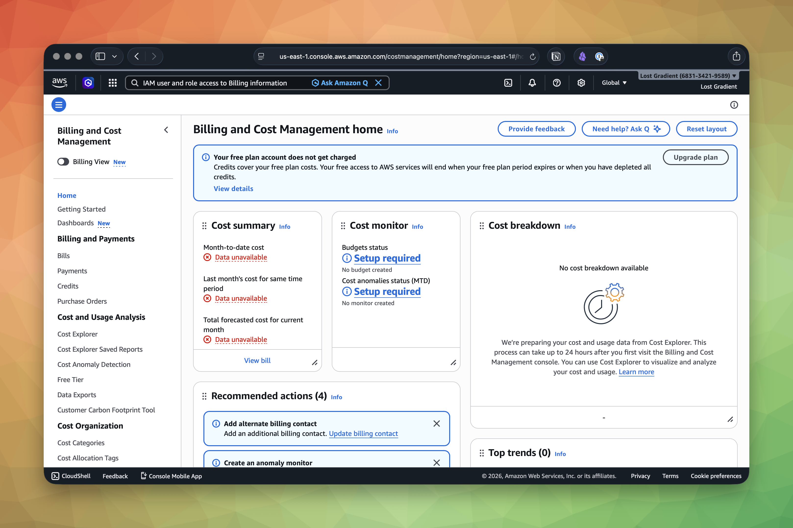

The scariest thing about AWS isn't IAM policies or CloudFormation templates—it's the billing page. Unlike Vercel or Netlify, where you pick a plan and know what you'll pay, AWS charges you for exactly what you use. That's great for cost efficiency at scale. It's terrifying when you're learning, because a misconfigured service can run up charges before you notice.

If you want live numbers instead of lesson-time snapshots, the [AWS Pricing Calculator](https://calculator.aws/), the [AWS Budgets pricing page](https://aws.amazon.com/aws-cost-management/aws-budgets/pricing/), and the current service pricing pages are the sources of truth.

The good news: everything you built in this course fits comfortably within the AWS Free Tier or costs pennies per month. The better news: AWS gives you tools to set up alarms that fire before you spend a single unexpected dollar. Set them up now, before you forget.

## Free Tier Boundaries for Every Service in This Course

Before you set up budget alarms, you need to know what's actually free. Here's every service you've used, with its free tier limits:

### S3

**Free for 12 months** after account creation:

- 5 GB of S3 Standard storage
- 20,000 GET requests per month
- 2,000 PUT requests per month

A typical static frontend build is 5-50 MB. You'd need to store roughly 100 different versions of a large site to approach the 5 GB limit. The request limits are similarly generous—20,000 GETs per month is well beyond what you'll generate during development.

### CloudFront

**Always free** (no 12-month expiration):

- 1 TB of data transfer out per month
- 10,000,000 HTTP/HTTPS requests per month
- 2,000,000 CloudFront Functions invocations per month

This is extremely generous. A typical static site serving 100 KB pages would need 10 million page views per month to hit the 1 TB transfer limit. If your personal project is getting 10 million page views, you have much bigger things to think about than your AWS bill. (Congratulations, by the way.)

### Lambda

**Always free** (no 12-month expiration):

- 1,000,000 invocations per month
- 400,000 GB-seconds of compute per month

A GB-second is one second of execution with 1 GB of memory. If your function uses 128 MB of memory and runs for 200 ms per invocation, each invocation consumes 0.025 GB-seconds. At that rate, you get 16 million invocations per month before you exceed the compute limit. The request limit of 1 million will be your constraint first—and a million API calls per month is a real application, not a side project.

### API Gateway

**Free for 12 months** after account creation:

- 1,000,000 HTTP API calls per month
- 1,000,000 REST API calls per month

After the 12-month period, HTTP APIs cost $1.00 per million requests. Even a moderately active application will cost single digits per month.

### DynamoDB

**Always free** (no 12-month expiration):

- 25 GB of storage
- 25 read capacity units (RCUs)
- 25 write capacity units (WCUs)

The 25 GB storage limit is enormous for most frontend-backed applications. The capacity units are enough for roughly 25 reads and 25 writes per second—sustained, continuously. For a side project or small production app, you'll never hit these limits.

> [!TIP]
> If you created your DynamoDB table with on-demand capacity mode (as recommended in this course), treat DynamoDB costs as request-based rather than provisioned-capacity math. The easiest way to stay accurate is to check the current DynamoDB pricing page or calculator instead of memorizing old free-tier numbers.

### Route 53

**No free tier.** Route 53 charges $0.50 per hosted zone per month, plus $0.40 per million DNS queries for the first billion queries. For a single domain with normal traffic, expect to pay about $0.50–$1.00 per month. This is one of the few services in this course that costs money from day one.

### CloudWatch

**Always free** (no 12-month expiration):

- 10 custom or detailed monitoring metrics
- 10 standard alarm metrics
- 1,000,000 API requests
- 5 GB across log ingestion, archive storage, and Logs Insights scanning
- 3 dashboards with up to 50 metrics each

Lambda automatically sends logs to CloudWatch. The 5 GB shared log allowance is where you're most likely to hit a boundary—if your Lambda functions log aggressively, you can exceed it quickly. Set log retention to 7 or 14 days on your log groups to keep storage costs down.

## Setting Up a Budget Alarm

AWS Budgets lets you define a spending threshold and get notified when you approach it. This takes five minutes and can save you from a surprise bill.

### Using the Console

The fastest way to set up your first budget:

1. Open the **AWS Billing and Cost Management** console.
2. Click **Budgets** in the left sidebar.
3. Click **Create budget**.
4. Select **Customize (advanced)** and then **Cost budget**.
5. Set the budget amount to something low—$5 or $10 per month is reasonable for a learning account.
6. Add a notification threshold at 80% of your budget. Enter your email address as the notification target.
7. Add a second notification at 100%.
8. Click **Create budget**.

### Using the CLI

You can also create a budget programmatically. First, create a JSON file with your budget definition:

```json
{
  "BudgetName": "my-frontend-app-monthly",
  "BudgetLimit": {
    "Amount": "10",
    "Unit": "USD"
  },
  "TimeUnit": "MONTHLY",
  "BudgetType": "COST"
}
```

Then create the notification configuration:

```json
[
  {
    "Notification": {
      "NotificationType": "ACTUAL",
      "ComparisonOperator": "GREATER_THAN",
      "Threshold": 80,
      "ThresholdType": "PERCENTAGE"
    },
    "Subscribers": [
      {
        "SubscriptionType": "EMAIL",
        "Address": "your-email@example.com"
      }
    ]
  },
  {
    "Notification": {
      "NotificationType": "ACTUAL",
      "ComparisonOperator": "GREATER_THAN",
      "Threshold": 100,
      "ThresholdType": "PERCENTAGE"
    },
    "Subscribers": [
      {
        "SubscriptionType": "EMAIL",
        "Address": "your-email@example.com"
      }
    ]
  }
]
```

Then run:

```bash
aws budgets create-budget \
  --account-id 123456789012 \
  --budget file://budget.json \
  --notifications-with-subscribers file://notifications.json \
  --region us-east-1 \
  --output json
```

You'll receive an email when your actual spending crosses 80% and 100% of your $10 monthly budget.

> [!WARNING]
> Budget alerts aren't real-time. AWS evaluates budgets multiple times per day, but there can be a delay of several hours between when you incur a charge and when the alert fires. Don't rely on budget alerts as a hard spending cap—they're an early warning system, not a kill switch.

## The Billing Dashboard and Cost Explorer

Two tools in the AWS console help you understand where your money is going:

### Billing Dashboard

The **Billing and Cost Management Dashboard** shows your current month's charges broken down by service. Open it from the console's top navigation bar (click your account name, then "Billing and Cost Management"). This is the page you should check once a week while you're learning AWS.



The dashboard shows:

- **Month-to-date charges** broken down by service
- **Free tier usage** showing how much of each service's free tier you have consumed
- **Forecasted end-of-month charges** based on your current usage pattern

If your `admin` user cannot open this page, you probably skipped **IAM user and role access to Billing information** during the initial account setup. Go back to [Creating and Securing an AWS Account](creating-and-securing-an-aws-account.md) and enable it from the billing settings page as root.

### Cost Explorer

**Cost Explorer** is more powerful. It lets you visualize spending over time, filter by service, and identify trends. It's particularly useful for answering questions like "why did my bill jump this month?"—you can drill into individual services and see day-by-day spending.

To enable Cost Explorer:

1. Open the Billing console.
2. Click **Cost Explorer** in the left sidebar.
3. Click **Launch Cost Explorer** if this is your first time.

Cost Explorer itself is free for the basic functionality. The API version charges per request, but you don't need the API for manual investigation.

> [!TIP]
> Enable **Free Tier usage alerts** in the Billing preferences. Go to Billing, then Preferences, then Billing Preferences, and check "Receive Free Tier Usage Alerts." AWS will email you when any service approaches 85% of its free tier limit—a separate, more granular alert than the budget alarm you set up above.

## The Services That Catch People Off Guard

Most of the services in this course are either always-free or comfortably within the 12-month free tier for development workloads. But a few have caught people off guard:

**Route 53 hosted zones** cost $0.50/month each. If you created multiple hosted zones while experimenting, each one costs $0.50/month whether you use it or not. Delete hosted zones you aren't using.

**CloudWatch Logs storage** charges $0.03 per GB per month after the free tier. If your Lambda functions log verbose output on every invocation and you never set a retention policy, the logs accumulate indefinitely. Set a retention period on every log group.

**Forgotten resources** are the real danger. I've been bitten by this more than once. A Lambda function that isn't invoked costs nothing. A DynamoDB table with provisioned capacity that nobody reads from still costs money for the provisioned throughput. An Elastic IP address that's allocated but not attached to a running instance costs $0.005 per hour. The pattern is always the same: you created something while experimenting, you forgot about it, and it accrues charges quietly.

Run this periodically to check for resources you might have forgotten:

```bash
aws s3 ls --region us-east-1 --output json
```

```bash
aws dynamodb list-tables --region us-east-1 --output json
```

```bash
aws lambda list-functions --region us-east-1 --output json
```

If anything shows up that you don't recognize or no longer need, delete it.

## A Reasonable Budget for This Course

If you're working through this course with a single project, here's what to expect:

- **During the 12-month free tier period:** $0.50–$2.00 per month, almost entirely from Route 53 and minor CloudWatch overages.
- **After the 12-month free tier expires:** $2.00–$5.00 per month for a low-traffic application, assuming Lambda and DynamoDB stay within their always-free limits.
- **If something goes wrong:** The most common surprise bill is $10–$50 from a forgotten resource or an unexpectedly verbose logging configuration.

Setting up a $10 monthly budget alarm—which you just did—covers all of these scenarios. If you get that email, something is either misconfigured or getting more traffic than you expected. Either way, you'll want to know about it.
