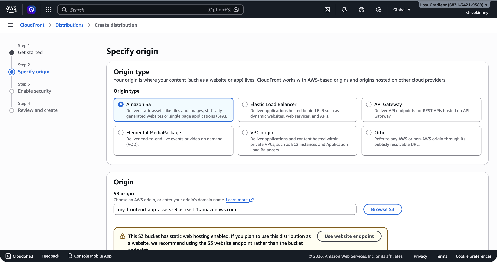
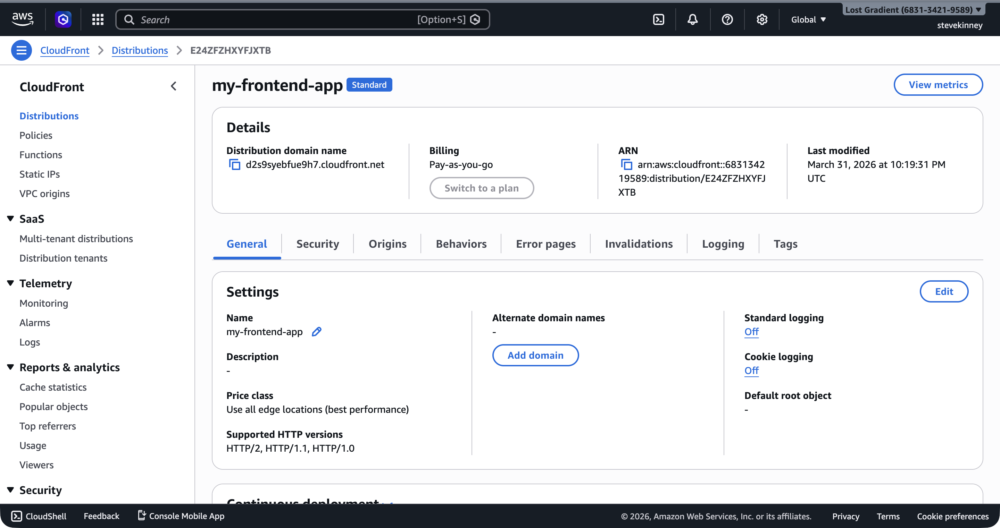
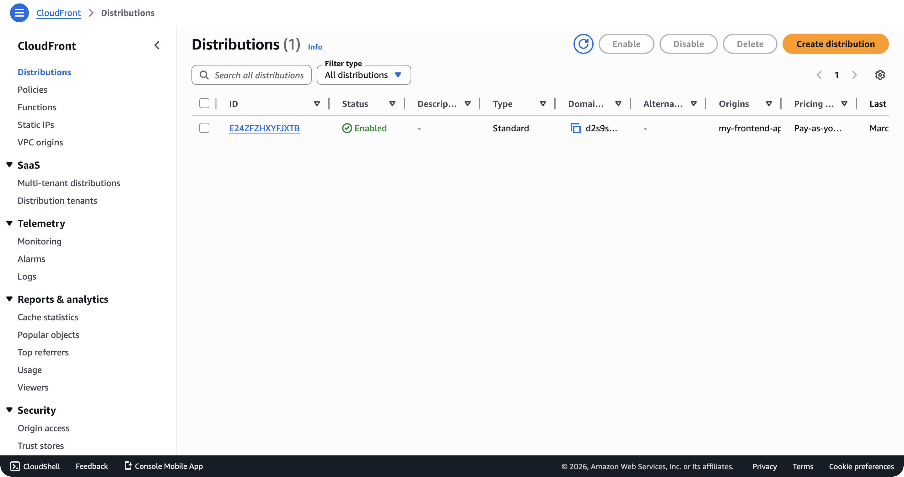

You have an S3 bucket with your static site files. Now you need to put a CDN in front of it. That means creating a CloudFront **distribution**—the resource that defines how CloudFront serves your content to users around the world.

If you want AWS's exact terminology next to this lesson, the [CloudFront Developer Guide](https://docs.aws.amazon.com/AmazonCloudFront/latest/DeveloperGuide/Introduction.html) and the [cache behavior settings reference](https://docs.aws.amazon.com/AmazonCloudFront/latest/DeveloperGuide/DownloadDistValuesCacheBehavior.html) are the official sources.

On Vercel, this happens automatically when you push to a Git branch. On AWS, you configure it explicitly. The upside: you control every detail. The downside: there are a lot of details.

## The Distribution Config

Creating a CloudFront distribution through the CLI means passing a JSON configuration to `aws cloudfront create-distribution`. The config is verbose—CloudFront has many options and the CLI requires you to specify most of them, even when you want the defaults. Rather than pretend this is simple, here's the full config with annotations explaining each part.

In the console, the new **Create distribution** wizard walks you through the same choices step by step—selecting your origin type, specifying the S3 bucket, and configuring OAC.



Save this as `distribution-config.json`:

```json
{
  "CallerReference": "my-frontend-app-2026-03-18",
  "Comment": "CloudFront distribution for my-frontend-app-assets",
  "Enabled": true,
  "DefaultRootObject": "index.html",
  "PriceClass": "PriceClass_100",
  "HttpVersion": "http2and3",
  "IsIPV6Enabled": true,
  "Origins": {
    "Quantity": 1,
    "Items": [
      {
        "Id": "S3-my-frontend-app-assets",
        "DomainName": "my-frontend-app-assets.s3.us-east-1.amazonaws.com",
        "S3OriginConfig": {
          "OriginAccessIdentity": ""
        }
      }
    ]
  },
  "DefaultCacheBehavior": {
    "TargetOriginId": "S3-my-frontend-app-assets",
    "ViewerProtocolPolicy": "redirect-to-https",
    "CachePolicyId": "658327ea-f89d-4fab-a63d-7e88639e58f6",
    "Compress": true,
    "AllowedMethods": {
      "Quantity": 2,
      "Items": ["GET", "HEAD"],
      "CachedMethods": {
        "Quantity": 2,
        "Items": ["GET", "HEAD"]
      }
    }
  },
  "ViewerCertificate": {
    "CloudFrontDefaultCertificate": true,
    "MinimumProtocolVersion": "TLSv1.2_2021"
  },
  "Restrictions": {
    "GeoRestriction": {
      "RestrictionType": "none",
      "Quantity": 0
    }
  }
}
```

That's a lot of JSON. Let's walk through it.

## Breaking Down the Config

### CallerReference

```json
"CallerReference": "my-frontend-app-2026-03-18"
```

A unique string that prevents you from accidentally creating duplicate distributions. If you submit the same `CallerReference` twice, CloudFront returns the existing distribution instead of creating a new one. Use a timestamp or project name—anything unique to this distribution.

### DefaultRootObject

```json
"DefaultRootObject": "index.html"
```

When someone requests the root URL of your distribution (`https://d1234abcdef.cloudfront.net/`), CloudFront serves this file. This is the CDN equivalent of S3's index document setting. Without it, a request to `/` returns an error because CloudFront doesn't know which object to serve.

> [!WARNING]
> `DefaultRootObject` only applies to the root URL (`/`). It doesn't apply to subdirectory paths like `/about/`. If you need `/about/` to serve `/about/index.html`, you'll need a CloudFront Function or Lambda@Edge, which you'll cover in the edge-compute section. For single-page applications, this is handled by custom error responses, which you'll configure in [Custom Error Pages and SPA Routing](custom-error-pages-and-spa-routing.md).

### PriceClass

```json
"PriceClass": "PriceClass_100"
```

Controls which edge locations serve your content. `PriceClass_100` covers North America, Europe, and Israel—the cheapest option. You can change this to `PriceClass_200` (adds Asia, Africa, Middle East) or `PriceClass_All` (every edge location worldwide) at any time without creating a new distribution.

### Origins

```json
"Origins": {
  "Quantity": 1,
  "Items": [
    {
      "Id": "S3-my-frontend-app-assets",
      "DomainName": "my-frontend-app-assets.s3.us-east-1.amazonaws.com",
      "S3OriginConfig": {
        "OriginAccessIdentity": ""
      }
    }
  ]
}
```

The **origin** is where CloudFront fetches content when it doesn't have a cached copy. For a static site, that's your S3 bucket. A few things to note:

- **`Id`**: A label for this origin. You reference it in cache behaviors to tell CloudFront which origin to use for which paths. The name is arbitrary.
- **`DomainName`**: The S3 bucket's regional domain name. Use the format `<bucket>.s3.<region>.amazonaws.com`, not the S3 website endpoint. CloudFront talks to S3 via the REST API, not the website endpoint. (This one bit me the first time I set this up—I used the website endpoint and spent way too long debugging.)
- **`S3OriginConfig.OriginAccessIdentity`**: Set to an empty string for now. We're not using the legacy Origin Access Identity (OAI). In the next lesson, you'll configure the newer **Origin Access Control** (OAC), which is the recommended approach.

> [!WARNING]
> Don't use the S3 website endpoint URL (e.g., `my-frontend-app-assets.s3-website-us-east-1.amazonaws.com`) as the origin domain name. That endpoint is for direct browser access. CloudFront needs the REST API endpoint (`my-frontend-app-assets.s3.us-east-1.amazonaws.com`) to properly authenticate requests, especially when you add Origin Access Control.

### DefaultCacheBehavior

```json
"DefaultCacheBehavior": {
  "TargetOriginId": "S3-my-frontend-app-assets",
  "ViewerProtocolPolicy": "redirect-to-https",
  "CachePolicyId": "658327ea-f89d-4fab-a63d-7e88639e58f6",
  "Compress": true,
  "AllowedMethods": {
    "Quantity": 2,
    "Items": ["GET", "HEAD"],
    "CachedMethods": {
      "Quantity": 2,
      "Items": ["GET", "HEAD"]
    }
  }
}
```

This is the default **behavior**—the rules that apply to every request that doesn't match a more specific path pattern. The important fields:

- **`TargetOriginId`**: Must match the `Id` of one of your origins.
- **`ViewerProtocolPolicy`**: `"redirect-to-https"` means any HTTP request gets a 301 redirect to HTTPS. This is what you want for any production site.
- **`CachePolicyId`**: Instead of manually specifying TTLs and forwarded values, you reference a managed **cache policy**. The ID `658327ea-f89d-4fab-a63d-7e88639e58f6` is AWS's **CachingOptimized** policy, which sets a default TTL of 86,400 seconds (24 hours), a maximum TTL of 31,536,000 seconds (365 days), and a minimum TTL of 1 second.
- **`Compress`**: When `true`, CloudFront automatically compresses files using gzip or Brotli before sending them to the browser. Free performance improvement.

### ViewerCertificate

```json
"ViewerCertificate": {
  "CloudFrontDefaultCertificate": true,
  "MinimumProtocolVersion": "TLSv1.2_2021"
}
```

For now, we're using CloudFront's default certificate, which gives you HTTPS on the `*.cloudfront.net` domain. In [Attaching an SSL Certificate](attaching-an-ssl-certificate.md), you'll swap this for your ACM certificate to use a custom domain.

## Creating the Distribution

With the config file saved, create the distribution:

```bash
aws cloudfront create-distribution \
  --distribution-config file://distribution-config.json \
  --region us-east-1 \
  --output json
```

The response is large—CloudFront returns the complete distribution configuration plus its current status. The fields you care about right now:

```json
{
  "Distribution": {
    "Id": "E1A2B3C4D5E6F7",
    "DomainName": "d1234abcdef.cloudfront.net",
    "Status": "InProgress",
    "DistributionConfig": {
      "...": "the config you submitted"
    }
  }
}
```

- **`Id`**: Your distribution's unique identifier. You'll use this for every subsequent operation—invalidations, updates, deletions.
- **`DomainName`**: The CloudFront URL where your site is now accessible. This is a `*.cloudfront.net` domain that you can open in a browser.
- **`Status`**: `"InProgress"` means CloudFront is deploying your distribution to edge locations worldwide. This takes a few minutes.

In the console, the distribution detail page shows the deployment progress. The **Last modified** column shows "Deploying" as CloudFront propagates to all edge locations.



## Waiting for Deployment

CloudFront distributions take time to deploy—typically 5 to 15 minutes. You can check the status:

```bash
aws cloudfront get-distribution \
  --id E1A2B3C4D5E6F7 \
  --region us-east-1 \
  --output json \
  --query "Distribution.Status"
```

When the status changes from `"InProgress"` to `"Deployed"`, your distribution is live. You can also use the `wait` command to block until deployment completes:

```bash
aws cloudfront wait distribution-deployed \
  --id E1A2B3C4D5E6F7 \
  --region us-east-1
```

This command exits silently when the distribution is fully deployed. No output means success.

In the console, the distributions list shows the distribution with status **Enabled** and the `*.cloudfront.net` domain name once deployment completes.



## Testing Your Distribution

Once deployed, open the CloudFront domain name in your browser:

```
https://d1234abcdef.cloudfront.net
```

You should see your site—the same files you uploaded to S3 in [Uploading and Organizing Files](uploading-and-organizing-files.md), now served through CloudFront with HTTPS. The URL isn't pretty, but it proves the distribution works. You'll attach a custom domain later.

> [!TIP]
> If you see an "Access Denied" XML error, your S3 bucket might not have a public bucket policy yet. For now, the bucket needs to be publicly readable (as configured in [Bucket Policies and Public Access](bucket-policies-and-public-access.md)). In the next lesson, you'll lock down the bucket using Origin Access Control so only CloudFront can read from it—removing the need for public access entirely.

## Listing and Describing Distributions

To see all your distributions:

```bash
aws cloudfront list-distributions \
  --region us-east-1 \
  --output json \
  --query "DistributionList.Items[*].{Id:Id,Domain:DomainName,Status:Status,Comment:Comment}"
```

To get the full configuration of a specific distribution:

```bash
aws cloudfront get-distribution-config \
  --id E1A2B3C4D5E6F7 \
  --region us-east-1 \
  --output json
```

You'll use `get-distribution-config` frequently—updating a distribution requires fetching the current config, modifying it, and submitting it back with the `ETag` from the response. More on that when you update the distribution in later lessons.

Your distribution works, but right now anyone can bypass CloudFront and access your S3 bucket directly. That defeats the purpose of having a CDN—you want all traffic flowing through CloudFront so you get caching, HTTPS, and security headers. In the next lesson, you'll configure **Origin Access Control** to lock down the S3 bucket so only CloudFront can read from it.
