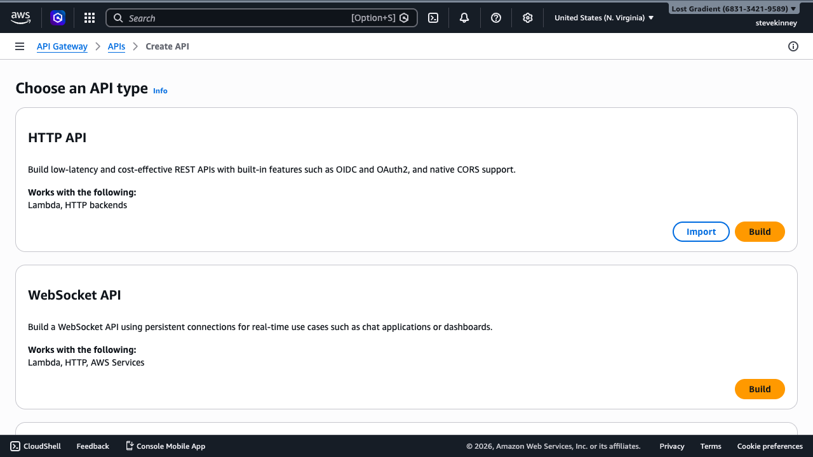
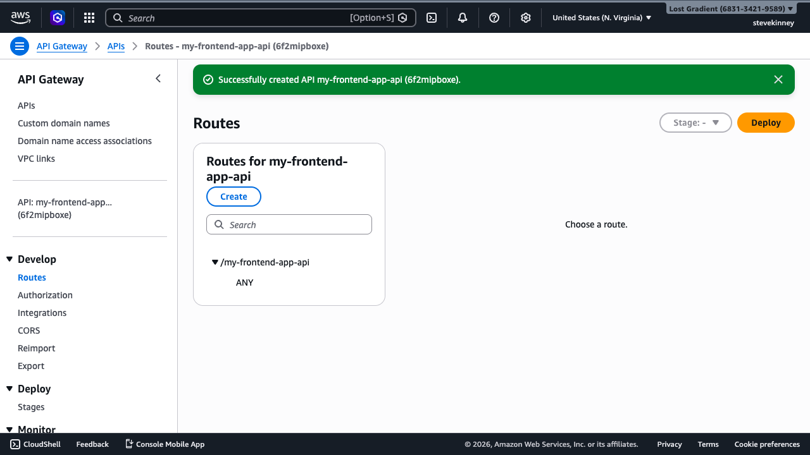

You picked HTTP APIs. Now you need to create one. On Vercel, an API endpoint exists the moment you create a file in the `api/` directory. On AWS, you create the API explicitly—a named resource with its own URL, its own configuration, and its own lifecycle. The upside is that you control everything. The downside is that you _have_ to create everything.

If you want AWS's exact version of the HTTP API setup while you read, keep the [HTTP APIs documentation](https://docs.aws.amazon.com/apigateway/latest/developerguide/http-api.html) and the [`aws apigatewayv2 create-api` command reference](https://docs.aws.amazon.com/cli/latest/reference/apigatewayv2/create-api.html) open.

The good news: creating an HTTP API from the CLI takes a single command.

## Creating the API

Use `aws apigatewayv2 create-api` to create a new HTTP API:

```bash
aws apigatewayv2 create-api \
  --name my-frontend-app-api \
  --protocol-type HTTP \
  --region us-east-1 \
  --output json
```

The response includes the fields you'll need for everything that follows:

```json
{
  "ApiEndpoint": "https://abc123def4.execute-api.us-east-1.amazonaws.com",
  "ApiId": "abc123def4",
  "CreatedDate": "2026-03-18T12:00:00+00:00",
  "Name": "my-frontend-app-api",
  "ProtocolType": "HTTP",
  "RouteSelectionExpression": "${request.method} ${request.path}"
}
```

Two things to note here:

- **`ApiId`**: This is the identifier you'll use in every subsequent command. Save it. Every route, integration, stage, and domain configuration references this ID.
- **`ApiEndpoint`**: This is the auto-generated URL where your API will be reachable.

In the console, the **Create API** page shows the choice between HTTP API, WebSocket API, and REST API upfront—HTTP API is the right choice for a Lambda-backed REST endpoint.

 It follows the pattern `https://{api-id}.execute-api.{region}.amazonaws.com`. You'll replace this with a custom domain later, but it works immediately for testing.

> [!TIP]
> Save the `ApiId` to a shell variable so you can reference it in later commands without copying and pasting:
>
> ```bash
> API_ID="abc123def4"
> ```

## The `$default` Stage

When you create an HTTP API using the console or quick-create (`--target`), API Gateway automatically creates a **`$default` stage**. When you build the API step-by-step from the CLI (which is what we do in this course), you need to create it yourself:

```bash
aws apigatewayv2 create-stage \
  --api-id abc123def4 \
  --stage-name '$default' \
  --auto-deploy \
  --region us-east-1 \
  --output json
```

The `$default` stage has two important properties:

1. **Auto-deploy is enabled.** Any changes you make to routes, integrations, or configuration are deployed automatically. You don't need to run a separate deploy command.
2. **No stage prefix in the URL.** The `$default` stage serves your API at the root of the `ApiEndpoint` URL. If your endpoint is `https://abc123def4.execute-api.us-east-1.amazonaws.com`, a route at `/items` is reachable at `https://abc123def4.execute-api.us-east-1.amazonaws.com/items`—no `/prod` or `/dev` prefix needed.

This is different from REST APIs, where you always have a stage name in the URL (like `/prod/items`). The `$default` stage keeps your URLs clean and matches the routing behavior you're used to from Vercel or Netlify.

You can verify the stage exists:

```bash
aws apigatewayv2 get-stages \
  --api-id abc123def4 \
  --region us-east-1 \
  --output json
```

```json
{
  "Items": [
    {
      "AutoDeploy": true,
      "CreatedDate": "2026-03-18T12:00:00+00:00",
      "DefaultRouteSettings": {
        "DetailedMetricsEnabled": false
      },
      "StageName": "$default",
      "StageVariables": {}
    }
  ]
}
```

In the console, clicking the `$default` stage shows the **Invoke URL**—the base URL for all your routes.



## The Route Selection Expression

The `RouteSelectionExpression` in the API output was `${request.method} ${request.path}`. This tells API Gateway how to match incoming requests to routes. For HTTP APIs, this is always `${request.method} ${request.path}`—the HTTP method followed by the path. You can't change it, and you don't need to.

When a request comes in, API Gateway evaluates the method and path against your defined routes. A route key like `GET /items` matches GET requests to `/items`. A route key like `POST /items` matches POST requests to the same path. If no route matches, the request gets a 404.

## Quick Create: The Shortcut

If you already have a Lambda function and want to skip the separate integration and route steps (which we'll cover in the next lesson), you can use the `--target` flag to create everything in one command:

```bash
aws apigatewayv2 create-api \
  --name my-frontend-app-api \
  --protocol-type HTTP \
  --target arn:aws:lambda:us-east-1:123456789012:function:my-frontend-app-api \
  --region us-east-1 \
  --output json
```

This creates the API, a `$default` catch-all route, and a Lambda proxy integration—all in one shot. It also creates the `$default` stage with auto-deploy enabled.

The catch: quick create wires up a single catch-all route (`$default`) that sends every request to one Lambda function. That's fine for simple APIs where your handler does its own routing, but it gives you less control over per-route configuration. For this course, we'll create routes and integrations explicitly so you understand how the pieces fit together.

> [!WARNING]
> Quick create doesn't automatically grant API Gateway permission to invoke your Lambda function. You still need to run `aws lambda add-permission` separately, which we cover in the next lesson. Without that permission, every request returns a 500 error with an "Internal Server Error" message and no useful details.

## With the SDK

```typescript
import {
  ApiGatewayV2Client,
  CreateApiCommand,
  GetApiCommand,
  GetApisCommand,
} from '@aws-sdk/client-apigatewayv2';

const apigw = new ApiGatewayV2Client({ region: 'us-east-1' });

const created = await apigw.send(
  new CreateApiCommand({
    Name: 'my-frontend-app-api',
    ProtocolType: 'HTTP',
    Description: 'HTTP API for the frontend',
    CorsConfiguration: {
      AllowOrigins: ['https://example.com'],
      AllowMethods: ['GET', 'POST'],
      AllowHeaders: ['content-type'],
    },
  }),
);
console.log(created.ApiId, created.ApiEndpoint);
```

## Verifying Your API

Verify the API exists and check its configuration at any time:

```bash
aws apigatewayv2 get-api \
  --api-id abc123def4 \
  --region us-east-1 \
  --output json
```

If you have multiple APIs and need to find the right one:

```bash
aws apigatewayv2 get-apis \
  --region us-east-1 \
  --output json
```

At this point, you have an HTTP API with a `$default` stage and an auto-generated URL. The API doesn't have any routes or integrations yet, so hitting the URL returns a `{"message":"Not Found"}` response. That's correct—you haven't told API Gateway where to send requests.

## Cleaning Up

If you need to start over or delete an API you created for testing:

```bash
aws apigatewayv2 delete-api \
  --api-id abc123def4 \
  --region us-east-1 \
  --output json
```

This removes the API, all its routes, integrations, and stages. The Lambda function isn't affected—it still exists, just without an API in front of it.

An API without routes is an API that returns 404 for everything. In the next lesson, you'll create a Lambda proxy integration and wire routes to your Lambda function so that HTTP requests actually reach your handler. You'll also grant API Gateway permission to invoke the function—a step that catches almost everyone the first time.
