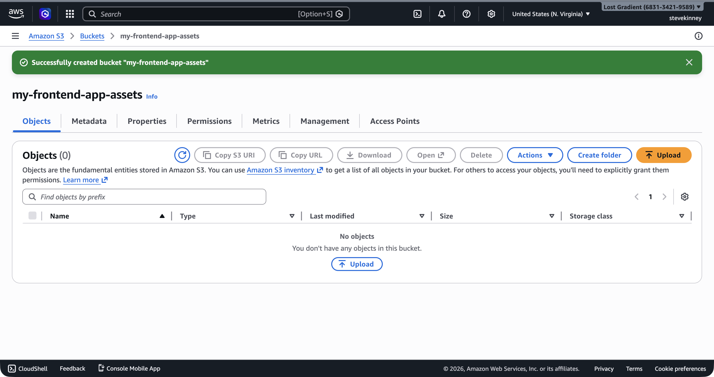
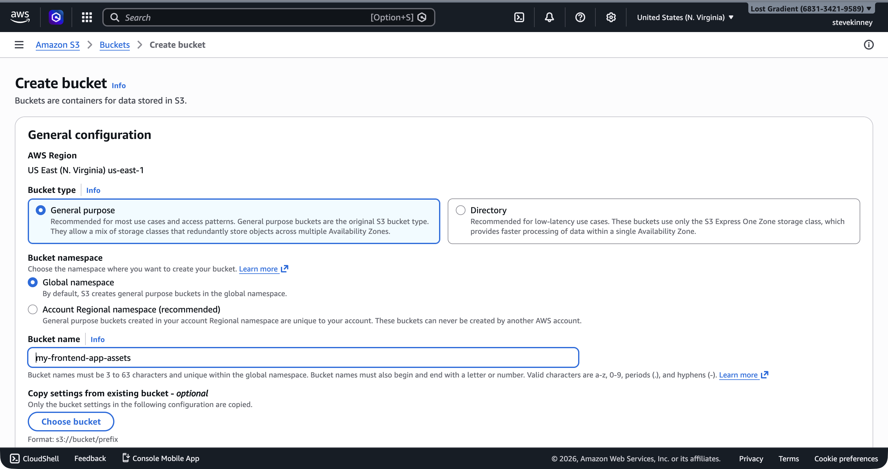
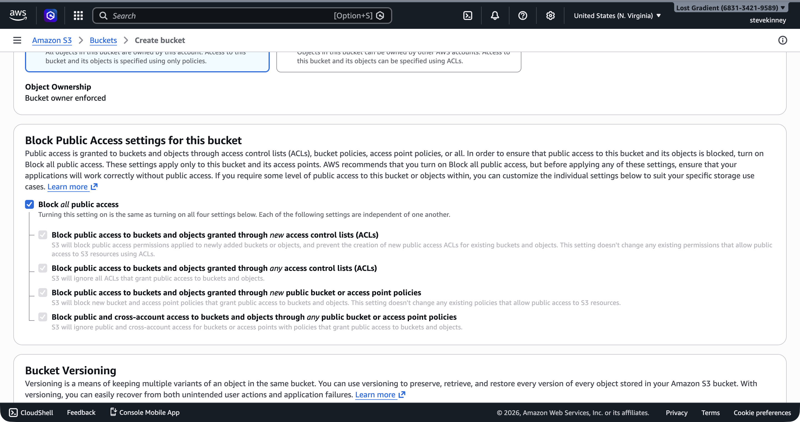
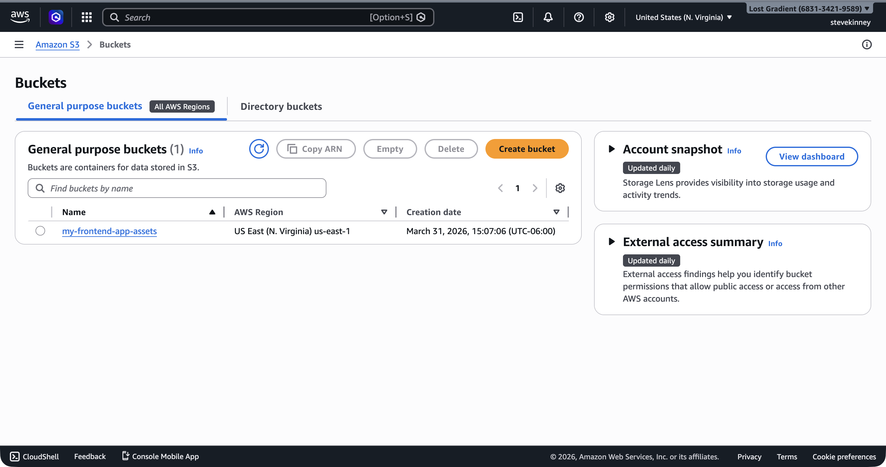

You know what S3 is and how buckets and objects work. Now it's time to create one. By the end of this lesson, you'll have an S3 bucket configured and ready to hold your static site files. We'll use the AWS CLI because that's how you'll automate this later—clicking through the console is fine for exploration, but it doesn't scale.

If you want AWS's version of the bucket rules next to this lesson, keep the [Amazon S3 User Guide](https://docs.aws.amazon.com/AmazonS3/latest/userguide/Welcome.html) and the [bucket naming rules](https://docs.aws.amazon.com/AmazonS3/latest/userguide/bucketnamingrules.html) handy.

## Creating a Bucket with the CLI

The simplest way to create a bucket is the `aws s3 mb` command (mb stands for "make bucket"):

```bash
aws s3 mb s3://my-frontend-app-assets \
  --region us-east-1
```

You should see output like:

```
make_bucket: my-frontend-app-assets
```

That's it. You have a bucket. In the console, a green success banner confirms the bucket was created and takes you directly to the bucket's detail page.



But the defaults AWS applied to it matter a lot, and understanding them will save you from a class of debugging problems that plague every newcomer to S3.

> [!TIP]
> If you get a `BucketAlreadyExists` error, someone else in the world already owns that bucket name. Remember: bucket names are globally unique across all AWS accounts. Try adding a unique suffix like your name or a random string: `my-frontend-app-assets-jsmith-2026`.

If you prefer to create the bucket through the AWS console, the Create Bucket form asks for the same two things: a name and a region.



## Choosing a Region

We're using `us-east-1` throughout this course, and there's a practical reason for that. When you eventually attach an ACM certificate to a CloudFront distribution, the certificate must be provisioned in `us-east-1`. Several other AWS services also require `us-east-1` for specific features. Keeping your S3 bucket in the same region simplifies everything and avoids cross-region transfer costs.

That said, S3 buckets can exist in any AWS region. If your users are primarily in Europe, you might choose `eu-west-1`. If they're in Asia, `ap-northeast-1`. For a production application, your bucket region should be close to your users—or, more accurately, close to your CloudFront origin, since CloudFront will be the thing actually serving your files.

You can verify your bucket's region after creation:

```bash
aws s3api get-bucket-location \
  --bucket my-frontend-app-assets \
  --region us-east-1 \
  --output json
```

```json
{
  "LocationConstraint": null
}
```

A `null` location constraint means `us-east-1`—it's a historical quirk. Every other region returns its name as a string.

## Understanding Block Public Access

Every S3 bucket created since April 2023 has **Block Public Access** enabled by default. This is four separate settings, and all four are turned on:

1. **BlockPublicAcls**—blocks new public ACLs from being applied
2. **IgnorePublicAcls**—ignores any existing public ACLs
3. **BlockPublicPolicy**—blocks new public bucket policies
4. **RestrictPublicBuckets**—restricts access for any bucket with a public policy

This is AWS saying: "We assume you don't want this bucket to be public unless you explicitly tell us otherwise." For most S3 use cases, this is exactly right. For hosting a static website, you have two paths:

**Path 1: CloudFront with Origin Access Control (recommended).** You keep Block Public Access enabled and let CloudFront access the bucket through a special mechanism called Origin Access Control. The bucket stays private, and CloudFront is the only thing that can read from it. This is the production path you'll build once the CloudFront section starts.

**Path 2: Direct S3 website hosting.** You disable some Block Public Access settings and attach a bucket policy that allows public reads. This is simpler to set up and is what we'll do in this module so you can see the moving parts clearly. The tradeoff is that anyone with the S3 URL can access your files directly.

For this module, we're going with Path 2 because it teaches the mechanics cleanly. Treat it like a lab version of the deployment, not the finish line. You'll lock the bucket down properly once you move into CloudFront and Origin Access Control.

To check the current Block Public Access settings:

```bash
aws s3api get-public-access-block \
  --bucket my-frontend-app-assets \
  --region us-east-1 \
  --output json
```

```json
{
  "PublicAccessBlockConfiguration": {
    "BlockPublicAcls": true,
    "IgnorePublicAcls": true,
    "BlockPublicPolicy": true,
    "RestrictPublicBuckets": true
  }
}
```

In the console, the bucket's **Permissions** tab shows these same four settings under **Block Public Access (bucket settings)**—all enabled by default.



When you're ready to make the bucket publicly accessible for static website hosting, you'll need to disable these settings. We'll do that in [Bucket Policies and Public Access](bucket-policies-and-public-access.md), once you understand what a bucket policy actually is.

> [!WARNING]
> Don't disable Block Public Access until you understand exactly what you're exposing. A misconfigured public bucket is one of the most common AWS security incidents. Every few months, a company makes the news because they accidentally exposed an S3 bucket full of customer data. For a static site with HTML, CSS, and JavaScript, public access is fine. For anything containing user data, API keys, or internal documents, it's not.

## Default Encryption

Since January 2023, all new S3 buckets have **server-side encryption** enabled by default using Amazon S3 managed keys (SSE-S3). This means every object you upload is automatically encrypted at rest. You don't need to configure anything—it just works.

For a static website, this is mostly academic. Your HTML and JavaScript files are public anyway, so encrypting them at rest doesn't add meaningful security. But it's good to know the default exists, because when you start storing private data (like user uploads or application state), encryption at rest is a compliance requirement that S3 handles for you automatically.

You can verify the encryption configuration:

```bash
aws s3api get-bucket-encryption \
  --bucket my-frontend-app-assets \
  --region us-east-1 \
  --output json
```

```json
{
  "ServerSideEncryptionConfiguration": {
    "Rules": [
      {
        "ApplyServerSideEncryptionByDefault": {
          "SSEAlgorithm": "AES256"
        },
        "BucketKeyEnabled": true
      }
    ]
  }
}
```

## ACLs Are Disabled by Default

Historically, S3 used **Access Control Lists (ACLs)** to manage permissions on buckets and objects. ACLs are a legacy mechanism, and AWS now recommends using bucket policies instead. Since April 2023, all new buckets have ACLs disabled by default—the bucket is set to "BucketOwnerEnforced," which means the bucket owner owns all objects and ACLs have no effect.

This is the right default. You shouldn't need to touch ACLs for anything in this course. If you see old tutorials or Stack Overflow answers telling you to set an ACL like `--acl public-read`, ignore them. Honestly, the amount of outdated S3 advice floating around out there is _remarkable_. Use bucket policies instead—they're more flexible and easier to audit.

## Creating a Bucket with the Low-Level API

The `aws s3 mb` command is the quick way. For more control, use `aws s3api create-bucket`:

```bash
aws s3api create-bucket \
  --bucket my-frontend-app-assets \
  --region us-east-1 \
  --output json
```

```json
{
  "Location": "/my-frontend-app-assets"
}
```

For regions other than `us-east-1`, you need to include a `--create-bucket-configuration`:

```bash
aws s3api create-bucket \
  --bucket my-frontend-app-assets \
  --region us-west-2 \
  --create-bucket-configuration LocationConstraint=us-west-2 \
  --output json
```

This is another historical quirk—`us-east-1` is the original S3 region and doesn't require the location constraint. Every other region does.

> [!TIP]
> If you created the bucket with `aws s3 mb` already, you don't need to create it again with `s3api`. Both commands create the same bucket—`s3 mb` is just a higher-level wrapper around `s3api create-bucket`.

## Verifying Your Bucket

Let's confirm everything looks right. List your buckets:

```bash
aws s3api list-buckets \
  --region us-east-1 \
  --output json
```

You should see your bucket in the list with a creation date. You can also inspect the bucket specifically:

```bash
aws s3api head-bucket \
  --bucket my-frontend-app-assets \
  --region us-east-1 \
  --output json
```

If the command returns without error, the bucket exists and you have access to it. A 404 means the bucket doesn't exist; a 403 means it exists but you don't have permission (which can happen if someone else owns a bucket with that name, as covered in [Writing Your First IAM Policy](writing-your-first-iam-policy.md)).



## What You Have So Far

You now have an S3 bucket with:

- A globally unique name
- Server-side encryption enabled (default)
- Block Public Access enabled (default—we'll modify this later)
- ACLs disabled (default—we won't change this)
- A home in `us-east-1`

Next up, you'll upload files to this bucket and learn how `aws s3 cp` and `aws s3 sync` work—including the gotchas around content types that trip up every frontend engineer the first time.
