You've been deploying to Vercel or Cloudflare, a lot of the infrastructure has been abstracted away for you. That's kind of the value proposition of some of these tools. (Yes, Cloudflare has their own infrastructure and Vercel is an abstraction on top of multiple vendors—but, you get my point.) You click a button, connect a repo, and your site is live. AWS gives you actual infrastructure, which means actual security responsibility. The account you're about to create controls real resources that cost real money, and if someone compromises it, they can spin up crypto miners on your credit card. So we're going to do the Right Way™ from the start.

> [!NOTE]
> We're going to use a _lot_ of screenshots in this very first section. This is because I'd rather not doxx myself on the life stream. Sorry—but, I'm not sorry. 🤓

## Why This Matters

Your AWS account is _not_ just another dashboard login. It is the trust boundary around everything else in this course: IAM users, S3 buckets, CloudFront distributions, Lambda functions, billing, and production data. If you get the first hour wrong, every later lesson inherits that mistake.

## Create the Account

Start on the AWS homepage. Depending on which part of the page AWS is currently promoting, you'll usually see either **Create account** in the header or a larger call-to-action like **Start free with AWS**.


After you click into the signup flow, AWS asks for the email address that will own the account and an account name.

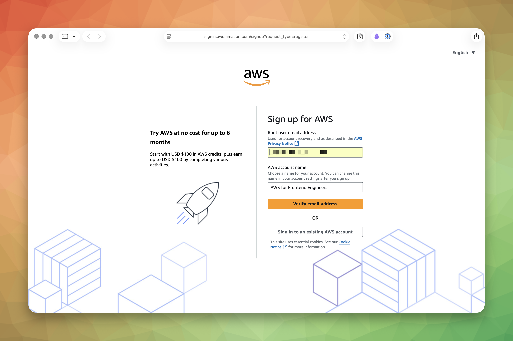

A few decisions here matter more than they look:

- **Use a dedicated email address.** A plus-addressed Gmail or a team alias is fine. The important part is that this email remains recoverable for years.
- **Pick an account name you won't hate later.** It does not need to match a project name exactly, but it should be recognizable when you see it in the console header.
- **Treat this as root from the first click.** This email becomes the login for the **root user**, which is the highest-privilege identity in the account.

Once AWS verifies your email address, the next screen is where you set the root password.

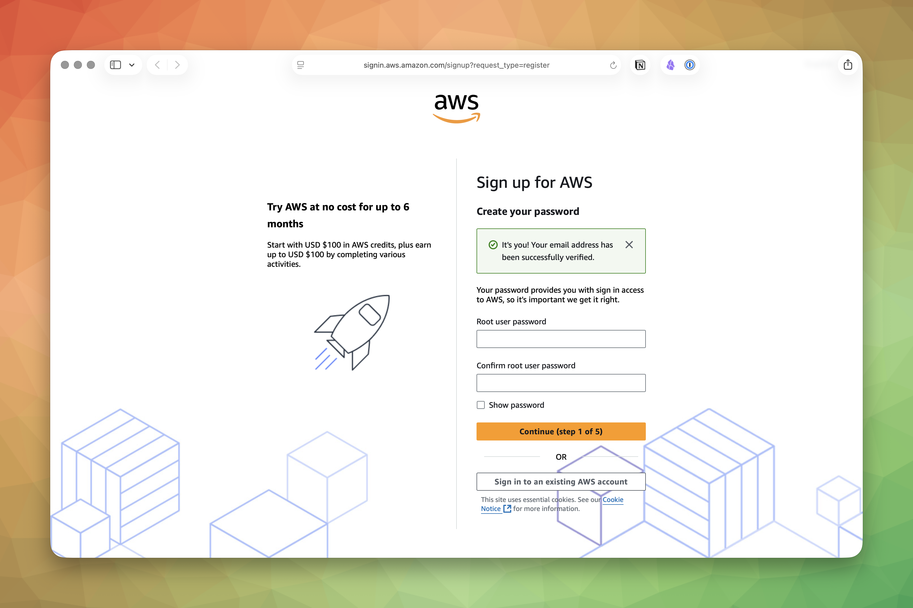

Use a strong password and store it in a password manager immediately. This is not a password you should memorize or reuse anywhere else.

AWS then asks you to choose an account plan. In the current flow shown here, AWS offers a free option and a **Paid** option. AWS's Free Tier options include an introductory period (the duration varies — check the current offer) and a set of always-free allowances.

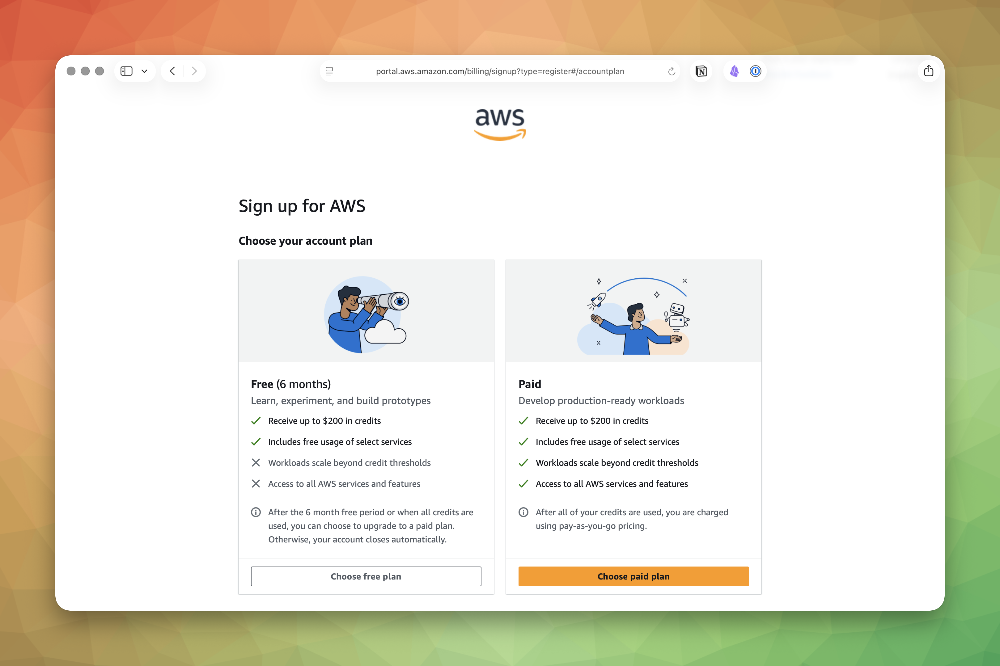

For a personal learning account, choose the free plan if AWS offers it to you. The goal for this course is to learn the platform without accidentally turning your first week into a billing postmortem.

Next comes your contact information.

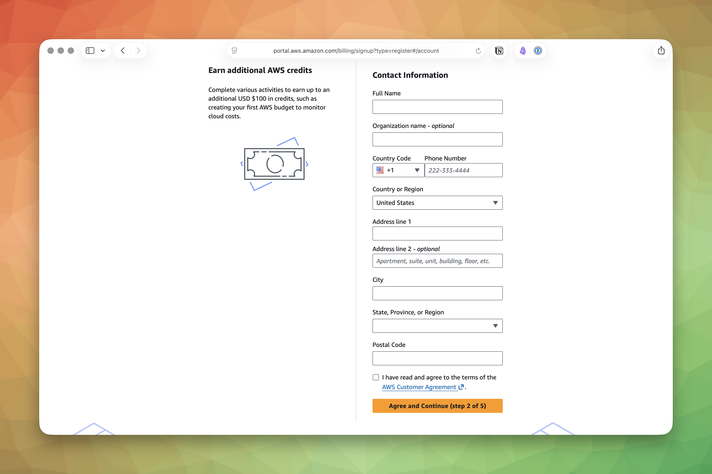

Fill this out accurately. AWS uses it for account ownership, billing, and recovery. This is not the place for fake data.

After that, AWS asks for billing information.

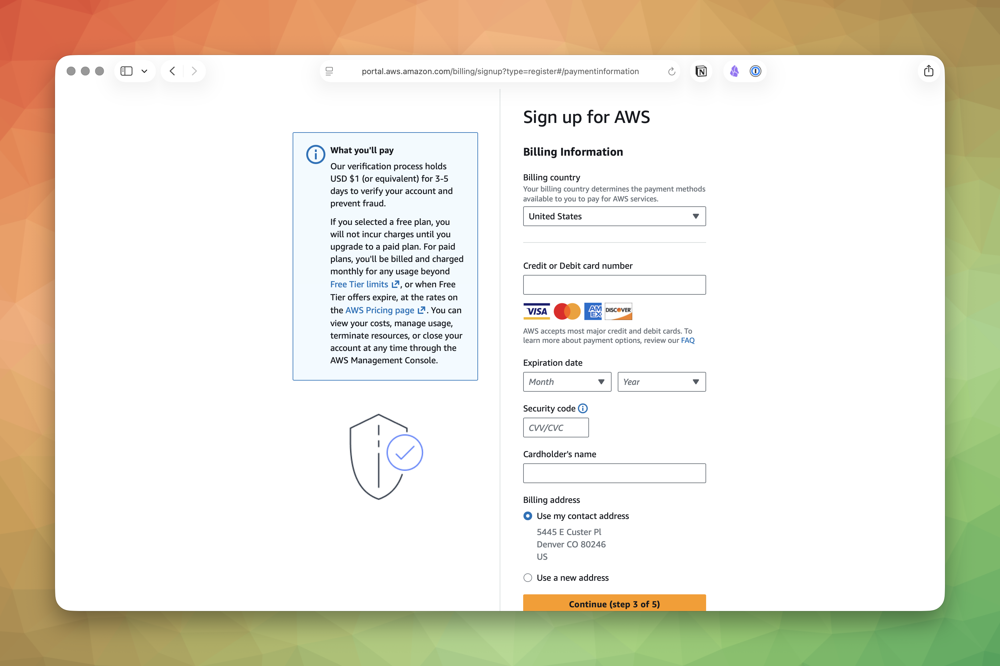

Yes, AWS requires a payment method even for a learning account. No, that does not mean you are guaranteed to be charged right away. It means AWS has a way to bill you if you create something outside the free tier or leave paid resources running indefinitely.

You may also see one or more additional steps after billing, such as phone verification or a short account activation wait. Finish those before moving on. The exact screens vary a little, but the principle does not: complete the signup flow, land in the console, and then secure the account before you build anything.

## Lock Down the Root User Immediately

The credentials you just created are the **root user** credentials. The root user is the god-mode account for your entire AWS environment. It can do literally anything: create and delete resources, change billing information, close the account entirely. There is no permission boundary that applies to root.

Think of it this way: if your AWS account were an apartment building, the root user holds the master key to every unit, the mailroom, the electrical panel, and the demolition switch. You do not carry that key to get your morning coffee.

Here is the rule: use the root user to finish the initial account setup, enable MFA, create an everyday admin IAM user, and then stop using it.

### Open Security Credentials

From the console home page, click your account menu in the top-right corner and choose **Security credentials**.

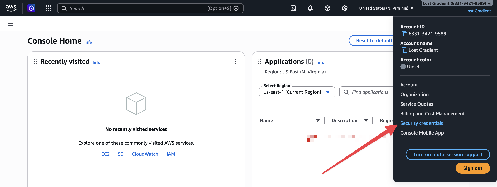

That takes you to the root user's security page.

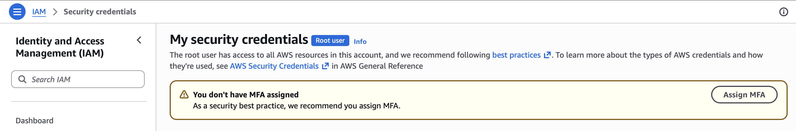

If you see a warning banner telling you MFA is not assigned, good. That means you are in exactly the right place.

> [!WARNING]
> Never create access keys for the root user. If root access keys leak, an attacker has unrestricted access to your entire AWS account. There is no IAM policy that can save you from that mistake.

### Enable MFA

Click **Assign MFA** and AWS will walk you through choosing a device type. The screenshots here use a passkey because it is phishing-resistant and tied to a device you already control.

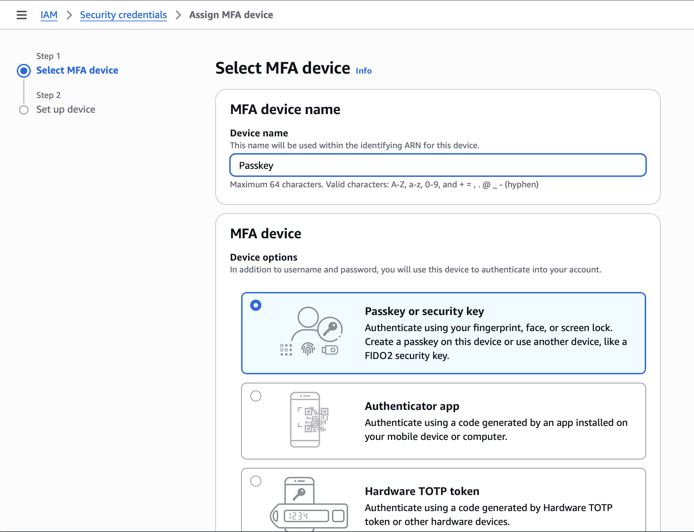

Other choices are still valid:

- **Passkey or security key**: The best option if your devices support it.
- **Authenticator app**: The most common fallback and completely reasonable for a personal learning account.
- **Hardware TOTP token**: Useful if your security model already depends on dedicated hardware.

I chose a passkey, but you're free to use whatever makes you happiest. Once the flow completes, AWS shows a confirmation banner on the root security page.

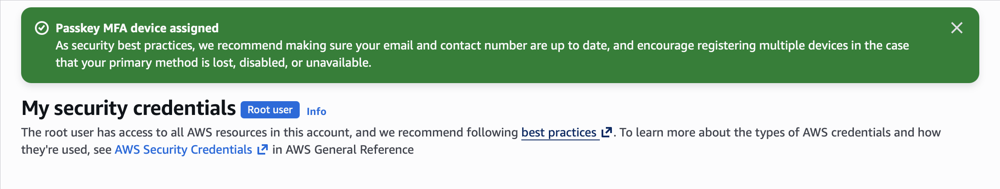

At that point, every future root login requires both the password and the second factor. That is exactly what you want.

## Add the Safety Rails You Will Want Later

Before you retire the root user, there are three small pieces of account hygiene worth handling now.

### Set Alternate Contacts

AWS lets you define separate contacts for billing, operations, and security notifications.

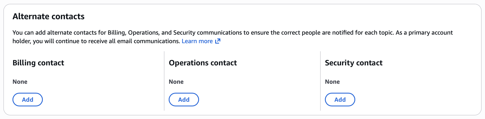

If this is just your personal learning account, you can leave these empty for now. If you have a shared inbox for billing or a teammate who should receive security notices, set them now while you still remember. It is much easier to do this on day one than during an incident.

### Enable IAM Access to Billing

By default, new IAM users often cannot see billing information. That becomes a problem later when you try to set up budgets or inspect charges without logging back in as root.

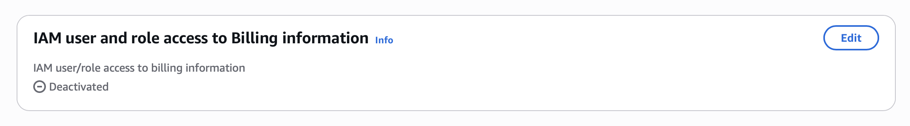

Click **Edit** and enable **IAM user and role access to Billing information** before you move on. Your future `admin` user needs this.

### Acknowledge IAM Identity Center, Then Skip It for Now

AWS now surfaces [**IAM Identity Center**](https://docs.aws.amazon.com/singlesignon/latest/userguide/what-is.html) prominently because it is the preferred long-term answer for workforce access and single sign-on.

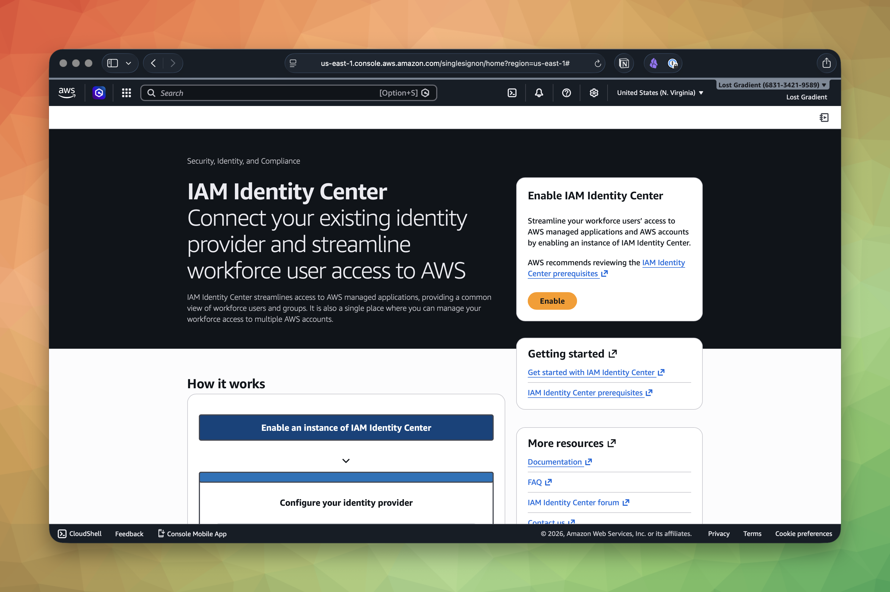

That is a good direction for a team. It is also one more system to understand on the same day you are still learning what an IAM user even is. For this course, we are intentionally keeping the starting point simpler:

- Create one everyday IAM user for yourself.
- Use that user for console access and CLI setup.
- Learn IAM concepts before layering on organization-wide identity tooling.

> [!NOTE] 2026 Recommendation
> The course teaches IAM users because they're the shortest path to understanding the permission model. In a real production account, the 2026 recommendation is to enable **IAM Identity Center** and use `aws configure sso` to log in through a short-lived SSO session instead of creating IAM users with long-lived access keys. Same IAM concepts apply underneath—the difference is where the credentials come from. Once you've finished the course, the [AWS IAM Identity Center user guide](https://docs.aws.amazon.com/singlesignon/latest/userguide/what-is.html) is the natural next read.

We will talk about better long-term patterns later. Right now, the shortest path to understanding AWS is still the best one.

## Create an Everyday Admin User Through a Group

The root user should now be retired from daily use. You need a separate **IAM user** with admin permissions for everyday work.

One quick note before you follow the screenshots below: the screenshots show the account and username I used while writing this lesson. For the course, stick with the conventions we use everywhere else:

- Create an everyday IAM user named `admin`.
- Use your own account ID in the IAM sign-in URL.

### Go to IAM

Search for **IAM** from the AWS console header and open the service.

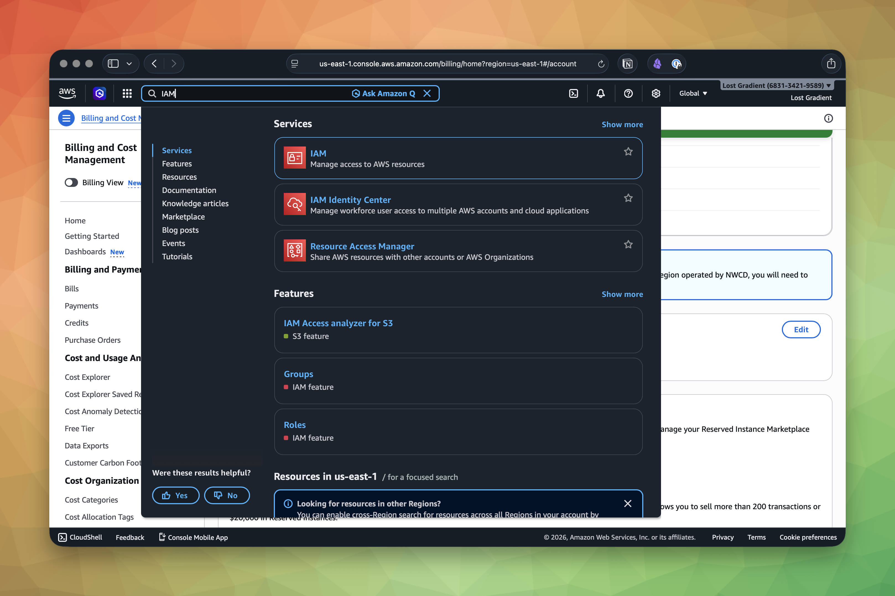

### Create an Administrators Group

Before you create the user, create a group named `Administrators` and attach the AWS-managed `AdministratorAccess` policy to that group.

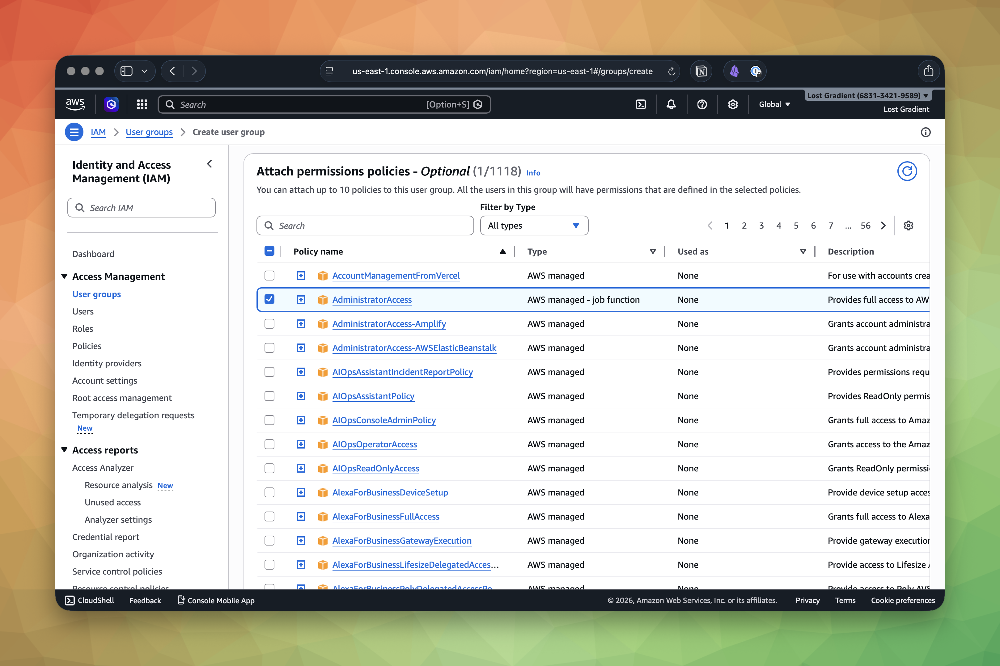

This is a better starting shape than attaching the policy directly to the user. Even in a tiny account, it nudges you toward cleaner IAM habits:

- permissions live on groups
- users join groups
- you can reason about access without hunting through per-user policy attachments

### Start the User Creation Flow

After the group exists, go to **Users** and click **Create user**.

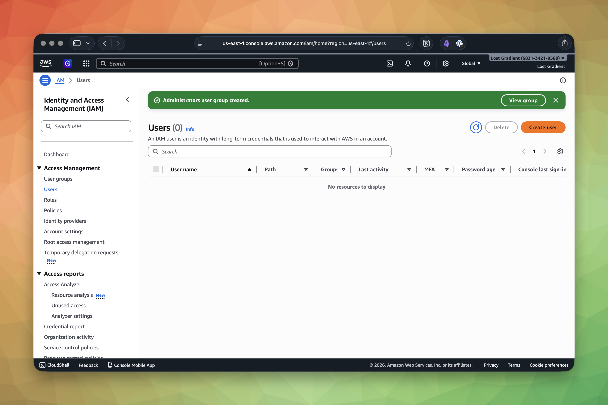

On the user details screen, enter `admin` as the username, enable console access, and set the password options you want.

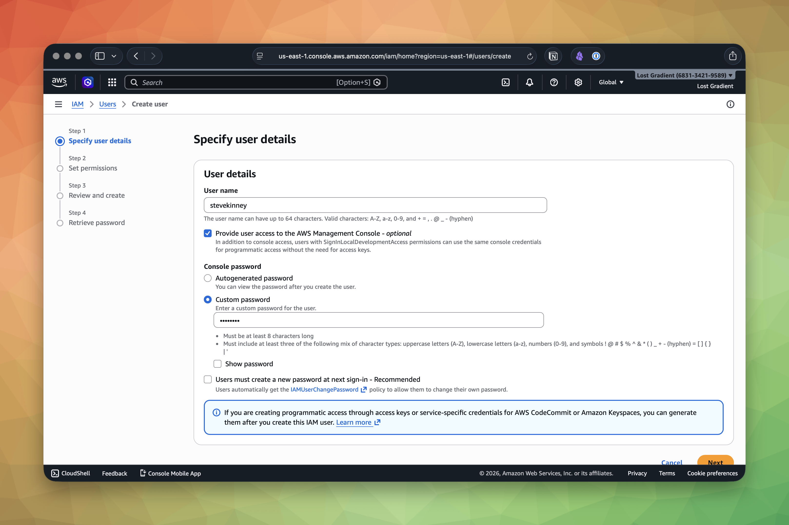

For your own learning account, a custom password is fine. If you were creating this user for someone else, you would usually require a password reset on first sign-in.

### Add the User to the Group

On the permissions screen, choose **Add user to group** and select the `Administrators` group.

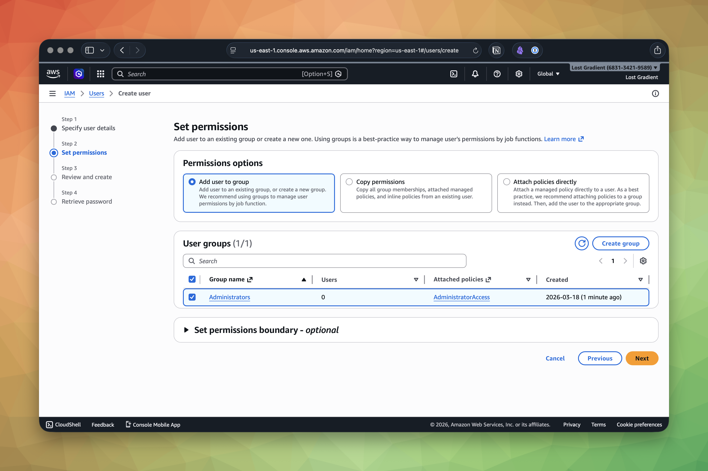

This is the point where the screenshots and the course conventions intentionally diverge. The screenshot shows a real username from my account. You should still create `admin` and add that user to the `Administrators` group.

### Review and Create

AWS then gives you a review screen so you can confirm the username, console password configuration, and group assignment.

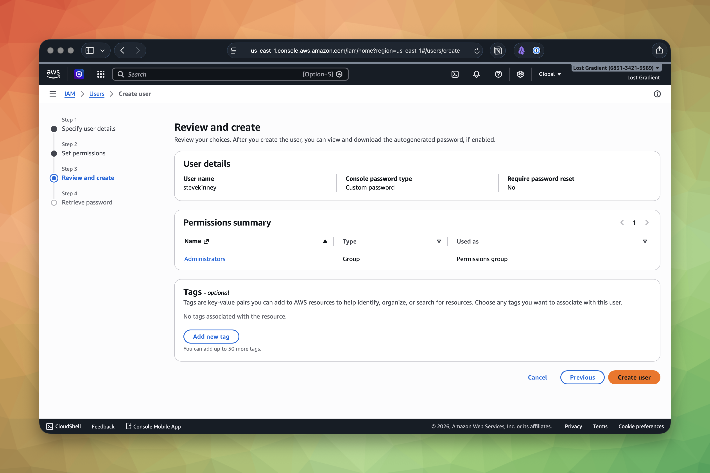

If the group assignment looks wrong, fix it here. This is much better than creating the user and then cleaning up a bad permission model afterwards.

### Save the Sign-In URL

After the user is created, AWS shows the IAM console sign-in details.

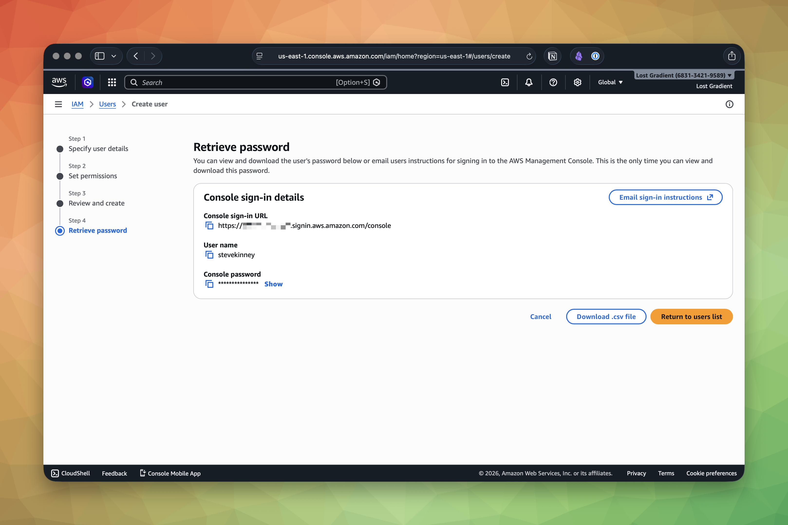

Bookmark that IAM sign-in URL. It has this shape:

```text
https://123456789012.signin.aws.amazon.com/console
```

Obviously `123456789012` will be _something_ else.

You will use your own account ID, not the one shown in the screenshot.

## Sign In as `admin` and Repeat MFA

Sign out of the root user. Then sign back in using:

- your account ID or account alias
- the IAM username `admin`
- the password you just set

As soon as you are in, repeat the same MFA flow you used for root. Open the user's **Security credentials** tab in IAM, assign MFA, and verify that everyday logins now require the second factor too.

At this point, the root user should move into break-glass status:

- keep the password in a password manager
- keep MFA registered
- do not use it for daily console work
- do not use it for CLI access

## Verification

If all of this worked, your account should now look like this:

- [ ] AWS account created with a dedicated email address
- [ ] Root user password stored in a password manager
- [ ] MFA enabled on the root user
- [ ] Alternate contacts reviewed or configured
- [ ] IAM user and role access to Billing and Cost Management enabled
- [ ] `Administrators` group created with `AdministratorAccess`
- [ ] IAM `admin` user created and added to `Administrators`
- [ ] MFA enabled on the `admin` user
- [ ] IAM sign-in URL bookmarked
- [ ] Signed in successfully as `admin`

> [!TIP]
> Set up a billing alarm before you do anything else. Navigate to **Billing and Cost Management** and create a small budget. We cover the full flow in [Cost Monitoring and Budget Alarms](cost-monitoring-and-budget-alarms.md), but the short version is simple: spend five minutes on budgets now so you do not spend five hours explaining a surprise bill later.

## Common Failure Modes

- **You keep using the root user because it already works:** Stop. Root is for break-glass account administration, not daily CLI or console work.
- **You skip MFA because this is "just a sandbox account":** Sandbox accounts still create bills and still become production surprisingly often.
- **You create the account with a personal email you do not control long-term:** That turns basic recovery and billing work into a future incident.

You now have a properly secured AWS account. The root user is locked down with MFA and gathering dust. Your `admin` user is ready for daily use. Next, we will build a mental model of IAM so you understand what you just configured and why it matters.
