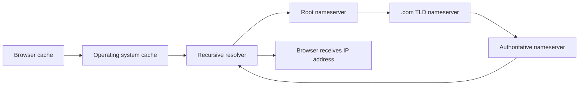

You've configured custom domains on Vercel. You've pointed a subdomain at a Netlify deployment. You've pasted `CNAME` values into GoDaddy's dashboard and waited for "propagation" to finish. But what was actually happening during all of that? DNS is the system you've been using without fully understanding, and now that you're building your own infrastructure on AWS, understanding it is no longer optional.

If you want AWS's version of the DNS terminology while you read, the [Route 53 Developer Guide](https://docs.aws.amazon.com/Route53/latest/DeveloperGuide/Welcome.html) is the official reference.

**DNS (Domain Name System)** is the protocol that translates human-readable domain names like `example.com` into IP addresses like `192.0.2.1`. Every time a user types your URL into a browser, DNS resolution happens before a single byte of your frontend reaches the screen.

## Why This Matters

DNS problems feel random when you do not have a model for where answers come from and how they get cached. Once you do have that model, most "propagation" problems collapse into a small set of causes: wrong record, wrong nameserver, or stale cache.

## Builds On

This lesson builds on your prior experience pointing domains at hosted frontends. You already know the workflow from the registrar dashboard point of view. What you are adding now is the resolution chain behind that workflow, which becomes important the first time a custom domain does not behave the way you expected.



## The DNS Resolution Process

When someone visits `www.example.com`, the browser doesn't magically know where to send the request. It has to ask a chain of servers, each one getting closer to the answer. Here's the sequence:

1. **The browser cache.** The browser checks whether it has resolved this domain recently. If it has a cached answer that hasn't expired, it uses that immediately. No network request needed.

2. **The operating system cache.** If the browser doesn't have it, the OS checks its own cache. On macOS, this is the `dnsmasq` or `mDNSResponder` cache. Same idea: if the answer is fresh, use it.

3. **The recursive resolver.** If neither cache has the answer, the request goes to a **recursive resolver**—usually operated by your ISP or a public DNS service like Cloudflare (`1.1.1.1`) or Google (`8.8.8.8`). The resolver's job is to chase down the answer on your behalf.

4. **The root nameservers.** The resolver starts at the top of the DNS hierarchy: the **root nameservers**. There are 13 root server clusters (labeled A through M) distributed globally. The resolver asks: "Who is responsible for `.com`?" The root server responds with the address of the `.com` TLD nameservers.

5. **The TLD nameservers.** The resolver asks the **TLD (Top-Level Domain)** nameservers for `.com`: "Who is responsible for `example.com`?" The TLD server responds with the address of the **authoritative nameservers** for `example.com`.

6. **The authoritative nameservers.** The resolver asks the authoritative nameservers: "What is the IP address for `www.example.com`?" This is the server that actually knows the answer—it holds the DNS records you configured. It responds with the IP address (or alias, or whatever record type was requested).

7. **The response.** The resolver sends the IP address back to your browser. The browser opens a TCP connection to that IP, performs the TLS handshake (using the certificate you provisioned in [Requesting a Certificate in ACM](requesting-a-certificate-in-acm.md)), and finally sends the HTTP request for your page.

This entire chain typically completes in under 100 milliseconds. Most of the time, caches at various levels mean the full chain isn't traversed at all.

## TTL: How Long Answers Stay Cached

Every DNS record includes a **TTL (Time to Live)** value, measured in seconds. TTL tells resolvers and caches how long they are allowed to keep a cached answer before they have to ask again.

- **TTL of 300** means the record is cached for 5 minutes. After 5 minutes, the next request triggers a fresh lookup.
- **TTL of 86400** means the record is cached for 24 hours.
- **TTL of 60** means 1 minute—useful during migrations when you want changes to propagate quickly.

Here's the tradeoff: a high TTL reduces DNS lookup latency for repeat visitors (the answer is already cached), but it means changes take longer to propagate. A low TTL means changes propagate quickly, but every visitor pays for more frequent DNS lookups.

For a production frontend behind CloudFront, a TTL of 300 (5 minutes) is a reasonable default. You're not changing your DNS records frequently, and the small caching window gives you a reasonable time to recover if you need to change something.

> [!TIP]
> When you're about to migrate DNS records—switching from one CDN to another, for example—lower the TTL to 60 seconds a day or two before the migration. This ensures that when you make the actual change, cached records expire quickly and traffic shifts to the new destination within minutes instead of hours.

## DNS Record Types That Matter

You'll encounter several DNS record types as you work with AWS. Here's a quick overview—we'll cover them in detail in [Hosted Zones and Record Types](hosted-zones-and-record-types.md):

- **A record**: Maps a domain name to an IPv4 address. The most fundamental record type.
- **AAAA record**: Maps a domain name to an IPv6 address. Same as A, but for the newer protocol.
- **CNAME record**: Maps a domain name to another domain name. The resolver follows the chain until it reaches an A or AAAA record.
- **NS record**: Specifies the authoritative nameservers for a domain. This is how the TLD knows where to send queries for your domain.
- **MX record**: Specifies mail servers for your domain. Not relevant for frontend hosting, but you'll see them if you manage a domain.
- **TXT record**: Holds arbitrary text. Often used for domain verification (Google Search Console, email authentication, ACM validation).

## How This Connects to Route 53

**Route 53** is AWS's DNS service. When you create a **hosted zone** for `example.com` in Route 53, you're telling AWS: "I want Route 53 to be the authoritative nameserver for this domain." Route 53 assigns four nameservers to your hosted zone, and you configure your domain registrar to use those nameservers. From that point on, every DNS query for `example.com` ends up at Route 53, which responds with the records you've configured.

This is exactly what happened behind the scenes when you used Vercel or Netlify with a custom domain. Those platforms told you to either change your nameservers (delegating authority to their DNS) or add CNAME records (pointing specific subdomains to their infrastructure). Route 53 is the AWS version of that, except you control the entire configuration.

Route 53 also has a feature that the generic DNS tools don't: **alias records**. An alias record looks like a standard A or AAAA record to the outside world, but internally it resolves to an AWS resource—like the CloudFront distribution you set up in [Creating a CloudFront Distribution](creating-a-cloudfront-distribution.md). We'll cover alias records in detail in [Alias Records vs. CNAME Records](alias-records-vs-cname-records.md), but know that they exist because standard DNS has limitations that alias records work around.

## Debugging DNS with `dig`

When something isn't working—your domain isn't resolving, or it's pointing to the wrong place—`dig` is the tool you reach for. It's installed by default on macOS and Linux.

```bash
dig example.com
```

This returns the A record for `example.com`, along with the TTL and the nameserver that answered. A more targeted query:

```bash
dig www.example.com CNAME +short
```

The `+short` flag strips the output down to just the answer. You can also query a specific nameserver directly:

```bash
dig example.com @ns-1234.awsdns-56.org
```

This asks one of Route 53's nameservers directly, bypassing all caches. Useful for verifying that your Route 53 records are correct before TTLs expire on cached records elsewhere.

`nslookup` is an alternative that works similarly but with different output formatting:

```bash
nslookup example.com
```

Either tool works. `dig` gives you more detail; `nslookup` gives you a simpler answer.

> [!WARNING]
> When you change a DNS record and it doesn't seem to take effect, the problem is almost always caching. Your browser, your OS, your ISP's resolver—any of them could be serving a stale cached answer. Use `dig @<nameserver>` to query the authoritative nameserver directly and confirm the record is correct at the source. Then wait for TTLs to expire everywhere else.

## What You Already Knew (and What You Didn't)

If you've deployed to Vercel, you already understood DNS intuitively: "I put a value in my registrar, and my domain pointed at my site." What you might not have understood is the hierarchy—root servers, TLD servers, authoritative servers—or why "propagation" sometimes took minutes and sometimes took hours (it was TTL, not magic). You might not have known why CNAME records work for `www.example.com` but not for `example.com` itself (we'll cover that in [Alias Records vs. CNAME Records](alias-records-vs-cname-records.md)).

I remember the first time I actually ran `dig` on one of my own domains and realized the whole resolution chain was right there in the output. It went from feeling like magic to feeling like plumbing—and honestly, that's the goal here.

## Verification

- You can walk through the order of DNS lookup from browser cache to recursive resolver to authoritative nameserver.
- You can explain what TTL controls without using the word "propagation" as a black box.
- You can use `dig` to compare a cached answer with an authoritative answer from a specific nameserver.

## Common Failure Modes

- **Blaming DNS propagation for every problem:** A surprising number of DNS issues are just wrong records or wrong nameservers.
- **Forgetting that caches exist at multiple layers:** Your browser, operating system, and resolver can all disagree temporarily.
- **Using a CNAME mental model for every hostname:** Apex domains follow different rules, which is why Route 53 alias records matter later.

Now you know the system. In the next lesson, you'll start configuring it yourself in Route 53.
