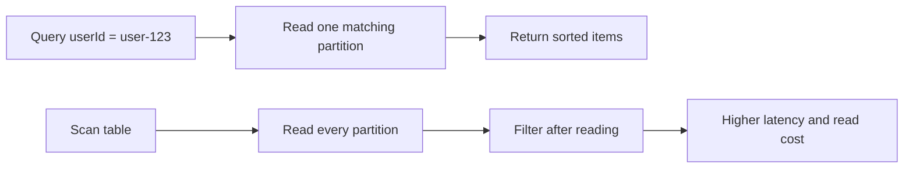

GetItem retrieves a single item by its exact primary key. But frontend applications rarely need just one item at a time—you need a list. "Show me all the items for this user." "Show me this user's items created after a certain date." DynamoDB gives you two tools for retrieving multiple items: **Query** and **Scan**. They sound similar, but they're fundamentally different in how they work, what they cost, and when you should use each one.

If you want AWS's exact wording on the trade-off you're making here, keep the [DynamoDB Query guide](https://docs.aws.amazon.com/amazondynamodb/latest/developerguide/Query.html) and the [DynamoDB Scan guide](https://docs.aws.amazon.com/amazondynamodb/latest/developerguide/Scan.html) open.



## Query: The Right Way to Read Multiple Items

**Query** retrieves items from a single partition. You specify the partition key (required) and optionally filter by the sort key. DynamoDB finds the partition, reads the items within it, and returns them—already sorted by the sort key.

This is efficient because DynamoDB knows exactly where to look. It doesn't scan the entire table. It goes directly to the partition you specified and reads only the items that match your key condition.

```typescript
import { DynamoDBClient } from '@aws-sdk/client-dynamodb';
import { DynamoDBDocumentClient, QueryCommand } from '@aws-sdk/lib-dynamodb';

const client = DynamoDBDocumentClient.from(new DynamoDBClient({}));
const TABLE_NAME = process.env.TABLE_NAME ?? 'my-frontend-app-data';

async function getItemsForUser(userId: string) {
  const result = await client.send(
    new QueryCommand({
      TableName: TABLE_NAME,
      KeyConditionExpression: 'userId = :userId',
      ExpressionAttributeValues: {
        ':userId': userId,
      },
    }),
  );

  return result.Items ?? [];
  // [!note `Items` is an array of plain JavaScript objects, thanks to the document client.]
}
```

The **`KeyConditionExpression`** is the critical parameter. It specifies which partition key value to query, and optionally constrains the sort key. The expression uses the same placeholder syntax you saw with UpdateCommand—values prefixed with `:` are defined in `ExpressionAttributeValues`.

### Sort Key Conditions

The sort key supports several comparison operators in the key condition expression:

```typescript
// Items where itemId begins with a prefix
const result = await client.send(
  new QueryCommand({
    TableName: TABLE_NAME,
    KeyConditionExpression: 'userId = :userId AND begins_with(itemId, :prefix)',
    ExpressionAttributeValues: {
      ':userId': 'user-123',
      ':prefix': 'item-2026',
    },
  }),
);
```

Available sort key operators:

| Operator             | Example                          | Use case                          |
| -------------------- | -------------------------------- | --------------------------------- |
| `=`                  | `itemId = :id`                   | Exact match                       |
| `<`, `<=`, `>`, `>=` | `createdAt > :date`              | Range queries on timestamps       |
| `BETWEEN`            | `itemId BETWEEN :start AND :end` | Range with upper and lower bounds |
| `begins_with`        | `begins_with(itemId, :prefix)`   | Prefix matching                   |

These operators only work on the sort key in a `KeyConditionExpression`. The partition key must always use `=`.

### Filtering Results

Sometimes you need to filter by attributes that aren't part of the key. For this, you add a **`FilterExpression`**:

```typescript
async function getPendingItems(userId: string) {
  const result = await client.send(
    new QueryCommand({
      TableName: TABLE_NAME,
      KeyConditionExpression: 'userId = :userId',
      FilterExpression: '#status = :status',
      ExpressionAttributeNames: {
        '#status': 'status',
      },
      ExpressionAttributeValues: {
        ':userId': userId,
        ':status': 'pending',
      },
    }),
  );

  return result.Items ?? [];
}
```

> [!WARNING]
> A `FilterExpression` doesn't reduce the amount of data DynamoDB reads—it only reduces what comes back in the response. DynamoDB reads all items matching the `KeyConditionExpression`, then applies the filter to the results. You still pay for the reads. If a partition has 1,000 items and the filter matches 10, you're charged for reading all 1,000. Filters are useful for reducing network transfer, but they're not a substitute for good key design.

### Sorting and Limiting

Items within a partition are automatically sorted by the sort key. You can reverse the order and limit the number of items returned:

```typescript
async function getRecentItems(userId: string, limit: number) {
  const result = await client.send(
    new QueryCommand({
      TableName: TABLE_NAME,
      KeyConditionExpression: 'userId = :userId',
      ExpressionAttributeValues: {
        ':userId': userId,
      },
      ScanIndexForward: false,
      Limit: limit,
    }),
  );

  return result.Items ?? [];
}
```

- **`ScanIndexForward: false`** reverses the sort order (descending by sort key). The default is `true` (ascending).
- **`Limit`** caps the number of items returned. Combined with reverse sort order, this gives you "the N most recent items"—a pattern frontend applications use constantly.

## Scan: Reading the Entire Table

**Scan** reads every item in the table, one page at a time. Unlike Query, which targets a specific partition, Scan examines every single item and optionally applies a filter to the results.

```typescript
import { ScanCommand } from '@aws-sdk/lib-dynamodb';

async function getAllItems() {
  const result = await client.send(
    new ScanCommand({
      TableName: TABLE_NAME,
    }),
  );

  return result.Items ?? [];
}
```

This works, and for a table with 50 items during development, it's fine. But Scan has a cost that grows linearly with table size:

- A table with 100 items: Scan reads 100 items. Fast, cheap.
- A table with 100,000 items: Scan reads 100,000 items. Slow, expensive.
- A table with 10 million items: Scan reads 10 million items. Very slow, very expensive.

Query performance depends on the partition size. Scan performance depends on the table size. As your table grows, Query stays fast and Scan gets slower.

> [!TIP]
> A useful rule of thumb: if you find yourself reaching for Scan, ask whether a different key design would let you use Query instead. Most of the time, the answer is yes. Scan is a code smell in DynamoDB—it usually means your key design doesn't match your access patterns.

### When Scan Is Acceptable

Scan isn't always wrong. Reasonable use cases include:

- **Admin tools** that need to export or audit the entire table
- **Small tables** (under a few thousand items) where the cost is negligible
- **One-time data migrations** where you need to touch every item
- **Development and debugging**—scanning a table with 20 test items is fine

For a frontend API endpoint that runs on every request, Scan is almost never the right choice.

## Pagination with `LastEvaluatedKey`

Both Query and Scan return at most 1 MB of data per request. If there are more items to read, the response includes a `LastEvaluatedKey`—a bookmark that tells DynamoDB where to continue on the next request.

```typescript
async function getAllItemsForUser(userId: string) {
  const allItems: Record<string, unknown>[] = [];
  let lastKey: Record<string, unknown> | undefined;

  do {
    const result = await client.send(
      new QueryCommand({
        TableName: TABLE_NAME,
        KeyConditionExpression: 'userId = :userId',
        ExpressionAttributeValues: {
          ':userId': userId,
        },
        ExclusiveStartKey: lastKey,
      }),
    );

    allItems.push(...(result.Items ?? []));
    lastKey = result.LastEvaluatedKey;
  } while (lastKey);

  return allItems;
}
```

The pattern:

1. Make the initial request without `ExclusiveStartKey`
2. If the response includes `LastEvaluatedKey`, make another request with that value as `ExclusiveStartKey`
3. Repeat until `LastEvaluatedKey` is undefined

For frontend APIs, you usually don't want to paginate through everything—you want to return a page of results to the client and let them request the next page. You can pass `LastEvaluatedKey` back to the frontend (base64-encoded) as a pagination cursor:

```typescript
export const handler: APIGatewayProxyHandlerV2 = async (event) => {
  const userId = event.queryStringParameters?.userId;
  const cursor = event.queryStringParameters?.cursor;

  const result = await client.send(
    new QueryCommand({
      TableName: TABLE_NAME,
      KeyConditionExpression: 'userId = :userId',
      ExpressionAttributeValues: {
        ':userId': userId,
      },
      Limit: 20,
      ExclusiveStartKey: cursor ? JSON.parse(atob(cursor)) : undefined,
    }),
  );

  return {
    statusCode: 200,
    headers: { 'Content-Type': 'application/json' },
    body: JSON.stringify({
      items: result.Items ?? [],
      nextCursor: result.LastEvaluatedKey ? btoa(JSON.stringify(result.LastEvaluatedKey)) : null,
    }),
  };
};
```

> [!TIP]
> This cursor-based pagination pattern is common in APIs backed by DynamoDB. The client receives a `nextCursor` with each response. To get the next page, the client includes `?cursor=...` in the request. When `nextCursor` is `null`, there are no more pages.

## Query vs Scan: The Summary

|                     | Query                         | Scan                       |
| ------------------- | ----------------------------- | -------------------------- |
| Reads               | One partition                 | Entire table               |
| Required parameters | Partition key                 | None                       |
| Performance         | Consistent, fast              | Degrades with table size   |
| Cost                | Proportional to items matched | Proportional to table size |
| Use for             | Application endpoints         | Admin tools, migrations    |

Design your table keys around Query. Use Scan only when you genuinely need to read everything. I've found that if I'm tempted to reach for Scan in production code, it almost always means I need to rethink my key design.
