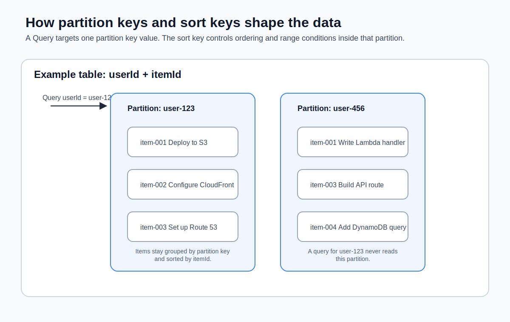
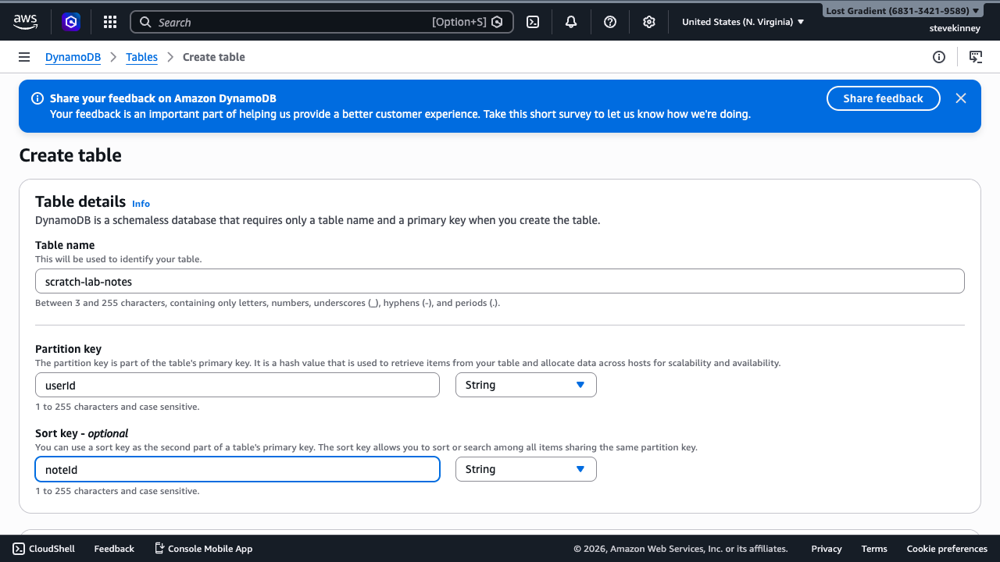
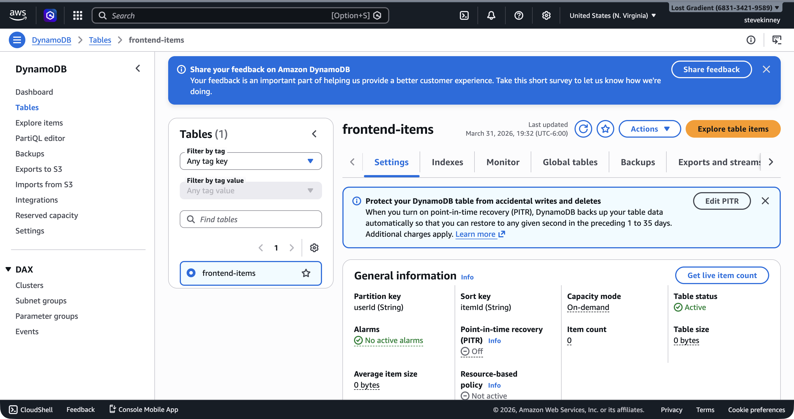

Every DynamoDB table needs a primary key, and the key you choose determines how you access your data for the lifetime of that table. You can't change a table's primary key after creation. This is the most important decision you make when designing a DynamoDB table, and it's worth getting right from the start.

If you want AWS's version of the table-shape rules while you read, the [DynamoDB core components guide](https://docs.aws.amazon.com/amazondynamodb/latest/developerguide/HowItWorks.CoreComponents.html) is the official reference.



## Partition Keys and Sort Keys

DynamoDB supports two types of primary keys:

**Simple primary key (partition key only).** A single attribute that uniquely identifies each item. DynamoDB uses the partition key's value to determine which internal partition stores the item. If you're building a table where each item is accessed by a unique ID—like a users table keyed on `userId`—a simple primary key is sufficient.

**Composite primary key (partition key + sort key).** Two attributes that together uniquely identify each item. Items with the same **partition key** are stored together and sorted by the **sort key**. This enables range queries: "give me all items with this partition key where the sort key is between these two values."

The composite key is where DynamoDB gets interesting for frontend applications. Consider a table that stores items for different users:

| `userId` (partition key) | `itemId` (sort key) | `title`              | `status`    |
| ------------------------ | ------------------- | -------------------- | ----------- |
| `user-123`               | `item-001`          | Deploy to S3         | done        |
| `user-123`               | `item-002`          | Configure CloudFront | in-progress |
| `user-456`               | `item-001`          | Write Lambda handler | done        |
| `user-456`               | `item-003`          | Set up API Gateway   | pending     |

With this design, you can:

- Get a specific item: partition key `user-123` + sort key `item-001`
- Get all items for a user: query by partition key `user-123` (returns both items, sorted by `itemId`)
- Get a range of items: query by partition key `user-123` where sort key begins with `item-00`

You can't efficiently query across partition keys—for example, "get all items with status `done` across all users." That requires a **scan** (which reads every item in the table) or a secondary index. This is the trade-off you accept with DynamoDB: predictable performance on your primary access patterns, at the cost of flexibility on queries you didn't plan for.

## Global Secondary Indexes

The standard fix for "I need to query by an attribute that isn't my partition key" is a **Global Secondary Index (GSI)**. A GSI is a second view of the same table with a different key schema. DynamoDB keeps the GSI in sync with the base table automatically—you don't write to it directly; writes to the base table propagate.

For the "find items by status across all users" case, create a GSI keyed on `status`:

```bash
aws dynamodb update-table \
  --table-name my-frontend-app-data \
  --attribute-definitions \
    AttributeName=status,AttributeType=S \
    AttributeName=updatedAt,AttributeType=S \
  --global-secondary-index-updates '[
    {
      "Create": {
        "IndexName": "status-updatedAt-index",
        "KeySchema": [
          {"AttributeName": "status", "KeyType": "HASH"},
          {"AttributeName": "updatedAt", "KeyType": "RANGE"}
        ],
        "Projection": {"ProjectionType": "ALL"}
      }
    }
  ]' \
  --region us-east-1
```

Then query it instead of the base table:

```typescript
await ddb.send(
  new QueryCommand({
    TableName: 'my-frontend-app-data',
    IndexName: 'status-updatedAt-index',
    KeyConditionExpression: '#s = :s',
    ExpressionAttributeNames: { '#s': 'status' },
    ExpressionAttributeValues: { ':s': 'done' },
  }),
);
```

A few things worth knowing before you reach for a GSI:

- GSIs are **eventually consistent** with the base table. A write shows up in the GSI milliseconds later, not instantly.
- GSIs **cost extra**—both storage (the projected attributes duplicate) and write capacity (each base-table write propagates).
- You can have up to 20 GSIs per table, but if you need more than three or four, you're probably fighting the data model.
- GSIs can only be _added_ to an existing table; you can't convert a GSI into a primary key. Design for them up front.

The rule of thumb: **design the base table around your one primary access pattern, and add a GSI per additional access pattern you can't avoid**. The [DynamoDB access-patterns-first design talk](https://www.youtube.com/watch?v=HaEPXoXVf2k) from Rick Houlihan is the canonical deep dive.

## Choosing Good Keys

The golden rule for partition keys: **high cardinality with even distribution**. Every unique partition key value maps to a physical partition in DynamoDB. If all your data shares the same partition key, it all lands on the same partition, and you hit throughput limits.

Good partition keys:

- `userId`—unique per user, distributes evenly
- `orderId`—unique per order, high cardinality
- UUIDs—maximum cardinality by definition

Bad partition keys:

- `status`—only a few possible values (`active`, `inactive`), creates hot partitions
- `country`—low cardinality, and one country likely has far more items than others
- `date`—all writes on the same day hit the same partition

> [!TIP]
> If you're coming from a relational database background, think of the partition key as the value you most commonly filter by in a `WHERE` clause. The sort key is what you'd `ORDER BY` within that filtered set.

## Creating a Table with the CLI

Create the `my-frontend-app-data` table with a composite primary key—`userId` as the partition key and `itemId` as the sort key:

```bash
aws dynamodb create-table \
  --table-name my-frontend-app-data \
  --attribute-definitions \
    AttributeName=userId,AttributeType=S \
    AttributeName=itemId,AttributeType=S \
  --key-schema \
    AttributeName=userId,KeyType=HASH \
    AttributeName=itemId,KeyType=RANGE \
  --billing-mode PAY_PER_REQUEST \
  --region us-east-1 \
  --output json
```

Let's break down what each parameter does:

- **`--table-name`**: The name of the table. This is how you reference it in your Lambda code and IAM policies.
- **`--attribute-definitions`**: Declares the data types for key attributes. `S` means string. DynamoDB also supports `N` (number) and `B` (binary), but strings cover most frontend use cases.
- **`--key-schema`**: Defines which attributes form the primary key. `HASH` is the partition key and `RANGE` is the sort key. (The naming comes from the internal hashing mechanism DynamoDB uses for partitioning—not the most intuitive labels, I know.)
- **`--billing-mode PAY_PER_REQUEST`**: On-demand pricing. You pay per read and write, with no capacity planning.

The response includes the table description:

```json
{
  "TableDescription": {
    "TableName": "my-frontend-app-data",
    "TableStatus": "CREATING",
    "KeySchema": [
      {
        "AttributeName": "userId",
        "KeyType": "HASH"
      },
      {
        "AttributeName": "itemId",
        "KeyType": "RANGE"
      }
    ],
    "BillingModeSummary": {
      "BillingMode": "PAY_PER_REQUEST"
    },
    "TableArn": "arn:aws:dynamodb:us-east-1:123456789012:table/my-frontend-app-data"
  }
}
```

Note the `TableStatus` is `CREATING`. DynamoDB tables take a few seconds to become active. You can check the status:

In the console, the **Create table** form shows the table name, partition key, and sort key fields in the **Table details** section.



```bash
aws dynamodb describe-table \
  --table-name my-frontend-app-data \
  --region us-east-1 \
  --output json \
  --query "Table.TableStatus"
```

Wait until the status changes from `CREATING` to `ACTIVE` before writing data.

Once ACTIVE, the table's **Overview** tab in the console shows the key schema, capacity mode, and table status.



> [!WARNING]
> The `--attribute-definitions` parameter only defines attributes that are used in the key schema (or secondary indexes). You don't declare non-key attributes here. DynamoDB is schemaless for non-key attributes—you can add any attributes you want when you write items. This trips up people coming from SQL databases who expect to define all columns up front.

## A Note on Attribute Definitions

It's tempting to list every attribute your items will have in `--attribute-definitions`. Don't do this. DynamoDB will reject your request if you define attributes that aren't part of any key schema or index. Only define the attributes that form your keys.

Your items can have as many additional attributes as you want—`title`, `status`, `createdAt`, `priority`—and you never declare them in the table definition. You just include them when you write an item.

## Key Design Patterns for Frontend Applications

Here are common patterns that work well for frontend API backends:

### User-scoped data

Partition key: `userId`, sort key: `itemId`

This is the pattern you're using for `my-frontend-app-data`. Each user's items are stored together, and you can efficiently query all items for a given user. This covers the most common frontend access pattern: "show me my stuff."

### Timestamp-sorted data

Partition key: `userId`, sort key: `createdAt` (ISO 8601 string)

Items are automatically sorted by creation time. You can query for a user's recent items by adding a sort key condition: "give me items for `user-123` where `createdAt` is greater than `2026-03-01`."

### Entity-type mixing (single-table design)

Partition key: `pk`, sort key: `sk`

Advanced DynamoDB users sometimes store multiple entity types in a single table using generic key names. The generic key names (`pk`, `sk`) let one table hold many entity types at once: a user record uses `pk = USER#user-123` and `sk = PROFILE`, while that same user's items use `pk = USER#user-123` and `sk = ITEM#item-456`. A single `Query` on `pk = USER#user-123` fetches the user record _and_ all their items in one round trip.

> [!TIP]
> You don't need single-table design for this course—the `userId`/`itemId` composite key is all you need. But you'll see the `pk`/`sk` pattern constantly in production DynamoDB code, and now you know why the keys are named so abstractly: they're deliberately generic so one table can mean different things for different items.

You've got a table with a composite primary key. Next up, you'll write data to it and read it back using the AWS SDK v3 from TypeScript—the same language your Lambda handlers are written in.
