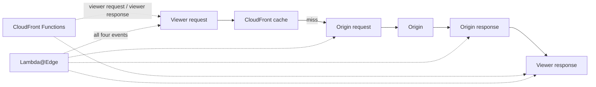

Summit Supply is live now, which means the weird requirements start showing up. Marketing wants an A/B test on the homepage hero. You want to redirect a retired campaign URL before it ever touches your origin. Security wants a header added everywhere. These are not "spin up a whole backend" problems. These are _edge_ problems.

If you want AWS's exact feature boundaries in front of you while you read, keep the [CloudFront Functions guide](https://docs.aws.amazon.com/AmazonCloudFront/latest/DeveloperGuide/cloudfront-functions.html) and the [Lambda@Edge guide](https://docs.aws.amazon.com/AmazonCloudFront/latest/DeveloperGuide/lambda-at-the-edge.html) open.

You already know how to write Lambda functions and how CloudFront serves your content. Now you're going to push compute into the CDN itself. AWS gives you two ways to run code at CloudFront's edge locations: **Lambda@Edge** and **CloudFront Functions**. They solve overlapping problems, but they aren't interchangeable—the runtimes, execution limits, and pricing are different enough that choosing the wrong one either wastes money or blocks you from doing what you need.

Think of it like the difference between a Vercel Edge Function and a Vercel Serverless Function. One runs instantly at the edge with tight constraints. The other gives you a full runtime with more power and higher latency. AWS made the same tradeoff, just with different names.

## Why This Matters

This decision shows up fast in real systems. If all you need is a redirect or header rewrite, Lambda@Edge is overkill and more expensive. If you need to call an origin, validate a token with a library, or touch the request body, CloudFront Functions hits a wall immediately. The lesson here is not "edge compute exists." The lesson is "pick the smallest tool that can actually do the job."

## Builds On

- [Creating a CloudFront Distribution](creating-a-cloudfront-distribution.md)
- [Cache Behaviors and Invalidations](cache-behaviors-and-invalidations.md)
- [What Lambda Is and Why Frontend Engineers Care](what-is-lambda.md)

## Where They Run in the Request Lifecycle

Both Lambda@Edge and CloudFront Functions hook into CloudFront's request lifecycle, but at different points. CloudFront processes every request through four potential events:

1. **Viewer request**—CloudFront receives a request from the client, before checking the cache.
2. **Origin request**—CloudFront forwards the request to the origin, after a cache miss.
3. **Origin response**—CloudFront receives the response from the origin, before caching it.
4. **Viewer response**—CloudFront returns the response to the client.

**CloudFront Functions** can only attach to **viewer request** and **viewer response** events. They intercept traffic before the cache layer, which means they run on every single request—cached or not.

**Lambda@Edge** can attach to **all four events**: viewer request, viewer response, origin request, and origin response. This makes Lambda@Edge the only option when you need to modify how CloudFront talks to your origin.

> [!TIP]
> If you need to transform the request before it hits your S3 bucket (for example, rewriting a URL path), you need an **origin request** trigger—and that means Lambda@Edge.

## The Comparison Table

Here's the side-by-side breakdown. Every time you're deciding which to use, start here.

| Dimension                  | CloudFront Functions                                              | Lambda@Edge                                                      |
| -------------------------- | ----------------------------------------------------------------- | ---------------------------------------------------------------- |
| **Runtime**                | JavaScript (ECMAScript 5.1 with select ES6–ES12 features)         | Node.js or Python                                                |
| **Execution location**     | CloudFront edge locations (200+)                                  | Regional edge caches (13 locations)                              |
| **Supported events**       | Viewer request, viewer response                                   | Viewer request, viewer response, origin request, origin response |
| **Maximum execution time** | Sub-millisecond (measured as compute utilization, not wall clock) | 5 seconds (viewer events), 30 seconds (origin events)            |
| **Memory**                 | 2 MB                                                              | 128 MB (viewer events), up to 10,240 MB (origin events)          |
| **Maximum package size**   | 10 KB                                                             | 1 MB (viewer events), 50 MB (origin events)                      |
| **Network access**         | No                                                                | Yes                                                              |
| **File system access**     | No                                                                | Yes (read-only `/tmp`, up to 512 MB)                             |
| **Request body access**    | No                                                                | Yes (origin events only)                                         |
| **Environment variables**  | No                                                                | No user-defined environment variables                            |
| **Pricing**                | $0.10 per 1 million invocations                                   | $0.60 per 1 million invocations + $0.00005001 per GB-second      |
| **Free tier**              | 2 million invocations per month                                   | No CloudFront free-tier allowance for Lambda@Edge                |
| **Deployment region**      | Global (no region selection needed)                               | Must deploy in `us-east-1`; AWS replicates automatically         |
| **Scale**                  | 10,000,000+ requests per second                                   | Thousands of concurrent executions per region                    |

## The Runtime Difference

This is the biggest conceptual difference. CloudFront Functions do **not** run Node.js. They run a purpose-built JavaScript runtime that's compliant with ECMAScript 5.1 and supports select features from ES6 through ES12. You can't `require()` or `import` modules. You can't use the AWS SDK. You can't make HTTP requests. You get pure JavaScript string and object manipulation—and that's it.

Lambda@Edge runs a full Node.js or Python runtime. You can bundle npm packages, call external APIs, read from DynamoDB, validate JWTs with a library—anything a normal Lambda function can do, within the execution time limits.

If you've written middleware in Express or Next.js, CloudFront Functions feel like a stripped-down middleware layer. Lambda@Edge feels like a full serverless function that happens to run closer to your users.

## The Pricing Difference

CloudFront Functions are roughly **six times cheaper** per invocation than Lambda@Edge, and there's no duration-based charge. You pay a flat $0.10 per million invocations regardless of how long each function takes (as long as it stays within the compute utilization limit).

Lambda@Edge charges $0.60 per million invocations **plus** a per-GB-second charge for the compute time your function uses. For a function using 128 MB that runs for 50 ms, that compute cost is small—but I've watched it add up faster than you'd expect at scale.

CloudFront's free usage tier covers **1 TB of data transfer out, 10 million HTTP/HTTPS requests, and 2 million CloudFront Functions invocations each month**. Lambda@Edge is explicitly excluded from that free-tier bucket, which is a polite AWS way of saying: if a trivial rewrite can be a CloudFront Function, make it a CloudFront Function.

For a site handling 100 million requests per month:

- **CloudFront Functions:** 100 million × $0.10 / 1M = **$10.00**
- **Lambda@Edge (viewer events, 128 MB, 50 ms):** 100M × $0.60 / 1M + compute = roughly **$60.00 + ~$32.00 = $92.00**

> [!WARNING]
> Lambda@Edge functions run at **regional edge caches**, not at every CloudFront edge location. This means they have higher latency than CloudFront Functions for viewer events. If your function is doing something simple like URL rewriting or header manipulation, CloudFront Functions are faster and cheaper.

## The Decision Matrix

Use this when choosing:

**Choose CloudFront Functions when:**

- You need to manipulate headers, URLs, or cookies on viewer requests or responses
- Your logic is simple string manipulation (redirects, rewrites, header injection)
- You need sub-millisecond execution time
- You're operating at high scale and cost matters
- You don't need network access or external dependencies

**Choose Lambda@Edge when:**

- You need to run code on origin request or origin response events
- You need to make network calls (validate tokens against an external service, fetch configuration)
- Your logic requires npm packages or the AWS SDK
- You need access to the request body
- You need more than 2 MB of memory or more than a few milliseconds of execution time

**Choose neither when:**

- CloudFront's built-in features handle it. Response headers policies (which you configured in [CloudFront Headers, CORS, and Security](cloudfront-headers-cors-and-security.md)) can add security headers without any code. Cache policies can handle query string forwarding. Don't write a function for something CloudFront already does natively.

## The Deployment Model

CloudFront Functions deploy instantly. You write the function, publish it, associate it with a **behavior** on your distribution (recall behaviors from [Cache Behaviors and Invalidations](cache-behaviors-and-invalidations.md)), and it takes effect within seconds.

Lambda@Edge functions must be deployed to `us-east-1`—the same region requirement you encountered with ACM certificates in [Certificate Renewal and us-east-1](certificate-renewal-and-us-east-1.md). Once deployed, you publish a numbered version (not `$LATEST`), and AWS replicates that version to regional edge caches worldwide. This replication takes a few minutes, and you can't delete a Lambda@Edge function until CloudFront finishes removing all the replicas.

> [!WARNING]
> You can't use `$LATEST` with Lambda@Edge. You must publish a numbered version and reference that specific version ARN when associating the function with a CloudFront behavior. If you try to use `$LATEST`, CloudFront will reject the association.

With the comparison in hand, you'll write and deploy one of each in the next two lessons. [Writing a CloudFront Function](writing-a-cloudfront-function.md) covers a URL rewrite function using the lightweight JavaScript runtime. [Writing a Lambda@Edge Function](writing-a-lambda-at-edge-function.md) covers deploying a Lambda function to the edge with the full Node.js runtime. Both lessons assume you already have a working CloudFront distribution. If you don't, go back and set one up first.

## Verification

Before you choose, force yourself through this checklist:

- Can the logic run entirely on viewer request or viewer response?
- Does it need a package, network call, request body, or origin event?
- Is this happening on every request at high scale, where per-invocation cost matters?

If the honest answers are "yes, no, yes," CloudFront Functions is probably the right call.

## Common Failure Modes

- **Picking Lambda@Edge for a simple redirect:** you pay more, deploy more slowly, and gain nothing.
- **Picking CloudFront Functions for anything needing network access or SDK calls:** the runtime cannot do it.
- **Assuming Lambda@Edge supports normal Lambda conveniences:** user-defined environment variables are not available, and deployment rules are stricter.
- **Forgetting event placement:** a viewer-request function cannot do origin-request work just because you wish it could.
