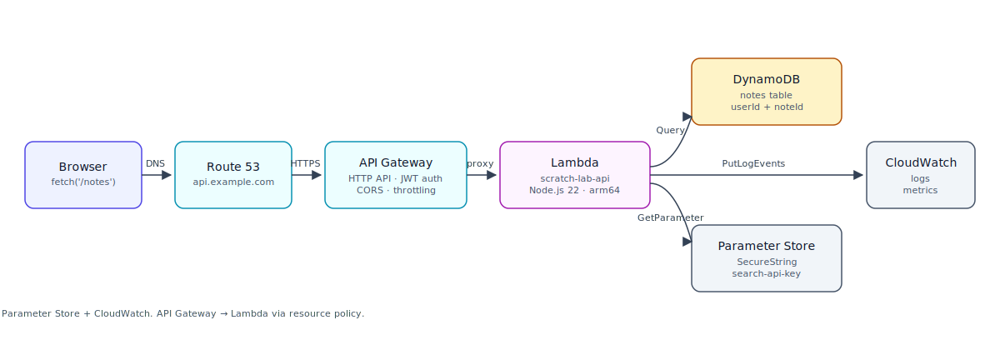

You've built all the pieces. Now build the backend they add up to.

This is the Part 2 capstone—the mirror of [Exercise: End-to-End Static Site Deployment](static-site-deployment-exercise.md) that closed out Part 1. By the end, Summit Supply's frontend should be able to `fetch()` a real API on your own domain, that hits a real Lambda, that reads and writes a real DynamoDB table, using credentials fetched from Parameter Store (or Secrets Manager). Every layer you've learned about, stacked.

## Why It Matters

Each service on its own is a toy. Wired together they're a backend. The reason the course teaches Lambda, API Gateway, DynamoDB, and Secrets Manager separately is that the moving pieces are easier to reason about in isolation—but shipping software means putting them together and living with the rough edges at the seams. That's the skill this capstone builds.



## Your Task

Build a `saved-lists` backend for Summit Supply that:

- Exposes four routes through API Gateway HTTP API:
  - `GET  /lists` → return every saved list for the authenticated user.
  - `POST /lists` → create a new saved list and return it.
  - `GET  /lists/{listId}` → return a single list.
  - `DELETE /lists/{listId}` → delete a list.
- Runs one Lambda function (`summit-supply-api`) behind API Gateway, which handles all four routes by inspecting `event.requestContext.http`.
- Persists lists in a DynamoDB table (`summit-supply-saved-lists`) with a `userId` partition key and `listId` sort key.
- Reads a third-party `SEARCH_API_KEY` from Parameter Store or Secrets Manager at Lambda cold-start and caches it in module scope.
- Returns CORS-correct responses so the Summit Supply frontend (served from your CloudFront distribution in Part 1) can call the API from the browser.

## Prerequisites

You've completed Part 1 (static site on CloudFront) and all of the Part 2 lessons up to this point. You should already have:

- An S3 + CloudFront deployment from [Exercise: End-to-End Static Site Deployment](static-site-deployment-exercise.md).
- A working Lambda project from [Exercise: Build and Deploy a Lambda Function](lambda-function-exercise.md).
- An HTTP API from [Exercise: Build an API with API Gateway and Lambda](api-gateway-lambda-exercise.md).
- A DynamoDB table pattern from [Exercise: Build a Data API with DynamoDB](dynamodb-lambda-exercise.md).
- A secret stored and readable from [Exercise: Store and Retrieve a Secret in Lambda](secrets-in-lambda-exercise.md).

Nothing in this exercise introduces a service you haven't already used. The point is wiring, not discovery.

## Step-by-Step

### 1. Create the DynamoDB Table

Create `summit-supply-saved-lists` with:

- Partition key: `userId` (String)
- Sort key: `listId` (String)
- Billing mode: on-demand

Revisit [Tables, Partition Keys, and Sort Keys](dynamodb-tables-and-keys.md) if the `aws dynamodb create-table` flag shape is foggy.

### 2. Store the Search API Key

Pick one of the two services you learned:

- **Parameter Store** as a `SecureString` at `/summit-supply/production/search-api-key`, or
- **Secrets Manager** at `/summit-supply/production/search-api-key`.

Use whichever you're more comfortable with. The lesson in [Parameter Store vs. Secrets Manager](parameter-store-vs-secrets-manager.md) is the decision tree.

### 3. Update the Lambda Execution Role

Your execution role needs:

- `dynamodb:GetItem`, `PutItem`, `DeleteItem`, `Query` on `summit-supply-saved-lists`.
- `ssm:GetParameter` (+ `kms:Decrypt` if you used `SecureString` with a customer-managed key) or `secretsmanager:GetSecretValue`, depending on which store you picked.
- `logs:CreateLogGroup`, `logs:CreateLogStream`, `logs:PutLogEvents` (usually already present from the Lambda execution role basics).

Scope every resource ARN to the specific table, parameter, or secret. No `*`.

### 4. Write the Lambda Handler

Your handler must:

- Route based on `event.requestContext.http.method` and `event.requestContext.http.path`. A small `switch` over `${method} ${routeKey}` is plenty—you don't need a router framework.
- Parse the authenticated user's ID. For the exercise, read it from a custom header (`x-summit-user-id`)—we're not wiring real auth here, that's what [Authentication with API Gateway](api-gateway-authentication.md) covers.
- Use the DynamoDB Document Client (`@aws-sdk/lib-dynamodb`) so you don't have to marshal types by hand.
- Load the search API key once per cold start and cache it in a module-level variable. Do not re-fetch it on every invocation.
- Return CORS headers on every response (`Access-Control-Allow-Origin`, `Access-Control-Allow-Methods`, `Access-Control-Allow-Headers`).

### 5. Wire API Gateway Routes

Create four routes on your existing HTTP API, each with `summit-supply-api` as the Lambda integration target:

```text
GET    /lists
POST   /lists
GET    /lists/{listId}
DELETE /lists/{listId}
```

Enable CORS on the API with your CloudFront domain as the allowed origin. Deploy to your stage.

### 6. Add a Custom Domain (Optional but Realistic)

Point `api.example.com` at the API Gateway stage using the pattern from [Stages, Deployments, and Custom Domains](api-gateway-stages-and-custom-domains.md). This lets your frontend call `fetch('https://api.example.com/lists')` instead of an `*.execute-api.amazonaws.com` URL.

### 7. Call It From the Frontend

From your Summit Supply frontend (served via CloudFront from Part 1), make a real `fetch()` to your API. The round trip should succeed end-to-end: browser → Route 53 → API Gateway → Lambda → DynamoDB → response → browser.

## Checkpoints

- [ ] `POST /lists` with a JSON body persists a new item you can see in the DynamoDB console.
- [ ] `GET /lists` returns every list for the `x-summit-user-id` header value.
- [ ] `GET /lists/{listId}` returns a single list or a 404.
- [ ] `DELETE /lists/{listId}` removes the item and a follow-up GET returns 404.
- [ ] The Lambda logs a single "loaded search api key" message on cold start and none on warm invocations. (Prove the caching works.)
- [ ] The browser can call the API from your CloudFront origin without a CORS preflight error.
- [ ] Every IAM resource ARN on the execution role points at a specific table / parameter / secret, not `*`.

## Failure Diagnosis

- **`AccessDeniedException: User is not authorized to perform: dynamodb:...`** — the execution role is missing the DynamoDB permission or the resource ARN doesn't match the actual table ARN. Run `aws dynamodb describe-table --table-name summit-supply-saved-lists --query 'Table.TableArn'` and compare.
- **CORS error in the browser, Lambda never logs a hit** — the preflight `OPTIONS` request is failing at API Gateway, not at your Lambda. Fix CORS at the API level (route `OPTIONS` or enable CORS on the API), not in the handler.
- **Cold start takes 3+ seconds** — you're fetching the secret and connecting to DynamoDB inside the handler instead of at module scope. Move both into module-level `const`s.
- **`ValidationException` on DynamoDB writes** — you're passing native JS types to the low-level DynamoDB client instead of the Document Client. Switch to `@aws-sdk/lib-dynamodb`.

## Stretch Goals

- **Real auth.** Swap the `x-summit-user-id` header for a JWT authorizer on API Gateway, using a token source you pre-mint. The [Authentication with API Gateway](api-gateway-authentication.md) lesson covers the shape.
- **Observability.** Add structured logs from [Log Groups, Log Streams, and Structured Logging](cloudwatch-log-groups-and-structured-logging.md) with the `awsRequestId` on every log line, then an alarm from [Alarms and Notifications with SNS](cloudwatch-alarms-and-sns.md) on 5xx rate.
- **GSI for list-by-updated-at.** Add a global secondary index that lets you query lists ordered by `updatedAt` across a partition. Read the Tier 2 GSI notes in [Tables, Partition Keys, and Sort Keys](dynamodb-tables-and-keys.md) first.

When everything works, you have a real production-shaped backend on AWS—every service from Part 2 wired into one request path. That's the whole point of the course.
