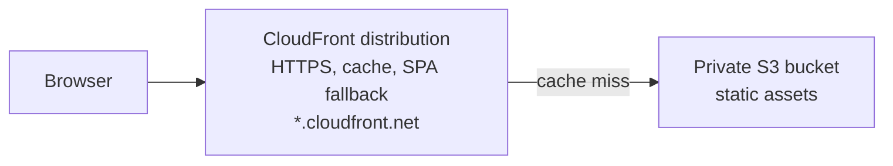
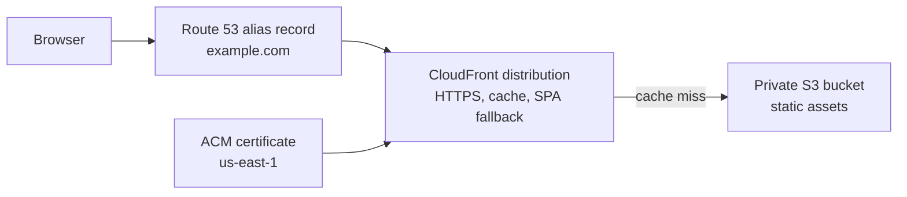
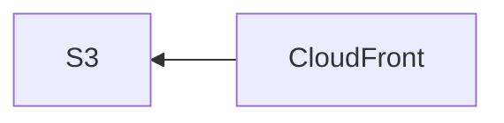
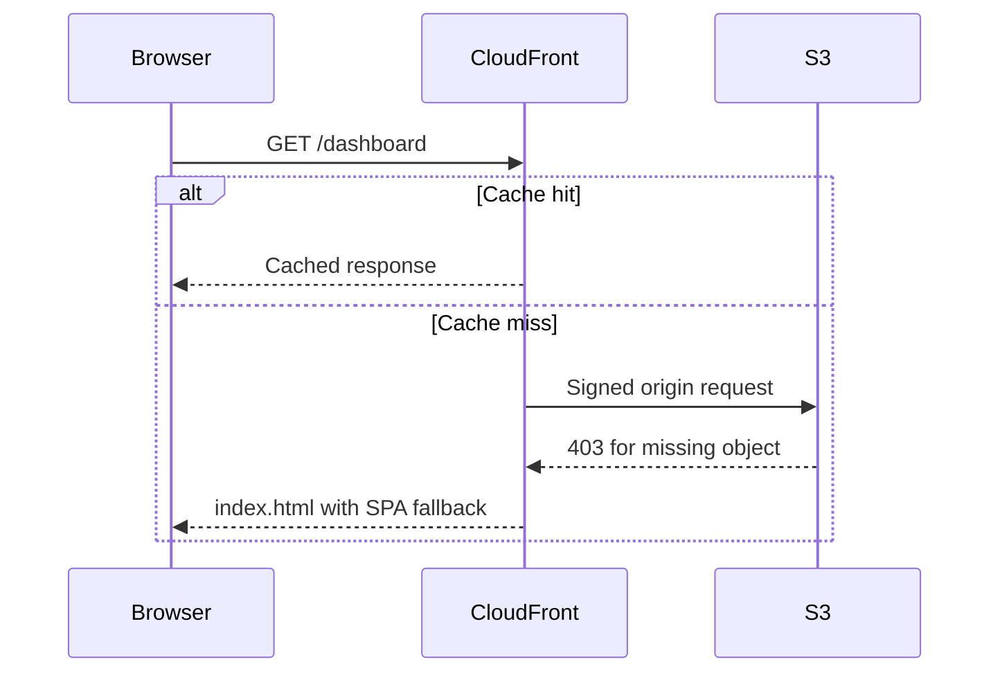

Imagine someone opening a link to your site to check whether the new spring camping gear is live yet. They do not care that your storefront is really a private S3 bucket behind CloudFront. They care that the page loads fast, uses HTTPS, and does not fall over when they refresh a deep route. That invisible plumbing is the pipeline you are building now.

You've spent the early static-hosting arc learning individual AWS services. You can create an S3 bucket, configure a CloudFront distribution, and lock it down with Origin Access Control. Each piece works on its own. But the value is in how they compose: a request hits CloudFront, CloudFront serves cached content from S3 over HTTPS, and the whole thing costs pennies. That's the pipeline. This lesson maps out the architecture end to end and explains the order of operations: what you create first, what depends on what, and why.

If you want AWS's canonical building blocks open next to this lesson, keep the [S3 static website tutorial](https://docs.aws.amazon.com/AmazonS3/latest/userguide/HostingWebsiteOnS3Setup.html) and the [CloudFront OAC guide](https://docs.aws.amazon.com/AmazonCloudFront/latest/DeveloperGuide/private-content-restricting-access-to-s3.html) nearby.

## Why This Matters

This is the first moment the course stops being "a bunch of AWS services you now vaguely recognize" and becomes "a deployment you could actually ship." If you understand this flow, every later module has somewhere to attach. Lambda adds compute to the same frontend. API Gateway adds an HTTP edge to the same domain. DynamoDB adds state to the same application. This is the spine.

## Builds On

- [Creating and Configuring a Bucket](creating-and-configuring-a-bucket.md)
- [Creating a CloudFront Distribution](creating-a-cloudfront-distribution.md)
- [Origin Access Control for S3](origin-access-control-for-s3.md)
- [Cache Behaviors and Invalidations](cache-behaviors-and-invalidations.md)

## The Architecture

Here's what the core pipeline looks like:



1. **CloudFront** terminates HTTPS using its default certificate, checks its edge cache, and on a miss, fetches from S3 using Origin Access Control.
2. **S3** stores the static files in a private bucket. Only CloudFront can read from it.

Two services, two clearly defined responsibilities. No servers. No containers. No load balancers. I genuinely love how simple this ends up being.

If you have a custom domain, you can optionally add Route 53 and ACM to the pipeline. That's covered in the [Custom Domains, DNS, and Certificates](dns-for-frontend-engineers.md) section at the end of the course. The extended architecture looks like this:



## The Order of Operations

The order matters. You can't attach OAC to a distribution that doesn't exist. You can't lock down S3 before CloudFront has a distribution ARN. Here's the sequence that keeps the dependency chain honest.

### Create the S3 Bucket

The bucket is still the storage foundation: it holds your files. Nothing else in the pipeline depends on S3 being configured in a specific way at creation time—you can always update the bucket policy later. You covered this in [Creating and Configuring a Bucket](creating-and-configuring-a-bucket.md) and uploaded files in [Uploading and Organizing Files](uploading-and-organizing-files.md).

At this stage, the bucket can be public or private. The course has you make it public temporarily so you can see direct S3 hosting in isolation. That is the learning checkpoint, not the end state. The end state is private bucket plus CloudFront plus OAC.

### Create the CloudFront Distribution with OAC

With the bucket ready, you can create the distribution. This is the step where everything comes together:

- The **origin** points to your S3 bucket. You configured this in [Creating a CloudFront Distribution](creating-a-cloudfront-distribution.md).
- **Origin Access Control** restricts the bucket so only CloudFront can read from it. You set this up in [Origin Access Control for S3](origin-access-control-for-s3.md).
- The **default CloudFront certificate** provides HTTPS on the `*.cloudfront.net` domain automatically.
- **Cache behaviors** and **custom error responses** handle caching and SPA routing. You configured these in [Cache Behaviors and Invalidations](cache-behaviors-and-invalidations.md) and [Custom Error Pages and SPA Routing](custom-error-pages-and-spa-routing.md).

After creating the distribution, you update the S3 bucket policy to allow only the CloudFront service principal, and you re-enable Block Public Access on the bucket. At this point, direct S3 URLs return 403.

At this point, your site is live on the `*.cloudfront.net` domain. If you want to add a custom domain, the optional [Custom Domains, DNS, and Certificates](dns-for-frontend-engineers.md) section at the end of the course covers Route 53, ACM, and wiring everything together.

## Why This Order

The dependency chain flows in one direction:



- CloudFront depends on S3 (as its origin).
- The S3 bucket policy depends on the CloudFront distribution ARN.
- OAC can't be attached until the distribution exists.

The order isn't arbitrary: it's dictated by the dependencies between services. If you try to configure OAC before the distribution exists, there's nothing to attach it to. If you try to lock down the bucket before you have the distribution's ARN, the policy has no principal to trust.

## The IAM Permissions That Make It Work

Every operation in this pipeline requires IAM permissions. You built the foundational understanding in [IAM Mental Model](iam-mental-model.md) and [Writing Your First IAM Policy](writing-your-first-iam-policy.md). For a deployment pipeline, the key permissions are:

- **S3**: `s3:PutObject`, `s3:DeleteObject`, `s3:ListBucket` on your bucket.
- **CloudFront**: `cloudfront:CreateInvalidation` on your distribution.

You built a scoped deploy bot with exactly these S3 and CloudFront permissions in the [IAM Policy for a Deploy Bot exercise](iam-policy-exercise.md). That same policy is what you'll use in CI/CD pipelines.

## What Each Service Is Doing at Runtime

Once the pipeline is deployed, here's what happens when a user visits `https://d1234abcdef.cloudfront.net/dashboard`:

1. **DNS resolution**: The browser queries DNS for the `*.cloudfront.net` domain and gets the nearest edge location's IP.
2. **TLS handshake**: The browser connects to CloudFront's edge location. CloudFront presents its default certificate. The browser verifies it and establishes an encrypted connection.
3. **Edge cache check**: CloudFront checks if `/dashboard` is cached at this edge location.
4. **Cache miss (first visit)**: CloudFront sends a signed request to S3 (using OAC's SigV4 credentials). S3 doesn't have a file at `/dashboard`, so it returns a 403.
5. **Custom error response**: CloudFront's custom error response intercepts the 403, serves `/index.html` instead, and returns a 200 status code. Your client-side router takes over and renders the `/dashboard` view.
6. **Cache hit (subsequent visits)**: The next request for `/dashboard` from the same edge location is served directly from cache. No round trip to S3.

Every layer does one thing. S3 stores files. CloudFront caches and routes. ACM secures. Route 53 resolves. The pieces compose without overlapping.



## The Deployment Workflow

With the infrastructure in place, deploying a new version of your site is two commands:

```bash
# Upload new files to S3
aws s3 sync ./build s3://my-frontend-app-assets \
  --region us-east-1 \
  --delete \
  --output json

# Invalidate CloudFront cache
aws cloudfront create-invalidation \
  --distribution-id E1A2B3C4D5E6F7 \
  --paths "/*" \
  --region us-east-1 \
  --output json
```

The `--delete` flag removes old files from S3 that no longer exist in your build directory. The invalidation tells CloudFront to drop cached copies so edge locations fetch the new versions. You learned about these in [Cache Behaviors and Invalidations](cache-behaviors-and-invalidations.md).

This is the foundation. In the next two lessons, you'll wrap these commands in a deploy script and then automate them with GitHub Actions so deployments happen on every push to `main`.

> [!TIP]
> If you want to test the pipeline before automating it, run the two commands above manually after each build. That's exactly what the automated pipeline does: it just removes you from the loop.

## Verification

Use these checks once the Summit Supply storefront is wired together:

```bash
curl -I https://YOUR_CLOUDFRONT_DOMAIN
curl -I https://YOUR_CLOUDFRONT_DOMAIN/collections/tents
curl -I https://my-frontend-app-assets.s3.us-east-1.amazonaws.com/index.html
```

You want three things to be true:

- `curl -I https://YOUR_CLOUDFRONT_DOMAIN` returns `200` with a valid TLS handshake.
- The deep route returns `200` and serves HTML, proving the SPA fallback works.
- The direct S3 URL returns `403`, proving the bucket is private.

## Common Failure Modes

- **The bucket is still public:** if the S3 URL works directly, Origin Access Control is not actually protecting the bucket.
- **The SPA fallback is only configured in S3:** that gives you a page, but often with the wrong status code. CloudFront should own the final browser behavior.
- **CloudFront returns 403 for files that exist:** the bucket policy doesn't trust the distribution's service principal, or the OAC isn't attached to the origin.

## Beyond This Course: Continuous Deployment

Once this pipeline is stable, **CloudFront Continuous Deployment** lets you ship high-risk distribution changes (new cache behaviors, new origin configs, new CloudFront Functions) behind a weighted split. You create a _staging distribution_ linked to your primary, route a percentage of traffic to it via a continuous-deployment policy, and promote the staging config to primary once you've verified it. Think of it as blue/green for CloudFront itself. It's not covered in this course—the scope is shipping the first version, not iterating on it—but it's the right answer when you need to change the distribution without a risky cutover.
