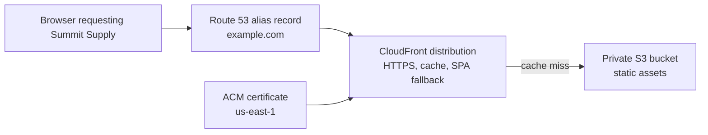
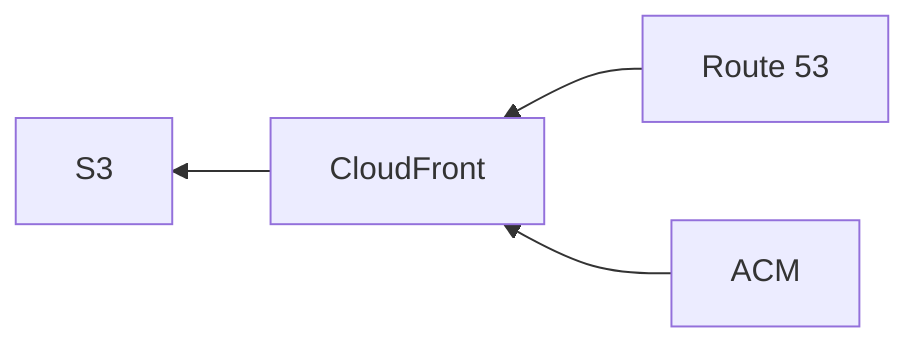
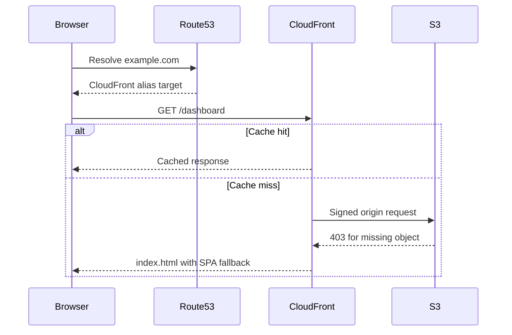

Imagine someone typing `https://summitsupply.com` into the browser to check whether the new spring camping gear is live yet. They do not care that your storefront is really a private S3 bucket behind CloudFront with a certificate from ACM and DNS in Route 53. They care that the page loads fast, uses HTTPS, and does not fall over when they refresh a deep route. That invisible plumbing is the pipeline you are building now.

You've spent the early static-hosting arc learning individual AWS services. You can create an S3 bucket, get control of a domain, request a certificate, configure a CloudFront distribution, and point that domain at it. Each piece works on its own. But the value is in how they compose: a user types your domain into a browser, DNS resolves to CloudFront, CloudFront serves cached content from S3 over HTTPS with your certificate, and the whole thing costs pennies. That's the pipeline. This lesson maps out the architecture end to end and explains the order of operations: what you create first, what depends on what, and why.

If you want AWS's canonical building blocks open next to this lesson, keep the [S3 static website tutorial](https://docs.aws.amazon.com/AmazonS3/latest/userguide/HostingWebsiteOnS3Setup.html), the [CloudFront OAC guide](https://docs.aws.amazon.com/AmazonCloudFront/latest/DeveloperGuide/private-content-restricting-access-to-s3.html), and the [Route 53 DNS configuration guide](https://docs.aws.amazon.com/Route53/latest/DeveloperGuide/dns-configuring.html) nearby.

## Why This Matters

This is the first moment the course stops being "a bunch of AWS services you now vaguely recognize" and becomes "a deployment you could actually ship." If you understand this flow, every later module has somewhere to attach. Lambda adds compute to the same frontend. API Gateway adds an HTTP edge to the same domain. DynamoDB adds state to the same application. This is the spine.

## Builds On

- [Creating and Configuring a Bucket](creating-and-configuring-a-bucket.md)
- [Registering and Transferring Domains](registering-and-transferring-domains.md)
- [Hosted Zones and Record Types](hosted-zones-and-record-types.md)
- [Requesting a Certificate in ACM](requesting-a-certificate-in-acm.md)
- [Creating a CloudFront Distribution](creating-a-cloudfront-distribution.md)
- [Pointing a Domain to CloudFront](pointing-a-domain-to-cloudfront.md)

## The Architecture

Here's what the fully assembled pipeline looks like:



1. **Route 53** resolves `example.com` to the CloudFront distribution using an alias record.
2. **CloudFront** terminates HTTPS using the ACM certificate, checks its edge cache, and on a miss, fetches from S3 using Origin Access Control.
3. **S3** stores the static files in a private bucket. Only CloudFront can read from it.
4. **ACM** provides the SSL/TLS certificate that CloudFront uses for HTTPS.

Four services, four clearly defined responsibilities. No servers. No containers. No load balancers. I genuinely love how simple this ends up being.

## The Order of Operations

The order matters. You can't validate a certificate for a domain you don't control. You can't create an alias record for a distribution that has no alternate domain name. Here's the sequence that keeps the dependency chain honest.

### Create the S3 Bucket

The bucket is still the storage foundation: it holds your files. Nothing else in the pipeline depends on S3 being configured in a specific way at creation time—you can always update the bucket policy later. You covered this in [Creating and Configuring a Bucket](creating-and-configuring-a-bucket.md) and uploaded files in [Uploading and Organizing Files](uploading-and-organizing-files.md).

At this stage, the bucket can be public or private. The course has you make it public temporarily so you can see direct S3 hosting in isolation. That is the learning checkpoint, not the end state. The end state is private bucket plus CloudFront plus OAC.

### Establish Domain Control and DNS Authority

This is the dependency people usually discover the hard way. Before ACM can issue anything, you need a real domain and a place to publish DNS records for it. That means choosing whether the domain lives in Route 53 or at another registrar, and making sure Route 53 is authoritative if you want to use it for validation and final routing.

You covered that in [Registering and Transferring Domains](registering-and-transferring-domains.md) and [Hosted Zones and Record Types](hosted-zones-and-record-types.md). By the end of that work, you should know who the registrar is, whether the nameservers are correct, and which hosted zone ACM should target.

### Request the ACM Certificate

The certificate must exist and be in the `ISSUED` state before you can attach it to a CloudFront distribution. Certificate validation can take minutes, and it depends on the DNS authority you established in the previous step. You requested a certificate in [Requesting a Certificate in ACM](requesting-a-certificate-in-acm.md) and validated it in [DNS Validation vs. Email Validation](dns-validation-vs-email-validation.md).

> [!WARNING]
> The certificate must be in `us-east-1`. CloudFront is a global service, but it only reads certificates from `us-east-1`. You covered this requirement in [Certificate Renewal and the us-east-1 Requirement](certificate-renewal-and-us-east-1.md). If your certificate is in any other region, CloudFront won't see it.

### Create the CloudFront Distribution with OAC

With the bucket and certificate ready, you can create the distribution. This is the step where everything comes together:

- The **origin** points to your S3 bucket. You configured this in [Creating a CloudFront Distribution](creating-a-cloudfront-distribution.md).
- **Origin Access Control** restricts the bucket so only CloudFront can read from it. You set this up in [Origin Access Control for S3](origin-access-control-for-s3.md).
- The **ACM certificate** is attached for HTTPS on your custom domain. You covered this in [Attaching an SSL Certificate](attaching-an-ssl-certificate.md).
- **Cache behaviors** and **custom error responses** handle caching and SPA routing. You configured these in [Cache Behaviors and Invalidations](cache-behaviors-and-invalidations.md) and [Custom Error Pages and SPA Routing](custom-error-pages-and-spa-routing.md).
- **Alternate domain names** (CNAMEs) are set to `example.com` and `www.example.com` so Route 53 can point to this distribution.

After creating the distribution, you update the S3 bucket policy to allow only the CloudFront service principal, and you re-enable Block Public Access on the bucket. At this point, direct S3 URLs return 403.

### Configure Route 53 DNS

DNS comes last because the alias record needs to point at something that exists. You create A alias records for `example.com` and `www.example.com` that resolve to your CloudFront distribution. You did this in [Pointing a Domain to CloudFront](pointing-a-domain-to-cloudfront.md) and learned why alias records are the right choice in [Alias Records vs. CNAME Records](alias-records-vs-cname-records.md).

Once the alias records propagate, users can visit `https://example.com` and reach your static site through the full pipeline.

> [!TIP]
> If your domain is registered outside Route 53, you need to update the nameservers at your registrar to point to Route 53's nameservers. This was covered in [Registering and Transferring Domains](registering-and-transferring-domains.md). DNS propagation can take up to 48 hours when changing nameservers, though it's often faster.

## Why This Order

The dependency chain flows in one direction:



- ACM depends on domain control and authoritative DNS.
- CloudFront depends on S3 (as its origin) and ACM (for the certificate).
- Final Route 53 alias records depend on CloudFront (as the alias target).
- S3 can be built in parallel with the domain and certificate work, but the learner experience is clearer when you understand both sides before assembling them.

If you try to request a certificate before you can publish DNS validation records, you stall out. If you try to create Route 53 alias records before the distribution exists, the alias target doesn't resolve. If you try to attach a certificate before it's issued, CloudFront rejects the configuration. If you try to configure OAC before the distribution exists, there's nothing to attach it to. The order isn't arbitrary: it's dictated by the dependencies between services.

## The IAM Permissions That Make It Work

Every operation in this pipeline requires IAM permissions. You built the foundational understanding in [IAM Mental Model](iam-mental-model.md) and [Writing Your First IAM Policy](writing-your-first-iam-policy.md). For a deployment pipeline, the key permissions are:

- **S3**: `s3:PutObject`, `s3:DeleteObject`, `s3:ListBucket` on your bucket.
- **CloudFront**: `cloudfront:CreateInvalidation` on your distribution.
- **ACM**: `acm:DescribeCertificate`, `acm:ListCertificates` for verifying certificate status.
- **Route 53**: `route53:ChangeResourceRecordSets` on your hosted zone.

You built a scoped deploy bot with exactly these S3 and CloudFront permissions in the [IAM Policy for a Deploy Bot exercise](iam-policy-exercise.md). That same policy is what you'll use in CI/CD pipelines.

## What Each Service Is Doing at Runtime

Once the pipeline is deployed, here's what happens when a user visits `https://example.com/dashboard`:

1. **DNS resolution**: The browser queries DNS. Route 53 returns the CloudFront distribution's IP addresses (via the alias record).
2. **TLS handshake**: The browser connects to CloudFront's edge location. CloudFront presents the ACM certificate for `example.com`. The browser verifies it and establishes an encrypted connection.
3. **Edge cache check**: CloudFront checks if `/dashboard` is cached at this edge location.
4. **Cache miss (first visit)**: CloudFront sends a signed request to S3 (using OAC's SigV4 credentials). S3 doesn't have a file at `/dashboard`, so it returns a 403.
5. **Custom error response**: CloudFront's custom error response intercepts the 403, serves `/index.html` instead, and returns a 200 status code. Your client-side router takes over and renders the `/dashboard` view.
6. **Cache hit (subsequent visits)**: The next request for `/dashboard` from the same edge location is served directly from cache. No round trip to S3.

Every layer does one thing. S3 stores files. CloudFront caches and routes. ACM secures. Route 53 resolves. The pieces compose without overlapping.



## The Deployment Workflow

With the infrastructure in place, deploying a new version of your site is two commands:

```bash
# Upload new files to S3
aws s3 sync ./build s3://my-frontend-app-assets \
  --region us-east-1 \
  --delete \
  --output json

# Invalidate CloudFront cache
aws cloudfront create-invalidation \
  --distribution-id E1A2B3C4D5E6F7 \
  --paths "/*" \
  --region us-east-1 \
  --output json
```

The `--delete` flag removes old files from S3 that no longer exist in your build directory. The invalidation tells CloudFront to drop cached copies so edge locations fetch the new versions. You learned about these in [Cache Behaviors and Invalidations](cache-behaviors-and-invalidations.md).

This is the foundation. In the next two lessons, you'll wrap these commands in a deploy script and then automate them with GitHub Actions so deployments happen on every push to `main`.

> [!TIP]
> If you want to test the pipeline before automating it, run the two commands above manually after each build. That's exactly what the automated pipeline does: it just removes you from the loop.

## Verification

Use these checks once the Summit Supply storefront is wired together:

```bash
dig example.com +short
curl -I https://example.com
curl -I https://example.com/collections/tents
curl -I https://my-frontend-app-assets.s3.us-east-1.amazonaws.com/index.html
```

You want four things to be true:

- `dig` resolves to CloudFront, not to a raw EC2 or S3 endpoint.
- `curl -I https://example.com` returns `200` with a valid TLS handshake.
- The deep route returns `200` and serves HTML, proving the SPA fallback works.
- The direct S3 URL returns `403`, proving the bucket is private.

## Common Failure Modes

- **The certificate is in the wrong region:** CloudFront only reads ACM certificates from `us-east-1`.
- **The bucket is still public:** if the S3 URL works directly, Origin Access Control is not actually protecting the bucket.
- **The alternate domain name is missing from CloudFront:** Route 53 can point at the distribution, but HTTPS still fails for your custom domain.
- **The SPA fallback is only configured in S3:** that gives you a page, but often with the wrong status code. CloudFront should own the final browser behavior.
