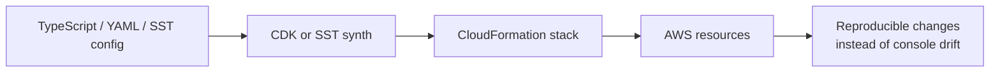

You've spent this entire course clicking through the AWS console and running CLI commands. You created an S3 bucket, configured a CloudFront distribution, set up an API Gateway, attached IAM roles, provisioned a DynamoDB table, and wired it all together. It works. But there's a problem: if you had to do it all again—on a new account, for a new Summit Supply environment, for a teammate—you'd need to repeat every step from memory, in the right order, without mistakes.

If you want AWS's official framing for the first-party IaC tool in this lesson, the [AWS CDK Developer Guide](https://docs.aws.amazon.com/cdk/v2/guide/home.html) is the canonical reference.

That's the problem **Infrastructure as Code** solves. Instead of manually configuring services through a web console, you write code that describes your infrastructure. You check that code into version control. You deploy it with a single command. And when you need to tear it down, update it, or replicate it, the code is the source of truth—not a series of console clicks you half-remember.

If you've ever used a `package.json` to describe your project's dependencies, you already understand the concept. IaC is `package.json` for your AWS infrastructure.

## Why This Matters

This is the lesson where the course finally turns back on itself. Up to this point, manual setup was the right move because you needed to see every service in the open. But once you understand the pieces, repeating the console dance is not educational anymore. It's just drift waiting to happen.

## Builds On

- [The Full Static Site Pipeline](full-static-pipeline.md)
- [What Lambda Is and Why Frontend Engineers Care](what-is-lambda.md)
- [What DynamoDB Is and When to Use It](what-is-dynamodb.md)



## The Pain of Manual Configuration

You might not feel the pain yet. You have one project, one account, and you just set everything up. But consider what happens as you grow:

**Reproducibility.** A new developer joins your team and needs their own staging environment. You hand them a 47-step rundown document. They miss step 23. The environment is broken in a way that takes two hours to debug because the error message from CloudFront is "Access Denied" and the actual problem is a missing bucket policy.

**Drift.** Someone makes a quick fix in the console—tweaks a Lambda timeout, adds a CORS header, changes a DynamoDB capacity setting. That change exists only in AWS, not in any documentation or code. Three months later, you deploy a "fresh" environment from your rundown document and it behaves differently from production. You spend a day figuring out why.

**Auditing.** Your security team asks "what changed in the last month?" With console changes, the answer is: go read CloudTrail logs and try to reconstruct what happened. With IaC, the answer is: look at the Git history.

**Disaster recovery.** Something catastrophic happens—an accidental deletion, a region outage, a compromised account. How fast can you rebuild? With manual configuration: hours to days. With IaC: minutes.

## CloudFormation: The Foundation

**CloudFormation** is AWS's native IaC service. You write a template—a JSON or YAML file—that describes every resource you want. CloudFormation reads the template, creates the resources, and tracks their state. When you update the template, CloudFormation figures out what changed and applies only the differences.

Here is a tiny CloudFormation template that creates an S3 bucket:

```yaml
AWSTemplateFormatVersion: '2010-09-09'
Description: S3 bucket for static frontend assets

Resources:
  FrontendBucket:
    Type: AWS::S3::Bucket
    Properties:
      BucketName: my-frontend-app-assets
      PublicAccessBlockConfiguration:
        BlockPublicAcls: true
        BlockPublicPolicy: true
        IgnorePublicAcls: true
        RestrictPublicBuckets: true
```

You deploy this with:

```bash
aws cloudformation deploy \
  --template-file template.yaml \
  --stack-name my-frontend-app \
  --region us-east-1 \
  --output json
```

CloudFormation creates a **stack**—a collection of resources that are managed as a unit. Delete the stack, and all the resources go away. Update the template, redeploy, and CloudFormation handles the changes.

The value is clear: this YAML file is your infrastructure. Check it into Git, review it in pull requests, and anyone can deploy the same environment by running one command.

The downside is also clear: CloudFormation templates get verbose fast. A complete static frontend deployment—S3 bucket, bucket policy, CloudFront distribution, OAC, ACM certificate, Route 53 records—can easily be 200-300 lines of YAML. And YAML isn't exactly pleasant to write at scale. (Honestly, I'm not sure YAML is pleasant to write at _any_ scale.)

## CDK: Infrastructure in TypeScript

The **AWS Cloud Development Kit (CDK)** solves the verbosity problem. Instead of writing YAML, you write real code—TypeScript, Python, Java, Go—that generates CloudFormation templates under the hood. CDK gives you the full power of a programming language: variables, loops, conditionals, abstractions, type checking.

Here is what your manually-built static site infrastructure looks like in CDK, using TypeScript:

```typescript
import * as cdk from 'aws-cdk-lib';
import * as s3 from 'aws-cdk-lib/aws-s3';
import * as cloudfront from 'aws-cdk-lib/aws-cloudfront';
import * as origins from 'aws-cdk-lib/aws-cloudfront-origins';
import * as acm from 'aws-cdk-lib/aws-certificatemanager';
import * as route53 from 'aws-cdk-lib/aws-route53';
import * as targets from 'aws-cdk-lib/aws-route53-targets';

export class FrontendStack extends cdk.Stack {
  constructor(scope: cdk.App, id: string) {
    super(scope, id);

    const bucket = new s3.Bucket(this, 'Assets', {
      bucketName: 'my-frontend-app-assets',
      blockPublicAccess: s3.BlockPublicAccess.BLOCK_ALL,
      removalPolicy: cdk.RemovalPolicy.DESTROY,
    });

    const certificate = acm.Certificate.fromCertificateArn(
      this,
      'Certificate',
      'arn:aws:acm:us-east-1:123456789012:certificate/your-cert-id',
    );

    const distribution = new cloudfront.Distribution(this, 'CDN', {
      defaultBehavior: {
        origin: origins.S3BucketOrigin.withOriginAccessControl(bucket),
        viewerProtocolPolicy: cloudfront.ViewerProtocolPolicy.REDIRECT_TO_HTTPS,
      },
      defaultRootObject: 'index.html',
      domainNames: ['example.com'],
      certificate,
      errorResponses: [
        {
          httpStatus: 404,
          responseHttpStatus: 200,
          responsePagePath: '/index.html',
        },
      ],
    });

    const zone = route53.HostedZone.fromLookup(this, 'Zone', {
      domainName: 'example.com',
    });

    new route53.ARecord(this, 'DNS', {
      zone,
      target: route53.RecordTarget.fromAlias(new targets.CloudFrontTarget(distribution)),
    });
  }
}
```

That's around 45 lines of TypeScript. It creates an S3 bucket with public access blocked, a CloudFront distribution with OAC, HTTPS redirection, SPA error handling, and a Route 53 alias record, basically the entire static-hosting arc in a single file. And because it's TypeScript, you get autocomplete, type errors, and compile-time validation.

You deploy it with:

```bash
npx cdk deploy --region us-east-1
```

CDK synthesizes the TypeScript into a CloudFormation template (often hundreds of lines of YAML) and deploys it. You never have to read or write that YAML.

> [!TIP]
> CDK uses constructs—reusable building blocks—at different levels of abstraction. The `Distribution` class above is a "L2 construct" that sets sensible defaults and hides low-level CloudFormation details. If you need full control, you can drop down to L1 constructs that map 1:1 to CloudFormation resources.

## SST: CDK for Serverless

**SST** (originally "Serverless Stack") is a framework built on top of CDK that's specifically designed for full-stack serverless applications. If CDK is "Infrastructure as Code in TypeScript," SST is "Infrastructure as Code in TypeScript, but opinionated about the patterns you'll actually use."

SST adds several things that CDK doesn't provide out of the box:

- **Live Lambda development.** Your Lambda function code runs locally and connects to real AWS resources, so you get instant feedback without deploying on every change. If you've used `next dev` or `vite dev`, this is the equivalent for serverless backends.
- **Higher-level constructs.** SST provides components like `StaticSite`, `Api`, and `Table` that bundle together multiple AWS resources into a single, sensible default. Creating a full-stack app takes a few lines instead of a few pages.
- **Frontend framework integration.** SST knows about Next.js, Astro, SvelteKit, and other frameworks. It can deploy your frontend and backend together, handling the build pipeline automatically.

Here is the same static site in SST:

```typescript
new sst.aws.StaticSite('Frontend', {
  path: './build',
  domain: 'example.com',
});
```

Two lines. SST creates the S3 bucket, CloudFront distribution, OAC, ACM certificate, and Route 53 records automatically. It applies the same best practices you configured manually throughout the static-hosting arc.

> [!WARNING]
> SST is a third-party open-source project, not an AWS product. It has a strong community and active development, but it's a dependency you take on. If SST's opinions about project structure and deployment patterns don't match yours, CDK gives you the same power with more flexibility.

## Which One Should You Use?

This isn't a deep dive into any of these tools. You're not going to learn CDK or SST in this lesson. But here's the honest decision matrix:

**CloudFormation** is the right choice if you want maximum control, no third-party dependencies, and are willing to write verbose YAML/JSON. Most large organizations use CloudFormation (or tools that generate it) because it's the native AWS primitive.

**CDK** is the right choice if you want type safety, reusable abstractions, and are comfortable writing TypeScript (which, as a frontend engineer, you are). CDK is an AWS product with strong support and a large ecosystem.

**SST** is the right choice if you're building exactly the kind of application this course teaches—a frontend with a serverless backend—and you want the fastest path from code to deployed infrastructure. SST's opinions save time when they match your use case.

All three tools produce CloudFormation templates at the end. The differences are in how you write and maintain the code that generates those templates.

## The Real Value

Here's the thing that matters: right now, you understand how every service works because you configured them by hand. That understanding is permanent and transferable. It doesn't matter whether you use CDK, SST, Terraform, Pulumi, or raw CloudFormation—you know what a bucket policy does, why OAC exists, how execution roles work, and what CORS headers mean. You did the hard part.

IaC isn't a replacement for that understanding. It's a way to encode it. The code you write in CDK is only as good as your knowledge of the underlying services. And because you built everything manually first, you'll actually know what the IaC is doing when something goes wrong—which it will, because infrastructure is infrastructure regardless of whether you wrote it in YAML or TypeScript.

## Verification

You do not need to deploy CDK in this lesson, but you should be able to verify the mental model:

- Can you point at one manual change in the course and say what it would become in code?
- Can you explain which CloudFormation resource is hiding under the friendly CDK construct?
- Can you explain what would happen if a teammate recreated Summit Supply in another account from the same IaC definition?

If those answers are clear, the lesson did its job.

## Common Failure Modes

- **Jumping to abstractions before understanding the services:** that gives you fast scaffolding and terrible debugging instincts.
- **Treating CDK as magic instead of CloudFormation generation:** when deployment errors happen, you still need the underlying AWS model.
- **Encoding bad infrastructure faster:** IaC faithfully preserves good decisions _and_ bad ones.
- **Letting the framework pick everything silently:** sensible defaults are great until they stop matching your actual system.
