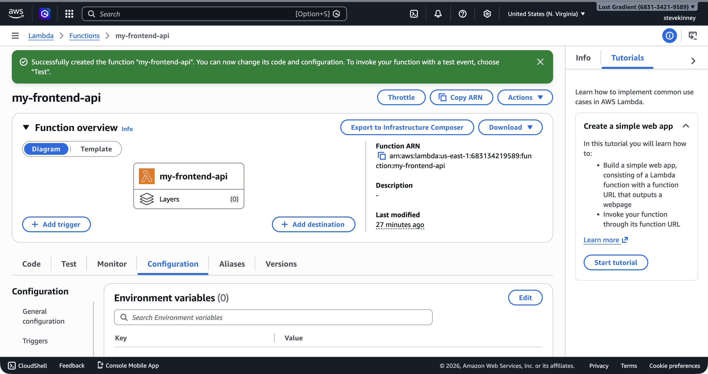

Environment variables work the same way in Lambda as they do in Vercel or Netlify: you set key-value pairs on the function, and your code reads them from `process.env`. The API endpoint for a third-party service, the name of a DynamoDB table, a feature flag—anything that changes between environments or shouldn't be hardcoded goes into an environment variable.

If you want AWS's exact rules and limits in front of you while you read, the [Lambda environment variables guide](https://docs.aws.amazon.com/lambda/latest/dg/configuration-envvars.html) is the official reference.

If you've ever set `NEXT_PUBLIC_API_URL` in a `.env.local` file or configured environment variables in the Vercel dashboard, you already understand the concept. The only difference is how you set them.

## Setting Environment Variables via CLI

You can set environment variables when you create the function or update them on an existing function. Here's how to add them during creation:

```bash
aws lambda create-function \
  --function-name my-frontend-app-api \
  --runtime nodejs22.x \
  --role arn:aws:iam::123456789012:role/my-frontend-app-lambda-role \
  --handler handler.handler \
  --zip-file fileb://function.zip \
  --environment 'Variables={TABLE_NAME=my-frontend-app-data,STAGE=production}' \
  --region us-east-1 \
  --output json
```

To update environment variables on an existing function, use `update-function-configuration`:

```bash
aws lambda update-function-configuration \
  --function-name my-frontend-app-api \
  --environment 'Variables={TABLE_NAME=my-frontend-app-data,STAGE=production,LOG_LEVEL=info}' \
  --region us-east-1 \
  --output json
```

In the console, the **Configuration → Environment variables** section shows all variables in plain text with an **Edit** button that lets you add, modify, or remove them.



> [!WARNING]
> The `--environment` flag replaces **all** environment variables on the function, not just the ones you specify. If your function has three existing variables and you run `update-function-configuration` with only two, the third variable is deleted. Always include every variable you want the function to have.

## Accessing Environment Variables in Your Handler

In your TypeScript handler, environment variables are available through `process.env`, exactly like they are in any Node.js application:

```typescript
import type { APIGatewayProxyHandlerV2 } from 'aws-lambda';

const tableName = process.env.TABLE_NAME;
// [!note Reading `process.env` at the top level runs once during init, not on every invocation.]
const stage = process.env.STAGE ?? 'development';

export const handler: APIGatewayProxyHandlerV2 = async (event) => {
  if (!tableName) {
    return {
      statusCode: 500,
      headers: { 'Content-Type': 'application/json' },
      body: JSON.stringify({ error: 'TABLE_NAME environment variable is not set' }),
    };
  }

  return {
    statusCode: 200,
    headers: { 'Content-Type': 'application/json' },
    body: JSON.stringify({
      table: tableName,
      stage,
      message: 'Configuration loaded successfully',
    }),
  };
};
```

There are two patterns worth noting here. First, reading environment variables at the top level (outside the handler function) means the value is read once during the init phase and reused across invocations. This is more efficient than reading `process.env` on every request. Second, always validate that required environment variables exist—`process.env.TABLE_NAME` is `string | undefined` in TypeScript, and your function should fail clearly if a variable is missing rather than silently breaking.

## Lambda's Built-In Environment Variables

Lambda also sets several environment variables automatically. You don't configure these—they're always present:

| Variable                          | Value                                                  |
| --------------------------------- | ------------------------------------------------------ |
| `AWS_REGION`                      | The function's region (e.g., `us-east-1`)              |
| `AWS_LAMBDA_FUNCTION_NAME`        | The function name                                      |
| `AWS_LAMBDA_FUNCTION_MEMORY_SIZE` | Allocated memory in MB                                 |
| `AWS_LAMBDA_FUNCTION_VERSION`     | The version of the function being executed             |
| `AWS_EXECUTION_ENV`               | The runtime identifier (e.g., `AWS_Lambda_nodejs22.x`) |
| `_HANDLER`                        | The handler setting (e.g., `handler.handler`)          |

These are useful for logging and debugging. For example, you might include `AWS_REGION` in log output to confirm your function is running where you expect. I like to log the function name and region on every cold start—it saves time when you're debugging across multiple environments.

## The 4 KB Limit

Lambda imposes a total limit of **4 KB** on all environment variables combined—keys, values, and formatting included. This sounds small, and it _is_. A handful of short configuration values fit easily; a JSON blob containing your entire application configuration doesn't.

If you're hitting the 4 KB limit, that's a signal that your configuration has outgrown environment variables. At that point, you should move configuration to **Parameter Store**, which you'll cover in the secrets section. It supports values up to 8 KB per parameter (or 64 KB for advanced parameters) with no total limit on the number of parameters.

> [!TIP]
> A practical rule of thumb: use environment variables for simple, non-sensitive values that your function needs at startup—table names, stage identifiers, feature flags, API endpoint URLs. Use Parameter Store or Secrets Manager for anything that's sensitive, large, or needs to be shared across multiple functions.

## When Not to Use Environment Variables

Environment variables are the right tool for configuration that:

- Changes between environments (dev, staging, production)
- Isn't sensitive enough to warrant encryption at rest
- Is small (a table name, a URL, a stage identifier)
- Needs to be available immediately at function startup

They're the **wrong** tool for:

- **API keys, database passwords, and tokens.** These should go in Secrets Manager or Parameter Store's `SecureString` type. Environment variables are visible to anyone with `lambda:GetFunctionConfiguration` permission, and they appear in the Lambda console in plain text. The secrets section covers secure configuration in detail.
- **Large configuration objects.** If your config is approaching the 4 KB limit, move it to Parameter Store.
- **Configuration that changes frequently.** Updating an environment variable requires `update-function-configuration`, which triggers a brief function update. For configuration you want to change without redeploying, Parameter Store lets you update the value and have your function pick it up on the next invocation (with appropriate caching).

## With the SDK

The read-modify-write pattern below is cleaner with the SDK because you get proper object merging instead of shell `jq` gymnastics:

```typescript
import {
  LambdaClient,
  GetFunctionConfigurationCommand,
  UpdateFunctionConfigurationCommand,
} from '@aws-sdk/client-lambda';

const lambda = new LambdaClient({ region: 'us-east-1' });

const current = await lambda.send(
  new GetFunctionConfigurationCommand({ FunctionName: 'my-frontend-app-api' }),
);

await lambda.send(
  new UpdateFunctionConfigurationCommand({
    FunctionName: 'my-frontend-app-api',
    Environment: {
      Variables: {
        ...(current.Environment?.Variables ?? {}),
        LOG_LEVEL: 'debug',
      },
    },
  }),
);
```

Same caveat as the CLI: `Environment.Variables` is _replaced_, not merged, by the API. The spread above is doing the merge client-side before the call.

## Updating a Single Variable

Since the `--environment` flag replaces all variables, updating a single variable requires you to re-specify everything. This is annoying but manageable. One approach is to use `get-function-configuration` to read the current variables, modify the JSON, and pass it back:

```bash
# Get current environment variables
aws lambda get-function-configuration \
  --function-name my-frontend-app-api \
  --query 'Environment.Variables' \
  --region us-east-1 \
  --output json
```

This returns:

```json
{
  "TABLE_NAME": "my-frontend-app-data",
  "STAGE": "production",
  "LOG_LEVEL": "info"
}
```

Then update with the modified set:

```bash
aws lambda update-function-configuration \
  --function-name my-frontend-app-api \
  --environment 'Variables={TABLE_NAME=my-frontend-app-data,STAGE=production,LOG_LEVEL=debug}' \
  --region us-east-1 \
  --output json
```

> [!NOTE] What happens to warm containers?
> Updating environment variables tells Lambda to swap in a fresh execution environment on the next invocation—the new value is picked up immediately, not gradually. Any warm containers running with the old values are retired in the background. You don't need to redeploy code to push a config change, and you don't need to wait for a rollout: the next request gets the new config.

## Environment Variables and Cold Starts

Environment variables are available during the init phase, which means you can safely read them in top-level module code. This is actually the recommended pattern: read configuration once during init and reuse it across invocations. Don't read `process.env` inside your handler on every request—it works, but it wastes time doing something that only needs to happen once.

```typescript
// Good: read once during init
const tableName = process.env.TABLE_NAME;

export const handler: APIGatewayProxyHandlerV2 = async (event) => {
  // tableName is already available here
};
```

```typescript
// Works but wasteful: read on every invocation
export const handler: APIGatewayProxyHandlerV2 = async (event) => {
  const tableName = process.env.TABLE_NAME;
  // reads process.env on every single request
};
```

The performance difference is negligible for a single variable, but the pattern matters: top-level initialization is a Lambda best practice that pays off when you're initializing database clients, parsing complex config, or loading cached data.

Your function is deployed, configured, and invocable. The last topic before you connect it to the internet via API Gateway is one that affects every API you build with Lambda: cold starts. In the next lesson, you'll learn what causes them, how they affect latency, and what you can do about it.
