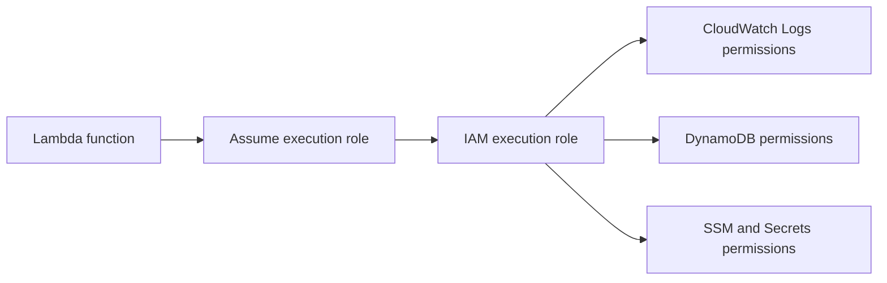
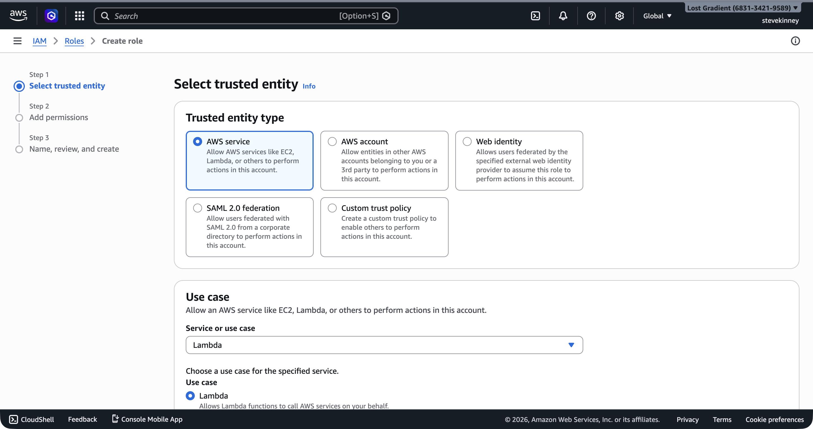
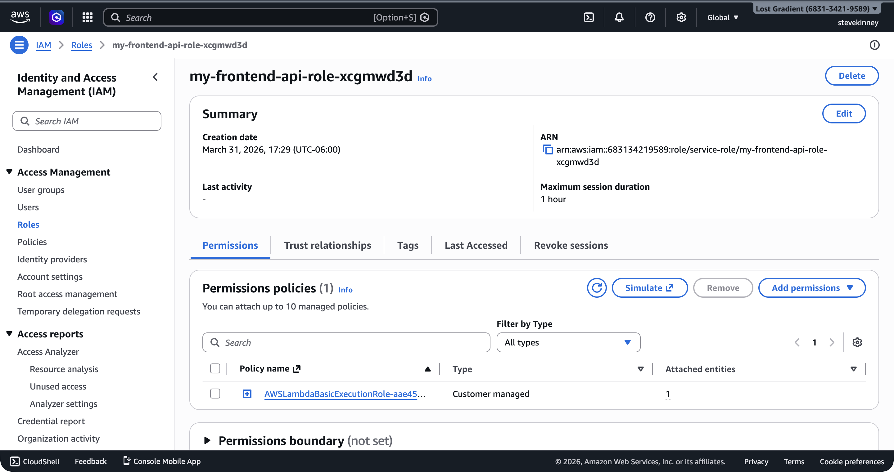

Every Lambda function needs permission to do things—write logs, read from DynamoDB, access S3. But Lambda functions don't have usernames or access keys. Instead, each function assumes an IAM role when it runs. This is the **execution role**, and it's the single most important security decision you make for each function.

If you want AWS's version of the same permission model while you read, the [Lambda execution role guide](https://docs.aws.amazon.com/lambda/latest/dg/lambda-intro-execution-role.html) is the official reference.

If you worked through [The IAM Mental Model](iam-mental-model.md), you already know how roles work: a role is a set of permissions that an AWS service can assume. The execution role is just that concept applied to Lambda. Your function says "I am `my-frontend-app-api`," Lambda says "let me check what role you're supposed to assume," and the role's policies determine what your function can do.

## What an Execution Role Is

An **execution role** has two parts:

1. **A trust policy**—tells AWS which service is allowed to assume this role. For Lambda, the trusted service is `lambda.amazonaws.com`.
2. **Permission policies**—the actual permissions the function gets when it runs. These are the same IAM policies you wrote in [Writing Your First IAM Policy](writing-your-first-iam-policy.md).



Without an execution role, Lambda can't run your function at all. The role is a required parameter when you create the function.

## Creating the Trust Policy

The trust policy is a JSON document that answers one question: "Who is allowed to assume this role?" For Lambda, the answer is always the Lambda service.

Create a file called `trust-policy.json`:

```json
{
  "Version": "2012-10-17",
  "Statement": [
    {
      "Effect": "Allow",
      "Principal": {
        "Service": "lambda.amazonaws.com"
      },
      "Action": "sts:AssumeRole"
    }
  ]
}
```

This policy says: "The Lambda service (`lambda.amazonaws.com`) is allowed to assume this role using the `sts:AssumeRole` action." The **Principal** field is what makes this a trust policy rather than a permission policy—it identifies who can use the role, not what the role can do.

> [!WARNING]
> The trust policy isn't the same as the permission policies you attach to the role. The trust policy controls who can _assume_ the role. The permission policies control what the role can _do_ once assumed. Mixing these up is a common source of confusion.

## Creating the Role

Use the AWS CLI to create the execution role:

```bash
aws iam create-role \
  --role-name my-frontend-app-lambda-role \
  --assume-role-policy-document file://trust-policy.json \
  --region us-east-1 \
  --output json
```

The response includes the role's ARN, which you'll need when creating the Lambda function:

```json
{
  "Role": {
    "RoleName": "my-frontend-app-lambda-role",
    "Arn": "arn:aws:iam::123456789012:role/my-frontend-app-lambda-role",
    "AssumeRolePolicyDocument": {
      "Version": "2012-10-17",
      "Statement": [
        {
          "Effect": "Allow",
          "Principal": {
            "Service": "lambda.amazonaws.com"
          },
          "Action": "sts:AssumeRole"
        }
      ]
    }
  }
}
```

Save that ARN. You'll pass it to `aws lambda create-function` in the next lesson.

In the console, the **Create role** wizard handles this on the **Select trusted entity** step—select **AWS service**, then choose **Lambda** as the use case.



## Attaching the Basic Execution Policy

A Lambda function that can't write logs is a Lambda function you can't debug. AWS provides a managed policy called **`AWSLambdaBasicExecutionRole`** that grants exactly three permissions:

- `logs:CreateLogGroup`—create a CloudWatch log group for the function
- `logs:CreateLogStream`—create a log stream within that group
- `logs:PutLogEvents`—write log entries

Attach it to your role:

```bash
aws iam attach-role-policy \
  --role-name my-frontend-app-lambda-role \
  --policy-arn arn:aws:iam::aws:policy/service-role/AWSLambdaBasicExecutionRole \
  --region us-east-1 \
  --output json
```

This is the minimum viable execution role. Every Lambda function should have at least this policy attached so that `console.log` output actually appears somewhere.

In the console, the completed role's **Permissions** tab shows the attached `AWSLambdaBasicExecutionRole` policy.

 Lambda writes logs to CloudWatch Logs. You'll dig into CloudWatch properly in the CloudWatch section, but for now, this policy ensures your logs aren't silently discarded.

> [!TIP]
> The ARN for AWS-managed policies always starts with `arn:aws:iam::aws:policy/`. The `aws` in the account position tells you this is a policy managed by AWS, not one you created. The `service-role/` path prefix is a convention for policies designed to be attached to service roles.

## Adding Custom Permissions

The basic execution policy only covers logging. As your application grows, your Lambda function will need access to other AWS services. You add these by creating and attaching additional policies. Honestly, this is where IAM starts to feel real—you're not just writing abstract policies anymore, you're deciding exactly what your running code can touch.

For example, if your function needs to read from an S3 bucket:

```json
{
  "Version": "2012-10-17",
  "Statement": [
    {
      "Sid": "AllowS3Read",
      "Effect": "Allow",
      "Action": ["s3:GetObject"],
      "Resource": "arn:aws:s3:::my-frontend-app-assets/*"
    }
  ]
}
```

Save this as `lambda-s3-policy.json` and attach it:

```bash
aws iam create-policy \
  --policy-name MyFrontendAppLambdaS3Read \
  --policy-document file://lambda-s3-policy.json \
  --region us-east-1 \
  --output json

aws iam attach-role-policy \
  --role-name my-frontend-app-lambda-role \
  --policy-arn arn:aws:iam::123456789012:policy/MyFrontendAppLambdaS3Read \
  --region us-east-1 \
  --output json
```

The principle of least privilege from [Principle of Least Privilege](principle-of-least-privilege.md) applies here exactly as it did with IAM users: grant only the permissions your function actually needs, scoped to the specific resources it accesses. A Lambda function that reads one DynamoDB table shouldn't have `dynamodb:*` on `*`.

## The Permissions Your Function Will Need

As you progress through the course, you'll add policies to this execution role incrementally:

| Section              | Service                           | Actions                                                            | Why                                 |
| -------------------- | --------------------------------- | ------------------------------------------------------------------ | ----------------------------------- |
| Lambda section (now) | CloudWatch Logs                   | `logs:CreateLogGroup`, `logs:CreateLogStream`, `logs:PutLogEvents` | Function logging                    |
| DynamoDB section     | DynamoDB                          | `dynamodb:GetItem`, `dynamodb:PutItem`, `dynamodb:Query`, etc.     | Reading and writing data            |
| Secrets section      | Parameter Store / Secrets Manager | `ssm:GetParameter`, `secretsmanager:GetSecretValue`                | Accessing configuration and secrets |

Each time you add a new integration, you'll create a new policy scoped to exactly the resources your function needs and attach it to the existing role. One role, multiple policies. This keeps your permissions auditable and makes it obvious what your function can do.

## Verifying the Role

You can verify what policies are attached to your role:

```bash
aws iam list-attached-role-policies \
  --role-name my-frontend-app-lambda-role \
  --region us-east-1 \
  --output json
```

Expected output:

```json
{
  "AttachedPolicies": [
    {
      "PolicyName": "AWSLambdaBasicExecutionRole",
      "PolicyArn": "arn:aws:iam::aws:policy/service-role/AWSLambdaBasicExecutionRole"
    }
  ]
}
```

If you see `AWSLambdaBasicExecutionRole` in the list, your role is ready for the next step: deploying the function.

## Common Mistakes

**Using the wrong trust policy principal.** If you copy a trust policy from an EC2 example, the principal will be `ec2.amazonaws.com` and Lambda won't be able to assume the role. The error message—"The role defined for the function cannot be assumed by Lambda"—is clear once you know to look for it, but confusing the first time.

**Attaching `AdministratorAccess` to get things working.** This is tempting during development and disastrous in production. A Lambda function with admin access can delete your entire AWS account's resources. Use the minimum permissions, even during development. If your function fails with an access denied error, the error message tells you exactly which action and resource you need to add.

**Forgetting to wait for role propagation.** IAM changes are eventually consistent. If you create a role and immediately create a Lambda function using that role, the function creation might fail because IAM hasn't propagated the role to all AWS endpoints yet. Wait 10–15 seconds—or if you're scripting the deployment, add retry-with-backoff logic on the `create-function` call rather than a fixed sleep, since propagation time isn't guaranteed.

You've got an execution role with logging permissions. In the next lesson, you'll package your TypeScript handler into a deployment zip and use `aws lambda create-function` to deploy it with this role.
