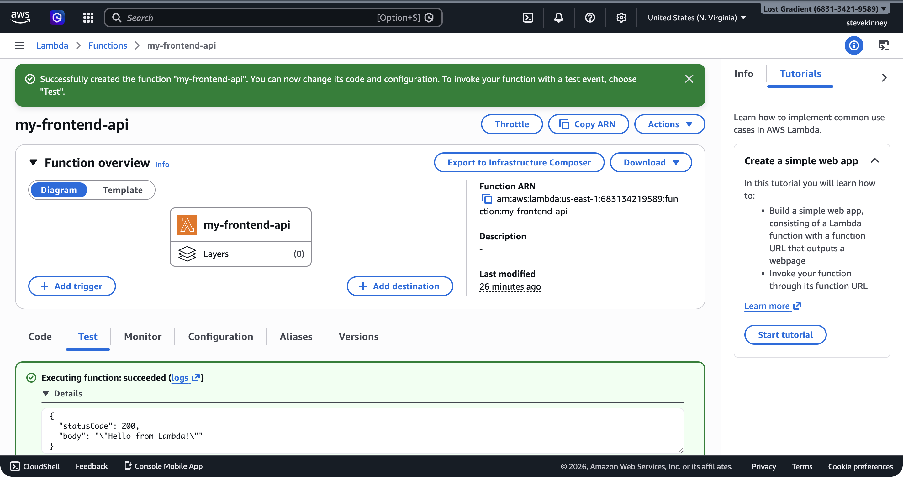

Here's the complete solution for every step, including the handler code, the trust policy, all CLI commands, and the expected output at each stage.

## Why This Works

- The execution role and trust policy solve different problems: one tells Lambda it may assume the role, and the other tells the role what the function may do after that.
- Packaging `dist/handler.js` into the deployment zip gives Lambda exactly the artifact it expects at runtime instead of asking it to transpile TypeScript for you.
- The CLI invocation and CloudWatch log checks prove both halves of the system work: the code path and the operational path.

> [!TIP]
> If the console or CLI output looks a little different when you do this, keep the [`aws lambda create-function` command reference](https://docs.aws.amazon.com/cli/latest/reference/lambda/create-function.html) and the [`aws lambda update-function-code` command reference](https://docs.aws.amazon.com/cli/latest/reference/lambda/update-function-code.html) open.

## Project Setup

```bash
mkdir -p lambda/src
cd lambda
npm init -y
npm install -D typescript @types/aws-lambda @types/node
```

### `lambda/tsconfig.json`

```json
{
  "compilerOptions": {
    "target": "ES2022",
    "module": "commonjs",
    "lib": ["ES2022"],
    "outDir": "./dist",
    "rootDir": "./src",
    "strict": true,
    "esModuleInterop": true,
    "skipLibCheck": true,
    "forceConsistentCasingInFileNames": true,
    "resolveJsonModule": true,
    "declaration": true,
    "declarationMap": true,
    "sourceMap": true
  },
  "include": ["src/**/*"],
  "exclude": ["node_modules", "dist"]
}
```

### `lambda/package.json` (scripts section)

```json
{
  "scripts": {
    "build": "tsc"
  }
}
```

## The Handler

### `lambda/src/handler.ts`

```typescript
import type { APIGatewayProxyHandlerV2 } from 'aws-lambda';

interface GreetingResponse {
  greeting: string;
  timestamp: string;
}

export const handler: APIGatewayProxyHandlerV2 = async (event) => {
  const name = event.queryStringParameters?.name ?? 'World';
  // [!note The `?.` and `??` operators handle the case where `queryStringParameters` is `undefined`.]

  const response: GreetingResponse = {
    greeting: `Hello, ${name}!`,
    timestamp: new Date().toISOString(),
  };

  console.log('Greeting request:', { name, timestamp: response.timestamp });

  return {
    statusCode: 200,
    headers: { 'Content-Type': 'application/json' },
    body: JSON.stringify(response),
  };
};
```

### Build

```bash
cd lambda
npm run build
```

Expected: `dist/handler.js`, `dist/handler.js.map`, `dist/handler.d.ts`, and `dist/handler.d.ts.map` are created with no errors.

## The Execution Role

### `trust-policy.json`

```json
{
  "Version": "2012-10-17",
  "Statement": [
    {
      "Effect": "Allow",
      "Principal": {
        "Service": "lambda.amazonaws.com"
      },
      "Action": "sts:AssumeRole"
    }
  ]
}
```

### Create the role

```bash
aws iam create-role \
  --role-name my-frontend-app-lambda-role \
  --assume-role-policy-document file://trust-policy.json \
  --region us-east-1 \
  --output json
```

Expected output:

```json
{
  "Role": {
    "RoleName": "my-frontend-app-lambda-role",
    "Arn": "arn:aws:iam::123456789012:role/my-frontend-app-lambda-role",
    "AssumeRolePolicyDocument": {
      "Version": "2012-10-17",
      "Statement": [
        {
          "Effect": "Allow",
          "Principal": {
            "Service": "lambda.amazonaws.com"
          },
          "Action": "sts:AssumeRole"
        }
      ]
    }
  }
}
```

### Attach the basic execution policy

```bash
aws iam attach-role-policy \
  --role-name my-frontend-app-lambda-role \
  --policy-arn arn:aws:iam::aws:policy/service-role/AWSLambdaBasicExecutionRole \
  --region us-east-1 \
  --output json
```

### Verify the role

```bash
aws iam list-attached-role-policies \
  --role-name my-frontend-app-lambda-role \
  --region us-east-1 \
  --output json
```

Expected output:

```json
{
  "AttachedPolicies": [
    {
      "PolicyName": "AWSLambdaBasicExecutionRole",
      "PolicyArn": "arn:aws:iam::aws:policy/service-role/AWSLambdaBasicExecutionRole"
    }
  ]
}
```

## Package and Deploy

### Create the deployment zip

```bash
cd lambda/dist
zip -r ../function.zip .
cd ..
```

### Create the function

```bash
aws lambda create-function \
  --function-name my-frontend-app-api \
  --runtime nodejs22.x \
  --architectures arm64 \
  --role arn:aws:iam::123456789012:role/my-frontend-app-lambda-role \
  --handler handler.handler \
  --zip-file fileb://function.zip \
  --region us-east-1 \
  --output json
```

Expected output:

```json
{
  "FunctionName": "my-frontend-app-api",
  "FunctionArn": "arn:aws:lambda:us-east-1:123456789012:function:my-frontend-app-api",
  "Runtime": "nodejs22.x",
  "Architectures": ["arm64"],
  "Role": "arn:aws:iam::123456789012:role/my-frontend-app-lambda-role",
  "Handler": "handler.handler",
  "CodeSize": 1523,
  "Timeout": 3,
  "MemorySize": 128,
  "LastUpdateStatus": "Successful",
  "State": "Active"
}
```

> [!TIP]
> If you get "The role defined for the function cannot be assumed by Lambda," wait 10-15 seconds and try again. IAM role propagation is eventually consistent—the role exists, but Lambda's endpoint might not have seen it yet.

### Verify the function exists

```bash
aws lambda get-function \
  --function-name my-frontend-app-api \
  --region us-east-1 \
  --output json
```

## Invoke the Function

### Test event with name parameter

Save as `test-event.json`:

```json
{
  "requestContext": {
    "http": {
      "method": "GET",
      "path": "/greeting"
    }
  },
  "queryStringParameters": {
    "name": "Lambda"
  }
}
```

Invoke:

```bash
aws lambda invoke \
  --function-name my-frontend-app-api \
  --cli-binary-format raw-in-base64-out \
  --payload file://test-event.json \
  --region us-east-1 \
  --output json \
  response.json
```

Expected terminal output:

```json
{
  "StatusCode": 200,
  "ExecutedVersion": "$LATEST"
}
```

Check the response:

```bash
cat response.json
```

Expected (formatted for readability):

```json
{
  "statusCode": 200,
  "headers": {
    "Content-Type": "application/json"
  },
  "body": "{\"greeting\":\"Hello, Lambda!\",\"timestamp\":\"2026-03-18T12:00:00.000Z\"}"
}
```

The `body` is a stringified JSON object. If you parse it, you get:

```json
{
  "greeting": "Hello, Lambda!",
  "timestamp": "2026-03-18T12:00:00.000Z"
}
```

In the console, the **Test** tab shows the same result with the execution status and response body expanded.



### Test event without name parameter

Save as `test-event-no-name.json`:

```json
{
  "requestContext": {
    "http": {
      "method": "GET",
      "path": "/greeting"
    }
  }
}
```

Invoke:

```bash
aws lambda invoke \
  --function-name my-frontend-app-api \
  --cli-binary-format raw-in-base64-out \
  --payload file://test-event-no-name.json \
  --region us-east-1 \
  --output json \
  response.json

cat response.json
```

Expected body:

```json
{
  "greeting": "Hello, World!",
  "timestamp": "2026-03-18T12:00:05.000Z"
}
```

The default value `"World"` is used when `queryStringParameters` is missing or doesn't include `name`.

## Read the Logs

### Verify the log group exists

```bash
aws logs describe-log-groups \
  --log-group-name-prefix /aws/lambda/my-frontend-app-api \
  --region us-east-1 \
  --output json
```

Expected output:

```json
{
  "logGroups": [
    {
      "logGroupName": "/aws/lambda/my-frontend-app-api",
      "arn": "arn:aws:logs:us-east-1:123456789012:log-group:/aws/lambda/my-frontend-app-api:*",
      "storedBytes": 1234
    }
  ]
}
```

### Read the latest log events

```bash
aws logs describe-log-streams \
  --log-group-name /aws/lambda/my-frontend-app-api \
  --order-by LastEventTime \
  --descending \
  --limit 1 \
  --region us-east-1 \
  --output json
```

Use the `logStreamName` from the response to fetch events:

```bash
aws logs get-log-events \
  --log-group-name /aws/lambda/my-frontend-app-api \
  --log-stream-name "2026/03/18/[$LATEST]abcdef1234567890" \
  --region us-east-1 \
  --output json
```

You should see log entries that include:

- `START RequestId: ...`
- Your `console.log` output: `Greeting request: { name: 'Lambda', timestamp: '...' }`
- `END RequestId: ...`
- `REPORT RequestId: ... Duration: X.XX ms Billed Duration: XX ms Memory Size: 128 MB Max Memory Used: XX MB Init Duration: XXX.XX ms`

The `Init Duration` line appears only on cold start invocations. If you invoke the function a second time quickly, it won't appear—the second invocation reused the warm execution environment.

## Stretch Goal: Environment Variable

### Set the environment variable

```bash
aws lambda update-function-configuration \
  --function-name my-frontend-app-api \
  --environment 'Variables={GREETING_PREFIX=Howdy}' \
  --region us-east-1 \
  --output json
```

### Update the handler to use it

```typescript
import type { APIGatewayProxyHandlerV2 } from 'aws-lambda';

interface GreetingResponse {
  greeting: string;
  timestamp: string;
}

const prefix = process.env.GREETING_PREFIX ?? 'Hello';

export const handler: APIGatewayProxyHandlerV2 = async (event) => {
  const name = event.queryStringParameters?.name ?? 'World';

  const response: GreetingResponse = {
    greeting: `${prefix}, ${name}!`,
    timestamp: new Date().toISOString(),
  };

  console.log('Greeting request:', { name, prefix, timestamp: response.timestamp });

  return {
    statusCode: 200,
    headers: { 'Content-Type': 'application/json' },
    body: JSON.stringify(response),
  };
};
```

### Rebuild and redeploy

```bash
cd lambda
npm run build
cd dist && zip -r ../function.zip . && cd ..

aws lambda update-function-code \
  --function-name my-frontend-app-api \
  --zip-file fileb://function.zip \
  --region us-east-1 \
  --output json
```

### Invoke and verify

```bash
aws lambda invoke \
  --function-name my-frontend-app-api \
  --cli-binary-format raw-in-base64-out \
  --payload file://test-event.json \
  --region us-east-1 \
  --output json \
  response.json

cat response.json
```

Expected body:

```json
{
  "greeting": "Howdy, Lambda!",
  "timestamp": "2026-03-18T12:05:00.000Z"
}
```

The greeting prefix changed from `"Hello"` to `"Howdy"` without changing the code logic—only the environment variable.

## Stretch Goal: Cold Start Measurement

Invoke with log tailing:

```bash
aws lambda invoke \
  --function-name my-frontend-app-api \
  --cli-binary-format raw-in-base64-out \
  --payload file://test-event.json \
  --log-type Tail \
  --region us-east-1 \
  --output json \
  response.json
```

The response includes a `LogResult` field containing base64-encoded log output. You can capture and decode it in a single invocation by swapping `--output json` for `--query 'LogResult' --output text` — that pipes the log string straight into `base64 --decode`:

```bash
aws lambda invoke \
  --function-name my-frontend-app-api \
  --cli-binary-format raw-in-base64-out \
  --payload file://test-event.json \
  --log-type Tail \
  --region us-east-1 \
  --query 'LogResult' \
  --output text \
  response.json | base64 --decode
```

`response.json` is still written (it's the positional output-file argument), and the `LogResult` field lands on stdout for the pipe.

On a cold start, the output includes:

```
REPORT RequestId: abc-123 Duration: 12.34 ms Billed Duration: 13 ms
Memory Size: 128 MB Max Memory Used: 67 MB Init Duration: 198.45 ms
```

Invoke immediately again. The `Init Duration` field disappears—the second invocation was a warm start.

## Cleanup

> [!NOTE]
> The `my-frontend-app-api` function and its CloudWatch log group are reused throughout the rest of this course—in the API Gateway, DynamoDB, Secrets Manager, and CloudWatch sections. Only clean up if you're done with the course entirely.

```bash
aws lambda delete-function \
  --function-name my-frontend-app-api \
  --region us-east-1

# The log group is NOT deleted automatically when the function is deleted
aws logs delete-log-group \
  --log-group-name /aws/lambda/my-frontend-app-api \
  --region us-east-1
```
