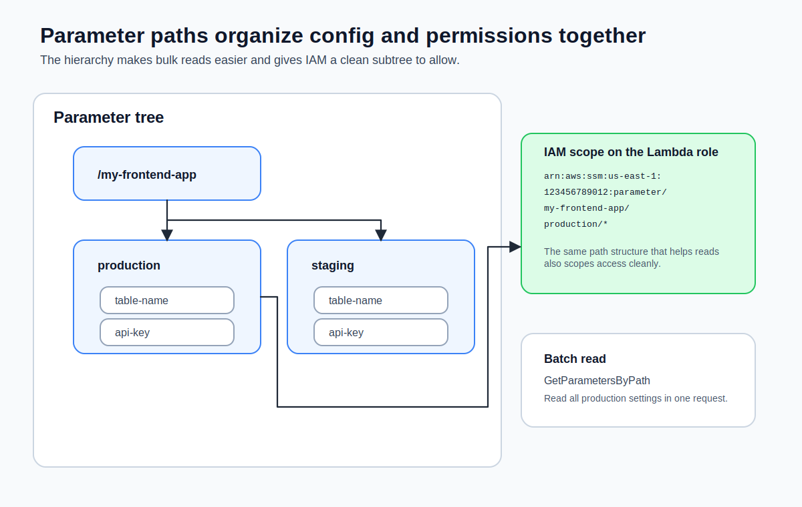
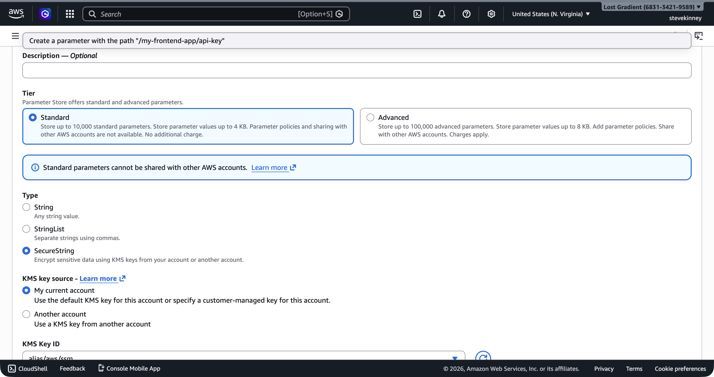
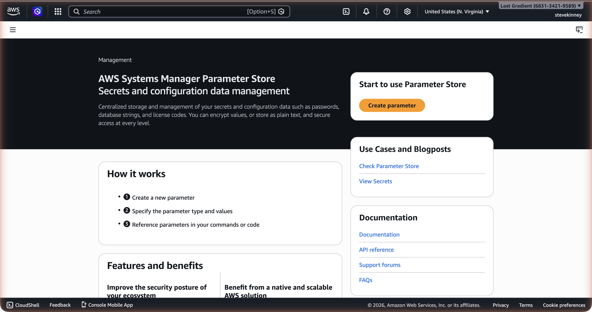

**Parameter Store** is part of AWS Systems Manager (SSM). It's a key-value store for configuration data—the same kind of data you've been putting in Lambda environment variables, but with encryption, access control, versioning, and a hierarchical namespace built in.

If you want AWS's version of the same feature while you read, the [Parameter Store documentation](https://docs.aws.amazon.com/systems-manager/latest/userguide/systems-manager-parameter-store.html) is the official reference.

If Lambda environment variables are like a flat `.env` file, Parameter Store is like a structured configuration tree. I find that distinction helpful because it changes how you think about organizing your config. You organize parameters by application, environment, and purpose using paths that look like file system directories: `/my-frontend-app/production/api-key`. And unlike environment variables, you can share parameters across multiple Lambda functions without duplicating values.



## Creating Parameters with the CLI

The `put-parameter` command creates or updates a parameter. Here's a plain text parameter:

```bash
aws ssm put-parameter \
  --name "/my-frontend-app/production/table-name" \
  --value "my-frontend-app-data" \
  --type "String" \
  --region us-east-1 \
  --output json
```

The response includes the version number and the tier:

```json
{
  "Version": 1,
  "Tier": "Standard"
}
```

Now create a **SecureString** parameter for something sensitive—an API key:

```bash
aws ssm put-parameter \
  --name "/my-frontend-app/production/api-key" \
  --value "sk_live_abc123xyz" \
  --type "SecureString" \
  --region us-east-1 \
  --output json
```

In the console, the **Create parameter** form shows the **SecureString** type option with the KMS key selector.



The value is encrypted at rest using an AWS-managed KMS key. You can also specify your own KMS key with the `--key-id` flag, but the default key works fine for most use cases.

> [!TIP]
> To update an existing parameter, add the `--overwrite` flag. Without it, `put-parameter` fails if the parameter already exists. This is a safety feature—you don't accidentally overwrite production values.

## Hierarchical Paths

The forward slashes in parameter names aren't just cosmetic. They define a hierarchy that you can query, and more importantly, they let you scope IAM permissions to entire subtrees.

Here's a typical structure for a frontend application with two environments:

```
/my-frontend-app/
├── production/
│   ├── table-name          (String)
│   ├── api-key             (SecureString)
│   ├── api-endpoint        (String)
│   └── feature-flags       (String)
├── staging/
│   ├── table-name          (String)
│   ├── api-key             (SecureString)
│   ├── api-endpoint        (String)
│   └── feature-flags       (String)
```

This hierarchy gives you two things. First, you can retrieve all parameters for a given environment in a single call. Second, you can write an IAM policy that grants a Lambda function access to `/my-frontend-app/production/*` without giving it access to staging parameters.

In the console, the **Parameter Store** list view shows all parameters in your account. You can filter by path to see only the `/my-frontend-app/` hierarchy.



Let's populate a few more parameters:

```bash
aws ssm put-parameter \
  --name "/my-frontend-app/production/api-endpoint" \
  --value "https://api.example.com/v1" \
  --type "String" \
  --region us-east-1 \
  --output json

aws ssm put-parameter \
  --name "/my-frontend-app/production/feature-flags" \
  --value '{"darkMode":true,"newCheckout":false}' \
  --type "String" \
  --region us-east-1 \
  --output json
```

## String vs. SecureString

Parameter Store supports three types:

| Type           | Encryption | Use Case                                        |
| -------------- | ---------- | ----------------------------------------------- |
| `String`       | None       | Table names, endpoint URLs, feature flags       |
| `StringList`   | None       | Comma-separated values                          |
| `SecureString` | KMS        | API keys, tokens, passwords, connection strings |

**String** parameters are stored in plain text. Use them for configuration that isn't sensitive—the same kind of values you'd put in Lambda environment variables.

**SecureString** parameters are encrypted at rest with a KMS key. When you retrieve a SecureString, you must explicitly request decryption with the `--with-decryption` flag (CLI) or `WithDecryption: true` (SDK). Without it, you get the encrypted ciphertext, which is useless.

**StringList** stores comma-separated values as a single parameter. It's occasionally useful, but most of the time you're better off using a JSON string in a regular `String` parameter.

> [!WARNING]
> SecureString parameters require KMS permissions to decrypt. If your Lambda function's execution role doesn't have `kms:Decrypt` permission on the KMS key used to encrypt the parameter, the function can read the parameter name but can't decrypt the value. You'll get an access denied error at runtime, not at deploy time.

## Retrieving Parameters

### Get a Single Parameter

```bash
aws ssm get-parameter \
  --name "/my-frontend-app/production/table-name" \
  --region us-east-1 \
  --output json
```

Response:

```json
{
  "Parameter": {
    "Name": "/my-frontend-app/production/table-name",
    "Type": "String",
    "Value": "my-frontend-app-data",
    "Version": 1,
    "LastModifiedDate": "2026-03-18T10:00:00.000Z",
    "ARN": "arn:aws:ssm:us-east-1:123456789012:parameter/my-frontend-app/production/table-name"
  }
}
```

For SecureString parameters, add `--with-decryption`:

```bash
aws ssm get-parameter \
  --name "/my-frontend-app/production/api-key" \
  --with-decryption \
  --region us-east-1 \
  --output json
```

Without `--with-decryption`, the `Value` field contains the encrypted ciphertext.

### Get All Parameters by Path

This is where the hierarchy pays off. Retrieve every parameter under a given path:

```bash
aws ssm get-parameters-by-path \
  --path "/my-frontend-app/production" \
  --with-decryption \
  --recursive \
  --region us-east-1 \
  --output json
```

This returns all four parameters under `/my-frontend-app/production/` in a single API call. The `--recursive` flag includes parameters in nested paths. Without it, only direct children of the specified path are returned.

## Retrieving Parameters with the SDK

Here's how you retrieve a parameter from a Lambda function using the AWS SDK v3:

```typescript
import { SSMClient, GetParameterCommand } from '@aws-sdk/client-ssm';

const ssm = new SSMClient({});

const getParameter = async (name: string): Promise<string> => {
  const response = await ssm.send(
    new GetParameterCommand({
      Name: name,
      WithDecryption: true,
    }),
  );
  // [!note `WithDecryption: true` is required for `SecureString` parameters. It has no effect on `String` parameters, so you can safely set it for all parameters.]

  if (!response.Parameter?.Value) {
    throw new Error(`Parameter ${name} not found or has no value`);
  }

  return response.Parameter.Value;
};
```

To retrieve all parameters under a path:

```typescript
import { SSMClient, GetParametersByPathCommand } from '@aws-sdk/client-ssm';

const ssm = new SSMClient({});

const getParametersByPath = async (path: string): Promise<Record<string, string>> => {
  const response = await ssm.send(
    new GetParametersByPathCommand({
      Path: path,
      WithDecryption: true,
      Recursive: true,
    }),
  );

  const parameters: Record<string, string> = {};
  for (const param of response.Parameters ?? []) {
    if (param.Name && param.Value) {
      const key = param.Name.replace(path, '').replace(/^\//, '');
      // [!note Strip the path prefix to get a clean key like `api-key` instead of the full path.]
      parameters[key] = param.Value;
    }
  }

  return parameters;
};
```

> [!WARNING]
> `GetParametersByPath` caps at **10 parameters per call**. More than that and the response includes a `NextToken` that you must pass back in on a follow-up call. The example above ignores pagination—if you have more than 10 parameters under the path, you'll silently only see the first 10. The correct shape is a loop:
>
> ```typescript
> let nextToken: string | undefined;
> do {
>   const response = await ssm.send(
>     new GetParametersByPathCommand({
>       Path: path,
>       WithDecryption: true,
>       Recursive: true,
>       NextToken: nextToken,
>     }),
>   );
>   for (const param of response.Parameters ?? []) {
>     /* collect */
>   }
>   nextToken = response.NextToken;
> } while (nextToken);
> ```
>
> Or use the AWS SDK v3 paginator helper: `paginateGetParametersByPath({ client: ssm }, { Path: path })`.

## Standard vs. Advanced Tier

Parameter Store has two tiers:

| Feature                       | Standard         | Advanced                            |
| ----------------------------- | ---------------- | ----------------------------------- |
| **Cost**                      | Free             | $0.05 per parameter per month       |
| **Max value size**            | 4 KB             | 8 KB                                |
| **Max parameters per region** | 10,000           | 100,000                             |
| **Parameter policies**        | No               | Yes (expiration, notification)      |
| **Throughput**                | 40 TPS (default) | Up to 1,000 TPS (higher throughput) |

For almost every frontend application, the standard tier is more than enough. You're storing a handful of configuration values, not tens of thousands. The 4 KB value limit is the same as Lambda's environment variable limit, and it's plenty for API keys and configuration strings.

> [!TIP]
> You don't need to choose a tier upfront. Parameters default to Standard. If you later need Advanced features, you can change a parameter's tier with `put-parameter --tier Advanced --overwrite`. You can also set the tier to `Intelligent-Tiering` and let AWS promote parameters to Advanced only when they exceed Standard limits.

## Versioning

Every time you update a parameter, Parameter Store increments its version number. You can retrieve a specific version by appending `:version` to the name:

```bash
aws ssm get-parameter \
  --name "/my-frontend-app/production/api-key:1" \
  --with-decryption \
  --region us-east-1 \
  --output json
```

This gives you a lightweight audit trail and the ability to roll back a configuration change without redeploying anything.

Parameter Store handles most configuration needs, but it doesn't rotate credentials for you. When you need automatic rotation—for database passwords, OAuth tokens, or any credential with a lifecycle—that's where Secrets Manager comes in. The next lesson covers Secrets Manager and when it's worth the cost.

## Cleanup

Standard-tier parameters are free, so there's no billing reason to delete them—but it keeps your parameter namespace clean:

```bash
aws ssm delete-parameters \
  --names \
    "/my-frontend-app/production/table-name" \
    "/my-frontend-app/production/api-key" \
    "/my-frontend-app/production/api-endpoint" \
    "/my-frontend-app/production/feature-flags" \
  --region us-east-1 \
  --output json
```
