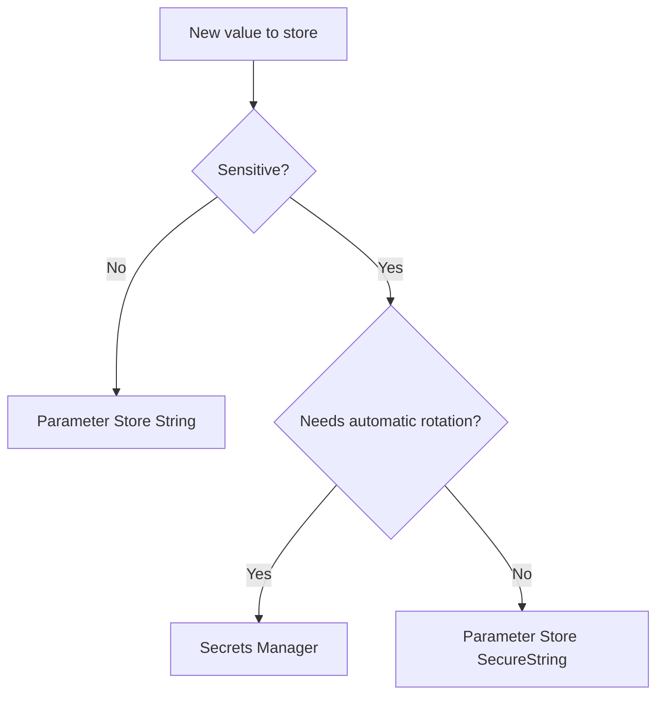

You have two AWS services that can store secrets. That's one too many for anyone who just wants to know where to put an API key. This lesson gives you a clear decision framework so you can stop deliberating and start building.

If you want AWS's official version of the service behavior while you read, the [AWS Secrets Manager overview](https://docs.aws.amazon.com/secretsmanager/latest/userguide/intro.html) and the [Parameter Store documentation](https://docs.aws.amazon.com/systems-manager/latest/userguide/systems-manager-parameter-store.html) are the canonical references.



## The Comparison

| Feature                               | Parameter Store (Standard)           | Parameter Store (Advanced) | Secrets Manager                          |
| ------------------------------------- | ------------------------------------ | -------------------------- | ---------------------------------------- |
| **Cost**                              | Free                                 | $0.05/parameter/month      | $0.40/secret/month + $0.05/10K API calls |
| **Max value size**                    | 4 KB                                 | 8 KB                       | 64 KB                                    |
| **Encryption**                        | SecureString (KMS)                   | SecureString (KMS)         | Always encrypted (KMS)                   |
| **Automatic rotation**                | No                                   | No                         | Yes                                      |
| **Versioning**                        | Yes                                  | Yes                        | Yes (with staging labels)                |
| **Hierarchical paths**                | Yes                                  | Yes                        | Yes (by convention)                      |
| **Cross-region replication**          | No                                   | No                         | Yes                                      |
| **Parameter policies (expiration)**   | No                                   | Yes                        | N/A (rotation handles lifecycle)         |
| **Max throughput**                    | 40 TPS (default), 1,000 TPS (higher) | 1,000 TPS (higher)         | 5,000 TPS                                |
| **Max parameters/secrets per region** | 10,000                               | 100,000                    | 500,000                                  |
| **CloudTrail logging**                | Yes                                  | Yes                        | Yes                                      |

The table tells a clear story: Parameter Store is a general-purpose configuration store with optional encryption. Secrets Manager is a credential vault with rotation as its defining feature.

## When to Use Parameter Store

**Non-sensitive configuration.** Table names, API endpoint URLs, feature flag JSON, stage identifiers. These are plain `String` parameters. They're free, versioned, and organized by path. This replaces the Lambda environment variables you've been using—same data, better organization and access control.

**Sensitive values that don't need rotation.** A third-party API key that you update once a year. A static signing secret for JWTs. An encryption key for client-side tokens. Store these as `SecureString` parameters. You get KMS encryption and IAM access control for free.

**Shared configuration across multiple functions.** If five Lambda functions all need the same API endpoint URL, storing it in Parameter Store means you update it in one place. With environment variables, you update it on five functions and hope you don't miss one.

**Projects where cost matters.** Personal projects, side projects, early-stage startups—anything where $0.40 per secret per month feels like an unnecessary expense. Standard Parameter Store is free.

## When to Use Secrets Manager

**Database credentials.** If your Lambda functions connect to RDS, Aurora, or Redshift, Secrets Manager provides pre-built rotation Lambda functions. You enable rotation, set a schedule, and Secrets Manager handles the credential lifecycle—creating new passwords, testing them, and promoting them to active. Your application picks up the new password on the next fetch.

**Credentials that must rotate on a schedule.** Security policies in larger organizations often require credential rotation every 30, 60, or 90 days. Manual rotation is error-prone. Secrets Manager automates it.

**Cross-region disaster recovery.** If you need your secrets available in multiple regions for failover, Secrets Manager supports replication. Parameter Store doesn't.

**Compliance requirements.** Secrets Manager's version staging (`AWSCURRENT`, `AWSPENDING`, `AWSPREVIOUS`) and built-in rotation audit trail satisfy compliance requirements that Parameter Store's simpler versioning doesn't.

## The Hybrid Approach

Most production applications use both services together. This isn't a compromise—it's the recommended pattern.

```
Parameter Store (free)
├── /my-frontend-app/production/table-name          → "my-frontend-app-data"
├── /my-frontend-app/production/api-endpoint        → "https://api.example.com/v1"
├── /my-frontend-app/production/feature-flags       → '{"darkMode":true}'
├── /my-frontend-app/production/log-level           → "info"
└── /my-frontend-app/production/third-party-api-key → (SecureString) "sk_abc123"

Secrets Manager ($0.40/month per secret)
├── /my-frontend-app/production/database-credentials → (auto-rotates every 30 days)
└── /my-frontend-app/production/oauth-client-secret  → (auto-rotates every 90 days)
```

Non-sensitive config and static secrets go in Parameter Store. Credentials with a rotation lifecycle go in Secrets Manager. Your Lambda function reads from both:

```typescript
import type { APIGatewayProxyHandlerV2 } from 'aws-lambda';
import { SSMClient, GetParameterCommand } from '@aws-sdk/client-ssm';
import { SecretsManagerClient, GetSecretValueCommand } from '@aws-sdk/client-secrets-manager';

const ssm = new SSMClient({});
const secretsManager = new SecretsManagerClient({});

let config: { apiEndpoint: string; apiKey: string } | undefined;
let dbCredentials: { username: string; password: string } | undefined;

const loadConfig = async () => {
  if (!config) {
    const [endpointResponse, keyResponse] = await Promise.all([
      ssm.send(new GetParameterCommand({ Name: '/my-frontend-app/production/api-endpoint' })),
      ssm.send(
        new GetParameterCommand({
          Name: '/my-frontend-app/production/third-party-api-key',
          WithDecryption: true,
        }),
      ),
    ]);
    // [!note Fetch multiple parameters in parallel with `Promise.all` to reduce init time.]

    config = {
      apiEndpoint: endpointResponse.Parameter?.Value ?? '',
      apiKey: keyResponse.Parameter?.Value ?? '',
    };
  }

  if (!dbCredentials) {
    const response = await secretsManager.send(
      new GetSecretValueCommand({
        SecretId: '/my-frontend-app/production/database-credentials',
      }),
    );

    dbCredentials = JSON.parse(response.SecretString ?? '{}');
  }
};

export const handler: APIGatewayProxyHandlerV2 = async (event) => {
  await loadConfig();

  // config and dbCredentials are now available
  return {
    statusCode: 200,
    headers: { 'Content-Type': 'application/json' },
    body: JSON.stringify({ message: 'All configuration loaded' }),
  };
};
```

## The Decision Flowchart

When you have a new configuration value to store, ask these questions in order:

1. **Is it sensitive?** No—use Parameter Store `String`. It's free, versioned, and queryable by path.

2. **Does it need to rotate automatically?** Yes—use Secrets Manager. The cost is justified by the automation.

3. **Is it a sensitive value that doesn't need rotation?** Use Parameter Store `SecureString`. You get KMS encryption and IAM access control without the Secrets Manager cost.

That's it. Three questions, one answer each time.

## IAM Considerations

When you use both services, your Lambda execution role needs permissions for both. Here is a combined policy:

```json
{
  "Version": "2012-10-17",
  "Statement": [
    {
      "Effect": "Allow",
      "Action": ["ssm:GetParameter", "ssm:GetParametersByPath"],
      "Resource": "arn:aws:ssm:us-east-1:123456789012:parameter/my-frontend-app/production/*"
    },
    {
      "Effect": "Allow",
      "Action": ["secretsmanager:GetSecretValue"],
      "Resource": "arn:aws:secretsmanager:us-east-1:123456789012:secret:/my-frontend-app/production/*"
    },
    {
      "Effect": "Allow",
      "Action": ["kms:Decrypt"],
      "Resource": "arn:aws:kms:us-east-1:123456789012:alias/aws/ssm"
    }
  ]
}
```

Notice the scoping. The SSM statement grants access to parameters under `/my-frontend-app/production/*`. The Secrets Manager statement does the same for secrets. The KMS statement grants decryption for Parameter Store SecureString values. This follows the principle of least privilege you learned in [Principle of Least Privilege](principle-of-least-privilege.md)—each function gets access to exactly what it needs.

The `*` wildcard in the Secrets Manager ARN isn't laziness—it's required. Secrets Manager appends a random 6-character suffix to secret ARNs (e.g., `secret:/my-frontend-app/production/stripe-key-AbCdEf`) to prevent name reuse within the deletion recovery window. You can't predict that suffix at policy-writing time, so your IAM policy has to use `*` or include the full ARN with the suffix.

> [!TIP]
> If you have separate Lambda functions for different features (one for user management, one for payments), give each function access to only its own secrets. The payments function gets access to `/my-frontend-app/production/stripe-*`. The user management function gets access to `/my-frontend-app/production/auth-*`. Do not give every function access to every secret.

## Common Mistakes

**Using Secrets Manager for non-sensitive configuration.** Storing a DynamoDB table name in Secrets Manager costs $0.40 per month for no reason. Use Parameter Store.

**Storing secrets in environment variables "just for now."** "Just for now" has a half-life of approximately forever. I've made this mistake myself. Put the secret in the right place from the start.

**Not caching secrets in Lambda.** Every SDK call to Parameter Store or Secrets Manager adds latency and API cost. Cache values in module-level variables and refresh them on a TTL or on cold start. We covered this pattern in [Accessing Secrets from Lambda](accessing-secrets-from-lambda.md).

**Granting `ssm:GetParameter` on `*` resources.** This gives the function access to every parameter in your account. Scope the resource to the specific path your function needs.

## What You Have Learned

The secrets section gave you the tools to move sensitive configuration out of Lambda environment variables and into purpose-built secret storage. Parameter Store handles configuration and static secrets for free. Secrets Manager handles rotating credentials for $0.40 per secret per month. Your Lambda functions read from both at init time, cache the values, and use IAM policies to enforce access control.

The pattern is simple: environment variables for non-sensitive config that doesn't change between deploys. Parameter Store for everything else that isn't rotating. Secrets Manager for credentials that must rotate. Now go move that API key out of your environment variables.
