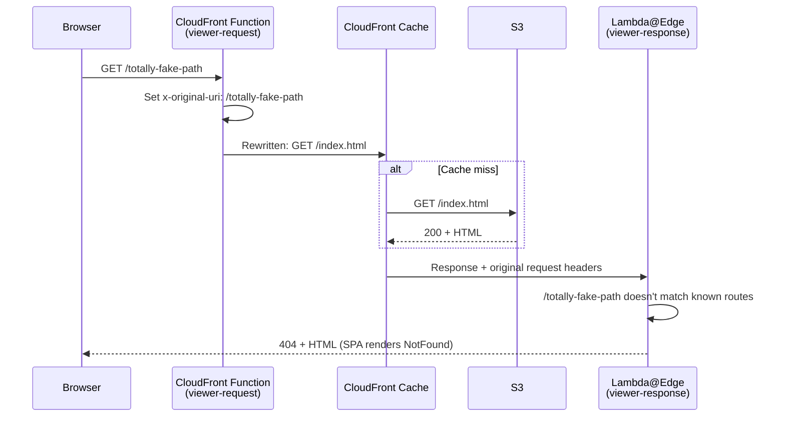

Your CloudFront Function rewrites all non-file paths to `/index.html`, and your SPA handles the rest. Users can refresh on `/notes/abc123` and the app works. But every path—valid or not—returns a 200 status code. `/notes/abc123` returns 200. `/totally-fake-path` returns 200. `/admin/secret/please` returns 200. The SPA renders its "not found" component for unrecognized routes, but the HTTP response says everything is fine.

If you want AWS's version of the Lambda@Edge event model while you read, the [Lambda@Edge guide](https://docs.aws.amazon.com/AmazonCloudFront/latest/DeveloperGuide/lambda-at-the-edge.html) is the official reference.

This matters in production. Search engine crawlers use the status code, not the visual content, to decide whether a page is real. A 200 on a junk path means Google might index it. Monitoring tools can't distinguish real traffic from bots hitting random URLs. And if you ever need to debug a redirect chain or track down broken links from external sites, having every path return 200 makes the logs useless.

The fix is a Lambda@Edge function that checks the original URL against your app's known routes and returns a 404 for anything that doesn't match—while still serving the HTML so the SPA can show its "not found" UI.

## The Architecture

This requires two edge functions working together:



1. **CloudFront Function (viewer-request):** Stashes the original URI in a custom header before rewriting to `/index.html`.
2. **Lambda@Edge (viewer-response):** Reads the original URI from the header, checks it against known route patterns, and sets the status code to 404 if it doesn't match.

Why Lambda@Edge and not a CloudFront Function for the viewer-response? You could do simple pattern matching in a CloudFront Function. Lambda@Edge makes more sense when the route patterns are complex, when you might want to load them from a build manifest, or when you need the full Node.js runtime for the matching logic. It's also a good opportunity to see Lambda@Edge in action on a real problem after learning the mechanics in [Writing a Lambda@Edge Function](writing-a-lambda-at-edge-function.md).

## Step 1: Update the CloudFront Function

Your CloudFront Function needs to save the original URI before rewriting it. Without this, the Lambda@Edge function only sees `/index.html`—the rewritten URI—and has no way to know what the viewer actually requested.

Update your SPA rewrite function:

```javascript
function handler(event) {
  var request = event.request;
  var uri = request.uri;

  if (uri.includes('.')) {
    return request;
  }

  // Pass the original URI to downstream functions
  request.headers['x-original-uri'] = { value: uri };
  request.uri = '/index.html';

  return request;
}
```

The `x-original-uri` header travels with the request through CloudFront's pipeline. The Lambda@Edge function reads it from the viewer-response event's request object.

Update and republish the function using the workflow from [Writing a CloudFront Function](writing-a-cloudfront-function.md):

```bash
aws cloudfront update-function \
  --name url-rewrite \
  --if-match CURRENT_ETAG \
  --function-config '{"Comment":"SPA rewrite with original URI passthrough","Runtime":"cloudfront-js-2.0"}' \
  --function-code fileb://url-rewrite.js \
  --region us-east-1 \
  --output json
```

Then publish:

```bash
aws cloudfront publish-function \
  --name url-rewrite \
  --if-match ETAG_FROM_UPDATE \
  --region us-east-1 \
  --output json
```

## Step 2: Write the Lambda@Edge Function

Create a Lambda@Edge function that runs on **viewer-response** events. It reads the original URI from the custom header and checks it against the route patterns that Scratch Lab's client-side router recognizes.

```typescript
import type { CloudFrontResponseHandler } from 'aws-lambda';

// Route patterns that the SPA knows how to handle.
// These mirror the patterns in src/hooks/use-router.ts.
const knownRoutes: RegExp[] = [
  /^\/$/, // Home
  /^\/notes\/[^/]+$/, // Note detail: /notes/:id
];
// [!note Keep these in sync with your client-side router. If you add a route to the app, add a pattern here.]

export const handler: CloudFrontResponseHandler = async (event) => {
  const response = event.Records[0].cf.response;
  const request = event.Records[0].cf.request;

  // Read the original URI stashed by the CloudFront Function.
  // If the header is missing, this is a request for a static file—leave it alone.
  const originalUriHeader = request.headers['x-original-uri'];
  if (!originalUriHeader || !originalUriHeader[0]) {
    return response;
  }

  const originalUri = originalUriHeader[0].value;
  const isKnownRoute = knownRoutes.some((pattern) => pattern.test(originalUri));

  if (!isKnownRoute) {
    response.status = '404';
    response.statusDescription = 'Not Found';
  }

  return response;
};
```

A few things to notice:

- **The response body doesn't change.** The HTML is the same `index.html` regardless of status code. The SPA renders its `NotFound` component for unrecognized paths based on the URL, not the status code. The status code is for machines—crawlers, monitoring tools, your access logs.
- **`response.status` is a string.** This is the Lambda@Edge quirk from [Writing a Lambda@Edge Function](writing-a-lambda-at-edge-function.md)—`'404'`, not `404`.
- **Static file requests skip the check.** If the CloudFront Function didn't set `x-original-uri`, the request was for a file with an extension (CSS, JS, images). Those should keep whatever status code S3 returned.

## Step 3: Deploy the Lambda@Edge Function

Build and package the function the same way you did in [Writing a Lambda@Edge Function](writing-a-lambda-at-edge-function.md):

```bash
npx tsc --outDir dist
cd dist && zip -r ../function.zip . && cd ..
```

### Create the execution role

If you don't already have one from the Lambda@Edge lesson, create a role that trusts both `lambda.amazonaws.com` and `edgelambda.amazonaws.com`:

```json
{
  "Version": "2012-10-17",
  "Statement": [
    {
      "Effect": "Allow",
      "Principal": {
        "Service": ["lambda.amazonaws.com", "edgelambda.amazonaws.com"]
      },
      "Action": "sts:AssumeRole"
    }
  ]
}
```

```bash
aws iam create-role \
  --role-name my-frontend-app-status-code-role \
  --assume-role-policy-document file://edge-trust-policy.json \
  --region us-east-1 \
  --output json

aws iam attach-role-policy \
  --role-name my-frontend-app-status-code-role \
  --policy-arn arn:aws:iam::aws:policy/service-role/AWSLambdaBasicExecutionRole \
  --region us-east-1 \
  --output json
```

### Deploy to us-east-1

```bash
aws lambda create-function \
  --function-name my-frontend-app-status-codes \
  --runtime nodejs22.x \
  --role arn:aws:iam::123456789012:role/my-frontend-app-status-code-role \
  --handler index.handler \
  --zip-file fileb://function.zip \
  --region us-east-1 \
  --output json
```

### Publish a numbered version

Lambda@Edge requires a published version—you can't use `$LATEST`:

```bash
aws lambda publish-version \
  --function-name my-frontend-app-status-codes \
  --description "SPA status code routing" \
  --region us-east-1 \
  --output json
```

Save the versioned ARN from the response (it ends with `:1`).

## Step 4: Associate with Your Distribution

Retrieve your distribution config and add the Lambda@Edge function to the default behavior's `LambdaFunctionAssociations`:

```json
{
  "LambdaFunctionAssociations": {
    "Quantity": 1,
    "Items": [
      {
        "LambdaFunctionARN": "arn:aws:lambda:us-east-1:123456789012:function/my-frontend-app-status-codes:1",
        "EventType": "viewer-response",
        "IncludeBody": false
      }
    ]
  }
}
```

```bash
aws cloudfront update-distribution \
  --id E1A2B3C4D5E6F7 \
  --if-match ETAG_FROM_GET \
  --distribution-config file://dist-config.json \
  --region us-east-1 \
  --output json
```

> [!WARNING]
> A behavior can only have one function per event type. If you have a CloudFront Function on `viewer-response` (like the security headers function from the [exercise](cloudfront-function-exercise.md)), you'll need to either move that logic into this Lambda@Edge function or use a [managed response headers policy](cloudfront-headers-cors-and-security.md) instead. You can have a CloudFront Function on `viewer-request` and a Lambda@Edge on `viewer-response` on the same behavior—they're on different event types.

Wait for the distribution to deploy:

```bash
aws cloudfront wait distribution-deployed \
  --id E1A2B3C4D5E6F7 \
  --region us-east-1
```

## Step 5: Test the Status Codes

Once the distribution is deployed, verify the status codes:

```bash
# Valid route: home page
curl -s -o /dev/null -w "%{http_code}" https://YOUR_CLOUDFRONT_DOMAIN/
# Expected: 200

# Valid route: a note page
curl -s -o /dev/null -w "%{http_code}" https://YOUR_CLOUDFRONT_DOMAIN/notes/abc123
# Expected: 200

# Invalid route: random path
curl -s -o /dev/null -w "%{http_code}" https://YOUR_CLOUDFRONT_DOMAIN/totally-fake-path
# Expected: 404

# Invalid route: almost a valid path
curl -s -o /dev/null -w "%{http_code}" https://YOUR_CLOUDFRONT_DOMAIN/notes/
# Expected: 404

# Static asset: still served normally
curl -s -o /dev/null -w "%{http_code}" https://YOUR_CLOUDFRONT_DOMAIN/favicon.svg
# Expected: 200
```

Open the CloudFront domain in a browser and navigate to `/totally-fake-path`. The SPA should show its "not found" UI—the same visual experience as before. But now the HTTP status code is 404, which is what search engines, monitoring tools, and your CloudWatch logs will see.

## Keeping Routes in Sync

The route patterns in your Lambda@Edge function must match your client-side router. If you add a new route to the Scratch Lab app (say, `/settings`), you need to add a pattern to the Lambda@Edge function and deploy a new version.

For a small app like Scratch Lab, maintaining the list by hand is fine. For a larger app, you have a few options:

- **Generate the pattern list at build time.** Extract route patterns from your router configuration and write them into the Lambda function's source before packaging.
- **Use CloudFront KeyValueStore.** Store the route patterns in a KVS instance that the function reads at runtime. Update the patterns without redeploying the function.
- **Accept the tradeoff.** If an unknown route briefly returns 200 before you update the function, that's usually acceptable. The main goal is preventing persistent 200s on junk paths.

## Cleanup

To remove the Lambda@Edge function, first disassociate it from the distribution, wait for the distribution to reach `Deployed` status, then delete the function. Lambda@Edge replicas take time to clean up—see [Writing a Lambda@Edge Function](writing-a-lambda-at-edge-function.md) for the full cleanup sequence.
