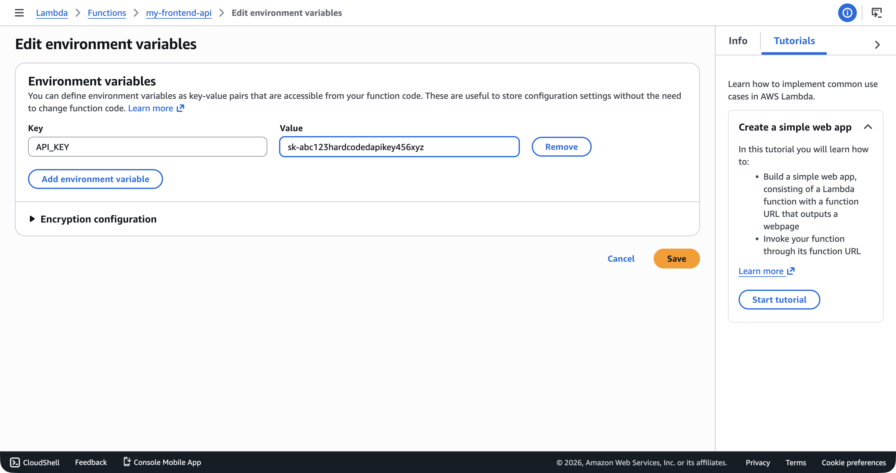

In Vercel, you set environment variables in the dashboard. Your API keys, database URLs, and third-party tokens live there, and the platform handles the rest. In Lambda, you can do the same thing—you set environment variables on the function and read them from `process.env`. You did exactly this in [Lambda Environment Variables](lambda-environment-variables.md).

If you want AWS's official version of the services behind this lesson, keep the [Parameter Store documentation](https://docs.aws.amazon.com/systems-manager/latest/userguide/systems-manager-parameter-store.html) and the [AWS Secrets Manager overview](https://docs.aws.amazon.com/secretsmanager/latest/userguide/intro.html) open.

That approach works. It's also a security problem waiting to happen.

## Why This Matters

By the time Summit Supply has a live inventory API, payment provider keys, and webhook signing secrets, "just put it in an environment variable" stops being a convenience and starts being a liability. This module is where the course shifts from "it works" to "it works without leaking credentials."

## Builds On

This lesson builds on the Lambda configuration work and the IAM foundation section. You already know how functions read configuration and how policies control access. Now you are applying those same mechanisms to secrets instead of harmless values like table names or stage labels.

## What "Hardcoded" Actually Means

When people say "hardcoded secrets," they usually mean one of three things:

1. **Secrets committed to source code.** An API key sitting in a `.ts` file, checked into Git, visible to everyone with repo access. This is the most obvious mistake, and most frontend engineers know to avoid it. (I'd hope.)

2. **Secrets in deployment configuration.** An API key in a GitHub Actions workflow file, a Terraform variable, or a CDK construct. Better than source code, but still stored in plain text in version control.

3. **Secrets in Lambda environment variables.** This is the one that catches people. You set the value in the AWS console or the CLI, your code reads it from `process.env`, and everything seems fine. But those environment variables are stored in plain text in the Lambda configuration. Anyone with `lambda:GetFunctionConfiguration` permission can read them.

That third one is the trap. It feels like the right approach—it's how Vercel and Netlify work, after all—but AWS gives you tools that are specifically designed for sensitive values. Environment variables aren't one of those tools.

## The Risks of Environment Variable Secrets

Here's what goes wrong when you store secrets as Lambda environment variables:

**They're visible in the console.** Open the Lambda function in the AWS console, click the Configuration tab, and every environment variable is right there. No extra authentication, no audit trail for who viewed them. Anyone with console access to the Lambda service can see your database password.



**They appear in CLI output.** Run `aws lambda get-function-configuration` and the response includes every environment variable in plain text. If your CI/CD pipeline logs that output—and many do—your secrets are in your build logs.

**They travel with the function configuration.** When you export a Lambda function's configuration (for backup, migration, or Infrastructure as Code), the environment variables come along. Secrets end up in CloudFormation templates, CDK snapshots, and Terraform state files.

**There's no rotation.** When you need to rotate an API key—because it was compromised, because the third-party provider requires it, because your security policy mandates it—you have to manually update the environment variable on every function that uses it. If you have five functions sharing the same key, you update it five times. Miss one and it breaks.

**There's no access audit.** AWS doesn't log who viewed a Lambda environment variable. With Secrets Manager, every access is logged in CloudTrail. With environment variables, you have no idea who looked at your database password last Tuesday.

> [!WARNING]
> Lambda environment variables are encrypted at rest by default using an AWS-managed KMS key. This protects them from someone who somehow accesses the underlying storage, but it does **not** protect them from anyone who has IAM permission to call `GetFunctionConfiguration`. Encryption at rest isn't the same as access control.

## A Concrete Example

You built a Lambda function earlier in the course and connected it to a DynamoDB table in [Connecting DynamoDB to Lambda](connecting-dynamodb-to-lambda.md). The table name went into an environment variable, and that was fine. A table name isn't a secret.

Now imagine your function also needs to call a third-party API—Stripe for payments, SendGrid for email, or a headless CMS for content. You need an API key. The temptation is to do this:

```bash
aws lambda update-function-configuration \
  --function-name my-frontend-app-api \
  --environment 'Variables={TABLE_NAME=my-frontend-app-data,STRIPE_API_KEY=sk_live_abc123xyz}' \
  --region us-east-1 \
  --output json
```

That `STRIPE_API_KEY` is now visible to anyone who can describe the function. It's in your deployment scripts. It'll end up in your CI logs. And when Stripe rotates your key, you have to redeploy the function.

## What AWS Offers Instead

AWS provides two services specifically designed for this problem:

**Parameter Store** is part of AWS Systems Manager. It stores configuration values in a hierarchical key-value structure. You can store plain text parameters (like table names and feature flags) and **SecureString** parameters (like API keys) that are encrypted with KMS. Standard parameters are free. You organize them with paths like `/my-frontend-app/production/api-key`, and you can grant IAM access to entire subtrees.

**Secrets Manager** is a standalone service built for credentials that need to rotate. It encrypts secrets with KMS, supports automatic rotation on a schedule, and integrates with services like RDS and Redshift for zero-downtime credential rotation. It costs $0.40 per secret per month plus $0.05 per 10,000 API calls.

Both services solve the same core problem: your Lambda function needs a secret at runtime, and that secret shouldn't live in the function's environment variables. The difference between them—and when to use each—is the subject of the rest of this module.

## The Pattern You'll Learn

By the end of the secrets section, your Lambda functions will follow this pattern:

1. **Non-sensitive configuration** (table names, stage identifiers, feature flags) stays in environment variables. This is still the right tool for values that aren't secret.

2. **Sensitive configuration** (API keys, tokens, connection strings) goes into Parameter Store as SecureString parameters or into Secrets Manager.

3. **Your Lambda function** reads secrets at initialization time using the AWS SDK, caches them in a module-level variable, and reuses them across invocations—the same init-time pattern you learned in [Lambda Environment Variables](lambda-environment-variables.md), but with a call to Parameter Store or Secrets Manager instead of `process.env`.

4. **IAM policies** on the function's execution role control which secrets the function can access. The policies you wrote in [Writing Your First IAM Policy](writing-your-first-iam-policy.md) and [Lambda Execution Roles and Permissions](lambda-execution-roles-and-permissions.md) are the same mechanism—you're just granting access to a different resource type.

> [!TIP]
> If you're coming from Vercel, think of Parameter Store as environment variables with encryption, access control, and organization built in. Think of Secrets Manager as the same thing but with automatic rotation added on top. Neither one is complicated—they just solve a problem that Vercel handles behind the scenes for you.

## Verification

- You can name the three common places secrets end up by mistake: source code, deployment configuration, and Lambda environment variables.
- You can explain why encrypting environment variables at rest is not the same thing as controlling who can read them.
- You can describe when Parameter Store is enough and when Secrets Manager earns its monthly cost.

## Common Failure Modes

- **Treating "not in Git" as secure enough:** A secret can still leak through Lambda configuration, CI output, or overly broad IAM access.
- **Using environment variables because rotation feels like a future problem:** Rotation always becomes a current problem on the worst possible day.
- **Picking Secrets Manager for every value automatically:** Some values are configuration, not secrets, and Parameter Store is the simpler tool.

## Use the Right Tool for the Job

This module isn't about making your life harder. It's about using the right tool for the job. Lambda environment variables are designed for non-sensitive configuration. Parameter Store and Secrets Manager are designed for sensitive values. When you put secrets in the right place, you get encryption, access control, audit logging, and rotation—all the things you'd expect a cloud platform to provide. I've seen teams burn entire afternoons tracking down a leaked key that lived in an environment variable for months. The next lesson walks through Parameter Store: how to create parameters, organize them hierarchically, and retrieve them in your code.
