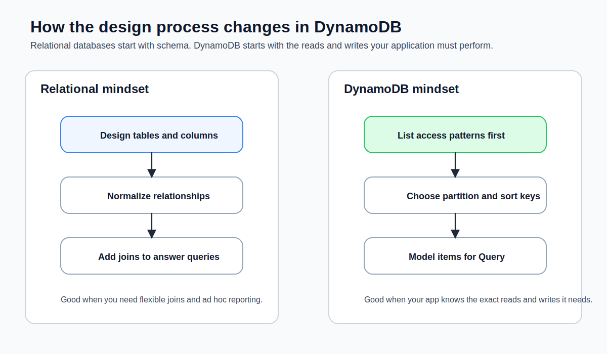

You don't need PostgreSQL for a todo list. You don't need to learn SQL joins, manage connection pools, or pay for a database server that runs 24/7 whether or not anyone is using your app. If your frontend needs a place to store and retrieve data—user preferences, form submissions, a list of items—**DynamoDB** gives you a database without giving you a database server.

DynamoDB is a fully managed, serverless NoSQL database from AWS. You create a table, write data to it, read data from it, and AWS handles everything else: provisioning, replication, patching, backups, scaling. If that sounds familiar, it should—it's the same "you write the code, we run the infrastructure" model you saw with Lambda in [What is Lambda?](what-is-lambda.md).

## Why This Matters

This is the moment Summit Supply stops being "a frontend with an API" and becomes "an application with state." Once you store saved gear lists, lightweight account state, or form submissions, you need a database choice that matches the rest of the stack. DynamoDB fits the same serverless operating model as Lambda, which is why it shows up so often in frontend-heavy AWS architectures.

## Builds On

- [What Lambda Is and Why Frontend Engineers Care](what-is-lambda.md)
- [Connecting API Gateway to Lambda](connecting-api-gateway-to-lambda.md)



## How It Differs from SQL Databases

If you've used PostgreSQL, MySQL, or even SQLite in a side project, you're accustomed to the relational model: tables with rigid schemas, rows and columns, and SQL queries that can join across multiple tables. That model is powerful, but it comes with operational overhead that frontend engineers rarely need.

DynamoDB uses a **key-value and document model** instead. Here's how the two compare:

|                       | Relational Database (PostgreSQL)                     | DynamoDB                                         |
| --------------------- | ---------------------------------------------------- | ------------------------------------------------ |
| Schema                | Fixed columns, defined up front                      | Flexible—each item can have different attributes |
| Query language        | SQL                                                  | API calls (SDK or CLI)                           |
| Joins                 | Yes, across multiple tables                          | No joins—design around single-table access       |
| Scaling               | You manage (replicas, read/write scaling)            | Automatic and on-demand                          |
| Server                | You provision and maintain it                        | Fully managed, no server                         |
| Connection management | Connection pools, max connections                    | HTTP API—no persistent connections               |
| Pricing               | Per hour (the server runs whether you use it or not) | Per request (you pay for what you use)           |

The mental shift: with a relational database, you design your schema around your data and then figure out queries. With DynamoDB, you design your schema around your **access patterns**—the specific ways your application reads and writes data. This tripped me up at first, but once it clicks, it makes a lot of sense. For a frontend API backend, your access patterns are usually simple: "get this item by ID," "list items for this user," "create a new item," "delete this item." DynamoDB handles these patterns well.

## The Data Model

DynamoDB organizes data into **tables**. Each table contains **items** (think rows), and each item contains **attributes** (think columns). But unlike a relational database, items in the same table don't need to have the same attributes. One item might have `title`, `status`, and `priority`. Another item in the same table might have `title` and `dueDate` but no `priority`. The only attributes that every item must have are the ones that make up the table's **primary key**.

Here's what an item looks like:

```json
{
  "userId": "user-123",
  "itemId": "item-456",
  "title": "Deploy to production",
  "status": "in-progress",
  "createdAt": "2026-03-18T10:00:00Z"
}
```

This is just a JSON object. There's no schema migration, no `ALTER TABLE`, no ORM. If you want to add a `priority` field next week, you just start including it in new items. Existing items are unaffected.

> [!TIP]
> If you've used Firebase's Firestore or MongoDB, DynamoDB's data model will feel familiar. The key difference is how you query it—DynamoDB doesn't have the flexible query language that Firestore or MongoDB offers. You trade query flexibility for predictable performance at any scale.

## Why Serverless and Managed Matters

DynamoDB is serverless in the same way Lambda is serverless: there's no instance to provision, no operating system to patch, no disk to resize. You interact with it through API calls—PutItem, GetItem, Query, Scan—and AWS handles the physical infrastructure.

For frontend engineers, this matters because:

- **No connection management.** Unlike PostgreSQL, which requires persistent connections and connection pooling (a common pain point in serverless architectures), DynamoDB uses HTTP-based API calls. Your Lambda function makes a request, gets a response, and moves on. No connection limits, no connection timeouts, no "too many connections" errors.
- **No cold start penalty for the database.** Lambda has cold starts. DynamoDB doesn't. Your table is always ready to accept requests.
- **No server to keep running.** A PostgreSQL instance on RDS costs money every hour, even at 3 AM when nobody is using your app. DynamoDB with on-demand pricing charges you per request. Zero requests, zero cost.

## On-Demand Pricing

DynamoDB offers two pricing modes: **provisioned** and **on-demand**. For a frontend API backend, on-demand is almost always the right choice. You don't need to predict traffic or configure capacity units.

AWS cut DynamoDB on-demand request pricing in late 2024, and the service still positions on-demand as the default choice for new or unpredictable workloads. Exact rates vary by Region and can change, so use the current [DynamoDB pricing page](https://aws.amazon.com/dynamodb/pricing/) or the AWS Pricing Calculator when you need a real number for production planning.

The practical point for this course is simpler: low-volume frontend workloads still cost pennies. A hobby project or learning app can read and write plenty of data before DynamoDB becomes a meaningful bill.

> [!WARNING]
> The DynamoDB free tier includes 25 GB of storage and enough read/write capacity for most development workloads. But the free tier only applies to tables using **provisioned** capacity mode, not on-demand. For learning and development, the cost difference is negligible—on-demand with low traffic will cost pennies. But be aware of this distinction if you're trying to stay strictly within the free tier.

## When DynamoDB Is the Right Choice

DynamoDB is a good fit when:

- Your access patterns are simple and well-defined (get by key, list by partition, create, update, delete)
- You want zero operational overhead
- Your data doesn't require complex joins or aggregations
- You're building a serverless application with Lambda

DynamoDB isn't a good fit when:

- You need complex queries with joins across multiple tables
- You need full-text search (use OpenSearch for that)
- Your data model is deeply relational and requires referential integrity
- You need SQL-compatible analytics across your entire dataset

For the typical frontend API backend—storing user data, tracking application state, persisting form submissions—DynamoDB handles the job with less complexity and lower cost than a relational database. Honestly, I reach for it any time I need a data layer for a side project and don't want to think about infrastructure.

## Verification

By the end of this lesson, you should be able to explain why a serverless frontend stack would pick DynamoDB _before_ you ever touch the CLI. If you want a quick concrete check, create a table name on paper and answer these three questions:

- What is the partition key?
- What are the first three access patterns the app needs?
- Would those access patterns need joins?

If your answers are specific, you're ready for the table design lesson.

## Common Failure Modes

- **Designing around the data shape instead of the access pattern:** that is the biggest DynamoDB mindset shift.
- **Assuming flexible ad hoc queries will save you later:** DynamoDB rewards deliberate query design, not "we'll figure it out in production."
- **Using Scan when you really needed Query:** it works at first, then becomes the slow, expensive habit you regret.
- **Treating DynamoDB like serverless Postgres:** it is not trying to be that, and life gets easier once you stop asking it to.
