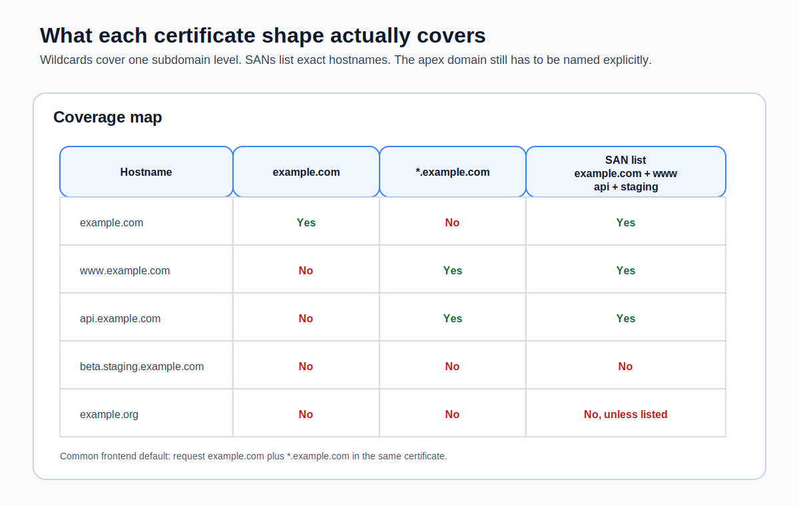

So far, we've requested a certificate covering a specific domain and its `www` subdomain. That works fine when you know exactly which hostnames you need. But what happens when your frontend grows? You might need `staging.example.com` for a staging environment, `api.example.com` for your backend, or `docs.example.com` for your documentation site. Requesting a new certificate for every subdomain gets tedious fast.

If you want AWS's official framing for the certificate behavior in this lesson, the [AWS Certificate Manager User Guide](https://docs.aws.amazon.com/acm/latest/userguide/acm-overview.html) is the source of truth.

ACM supports two strategies for covering multiple hostnames: **wildcard certificates** and **Subject Alternative Names (SANs)**. Each has tradeoffs, and knowing when to use which will save you from unnecessary certificate management overhead.



## Wildcard Certificates

A **wildcard certificate** covers a domain and all of its subdomains at one level. The syntax uses an asterisk: `*.example.com`.

```bash
aws acm request-certificate \
  --domain-name "*.example.com" \
  --validation-method DNS \
  --region us-east-1 \
  --output json
```

This single certificate covers:

- `www.example.com`
- `staging.example.com`
- `api.example.com`
- `docs.example.com`
- Any other subdomain of `example.com`

You can create new subdomains at any time and they are automatically covered by the existing certificate. No new certificate request, no new validation, no waiting.

### What Wildcards Don't Cover

Wildcards match exactly one level of subdomain. `*.example.com` covers `www.example.com` but **not** these (and this catches people off guard):

- `example.com` (the apex domain itself)
- `beta.staging.example.com` (two levels deep)

If you want both the apex domain and all subdomains, you need to include both in the certificate request:

```bash
aws acm request-certificate \
  --domain-name example.com \
  --subject-alternative-names "*.example.com" \
  --validation-method DNS \
  --region us-east-1 \
  --output json
```

This certificate covers `example.com` and every single-level subdomain. This is the most common pattern for frontend deployments—you want your site to work at both `example.com` and `www.example.com`, and you want room to add more subdomains later.

> [!TIP]
> The `--domain-name` value is the primary domain on the certificate. The `--subject-alternative-names` list adds additional domains. The primary domain is automatically included in the SANs, so you don't need to list it twice.

### Wildcard Validation

DNS validation for a wildcard certificate works the same way as for a specific domain. ACM generates a CNAME record for the wildcard domain, and you add it to your DNS. The record looks like this:

| Record Name           | Record Type | Record Value                  |
| --------------------- | ----------- | ----------------------------- |
| `_abc123.example.com` | CNAME       | `_def456.acm-validations.aws` |

Notice the validation record is for `example.com`, not `*.example.com`. ACM validates that you control the parent domain, which is sufficient to prove you control all subdomains under it.

When your certificate includes both `example.com` and `*.example.com`, ACM generates a single validation CNAME that covers both — you only add it once.

## Subject Alternative Names (SANs)

**Subject Alternative Names** let you list specific hostnames on a single certificate. Instead of a wildcard, you enumerate exactly which domains the certificate should cover:

```bash
aws acm request-certificate \
  --domain-name example.com \
  --subject-alternative-names www.example.com staging.example.com api.example.com \
  --validation-method DNS \
  --region us-east-1 \
  --output json
```

This certificate covers exactly four hostnames: `example.com`, `www.example.com`, `staging.example.com`, and `api.example.com`. Nothing else.

Each SAN that belongs to a different domain requires its own DNS validation record. If all the SANs are subdomains of the same domain, you may get fewer validation records (ACM deduplicates when it can).

### ACM's SAN Limits

ACM allows up to **10 domain names** per certificate by default (the primary domain name plus up to 9 additional SANs). You can request a limit increase through AWS Support if you need more, up to a maximum of 100.

For most frontend projects, 10 is more than enough. If you are hitting this limit, a wildcard certificate is probably the better approach.

## When to Use Each

**Use a wildcard certificate when:**

- You expect to add subdomains over time and don't want to reissue the certificate
- You are running multiple environments on subdomains (`staging.example.com`, `preview.example.com`)
- You want a single certificate that covers any future subdomain without planning ahead

**Use specific SANs when:**

- You need to cover domains that aren't subdomains of the same parent (e.g., `example.com` and `example.org`)
- Your security policy requires that certificates list only the exact hostnames in use
- You want an audit trail of exactly which hostnames a certificate covers

**Use both together when:**

- You want the apex domain, all subdomains, and one or more unrelated domains on the same certificate

```bash
aws acm request-certificate \
  --domain-name example.com \
  --subject-alternative-names "*.example.com" docs.another-domain.com \
  --validation-method DNS \
  --region us-east-1 \
  --output json
```

This covers `example.com`, every subdomain of `example.com`, and `docs.another-domain.com`. You'll need DNS validation records in both `example.com` and `another-domain.com` DNS zones.

## The Common Frontend Pattern

For a typical frontend deployment on AWS, here's what I'd recommend:

```bash
aws acm request-certificate \
  --domain-name example.com \
  --subject-alternative-names "*.example.com" \
  --validation-method DNS \
  --region us-east-1 \
  --output json
```

This gives you one certificate that covers the apex domain and any subdomain. You can point `www.example.com` at your CloudFront distribution today, spin up `staging.example.com` next week, and add `api.example.com` next month—all without touching ACM again.

> [!WARNING]
> Remember from [Requesting a Certificate in ACM](requesting-a-certificate-in-acm.md): certificates for CloudFront **must** be in `us-east-1`. This applies to wildcard certificates and multi-SAN certificates equally. Always specify `--region us-east-1`.

## Verifying Your Certificate

After validation completes, verify that the certificate covers the domains you expect:

```bash
aws acm describe-certificate \
  --certificate-arn arn:aws:acm:us-east-1:123456789012:certificate/a1b2c3d4-e5f6-7890-abcd-ef1234567890 \
  --region us-east-1 \
  --output json \
  --query "Certificate.SubjectAlternativeNames"
```

```json
["example.com", "*.example.com"]
```

If a domain is missing, you can't add it to an existing certificate. You'll need to request a new certificate with the correct list of domains and replace the old one on your CloudFront distribution. This is another reason to start with a wildcard—it gives you room to grow without replacing certificates.
