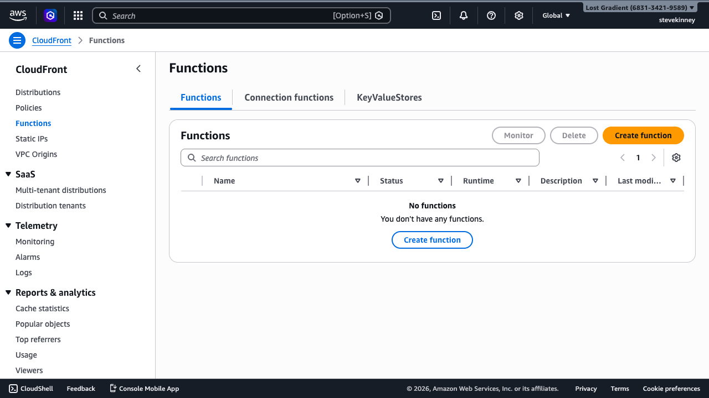
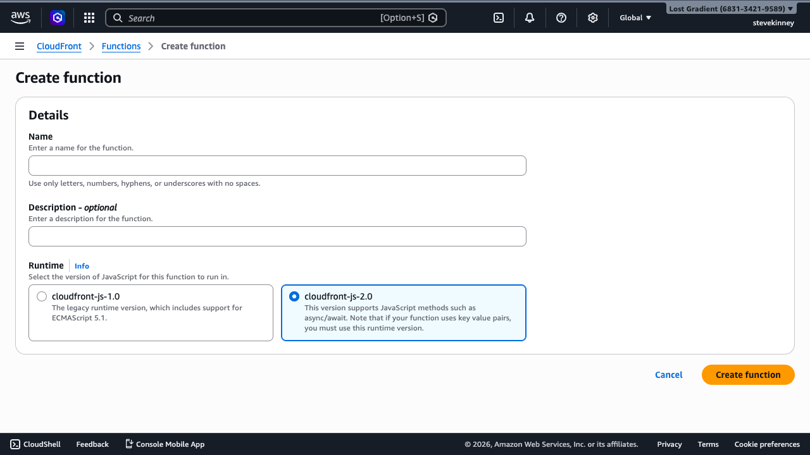
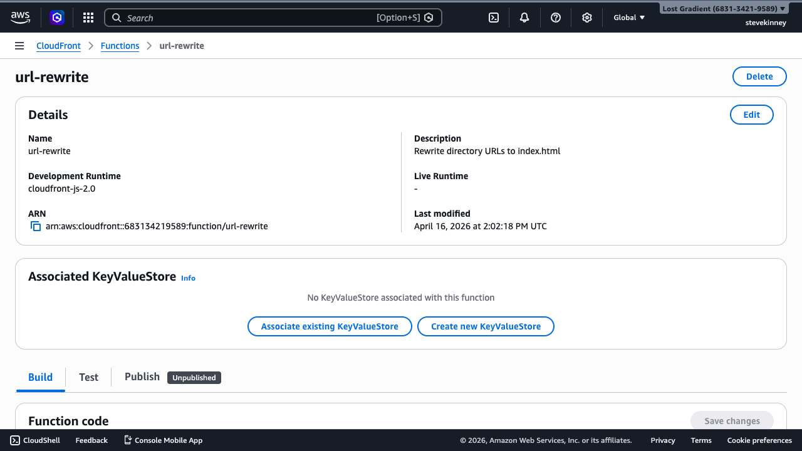

CloudFront Functions give you a way to run lightweight JavaScript at CloudFront's edge locations—all 200+ of them—on every single request. If you've ever written a `_redirects` file on Netlify or a `next.config.js` with redirects and rewrites, you already understand the use case. The difference is that you're writing actual code instead of configuration, which means you can handle dynamic logic that static config files can't.

If you want AWS's version of the runtime behavior while you read, the [CloudFront Functions guide](https://docs.aws.amazon.com/AmazonCloudFront/latest/DeveloperGuide/cloudfront-functions.html) is the official reference.

You already hit a version of this problem earlier. When you set up [Origin Access Control](origin-access-control-for-s3.md), your S3 bucket stopped being a website endpoint and became a private object store. S3 no longer resolves `/about/` to `/about/index.html`—it just looks for an object with the key `about/` and returns a 403 when it doesn't find one. The [custom error responses](custom-error-pages-and-spa-routing.md) you configured handle the SPA case (every missing path serves `index.html`), but they're a blunt instrument. A CloudFront Function gives you precise control: rewrite the URL before the cache check, so CloudFront requests the right object from S3 in the first place.

In this lesson, you'll write a CloudFront Function that does exactly that, test it, publish it, and associate it with your distribution.

## The Runtime Is Not Node.js

This is the single most important thing to internalize. The CloudFront Functions runtime is a purpose-built JavaScript engine. It's **not** Node.js. There's no `require()`, no `import`, no `Buffer`, no `process.env`, no `setTimeout`, no `fetch`. You get ECMAScript 5.1 with selected features from ES6 through ES12—things like `let`, `const`, arrow functions, template literals, destructuring, `String.prototype.includes()`, and `Array.prototype.find()`.

What you do **not** get:

- **No network access.** You can't make HTTP requests. Period.
- **No file system access.** There's no `fs` module.
- **No dynamic code evaluation.** No `eval()`, no `new Function()`.
- **No environment variables.** You can't read `process.env`.
- **No modules.** Everything must be in a single file, under 10 KB.

This feels restrictive, but the tradeoff is speed. CloudFront Functions execute in sub-millisecond time and can handle tens of millions of requests per second. The constraints are what make that possible.

> [!TIP]
> If you need any of the features listed above—network calls, npm packages, environment variables—you need Lambda@Edge instead. See [Lambda@Edge vs CloudFront Functions](edge-compute-comparison.md) for the full comparison.

## The Function Signature

Every CloudFront Function has the same structure:

```javascript
function handler(event) {
  var request = event.request;
  // Modify the request or generate a response
  return request;
}
```

That's it. One function named `handler`, one `event` argument, and you return either the modified request (to let CloudFront continue processing) or a response object (to short-circuit and respond immediately).

### The Event Object

The `event` object has this shape for a **viewer request** trigger:

```javascript
{
  version: '1.0',
  context: {
    distributionDomainName: 'd111111abcdef8.cloudfront.net',
    distributionId: 'E1A2B3C4D5E6F7',
    eventType: 'viewer-request',
    requestId: 'abcdef123456'
  },
  viewer: {
    ip: '203.0.113.1'
  },
  request: {
    method: 'GET',
    uri: '/about',
    querystring: {},
    headers: {
      host: { value: 'example.com' },
      accept: { value: 'text/html' }
    },
    cookies: {}
  }
}
```

A few things to notice:

- **`request.uri`** is the path, not the full URL. It starts with `/`.
- **Headers** are objects with a `value` property, not plain strings. To read the `Host` header, you access `event.request.headers.host.value`.
- **Query strings** are objects too. A request to `/search?q=hello` gives you `{ q: { value: 'hello' } }`.
- **Cookies** follow the same pattern: `{ session: { value: 'abc123' } }`.

### Returning a Request vs. a Response

If you return the `request` object (potentially modified), CloudFront continues processing the request—checking the cache, forwarding to the origin if needed, and so on.

If you return a **response** object, CloudFront sends that response directly to the viewer without ever touching the cache or origin:

```javascript
function handler(event) {
  return {
    statusCode: 301,
    statusDescription: 'Moved Permanently',
    headers: {
      location: { value: 'https://example.com/new-path' },
    },
  };
}
```

## Writing a URL Rewrite Function

> [!TIP]
> All CloudFront Functions from this lesson are available as standalone files in the [Scratch Lab repository](https://github.com/stevekinney/scratch-lab/tree/main/cloudfront/functions).

Here's the most common CloudFront Function you'll deploy: a URL rewrite that appends `index.html` to directory-style URLs. Your S3 bucket is behind OAC now—it's a private object store, not a website. When someone requests `/about/`, S3 looks for an object with the literal key `about/`, fails, and returns a 403. This function rewrites the URL before CloudFront even checks its cache, so S3 gets a request for `about/index.html` instead.

```javascript
function handler(event) {
  var request = event.request;
  var uri = request.uri;

  if (uri.endsWith('/')) {
    request.uri += 'index.html';
  } else if (!uri.includes('.')) {
    request.uri += '/index.html';
  }
  // [!note Requests like `/about` become `/about/index.html`. Requests for `/style.css` pass through unchanged.]

  return request;
}
```

Without this function, navigating directly to `/about` on your distribution returns a 403—there's no S3 object with the key `about`. Your custom error responses would catch the 403 and serve `index.html`, which works for SPAs but breaks multi-page static sites. The rewrite function solves it at the right layer: before the request ever reaches S3.

### SPA Variant: Rewriting to the Root

The function above works for multi-page static sites where every directory has its own `index.html`. But Scratch Lab—the app you [just deployed](deploying-scratch-lab.md)—is a single-page application. There's only one `index.html` at the root. Routes like `/notes/abc123` don't correspond to directories in S3 at all—the JavaScript router reads `window.location.pathname` and decides what to render.

For an SPA, the rewrite is different: anything that isn't a static file gets rewritten to the root `index.html`:

```javascript
function handler(event) {
  var request = event.request;
  var uri = request.uri;

  // Static assets (JS, CSS, images, fonts) pass through unchanged
  if (uri.includes('.')) {
    return request;
  }

  // Everything else serves the SPA shell
  request.uri = '/index.html';
  return request;
}
```

This is a fundamentally different operation from the multi-page rewrite. The multi-page version turns `/about` into `/about/index.html`—it assumes a directory structure with an HTML file at each path. The SPA version turns `/notes/abc123` into `/index.html`—it assumes a single entry point that handles all routing in JavaScript.

Your distribution already has custom error responses doing the same job: S3 returns a 403 for the missing path, CloudFront intercepts it, and serves `/index.html`. The CloudFront Function is cleaner because it rewrites the URL _before_ S3 ever sees it—no wasted round trip, no relying on error interception for normal routing. And as you'll see in [SPA Status Codes with Lambda@Edge](spa-status-codes-with-lambda-edge.md), it also opens the door to returning correct status codes for unknown paths.

> [!TIP]
> Which variant should you use? If your build output has HTML files in subdirectories (`about/index.html`, `blog/post/index.html`), use the multi-page rewrite. If your build output is a single `index.html` with a JavaScript router, use the SPA variant. Most React, Vue, and Svelte apps use the SPA pattern. Static site generators like Astro and Hugo use the multi-page pattern.

## Creating and Testing the Function

The steps below walk through the create → test → publish → associate workflow using the multi-page rewrite as the example. If you're deploying Scratch Lab (or any SPA), swap the function code for the SPA variant above—the workflow is identical.

### Creating a Function in the Console

Navigate to **CloudFront → Functions** in the left sidebar. You'll see the Functions list page.



Click **Create function**. The create form asks for three things: a **Name**, an optional **Description**, and the **Runtime** version. Use `cloudfront-js-2.0` (the default)—it supports modern JavaScript features including `async`/`await` and WebCrypto APIs.



After clicking **Create function**, you land on the function detail page. This page has three tabs: **Build**, **Test**, and **Publish**. The Build tab shows the code editor where you write or paste your function code.



Paste your function code into the editor and click **Save changes**. The editor starts with a skeleton handler—replace it entirely with your rewrite function.

The **Test** tab lets you build a test event and run it against the `DEVELOPMENT` stage of your function. Build a viewer request event with `uri` set to `/about`, then click **Test function**. You should see the output with `request.uri` changed to `/about/index.html`.

The **Publish** tab pushes your function from the `DEVELOPMENT` stage to `LIVE`. Until you publish, the function only runs in test mode. Click **Publish function** to make it available for association with a distribution.

### Creating a Function with the CLI

You can also create the function entirely from the command line. Save the function code to `url-rewrite.js`:

```javascript
function handler(event) {
  var request = event.request;
  var uri = request.uri;
  if (uri.endsWith('/')) {
    request.uri += 'index.html';
  } else if (!uri.includes('.')) {
    request.uri += '/index.html';
  }
  return request;
}
```

Then create the function using `fileb://` to pass the file contents:

```bash
aws cloudfront create-function \
  --name url-rewrite \
  --function-config '{"Comment":"Rewrite directory URLs to index.html","Runtime":"cloudfront-js-2.0"}' \
  --function-code fileb://url-rewrite.js \
  --region us-east-1 \
  --output json
```

The `cloudfront-js-2.0` runtime is the recommended choice for new functions. It supports a broader subset of modern JavaScript than `1.0`—including `async`/`await` syntax and a small set of Promise-based [WebCrypto APIs](https://docs.aws.amazon.com/AmazonCloudFront/latest/DeveloperGuide/functions-javascript-runtime-20.html) you can legitimately `await`. In practice, nearly every CloudFront Function use case is synchronous: URL rewrites, header manipulation, A/B routing. Write synchronous functions unless you specifically need WebCrypto for something like signed-cookie verification. The AWS docs describe the runtime as ECMAScript 5.1 with selected ES6–ES12 features, so check the [runtime features page](https://docs.aws.amazon.com/AmazonCloudFront/latest/DeveloperGuide/functions-javascript-runtime-20.html) before relying on any specific ES2020+ syntax.

The response includes an `ETag` value—save it. You need it for every subsequent operation on this function.

> [!WARNING]
> The `--region` flag doesn't control where the function runs. CloudFront Functions are global. The region flag tells the CLI which API endpoint to use, and CloudFront's API lives in `us-east-1`.

### Test the function

Before publishing, test the function against a sample event:

```bash
aws cloudfront test-function \
  --name url-rewrite \
  --if-match ETVPDKIKX0DER \
  --event-object '{"version":"1.0","context":{"eventType":"viewer-request"},"viewer":{"ip":"0.0.0.0"},"request":{"method":"GET","uri":"/about","querystring":{},"headers":{},"cookies":{}}}' \
  --stage DEVELOPMENT \
  --region us-east-1 \
  --output json
```

Replace `ETVPDKIKX0DER` with the `ETag` from the create step. The `--event-object` is a JSON representation of a viewer request event.

The response tells you whether the function succeeded and shows the output. You should see `request.uri` changed to `/about/index.html`.

### Publish the function

Testing happens on the `DEVELOPMENT` stage. To make the function available for association with a distribution, publish it to `LIVE`:

```bash
aws cloudfront publish-function \
  --name url-rewrite \
  --if-match ETVPDKIKX0DER \
  --region us-east-1 \
  --output json
```

This returns a new `ETag`—the live version's ETag. Save this one too.

## Associating with a CloudFront Behavior

A function that isn't associated with a **behavior** doesn't do anything. You need to update your CloudFront distribution to attach this function to a cache behavior—typically the default behavior (`*`).

You configured behaviors in [Cache Behaviors and Invalidations](cache-behaviors-and-invalidations.md). Now you're adding a function association to one of those behaviors.

```bash
aws cloudfront get-distribution-config \
  --id E1A2B3C4D5E6F7 \
  --region us-east-1 \
  --output json > dist-config.json
```

Edit `dist-config.json` and add a `FunctionAssociations` block inside the `DefaultCacheBehavior`:

```json
{
  "FunctionAssociations": {
    "Quantity": 1,
    "Items": [
      {
        "FunctionARN": "arn:aws:cloudfront::123456789012:function/url-rewrite",
        "EventType": "viewer-request"
      }
    ]
  }
}
```

Then update the distribution:

```bash
aws cloudfront update-distribution \
  --id E1A2B3C4D5E6F7 \
  --if-match ETAG_FROM_GET \
  --distribution-config file://dist-config.json \
  --region us-east-1 \
  --output json
```

> [!TIP]
> To find the function ARN, run `aws cloudfront list-functions --region us-east-1 --output json`. Each function in the response includes its `FunctionARN`.

## Updating an Existing Function

To change the function code, use `update-function`:

```bash
aws cloudfront update-function \
  --name url-rewrite \
  --if-match CURRENT_ETAG \
  --function-config '{"Comment":"Updated URL rewrite","Runtime":"cloudfront-js-2.0"}' \
  --function-code 'function handler(event) { /* updated code */ return event.request; }' \
  --region us-east-1 \
  --output json
```

After updating, you must **publish** again to push the changes to `LIVE`. The update only changes the `DEVELOPMENT` stage. This two-stage model lets you test changes before they affect production traffic.

## Common Patterns

### Redirecting www to the apex domain

If you set up a custom domain in the [DNS and Certificates](dns-for-frontend-engineers.md) section, you might have both `www.example.com` and `example.com` pointing at your distribution. This function canonicalizes traffic to the apex domain:

```javascript
function handler(event) {
  var request = event.request;
  var host = request.headers.host.value;

  if (host.startsWith('www.')) {
    return {
      statusCode: 301,
      statusDescription: 'Moved Permanently',
      headers: {
        location: { value: 'https://' + host.substring(4) + request.uri },
      },
    };
  }

  return request;
}
```

Without this, search engines treat `www.example.com/about` and `example.com/about` as two different pages. A 301 at the edge fixes that before anyone—crawler or human—sees the duplicate.

### Adding a trailing slash

If your static site generator creates directories like `about/index.html`, you want `/about` to redirect to `/about/` so relative asset paths resolve correctly:

```javascript
function handler(event) {
  var request = event.request;
  var uri = request.uri;

  if (!uri.endsWith('/') && !uri.includes('.')) {
    return {
      statusCode: 301,
      statusDescription: 'Moved Permanently',
      headers: {
        location: { value: uri + '/' },
      },
    };
  }

  return request;
}
```

You could combine this with the `index.html` rewrite from earlier—redirect `/about` to `/about/`, then rewrite `/about/` to `/about/index.html`—but putting both in one function is simpler and avoids the extra round trip.

These patterns are building blocks. In [Edge Function Use Cases](edge-function-use-cases.md), you'll see more examples including security headers, geolocation routing, and language detection.

## Gotchas

- **10 KB code size limit.** Your entire function, including comments, must fit in 10 KB. Minify aggressively if you're approaching the limit. If the pressure comes from embedded lookup data (redirect maps, feature flag tables, etc.), move that data to **CloudFront KeyValueStore** (KVS)—the function reads it at runtime via `cf.kvs()`, keeping the code small while the data scales independently.
- **No async APIs.** The `cloudfront-js-2.0` runtime parses `async`/`await` syntax without error, but there are no async APIs to call. Everything executes synchronously. Don't reach for `async` expecting it to do useful work.
- **Header names must be lowercase.** When you set or read headers, use lowercase names: `content-type`, not `Content-Type`.
- **The `ETag` dance.** Every create, update, and publish operation returns a new ETag, and the next operation requires the current ETag. I've lost track of these more times than I'd like to admit—if you do too, re-fetch with `describe-function`.
