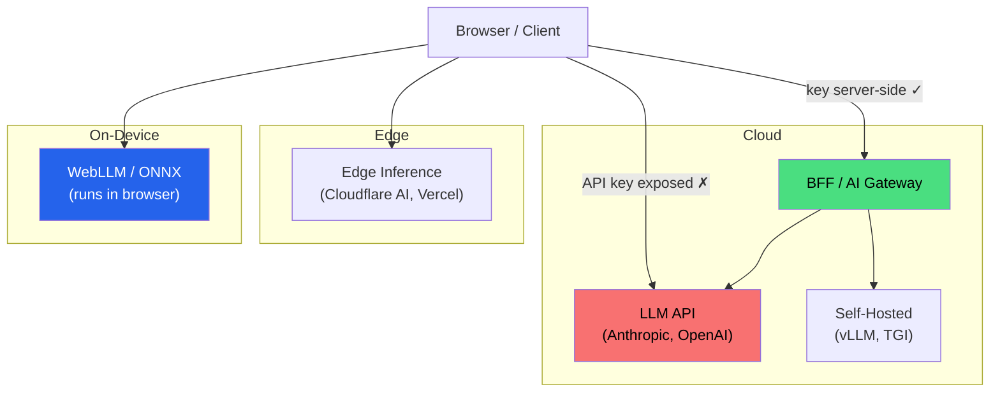
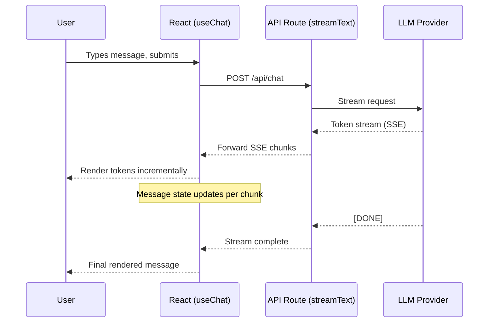
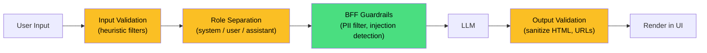
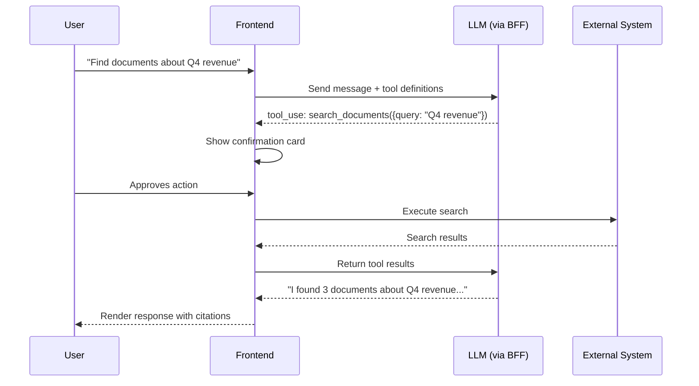
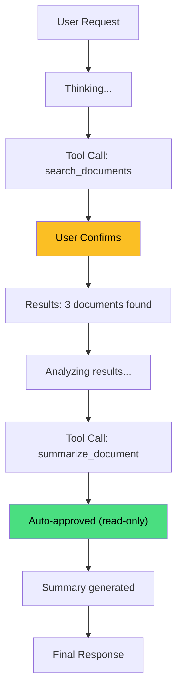
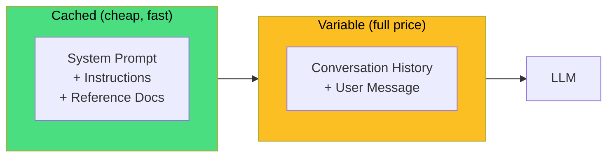
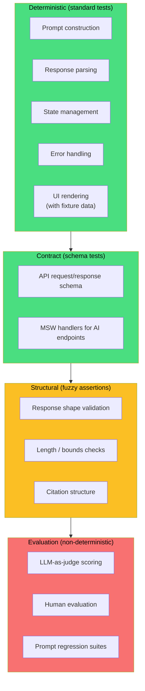

Adding an LLM-powered feature to a frontend application isn't like adding a new API integration. When you call a REST endpoint, you send a request, wait a predictable amount of time, and get back a deterministic response. When you call a language model, you send a prompt, wait _seconds_ (not milliseconds), and get back a stream of tokens that will be different every time—even for the same input. The response might be brilliant. It might be wrong. It might get filtered by a safety system halfway through generation. And it's going to cost you real money per token.

That combination—streaming delivery, non-deterministic output, high latency, and per-use cost—breaks assumptions baked into the request/response mental model that most frontend data fetching is built around. This isn't a complaint. It's an architectural reality that needs different patterns.

## Where Inference Lives

The first decision is where the AI processing happens relative to your frontend. This determines your latency profile, privacy guarantees, and cost model.



| Approach               | Latency              | Data privacy         | Cost model         | Good for                              |
| :--------------------- | :------------------- | :------------------- | :----------------- | :------------------------------------ |
| **Cloud API direct**   | High                 | Data leaves client   | Per-token          | Never do this—exposes API keys        |
| **BFF-proxied API**    | High (+ one hop)     | Server controls flow | Per-token + server | Most enterprise apps                  |
| **Self-hosted model**  | Medium               | Full control         | Infrastructure     | Regulated industries, sensitive data  |
| **Edge inference**     | Medium-Low           | Provider-dependent   | Per-request        | Content moderation, embeddings        |
| **On-device (WebLLM)** | Low after model load | Complete             | Zero marginal      | Autocomplete, classification, offline |

For most enterprise applications, the **BFF-proxied pattern** is the right default. It extends the [Backends for Frontends](backends-for-frontends.md) architecture into the AI domain—a server-side layer that holds API keys, enforces rate limits, filters PII, logs usage for compliance, and streams responses back to the client. The frontend never sees the API key. The server controls what goes in and what comes out.

```typescript
// Server-side BFF route — the frontend calls this, not the LLM API directly
export async function POST(request: Request) {
  const { prompt, context } = await request.json();
  const userId = await getAuthenticatedUser(request);

  // Server-side guardrails: PII filtering, rate limiting, prompt injection defense
  const sanitizedPrompt = await sanitizePrompt(prompt, userId);

  const response = await anthropic.messages.create({
    model: 'claude-sonnet-4-5-20250929',
    max_tokens: 1024,
    messages: [{ role: 'user', content: sanitizedPrompt }],
    stream: true,
  });

  return new Response(response.toReadableStream(), {
    headers: { 'Content-Type': 'text/event-stream' },
  });
}
```

The BFF isn't just a proxy. It's where you enforce everything the client can't be trusted with: authentication checks, per-user rate limits, cost budgets, audit logging, and the guardrails that keep someone from using your product's AI feature to generate content you'd rather it didn't.

### On-device inference

WebGPU and WebAssembly have made it feasible to run small language models directly in the browser. [WebLLM][1] uses machine learning compilers (MLC-LLM and Apache TVM) to run optimized inference kernels on the GPU, retaining [up to 80% of native performance][2] on the same hardware. With Firefox shipping WebGPU on Windows and Safari preparing support, 2025–2026 is the first window where you can target GPU compute across all major browsers.

The tradeoffs are real, though. Model download sizes range from hundreds of megabytes to several gigabytes. The quality gap between a 1B-parameter on-device model and Claude or GPT-4 is enormous. And WebGPU support is still uneven enough that you need a fallback path.

On-device inference is a _complement_ to cloud-based inference, not a replacement. Use it for latency-sensitive tasks where quality requirements are modest—autocomplete, local classification, or routing decisions that determine whether a query needs a full cloud LLM call.

## Streaming UI Patterns

The most distinctive frontend challenge is handling streaming responses. Text arrives token by token over seconds. That doesn't fit the "fetch data, render result" model that React Query, SWR, and every other data-fetching library assumes.

### The transport layer

The standard transport for LLM streaming is **Server-Sent Events** (SSE)—a unidirectional stream from server to client over HTTP. The server sends chunks as `data:` lines, and the client processes them incrementally:

```typescript
async function streamCompletion(prompt: string, onToken: (token: string) => void) {
  const response = await fetch('/api/ai/complete', {
    method: 'POST',
    headers: { 'Content-Type': 'application/json' },
    body: JSON.stringify({ prompt }),
  });

  const reader = response.body!.getReader();
  const decoder = new TextDecoder();

  while (true) {
    const { done, value } = await reader.read();
    if (done) break;

    const chunk = decoder.decode(value);
    const lines = chunk.split('\n').filter((line) => line.startsWith('data: '));

    for (const line of lines) {
      const data = JSON.parse(line.slice(6));
      if (data.type === 'content_block_delta') {
        onToken(data.delta.text);
      }
    }
  }
}
```

You _can_ write this yourself, but you probably shouldn't. The [Vercel AI SDK][3] has established a de facto standard for LLM streaming in React applications. Its `useChat` hook handles the SSE parsing, message state management, loading states, error handling, and cancellation:

```typescript
import { useChat } from 'ai/react';

function ChatInterface() {
  const { messages, input, handleInputChange, handleSubmit, isLoading, error } = useChat({
    api: '/api/chat',
    onError: (error) => {
      reportToObservability('ai_chat_error', { error: error.message });
    },
  });

  return (
    <div>
      {messages.map((m) => (
        <Message key={m.id} role={m.role} content={m.content} />
      ))}
      {isLoading && <StreamingIndicator />}
      <form onSubmit={handleSubmit}>
        <input value={input} onChange={handleInputChange} />
      </form>
    </div>
  );
}
```

The AI SDK's architecture follows a clean flow:



### State management for streaming

Streaming introduces state management challenges that don't exist in request/response systems:

- **Partial state.** The response is incomplete during streaming. Components must render partial content without layout shift or empty container flashes.
- **Optimistic rendering.** The user's message appears immediately. The AI response streams in. This is a variant of optimistic updates, but "confirmation" arrives one token at a time.
- **Cancellation.** Users need to cancel generation mid-stream. That means aborting the fetch, cleaning up partial state, and signaling the backend to stop (so you stop paying for tokens nobody will read).
- **Retry versus regeneration.** "Retry" with a deterministic API means "try again and get the same answer." With an LLM, retry means regeneration—the response _will_ be different. The UI should make this distinction clear.
- **Conversation history.** Chat interfaces accumulate message history that may need to persist across navigations or sessions. That's URL-driven state or server-side persistence, not ephemeral component state.

A state machine captures these states cleanly:

```typescript
type AIResponseState =
  | { status: 'idle' }
  | { status: 'pending'; abortController: AbortController }
  | { status: 'streaming'; content: string; abortController: AbortController }
  | { status: 'complete'; content: string; metadata: ResponseMetadata }
  | { status: 'error'; error: AIError; partialContent?: string }
  | { status: 'cancelled'; partialContent: string };
```

### Rendering performance

Updating the DOM on every token (~50ms intervals) can cause jank, especially with Markdown rendering. A few things to keep in mind:

- **Batch updates.** Accumulate tokens and flush to the DOM on `requestAnimationFrame` boundaries instead of on every SSE event.
- **Incremental Markdown.** Libraries like `react-markdown` re-parse the full content string on every update. For long responses, this gets expensive. Debounce the Markdown render or virtualize long responses.
- **Layout stability.** Reserve space for the streaming response with `min-height` or a growing placeholder. The "streaming text pushes everything below it down the page" experience is miserable.

## Prompt Management

In enterprise applications, prompts are not ad-hoc strings concatenated in a component. They're versioned, tested, reviewed artifacts that directly affect product behavior—as much as any API contract or database schema.

### Prompts as configuration

Treat prompts with the same rigor as application configuration. Separate the template from the application code. Version the templates. Test them against known inputs.

```typescript
interface PromptTemplate {
  id: string;
  version: string;
  template: string;
  variables: Record<string, PromptVariable>;
  model: string;
  maxTokens: number;
  temperature: number;
  systemMessage?: string;
  guardrails: GuardrailConfig;
}

// Fetched from a prompt registry, not hardcoded in a component
const summaryPrompt = await promptRegistry.get('document-summary', {
  version: 'latest',
  variables: {
    document: documentText,
    audience: userRole,
    maxLength: '500 words',
  },
});
```

This separation buys you three things. You can **A/B test** prompt versions by routing users to different templates and measuring output quality. You can **roll back** a prompt change that degrades quality via feature flags, without a code deploy. And you can run **prompt CI**—automated evaluation suites that test a prompt against curated inputs whenever someone modifies it.

Prompt CI isn't traditional unit testing. The outputs are non-deterministic, so you evaluate them with LLM-as-judge scoring, structural assertions, or human evaluation—not exact string matching. More on testing below.

### Prompt injection

Prompt injection is the XSS of the AI era. User input manipulates the model's behavior by overriding system instructions. The [OWASP Top 10 for LLM Applications][4] ranks it as the #1 vulnerability, and for good reason—it's inherent to how language models process input. There is no complete defense, only layers of mitigation.



The OWASP guidance distinguishes **direct injection** (the user types "ignore previous instructions") from **indirect injection** (the model processes a document that contains hidden instructions). Both are real attack vectors.

Frontend defenses include input validation (flag common injection patterns), strict role separation in the message format (system, user, assistant), and output sanitization before rendering. But the critical enforcement layer is the BFF. The server should enforce guardrails regardless of what the client sends. Never trust client-side validation for security—that lesson is older than LLMs.

## Tool Use and Agentic Patterns

Modern LLM APIs support **tool use** (sometimes called function calling), where the model can request that your application invoke predefined functions on its behalf. This is how you build interfaces where the AI doesn't just _say_ things—it _does_ things.



The critical pattern here is **human-in-the-loop confirmation**. When the model decides to use a tool that has side effects—creating a ticket, sending a message, modifying data—the frontend renders a confirmation card showing what action will be taken, with what parameters. The user approves, modifies, or rejects. Only on approval does the frontend execute the tool call.

```typescript
const tools = [
  {
    name: 'search_documents',
    description: 'Search the knowledge base for relevant documents',
    input_schema: {
      type: 'object',
      properties: {
        query: { type: 'string', description: 'Search query' },
        filters: {
          type: 'object',
          properties: {
            dateRange: { type: 'string' },
            department: { type: 'string' },
          },
        },
      },
      required: ['query'],
    },
  },
  {
    name: 'create_ticket',
    description: 'Create a support ticket in the ticketing system',
    input_schema: {
      type: 'object',
      properties: {
        title: { type: 'string' },
        description: { type: 'string' },
        priority: { type: 'string', enum: ['low', 'medium', 'high', 'critical'] },
      },
      required: ['title', 'description'],
    },
  },
];
```

This isn't optional for enterprise applications. Unreviewed AI actions in a billing system, a compliance workflow, or an HR tool create the kind of liability that makes legal teams lose sleep. The authorization model should extend to AI-initiated actions—the model should only be able to invoke tools that the _current user_ is authorized to use.

### Multi-step agent workflows

Complex agent workflows involve multiple sequential tool calls, where the output of one call informs the next. The frontend should render this as a transparent, auditable sequence:



Read-only tools (search, summarize, analyze) can often be auto-approved. Write tools (create, update, delete, send) should always require confirmation. Show each step with its inputs and outputs so the user can audit the reasoning chain—that transparency is what makes the difference between "the AI did something" and "the AI did something I understand and can verify."

## RAG in the Frontend

**Retrieval-Augmented Generation** grounds LLM responses in specific documents rather than the model's general training data. The retrieval and generation happen server-side, but the frontend has significant responsibilities around how that grounded content gets presented.

### Citation and source attribution

Enterprise RAG must provide source attribution. In regulated industries—legal, healthcare, finance—this isn't a UX nicety, it's a compliance requirement. Users need to verify _where_ the AI's answer came from.

```typescript
interface RAGResponse {
  content: string;
  citations: Citation[];
  confidence: number;
  metadata: {
    model: string;
    promptVersion: string;
    retrievedDocuments: number;
    generationTimeMs: number;
  };
}

interface Citation {
  id: string;
  sourceDocument: string;
  sourceUrl?: string;
  relevantPassage: string;
  pageNumber?: number;
  confidence: number;
}
```

Render citations inline—numbered references that link to a source panel where users can see the original passage. The source panel should show the relevant excerpt highlighted within its broader context, not just the extracted snippet. That context is what lets users judge whether the AI's interpretation of the source is reasonable.

### Context window management

The LLM's context window is a finite resource, and enterprise RAG systems can easily exceed it. The frontend should surface this constraint rather than hiding it:

- **Context indicators.** Show what documents and conversation history are included in the model's context. Users should know what the AI "knows" for a given query.
- **Conversation pruning.** Long conversations will exceed context limits. When older messages get dropped or summarized, tell the user. Don't silently lose context and produce a confusing response.
- **User-controlled context.** Let users explicitly include or exclude documents from the AI's working set for a given query.

## Observability for AI Features

AI features need observability infrastructure that extends what we covered in [Observability](observability.md), because the failure modes and cost dynamics are fundamentally different.

### AI-specific metrics

| Metric                           | What it tells you                                                 |
| :------------------------------- | :---------------------------------------------------------------- |
| **Time to first token**          | Perceived responsiveness—how long until the user sees _something_ |
| **Tokens per second**            | Streaming throughput, affects reading experience                  |
| **Total generation time**        | Whether users are waiting too long                                |
| **Token usage (input + output)** | Cost tracking and budget enforcement                              |
| **Error rate by type**           | Rate limits, timeouts, content filters, model errors              |
| **Regeneration rate**            | How often users ask for a different answer (quality signal)       |
| **Citation accuracy**            | Whether RAG citations map to real sources (RAG quality signal)    |
| **User feedback**                | Thumbs up/down, flags, free-text (product quality signal)         |

### Cost tracking

LLM API costs scale directly with usage. If you don't track per-request costs, you'll find out about your spending problem from the finance team, not from your dashboards.

```typescript
interface AIRequestMetrics {
  requestId: string;
  userId: string;
  feature: string;
  model: string;
  inputTokens: number;
  outputTokens: number;
  estimatedCost: number;
  latencyMs: number;
  cached: boolean;
  timestamp: Date;
}
```

Track cost per user (for rate limiting), per feature (for budgeting), and per model (for optimization decisions). When you can see that one feature burns 60% of your AI budget, the "should we use a cheaper model for this?" conversation gets concrete fast.

### Prompt caching

[Anthropic's prompt caching][5] reuses previously processed prompt prefixes to reduce both cost and latency. Cached reads cost 90% less than fresh input tokens, and latency can drop by up to 85% for long prompts—the Anthropic docs show a 100K-token prompt going from 11.5 seconds to 2.4 seconds with caching.

The frontend implication: structure prompts to maximize cache hit rates. Place stable content (system prompt, instructions, reference documents) _before_ variable content (user input, conversation turns). The cache matches from the beginning of the prompt, so anything stable that comes first gets reused.



## Error Handling for Non-Deterministic Systems

Traditional error handling assumes determinism: same input, same output. An error means something is broken. AI systems violate this assumption, and the error taxonomy is different.

| Error type              | What the user should see                      | Recovery strategy                                 |
| :---------------------- | :-------------------------------------------- | :------------------------------------------------ |
| **Rate limited**        | "Please wait a moment"                        | Auto-retry with backoff, queue position indicator |
| **Context too long**    | "Conversation is getting long—starting fresh" | Auto-summarize, let user control pruning          |
| **Content filtered**    | "I can't help with that request"              | Suggest rephrasing, offer alternative approaches  |
| **Model timeout**       | "Response took too long"                      | Retry with shorter `max_tokens` or a faster model |
| **Partial failure**     | Show partial content + error indicator        | Let user continue from partial result             |
| **Service unavailable** | Graceful degradation to non-AI fallback       | Feature flags to disable AI features entirely     |

That last row is the most important architectural principle: **every AI-powered feature should have a non-AI fallback.** If the LLM provider goes down, your search should fall back to keyword search. Your writing assistant should degrade to a plain text editor. Your smart form should still be a form.

```typescript
function SearchBar() {
  const aiEnabled = useFeatureFlag('ai-semantic-search');

  if (aiEnabled) {
    return <AISemanticSearch fallback={<KeywordSearch />} />;
  }
  return <KeywordSearch />;
}

function AISemanticSearch({ fallback }: { fallback: React.ReactNode }) {
  const { results, error, isLoading } = useAISearch();

  if (error?.type === 'service_unavailable') {
    reportDegradation('ai_search', error);
    return fallback;
  }

  return <SearchResults results={results} isLoading={isLoading} />;
}
```

## AI-Specific UX Patterns

### Transparency and trust

Enterprise users need to understand AI outputs before they act on them. This is the difference between a consumer chatbot and an enterprise tool—in a consumer product, a plausible-sounding answer might be fine. In an enterprise product, a plausible-sounding _wrong_ answer can cause real damage.

- **Confidence indicators.** Visual cues—color, percentage, language—that communicate how confident the model is. Not all LLM providers expose calibrated confidence scores, but when they do, surface them.
- **Reasoning visibility.** A "show your work" toggle that displays the model's chain-of-thought or retrieved sources. This builds trust and helps users evaluate the output.
- **Model attribution.** Label AI-generated content as AI-generated. Some jurisdictions require this. Even where they don't, it sets the right expectations.
- **Edit affordances.** Position AI output as a draft, not a verdict. Make it editable by default. The AI is a starting point, not a final answer.

### Loading states

AI latency is measured in seconds, not milliseconds. A generic spinner doesn't cut it.

- **Thinking indicators.** "Analyzing your documents..." or "Searching the knowledge base..." communicates _what_ the model is doing, not just _that_ it's doing something.
- **Streaming skeleton.** Before the first token arrives, show a skeleton or placeholder that indicates where content will appear.
- **Progressive disclosure.** Render content as it streams. Never buffer the entire response and show it all at once—that wastes the streaming architecture and makes the user wait for no reason.
- **Time estimation.** For known-slow operations (large document analysis, multi-step agent workflows), show estimated time remaining.

### Conversation context

For chat-style interfaces, the user needs to understand what the AI "knows":

- Show what documents or context the AI has access to for this conversation.
- Make session boundaries clear—is this a fresh conversation or a continuation?
- If AI is used across multiple features (chat, search, writing), clarify whether context is shared between them.

## Testing AI Features

Non-deterministic outputs mean you can't test AI features the way you test a form submission. The [testing strategy](testing-at-scale.md) needs adaptation.

The practical approach is a layered stack:



Test everything _around_ the model output deterministically—prompt construction, response parsing, state machine transitions, error handling, UI rendering with known fixture data. Use [MSW](mock-service-worker.md) to mock the AI endpoints with recorded responses for integration tests. For the non-deterministic outputs themselves, use structural assertions:

```typescript
describe('AI Document Summary', () => {
  it('returns a summary with expected structure', async () => {
    const result = await generateSummary(testDocument);

    // Structural assertions — not exact content
    expect(result.summary).toBeTruthy();
    expect(result.summary.length).toBeGreaterThan(50);
    expect(result.summary.length).toBeLessThan(1000);
    expect(result.citations).toBeInstanceOf(Array);
    expect(result.citations.length).toBeGreaterThan(0);
    expect(result.citations[0]).toHaveProperty('sourceDocument');
    expect(result.confidence).toBeGreaterThan(0);
    expect(result.confidence).toBeLessThanOrEqual(1);
  });
});
```

For prompt quality evaluation, run automated suites that score outputs using LLM-as-judge or human evaluation whenever a prompt template changes. This is closer to QA than traditional testing, and it belongs in the prompt CI pipeline, not in your unit test suite.

## Accessibility for AI Interfaces

AI-powered interfaces introduce specific accessibility concerns:

- **Screen reader announcements for streaming content.** Use `aria-live="polite"` regions for streaming responses. `aria-live="assertive"` would interrupt the user on every token—which is roughly once per 50 milliseconds. That's not assistive technology. That's a denial-of-service attack on someone's screen reader.
- **Keyboard navigation.** Chat inputs, message history, action buttons, confirmation cards, and citation panels must be fully keyboard-navigable.
- **Alternative modalities.** If the AI generates a visualization or diagram, it should also generate alt text. If it generates a code block, ensure it's in a labeled, navigable region.
- **Cognitive load.** AI responses can be long and dense. Provide mechanisms to collapse, summarize, or chunk responses. A 2,000-word AI response is not more useful than a 200-word one if the user can't find the relevant part.

## Data Privacy and Compliance

Enterprise applications need explicit policies for what user data flows through AI models.

- **PII detection and redaction.** Before sending user input to an LLM, detect and redact personally identifiable information unless processing PII is explicitly part of the feature. The BFF is the right place for this—not the client.
- **Data residency.** Some providers process data in specific regions. Enterprise compliance may require data to stay within certain jurisdictions.
- **Training data opt-out.** Most enterprise API agreements allow opting out of having your data used for model training. Verify this is configured. Then verify it's actually configured, because "I think we opted out" is not a compliance posture.
- **Audit logging.** Every AI interaction—prompt, response, user, timestamp, model version, cost—should be logged for compliance audit trails. The BFF captures this naturally as part of the request lifecycle.

## The Architectural Summary

AI integration touches almost every layer of a frontend architecture. The [BFF pattern](backends-for-frontends.md) becomes the AI gateway. State management needs to handle streaming and partial state. [Observability](observability.md) needs AI-specific metrics and cost tracking. The [testing strategy](testing-at-scale.md) needs non-deterministic evaluation. Security needs prompt injection defense. And the design system needs new components—chat bubbles, confidence indicators, citation cards, streaming containers, confirmation dialogs for tool use—that don't exist in most component libraries yet.

The guiding principles:

- **Stream everything.** Never make users wait for full generation when you can show tokens as they arrive.
- **Proxy through a BFF.** Keep API keys, guardrails, rate limits, and audit logs server-side.
- **Degrade gracefully.** Every AI feature needs a non-AI fallback.
- **Make AI transparent.** Users must understand what the AI knows, how confident it is, and where its answers come from.
- **Treat prompts as versioned configuration.** Not as ad-hoc strings concatenated in application code.

[1]: https://webllm.mlc.ai/ 'WebLLM — High-Performance In-Browser LLM Inference'
[2]: https://arxiv.org/abs/2412.15803 'WebLLM: A High-Performance In-Browser LLM Inference Engine'
[3]: https://ai-sdk.dev/docs/introduction 'AI SDK by Vercel'
[4]: https://genai.owasp.org/llmrisk/llm01-prompt-injection/ 'LLM01:2025 Prompt Injection - OWASP'
[5]: https://platform.claude.com/docs/en/build-with-claude/prompt-caching 'Prompt Caching - Claude API Docs'

---

## TL;DR

### Where Inference Lives

> The first decision: where does the AI processing happen?

| Approach               | Latency        | Data privacy       | Good for                     |
| ---------------------- | -------------- | ------------------ | ---------------------------- |
| **Cloud API direct**   | High           | Key exposed ✗      | Never do this                |
| **BFF-proxied API**    | High + 1 hop   | Server controls ✓  | Most enterprise apps         |
| **Self-hosted model**  | Medium         | Full control       | Regulated industries         |
| **Edge inference**     | Medium-Low     | Provider-dependent | Moderation, embeddings       |
| **On-device (WebLLM)** | Low after load | Complete           | Autocomplete, classification |

**Default:** BFF-proxied. The BFF holds API keys, enforces rate limits, filters PII, logs for compliance, and streams responses to the client.

---

### Streaming UI Patterns

> LLM responses arrive token by token. That changes everything.

- **Transport:** Server-Sent Events (SSE) — unidirectional stream over HTTP.
- **State machine:** `idle → pending → streaming → complete | error | cancelled`
- **Partial state:** The response is incomplete during streaming. Render it anyway.
- **Cancellation:** Users need to stop generation mid-stream. Abort the fetch, clean up state, stop paying for tokens.

**Use the Vercel AI SDK** (`useChat`, `useCompletion`) — it handles SSE parsing, message state, loading, errors, and cancellation.

---

### Prompt Management

> Prompts are versioned, tested, reviewed artifacts — not ad-hoc strings.

- Separate prompt templates from application code.
- Fetch from a prompt registry, not hardcoded in components.
- **A/B test** prompt versions by routing users to different templates.
- **Roll back** bad prompts via feature flags, without a code deploy.
- **Prompt CI** — automated evaluation suites that test prompts against curated inputs.

**Prompt injection is the XSS of the AI era.**

- Input validation (flag injection patterns)
- Role separation (system / user / assistant)
- Output sanitization before rendering
- BFF enforces guardrails regardless of client input

---

### Tool Use and Agentic Patterns

> The AI doesn't just say things — it does things.

```
User → "Find docs about Q4 revenue"
LLM  → tool_use: search_documents({query: "Q4 revenue"})
UI   → Shows confirmation card
User → Approves
App  → Executes search, returns results to LLM
LLM  → "I found 3 documents..."
```

- **Human-in-the-loop:** Write tools (create, update, delete) always require user confirmation.
- **Read-only tools** (search, summarize) can be auto-approved.
- **Authorization extends to AI actions** — the model can only invoke tools the current user is authorized to use.
- Show each step with inputs and outputs — transparency builds trust.

---

### RAG and Citation UI

> Retrieval-Augmented Generation grounds answers in your documents.

- Render citations inline — numbered references linking to a source panel.
- Source panel shows the relevant excerpt highlighted in broader context.
- Enterprise RAG in regulated industries: citation is a compliance requirement, not a UX nicety.

**Context window management:**

- Show what documents the AI "knows" for this query.
- When conversation history gets pruned, tell the user.
- Let users include/exclude documents from the AI's working set.

---

### Graceful Degradation for AI

> Every AI feature needs a non-AI fallback.

| Error type          | User sees              | Recovery                |
| ------------------- | ---------------------- | ----------------------- |
| Rate limited        | "Please wait"          | Auto-retry with backoff |
| Context too long    | "Starting fresh"       | Auto-summarize history  |
| Content filtered    | "Can't help with that" | Suggest rephrasing      |
| Service unavailable | Non-AI fallback        | Feature flag to disable |

- AI search degrades to keyword search.
- Writing assistant degrades to plain text editor.
- Smart form is still a form.
- **Feature flags** to disable AI features entirely when the provider is down.

---

### AI-Specific Observability

> Different failure modes, different metrics.

| Metric                 | Why it matters           |
| ---------------------- | ------------------------ |
| Time to first token    | Perceived responsiveness |
| Tokens per second      | Streaming throughput     |
| Token usage (in + out) | **Cost tracking**        |
| Regeneration rate      | Quality signal           |
| Citation accuracy      | RAG quality              |

- Track cost per user, per feature, per model.
- **Prompt caching** (Anthropic): cached reads cost 90% less. Place stable content before variable content in prompts.
- Audit log every AI interaction: prompt, response, user, model version, cost.
