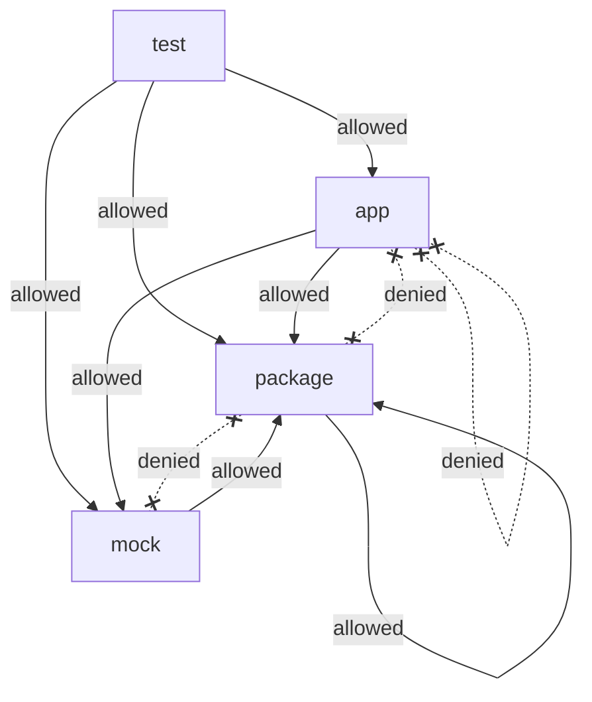
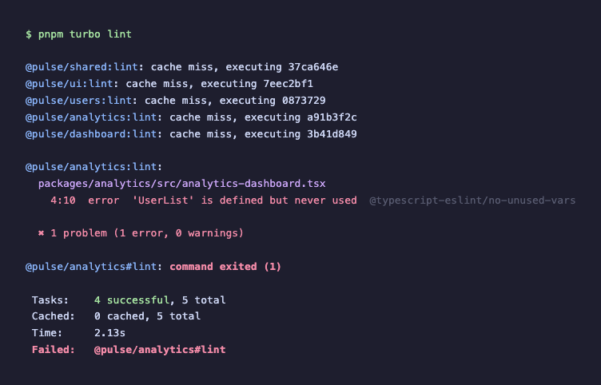

## What You're Doing

Nothing currently stops `packages/analytics` from importing the internal `UserList` component directly from `@pulse/users/src/user-list`, bypassing the package's public API. Nothing stops the `@pulse/ui` package from importing application-level code from `apps/dashboard`. These violations compile fine and pass all existing checks. You're going to configure `eslint-plugin-boundaries` to encode the intended dependency graph as lint rules so these violations are caught automatically.

## Why It Matters

In a monorepo, the package dependency graph is your architecture. Packages at the bottom (like `@pulse/shared`) should never import from packages above them (like `apps/dashboard`). Feature packages shouldn't reach into each other's internals. But without enforcement, developers take shortcuts — a quick internal import here, a circular dependency there — and the architecture erodes. `eslint-plugin-boundaries` turns architectural intent into automated checks that run on every save, every commit, and every CI run.

## Prerequisites

- Node.js 20+
- pnpm 9+

## Setup

You should be continuing from where Exercise 5 left off. If you need to catch up:

```bash
git checkout 05-linting-start
pnpm install
```

## Demonstrate the Problem

Before adding any rules, prove that the architecture can be violated without consequence.

Open `packages/analytics/src/analytics-dashboard.tsx` and add this import at the top:

```typescript title="packages/analytics/src/analytics-dashboard.tsx"
import { UserList } from '@pulse/users/src/user-list';
```

Save the file. TypeScript may or may not complain depending on whether you completed Exercise 5 (TypeScript References). If you added project references, TypeScript will reject this import because `@pulse/users` is not in `@pulse/analytics`'s references. If you didn't, the import resolves through the workspace. Either way, continue — the point is that _the linter_ has no opinion about this import.

Run the linter:

```bash
pnpm turbo lint
```

> [!NOTE]
> You will see a `@typescript-eslint/no-unused-vars` error because the imported symbol is never used — this comes from TypeScript ESLint's recommended rules, not from `eslint-plugin-boundaries`. There are **no boundaries errors**. That is the point: ESLint currently has no opinion about cross-package architectural violations. Ignore the unused-vars error for now; you'll remove the import shortly.

Now try an even worse violation. Open `packages/shared/src/api-client.ts` and add:

```typescript title="packages/shared/src/api-client.ts"
import { AnalyticsDashboard } from '@pulse/analytics';
```

This creates a circular dependency — `@pulse/shared` is importing from `@pulse/analytics`, which itself depends on `@pulse/shared`. TypeScript doesn't catch this because workspace resolution handles it. The build might even succeed depending on evaluation order. But it's architecturally wrong.

> [!NOTE] Circular dependencies
> First, initialization order becomes unpredictable: when module A imports module B and module B imports module A, one of them will see an incomplete (partially initialized) version of the other at import time, leading to subtle `undefined` errors that only manifest at runtime and depend on which module the bundler happens to evaluate first. Second, bundlers struggle to tree-shake circular dependency graphs because they cannot determine which exports are truly unused — if A references B and B references A, removing either one might break the other, so the bundler conservatively keeps everything, inflating bundle size. Third, circular dependencies make the system harder to reason about: you cannot understand module A without understanding module B, and vice versa, which means every change to either module requires reasoning about both. In a monorepo, a circular dependency between packages is especially dangerous because it defeats the purpose of having separate packages in the first place — they are no longer independently understandable or deployable.

Remove both imports. You're about to make the linter catch them.

> [!NOTE] Why TypeScript doesn't catch architectural violations
> TypeScript's job is type correctness, not architectural correctness. If a file exists and exports a type-compatible value, TypeScript considers the import valid. It doesn't know or care that `@pulse/shared` shouldn't import from `@pulse/analytics` — that's an architectural constraint, not a type constraint. This is why you need a separate tool (ESLint with boundaries) to enforce the dependency graph.

### Checkpoint

You've confirmed that cross-package internal imports and circular dependencies compile and lint without errors. The architecture is unenforced.

## The Allowed Dependency Graph

The boundary rules encode a directed graph of allowed imports. Element types define categories of code, and rules define which types can import from which. Arrows represent allowed import directions — anything not shown is denied by default.



## Configure Element Types

Open the root `eslint.config.js`. It should have basic ESLint configuration but no boundaries rules. You're going to add the boundaries plugin and define the element types that make up your architecture.

Import the boundaries plugin at the top of `eslint.config.js`:

```javascript title="eslint.config.js"
import boundaries from 'eslint-plugin-boundaries';
```

Add a configuration object to `eslint.config.js` with the plugin and element type settings:

```javascript title="eslint.config.js"
export default [
  // ... existing config entries (keep these in place)
  {
    plugins: {
      boundaries,
    },
    settings: {
      'boundaries/elements': [
        { type: 'app', pattern: 'apps/*' },
        { type: 'package', pattern: 'packages/*' },
        { type: 'mock', pattern: 'mocks' },
        { type: 'test', pattern: 'tests/*' },
      ],
      // [!note Element types define the architectural vocabulary for your boundary rules.]
      'boundaries/ignore': ['**/*.test.*', '**/*.spec.*'],
    },
  },
];
```

Then add the import resolver configuration to the same object in `eslint.config.js` so the boundaries plugin can map `@pulse/analytics` to `packages/analytics`. Without this, the plugin can't determine which element type an import belongs to and silently skips enforcement:

```javascript title="eslint.config.js"
{
  plugins: {
    boundaries,
  },
  settings: {
    "import/resolver": {
      typescript: {
        project: "./tsconfig.base.json",
      },
    },
    // [!note The resolver maps @pulse/analytics to packages/analytics so boundaries can classify imports.]
    "boundaries/elements": [
      { type: "app", pattern: "apps/*" },
      { type: "package", pattern: "packages/*" },
      { type: "mock", pattern: "mocks" },
      { type: "test", pattern: "tests/*" },
    ],
    "boundaries/ignore": ["**/*.test.*", "**/*.spec.*"],
  },
}
```

> [!IMPORTANT] The import resolver is required
> The `eslint-import-resolver-typescript` package resolves workspace package specifiers like `@pulse/analytics` to their actual file paths (e.g., `packages/analytics/src/index.ts`). Without it, the boundaries plugin sees an import from `@pulse/analytics` but can't map it to the `packages/*` element type, so it skips the check entirely. This is a silent failure — you'll think boundaries are enforced when they're not.

> [!NOTE] What element types represent
> Each entry in `boundaries/elements` defines a category of code in your repository. The `pattern` is a glob that matches directory paths — `apps/*` matches `apps/dashboard` and `apps/legacy`, classifying them as type `"app"`. The `packages/*` pattern matches `packages/analytics`, `packages/ui`, etc., classifying them as type `"package"`. These types are the vocabulary you use in the boundary rules: "an app can import from a package" or "a package cannot import from an app."

> [!NOTE] Why ignore test files
> The `boundaries/ignore` setting excludes test files from boundary enforcement. Tests often need to import from multiple layers — a test for `@pulse/analytics` might import MSW handlers from `mocks/` and fixtures from `tests/`. Enforcing production-time boundaries on test code would create friction without meaningful architectural benefit.

## Define Allowed Dependencies

Add the `boundaries/element-types` rule to the same configuration object in `eslint.config.js` to define which element types are allowed to import from which:

```javascript title="eslint.config.js" {19-31}
{
  plugins: {
    boundaries,
  },
  settings: {
    "import/resolver": {
      typescript: {
        project: "./tsconfig.base.json",
      },
    },
    "boundaries/elements": [
      { type: "app", pattern: "apps/*" },
      { type: "package", pattern: "packages/*" },
      { type: "mock", pattern: "mocks" },
      { type: "test", pattern: "tests/*" },
    ],
    "boundaries/ignore": ["**/*.test.*", "**/*.spec.*"],
  },
  rules: {
    "boundaries/element-types": [
      "error",
      {
        default: "disallow",
        // [!note Deny by default — only explicitly allowed imports pass.]
        rules: [
          { from: "app", allow: ["package", "mock"] },
          { from: "package", allow: ["package"] },
          { from: "test", allow: ["app", "package", "mock"] },
          { from: "mock", allow: ["package"] },
        ],
      },
    ],
  },
}
```

### What Each Rule Means

- **`default: "disallow"`**: If no rule explicitly allows an import, it's an error. This is deny-by-default, which is the safe default for architectural enforcement.

- **`from: "app", allow: ["package", "mock"]`**: Applications can import from packages and mocks. They cannot import from other apps (preventing coupling between `apps/dashboard` and `apps/legacy`).

- **`from: "package", allow: ["package"]`**: Packages can import from other packages. They cannot import from apps or mocks. This prevents `@pulse/ui` from depending on `apps/dashboard`, which would create an upward dependency.

- **`from: "test", allow: ["app", "package", "mock"]`**: Tests can import from anything. They need access to apps (to test them), packages (to use them), and mocks (for test data).

- **`from: "mock", allow: ["package"]`**: Mocks can import from packages (to use their types) but not from apps.

> [!IMPORTANT] The `default: "disallow"` setting is critical
> Without it, any import not covered by a rule would silently pass. With it, you get fail-closed behavior: if someone adds a new element type (say, a `scripts/` directory) without updating the boundary rules, any import from or to that type will be flagged. This forces you to explicitly decide what the new type is allowed to access.

## Test the Element Type Rules

> [!NOTE] Import resolution matters
> The boundaries plugin relies on `eslint-import-resolver-typescript` to map package specifiers (like `@pulse/analytics`) to file paths. In pnpm workspaces with strict resolution, the resolver can only resolve packages that are declared as dependencies. This means if `@pulse/shared` does not list `@pulse/analytics` in its `package.json`, the resolver can't map that import — and the boundaries plugin silently skips the check. The steps below describe the _intended_ behavior. You may not see the expected lint errors depending on your resolver configuration. Even when the errors don't appear for these synthetic test cases, the rules still provide value by catching violations where the import resolver can resolve the path.

Try adding an architectural violation. Open `packages/shared/src/api-client.ts` and add:

```typescript title="packages/shared/src/api-client.ts"
import { AnalyticsDashboard } from '@pulse/analytics';
```

Run the linter:

```bash
pnpm turbo lint
```

With proper import resolution, this would produce an error about circular dependencies — `@pulse/shared` importing from `@pulse/analytics` while `@pulse/analytics` depends on `@pulse/shared`. The `boundaries/element-types` rule catches this because `default: "disallow"` blocks any import the resolver can classify that isn't explicitly allowed.

Remove that violation, then try another one. Open `packages/ui/src/button.tsx` and add:

```typescript title="packages/ui/src/button.tsx"
import { App } from '@pulse/dashboard/src/app';
```

Run lint again. A package importing from an app would trigger:

```
error  Importing elements of type "app" is not allowed
       from elements of type "package"
       boundaries/element-types
```

Remove the violation.

### Checkpoint

The element-type rules are configured. Run `pnpm turbo lint` and confirm all packages pass with no violations (after removing the test imports).



## Add the `no-private` Rule

The element-type rules enforce the dependency graph between packages. But they don't prevent reaching into a package's internals. You can still do:

```typescript
import { StatsBar } from '@pulse/analytics/src/stats-bar';
```

This bypasses the public API defined in `@pulse/analytics/src/index.ts`. Add a rule to prevent it.

Add `boundaries/no-private` to the rules object in `eslint.config.js`:

```javascript title="eslint.config.js" {14}
rules: {
  "boundaries/element-types": [
    "error",
    {
      default: "disallow",
      rules: [
        { from: "app", allow: ["package", "mock"] },
        { from: "package", allow: ["package"] },
        { from: "test", allow: ["app", "package", "mock"] },
        { from: "mock", allow: ["package"] },
      ],
    },
  ],
  "boundaries/no-private": ["error"],
  // [!note Prevents deep imports that bypass a package's public API.]
},
```

Test it by opening `apps/dashboard/src/routes/analytics.tsx` and adding:

```typescript title="apps/dashboard/src/routes/analytics.tsx"
import { StatsBar } from '@pulse/analytics/src/stats-bar';
```

Run lint:

```bash
pnpm turbo lint
```

With proper resolution, this would produce:

```
error  Importing private elements of "@pulse/analytics" is not allowed.
       Only public entry points can be imported.
       boundaries/no-private
```

The import from `@pulse/analytics` (using the public API) works fine. The import from `@pulse/analytics/src/stats-bar` (bypassing the public API) is considered private because it doesn't match the package's declared entry point.

> [!NOTE] The `no-private` rule depends on the element pattern configuration
> If the boundaries plugin can't establish a parent-child relationship between `@pulse/analytics` and the subpath `@pulse/analytics/src/stats-bar`, the rule may not trigger. The `boundaries/entry-point` rule (mentioned in Stretch Goals) provides a more robust alternative for enforcing public API boundaries.

Remove the violation.

> [!NOTE] How `no-private` determines what's private
> The rule looks at the package's entry point — the `main` or `exports` field in `package.json`. If the import path doesn't match a declared entry point, it's considered private. Since `@pulse/analytics` only has `"main": "./src/index.ts"`, the only valid import is `import { ... } from "@pulse/analytics"`. Any deeper path like `@pulse/analytics/src/stats-bar` is private. This is the same boundary you defined architecturally when you chose to export only `AnalyticsDashboard` from `index.ts` — now the linter enforces it.

### Checkpoint

`pnpm turbo lint` passes with no violations. Importing from `@pulse/analytics` works, but importing from `@pulse/analytics/src/stats-bar` triggers a lint error. The public API boundary is enforced.

## Verify the Complete Configuration

Run the full lint pass to make sure everything is clean:

```bash
pnpm turbo lint
```

All packages should pass. The final `eslint.config.js` should include:

```javascript title="eslint.config.js"
import boundaries from 'eslint-plugin-boundaries';

export default [
  // ... existing config entries
  {
    plugins: {
      boundaries,
    },
    settings: {
      'import/resolver': {
        typescript: {
          project: './tsconfig.base.json',
        },
      },
      'boundaries/elements': [
        { type: 'app', pattern: 'apps/*' },
        { type: 'package', pattern: 'packages/*' },
        { type: 'mock', pattern: 'mocks' },
        { type: 'test', pattern: 'tests/*' },
      ],
      'boundaries/ignore': ['**/*.test.*', '**/*.spec.*'],
    },
    rules: {
      'boundaries/element-types': [
        'error',
        {
          default: 'disallow',
          rules: [
            { from: 'app', allow: ['package', 'mock'] },
            { from: 'package', allow: ['package'] },
            { from: 'test', allow: ['app', 'package', 'mock'] },
            { from: 'mock', allow: ['package'] },
          ],
        },
      ],
      'boundaries/no-private': ['error'],
    },
  },
];
```

### Checkpoint

The complete boundary configuration is in place. Apps can import from packages. Packages can import from other packages. No one can import private internals. The architecture is encoded in tooling.


## Stretch Goals

- **Banned external imports:** Add an ESLint rule that prevents any package except `@pulse/shared` from importing `lodash` directly. All utility usage must go through shared wrappers. This is how you prevent 12 versions of lodash across your monorepo.
- **`boundaries/entry-point` rule:** Configure entry point restrictions so that `@pulse/analytics` can only be imported via its top-level package name, not via subpaths like `@pulse/analytics/src/index`.
- **Custom rule for `displayName`:** Write a simple ESLint rule that requires all exported React components to have a `displayName` property. This helps with debugging in React DevTools and error boundaries.

## What's Next

You have type checking, build caching, and architectural linting all working locally. But none of this runs automatically on pull requests. In the next exercise, you'll build a GitHub Actions CI pipeline that uses Turborepo for caching and runs typecheck, lint, test, and build on every push.
