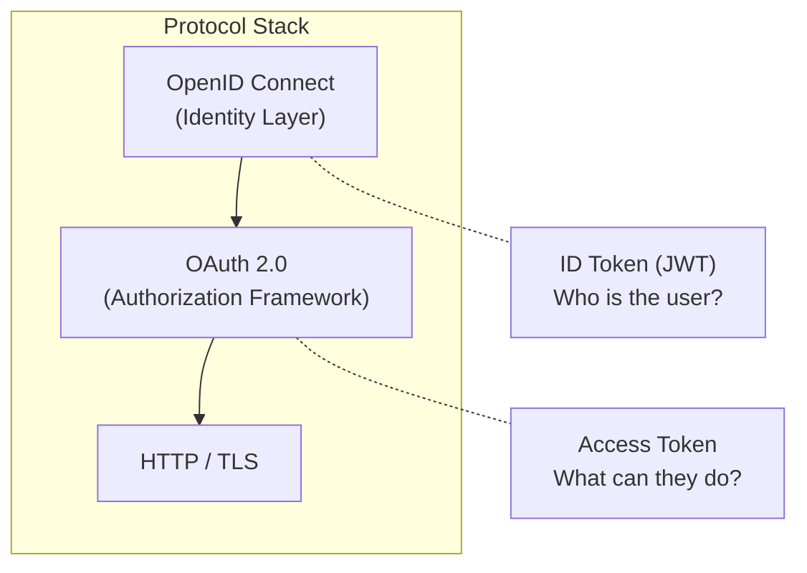
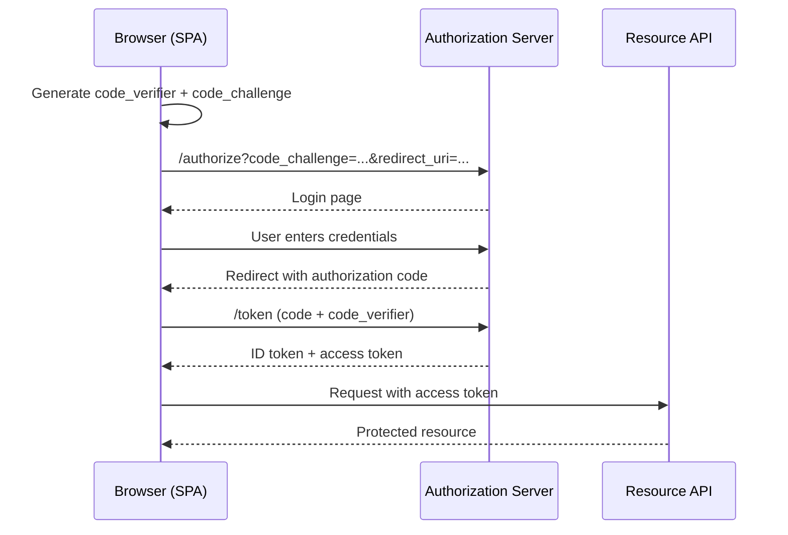
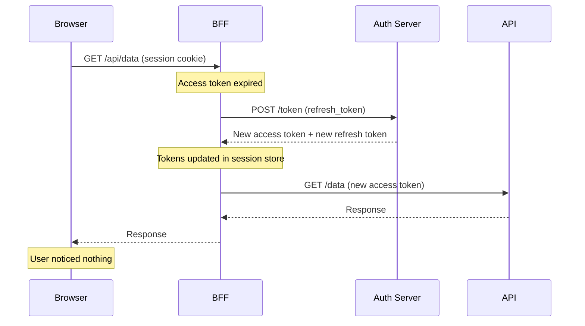
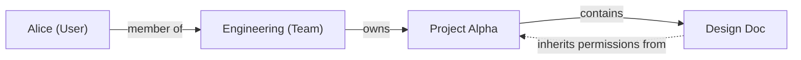
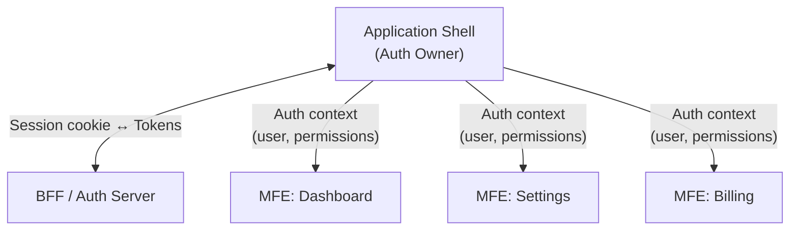
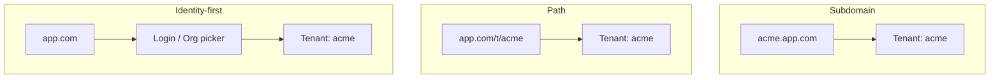

Authentication, authorization, and multi-tenancy are three problems that enterprise frontend teams tend to treat as "someone else's job" right up until they are not. The identity provider handles auth, the backend enforces permissions, the platform team manages tenants—and the frontend just… calls an API and hopes for the best.

That works until you need to render a UI that hides the "Delete Organization" button from non-admins, shows tenant-specific branding without a full redeploy, handles token refresh without interrupting a form the user has been filling out for twenty minutes, and does all of this across five independently deployed microfrontends that each have their own opinions about where to find the current user.

This section covers the frontend-specific concerns: how identity protocols work at the browser boundary, where tokens should (and should not) live, how to model authorization in the UI without duplicating backend logic, and how multi-tenant routing and theming work in practice.

## Authentication Protocols in the Enterprise

Enterprise authentication is not one protocol. It is a stack of protocols layered on top of each other, each solving a different problem, and the frontend's job is to participate in the ceremony without becoming the security weak link.

### SAML, OAuth 2.0, and OpenID Connect

Three protocols dominate enterprise identity, and they are not interchangeable.

**SAML 2.0** is the bedrock of traditional enterprise SSO. It uses XML-based assertions to convey authentication data between an identity provider (like Okta or Microsoft Entra ID) and a service provider (your application). The user is redirected to the IdP, authenticates there—often against Active Directory—and gets redirected back with a signed assertion. The application never sees the user's password. SAML is verbose and XML-heavy, but it is deeply entrenched in workforce applications connected to corporate directories. [Microsoft's identity platform documentation][1] describes the SAML flow in detail.

**OAuth 2.0** is an _authorization_ framework. It answers "what is this client allowed to do on behalf of the user?" not "who is the user?" OAuth issues access tokens that grant scoped permissions to resources. It is the foundation for API authorization across the modern web.

**OpenID Connect** (OIDC) is an _identity_ layer built on top of OAuth 2.0. It answers "who is the user?" by adding an ID token—a JWT containing claims about the authenticated user—to the OAuth flow. [OIDC's own documentation][2] describes it as providing a verifiable answer to "what is the identity of the person currently using the browser?"



The practical difference matters. In an enterprise context, SAML is frequently the choice for internal workforce applications connected to legacy directories, while OIDC is preferred for new customer-facing portals and mobile applications. Many organizations run both simultaneously—SAML for the employee-facing tools that predate the cloud migration, OIDC for everything built in the last five years.

| Feature          | SAML 2.0                  | OpenID Connect           | OAuth 2.0                  |
| ---------------- | ------------------------- | ------------------------ | -------------------------- |
| **Primary goal** | Identity federation / SSO | Identity verification    | Resource authorization     |
| **Data format**  | XML                       | JSON / JWT               | JSON / JWT                 |
| **Transport**    | Browser redirects         | API-friendly / REST      | API-friendly / REST        |
| **Typical IdP**  | Active Directory, Okta    | Google, Auth0, Entra ID  | GitHub, Salesforce, Stripe |
| **Best for**     | Legacy workforce apps     | Modern cloud/mobile apps | API access delegation      |

### The Authorization Code Flow

For browser-based applications, the standard OIDC flow is the **Authorization Code Flow with PKCE** (Proof Key for Code Exchange). PKCE was originally designed for mobile apps but is now the recommendation for all public clients, including SPAs.



The `code_verifier` is a random string generated by the client. The `code_challenge` is a SHA-256 hash of that string, sent with the initial authorization request. When the client exchanges the authorization code for tokens, it sends the original `code_verifier`. The authorization server hashes it and compares—if they match, the code was not intercepted and replayed by an attacker. PKCE closes the authorization code interception attack without requiring a client secret, which browser-based applications cannot securely store.

## Token Management in Single Page Applications

SPAs face a fundamental tension: they need tokens to call APIs, but they run entirely in the browser, where anything stored is theoretically accessible to malicious scripts.

### Where tokens should not live

The industry has moved decisively away from storing tokens in `localStorage` or `sessionStorage`. Both are accessible to any JavaScript running in the application's origin, which means a single XSS vulnerability—one `<script>` tag injected via a compromised dependency, a reflected query parameter, or an unsanitized user input—can exfiltrate every token and send it to an attacker's server. [FusionAuth's BFF guide][3] describes this as the core risk: data in browser storage can be accessed by JavaScript and sent elsewhere to impersonate the user.

### The Backend-for-Frontend pattern

The modern answer is the **Backend-for-Frontend (BFF) pattern**, covered in detail in the [Backends for Frontends](/courses/enterprise-ui/backends-for-frontends) section. For authentication specifically, the BFF acts as a confidential OAuth client: it receives the authorization code, exchanges it for tokens, stores them server-side (typically in Redis or an encrypted session store), and issues a session cookie to the browser.

```typescript
// Simplified BFF token exchange
app.get('/auth/callback', async (request, response) => {
  const { code } = request.query;

  const tokens = await authClient.exchangeCode(code, {
    // [!note The BFF is a *confidential* client—it has a client secret the browser never sees.]
    clientId: process.env.OIDC_CLIENT_ID,
    clientSecret: process.env.OIDC_CLIENT_SECRET,
    redirectUri: `${process.env.APP_URL}/auth/callback`,
  });

  // Tokens stay server-side. The browser gets a session cookie.
  request.session.accessToken = tokens.accessToken;
  request.session.refreshToken = tokens.refreshToken;
  request.session.idToken = tokens.idToken;

  response.redirect('/');
});
```

The session cookie is marked `HttpOnly` (JavaScript cannot read it), `Secure` (only transmitted over HTTPS), and `SameSite=Strict` (not sent on cross-origin requests). Because the cookie is `HttpOnly`, a successful XSS attack can make requests _as_ the user for the duration of the session, but it cannot steal the tokens and use them from a different machine. That is a meaningful reduction in blast radius.

| Storage pattern  | Where tokens live   | XSS risk                             | Token theft risk |
| ---------------- | ------------------- | ------------------------------------ | ---------------- |
| `localStorage`   | Browser JS          | Full access to tokens                | High             |
| `sessionStorage` | Browser JS          | Full access to tokens (tab-scoped)   | High             |
| **BFF + cookie** | Server-side session | Session abuse only (no exfiltration) | Low              |

### Token lifecycle: refresh and renewal

Access tokens are intentionally short-lived—typically 15 minutes to an hour—so that a stolen token has a limited window of usefulness. Refresh tokens are long-lived and used to obtain new access tokens without forcing the user to re-authenticate.

For public clients (SPAs without a BFF), the current recommendation is **refresh token rotation**: every time a refresh token is used, the authorization server invalidates it and issues a new one. If the old token shows up again, that is a clear signal of theft, and the server revokes the entire token chain. [Okta's refresh token documentation][4] describes this rotation mechanism in detail.

With a BFF, refresh is simpler. The BFF holds the refresh token server-side and silently obtains new access tokens when they expire. The browser never participates in the renewal—it just keeps sending its session cookie, and the BFF ensures the underlying access token is fresh.



### Session management

Enterprise applications need more than just "logged in" or "logged out." Common session requirements include:

- **Sliding sessions**: The expiration extends as long as the user remains active. A user working for eight hours should not be forced to re-authenticate mid-task.
- **Absolute timeouts**: A hard limit after which re-authentication is required regardless of activity. This mitigates the risk of an abandoned terminal with an active session.
- **Concurrent session limits**: Restricting a user to one or two active sessions prevents account sharing and limits the footprint of a compromised account. Salesforce, for instance, allows administrators to [configure concurrent session limits][5] through login flows.

### CSRF protection

Even with `HttpOnly` cookies and a BFF, Cross-Site Request Forgery remains a threat. A malicious page cannot _read_ the session cookie, but the browser will _send_ it automatically on any request to the BFF's origin.

The standard defenses:

- **`SameSite=Strict`** on the session cookie prevents the browser from sending it on cross-origin requests. This is the strongest cookie-level defense but breaks legitimate cross-site navigation (like clicking a link from an email).
- **`SameSite=Lax`** is a common compromise: the cookie is sent on top-level navigations (GET requests from external links) but not on POST requests or API calls from other origins.
- **Custom header requirement**: Require a custom header like `X-Requested-With` on all API calls. Browsers enforce a CORS preflight for cross-origin requests with custom headers, and the BFF can reject any request that lacks the header.

## Authorization Models

Authentication tells you _who_ the user is. Authorization tells you _what they can do_. These are fundamentally different concerns, and conflating them is how teams end up with permission logic scattered across a dozen middleware files, three frontend hooks, and a shared Google Sheet that nobody updates.

### RBAC: roles and their limits

**Role-Based Access Control** is the most common starting point. Users are assigned to roles (`Admin`, `Editor`, `Viewer`), roles map to permissions, and the application checks the role before allowing an action.

```typescript
// Simple RBAC check
function canDeleteProject(user: User): boolean {
  return user.roles.includes('admin');
}
```

RBAC is easy to understand and easy to implement. It also has a well-documented failure mode: **role explosion**. As the organization grows and permissions become more granular, you end up creating roles like `billing-admin-east-coast-read-only` because the existing roles do not capture the exact combination of permissions someone needs. [Oso's access control comparison][6] describes this proliferation as the central scalability problem of pure RBAC.

### ABAC: attributes and context

**Attribute-Based Access Control** evaluates policies based on attributes of the user, the resource, and the environment. Instead of mapping users to static roles, ABAC evaluates dynamic rules:

```
// Pseudocode: ABAC policy
allow if:
  user.department == resource.department
  AND user.clearance >= resource.sensitivity
  AND request.time is within business_hours
```

ABAC is powerful because it handles context-sensitive decisions without creating a new role for every combination of conditions. It is also harder to reason about, because the policy surface area grows with every new attribute you add.

### ReBAC: relationships as a graph

**Relationship-Based Access Control** models authorization as a graph of relationships between entities. It gained prominence after Google published the [Zanzibar paper][7], which described the authorization system backing Google Drive, YouTube, and other Google services.

ReBAC answers questions like "can this user edit this document?" by traversing a relationship graph: the user is a member of a team, the team owns a project, the project contains the document, and the document inherits the project's permissions.



Tools like [OpenFGA][8] and Ory Keto implement this relationship-first model. ReBAC is especially effective for collaborative applications with hierarchical structures—document sharing, project management, organizational hierarchies—where the question is not "what role does this user have?" but "what is this user's relationship to this resource?"

### PBAC: policies as code

**Policy-Based Access Control** is less a model and more a deployment strategy. It externalizes authorization logic into a centralized policy engine—[Open Policy Agent][9] (OPA) with Rego, or [Cedar][10] for AWS—where policies are written in a declarative language, version-controlled, and evaluated at runtime.

```rego
# OPA/Rego: allow project deletion only for org admins
package project.authz

default allow := false

allow if {
    input.action == "delete"
    input.user.role == "org_admin"
    input.resource.org_id == input.user.org_id
}
```

The advantage of PBAC is that it decouples policy from application code. Security teams can manage, audit, and update policies independently of the engineering release cycle. The policy engine becomes the single source of truth, and every service—frontend and backend—evaluates against the same rules.

| Model     | Core concept               | Strength             | Scaling challenge              |
| --------- | -------------------------- | -------------------- | ------------------------------ |
| **RBAC**  | User → role → permission   | Simplicity           | Role explosion                 |
| **ABAC**  | Attributes + rules         | Dynamic flexibility  | Policy complexity              |
| **ReBAC** | Relationship graph         | Hierarchical access  | Graph query performance        |
| **PBAC**  | Externalized policy engine | Decoupled, auditable | Operational overhead of engine |

In practice, most enterprise systems use a hybrid. RBAC provides the coarse-grained structure (admins, editors, viewers), ABAC or ReBAC handles the fine-grained context (department-scoped access, document-level sharing), and PBAC provides the deployment mechanism that keeps the whole thing consistent across services.

## Authorization in the Frontend

Authorization in the frontend serves two purposes: improving the user experience by guiding users toward actions they are allowed to take, and providing a secondary defense layer before a request hits the backend. The critical rule is that **the frontend is never the final arbiter of access**. Every action must be re-validated server-side.

### Route-level guards

The most basic frontend authorization pattern is preventing unauthorized users from reaching certain pages. In React, this typically looks like a wrapper component:

```tsx
function ProtectedRoute({
  children,
  requiredRole,
}: {
  children: React.ReactNode;
  requiredRole: string;
}) {
  const { user, isLoading } = useAuth();

  if (isLoading) return <LoadingSpinner />;
  // [!note The backend still enforces this. The route guard is a UX optimization, not a security boundary.]
  if (!user || !user.roles.includes(requiredRole)) {
    return <Navigate to="/unauthorized" replace />;
  }

  return children;
}

// Usage
<Route
  path="/admin"
  element={
    <ProtectedRoute requiredRole="admin">
      <AdminDashboard />
    </ProtectedRoute>
  }
/>;
```

### Component-level conditional rendering

For finer-grained control, a permissions-aware component can show, hide, or disable UI elements based on the user's entitlements:

```tsx
function Can({
  permission,
  children,
  fallback = null,
}: {
  permission: string;
  children: React.ReactNode;
  fallback?: React.ReactNode;
}) {
  const { permissions } = useAuth();
  // [!note permissions comes from the backend's "UI profile"—a list of allowed actions computed at login.]
  return permissions.includes(permission) ? children : fallback;
}

// Usage
<Can
  permission="project.delete"
  fallback={
    <Tooltip content="You don't have permission to delete projects">
      <Button disabled>Delete Project</Button>
    </Tooltip>
  }
>
  <Button onClick={handleDelete}>Delete Project</Button>
</Can>;
```

### Synchronizing frontend and backend logic

The biggest maintenance headache is keeping authorization logic in sync between the frontend and backend without duplicating it. The most effective strategy is to have the backend compute a **UI profile**—a set of allowed actions—when the user authenticates, and include it in the session state or as a dedicated API response.

```typescript
// Backend computes the UI profile
async function getUserProfile(userId: string, tenantId: string): Promise<UIProfile> {
  const policies = await policyEngine.evaluate({
    user: userId,
    tenant: tenantId,
  });

  return {
    permissions: policies.allowedActions,
    featureFlags: policies.enabledFeatures,
    // [!note The frontend consumes this profile. The backend enforces the same policies on every API request.]
    uiHints: {
      canDeleteProjects: policies.allowedActions.includes('project.delete'),
      canInviteMembers: policies.allowedActions.includes('member.invite'),
      maxUploadSizeMb: policies.limits.uploadSize,
    },
  };
}
```

The frontend consumes this profile to render the UI. The backend continues to enforce the same policies on every API request. This "single source of truth" approach prevents the slow drift where the frontend thinks one thing is allowed while the backend disagrees.

### Show, hide, or disable?

When a user lacks permission for an action, you have three choices:

- **Hide the element entirely**: Clean UI, reduced cognitive load, but the user may not know the feature exists. Best when the feature is completely outside the user's role.
- **Disable the element with an explanation**: Signals that the feature exists but is not available. Best when the feature is available at a higher subscription tier or when a specific condition is not met. A tooltip or adjacent text explaining _why_ it is disabled is essential—a grayed-out button with no explanation is just confusing.
- **Show and block on interaction**: Allow the click, then show an error. This is almost always the wrong choice for authorization (it is appropriate for validation), because it wastes the user's time and creates frustration.

From an accessibility perspective, disabled elements need care. Many screen readers skip `disabled` buttons entirely, so users relying on assistive technology may not know the feature exists at all. Pairing a disabled control with visible explanatory text or an `aria-describedby` reference ensures the context is available to everyone.

## Authentication in Microfrontend Architectures

When an application decomposes into independently deployed microfrontends, authentication becomes a shared responsibility between the application shell and remote modules. Getting this wrong means duplicated auth state, race conditions during token refresh, and logout flows that leave orphaned sessions in individual modules.

### The shell owns authentication

The recommended pattern is **auth at the shell level**:



The shell handles all authentication flows: login, logout, and token refresh. It exposes the authenticated user's identity and permissions to loaded microfrontends through a shared context mechanism. Individual microfrontends never initialize their own auth flows or store their own tokens.

This provides a single source of truth for authentication state, prevents token duplication across modules, centralizes token refresh logic (avoiding race conditions where multiple modules try to refresh simultaneously), and ensures logout invalidates everything at once.

### Distributing auth state to microfrontends

There are several mechanisms for sharing auth state across module boundaries:

- **React Context**: An `<AuthProvider>` in the shell wraps the entire application and provides a `useAuth()` hook that any microfrontend can call. This works well when all modules are React, but breaks down in a multi-framework environment.
- **Event bus**: Microfrontends subscribe to auth change events (`user:authenticated`, `user:logout`, `permissions:updated`). Framework-agnostic and works across any composition model.
- **Shell-injected global**: The shell sets a global object or uses Module Federation's shared scope to provide auth state. Simple but requires discipline to avoid stale reads.
- **Backend API**: Each module independently calls `/api/auth/me` to get the current user. The BFF caches the response to avoid redundant round trips. This is the most decoupled option but introduces latency.

### Authorization boundaries across modules

Each microfrontend should check permissions before rendering protected UI, using the shared auth context from the shell. But—and this is the part teams forget—the backend APIs behind each module must _also_ validate permissions. The frontend check is a UX optimization; the backend check is the security boundary.

The shell typically aggregates all available permissions from the backend and shares them, letting each module make local visibility decisions. This keeps the permission-fetching logic in one place instead of having every module independently query the policy engine.

## Multi-Tenancy in the Frontend

Multi-tenancy—serving multiple customers from a single application instance—is the architectural foundation of B2B SaaS. For the frontend, it introduces complexity in routing, branding, data isolation, and caching.

### Tenant resolution

The frontend needs to know which tenant context the current user is operating in. This resolution typically happens at the routing layer and follows one of three patterns:



**Subdomain-per-tenant** (`acme.app.com`) provides the strongest sense of tenant ownership and allows tenant-specific SSL certificates and CDN configurations. It also requires wildcard DNS management and complicates certificate rotation.

**Path-per-tenant** (`app.com/t/acme`) is simpler to manage with a single SSL certificate but can lead to complex relative URL generation. If session cookies are not properly scoped, there is a risk of session leakage across paths.

**Identity-first / single domain** (`app.com`) resolves the tenant from the user's login credentials or an organization picker. This is common for applications like Slack where a user belongs to multiple workspaces. [WorkOS's multi-tenant architecture guide][11] covers all three patterns and their tradeoffs.

| Pattern           | Branding strength | Management complexity | Session isolation |
| ----------------- | ----------------- | --------------------- | ----------------- |
| **Subdomain**     | High              | High (DNS, certs)     | Strong (origin)   |
| **Path-based**    | Low               | Low                   | Requires care     |
| **Single-domain** | Medium            | Low                   | Requires care     |

### Tenant-aware theming

Enterprise customers expect the application to match their corporate branding. The most effective implementation uses CSS custom properties injected at runtime from a tenant configuration:

```typescript
async function applyTenantTheme(tenantId: string) {
  const config = await fetch(`/api/tenants/${tenantId}/theme`);
  const theme = await config.json();
  const root = document.documentElement;

  root.style.setProperty('--tenant-primary-color', theme.primaryColor);
  root.style.setProperty('--tenant-accent-color', theme.accentColor);
  root.style.setProperty('--tenant-heading-font', theme.headingFont);
  // [!note One codebase, many visual identities. No tenant-specific builds required.]
  root.style.setProperty('--tenant-logo-url', `url(${theme.logoUrl})`);
}
```

```css
.navbar {
  background-color: var(--tenant-primary-color);
  font-family: var(--tenant-heading-font);
}

.logo {
  background-image: var(--tenant-logo-url);
}
```

This approach treats the theme as runtime state rather than build-time configuration. A single build artifact serves every tenant, and visual customization is just another API response.

### Data isolation in the frontend

Data isolation is primarily enforced on the backend—through Row-Level Security, separate database schemas, or separate databases per tenant. The frontend's job is to not accidentally undermine that isolation.

The practical concerns:

- **Every API request must include the tenant context**. This is typically a `tenant_id` claim in the JWT or a header derived from the session. If a request goes out without tenant context, the backend should reject it rather than guessing.
- **Clear state on tenant switch**. When a user switches between organizations (in an identity-first model), the frontend must flush all cached data, clear any in-memory state management (Redux, Zustand, whatever), and re-fetch everything in the new tenant context. Stale data from a previous tenant leaking into the current view is a data isolation failure.
- **Scope cache keys by tenant**. Any client-side caching (React Query, SWR, service worker) must include the tenant identifier in the cache key. A cache hit for `projects:list` that returns Tenant A's projects when Tenant B is active is the kind of bug that gets a dedicated Slack channel.

```typescript
// Tenant-scoped cache key pattern
function useTenantQuery<T>(key: string, fetcher: () => Promise<T>) {
  const { tenantId } = useTenant();
  return useQuery({
    // [!note The tenant ID is part of the cache key. No cross-tenant cache hits.]
    queryKey: [tenantId, key],
    queryFn: fetcher,
  });
}
```

### Caching and CDN strategies

Caching in a multi-tenant environment requires balancing performance with isolation. The rules are straightforward once you categorize the assets:

| Asset type             | Caching strategy      | TTL             | Isolation  |
| ---------------------- | --------------------- | --------------- | ---------- |
| **Application bundle** | Global cache (hashed) | Long (1 year)   | Shared     |
| **Tenant config**      | Tenant-scoped cache   | Short (1–5 min) | Per-tenant |
| **User data**          | No cache (`private`)  | N/A             | Per-user   |
| **Public marketing**   | Global cache          | Medium (1 day)  | Shared     |

Static assets like JavaScript bundles, CSS, and fonts are shared across all tenants and can be cached aggressively with content-hashed filenames. Tenant-specific assets (uploaded logos, custom stylesheets) should be isolated by path prefix (`cdn.app.com/assets/{tenant-id}/logo.png`) and cached independently. User data and authenticated API responses must use `Cache-Control: private, no-store`.

For subdomain-based routing, the hostname naturally segments the CDN cache. For path-based or single-domain routing, the CDN must be configured to include the tenant identifier in the cache key—otherwise Tenant A's dashboard might be served from cache to Tenant B.

## Organizational Ownership

Who _owns_ auth in a large organization? This is less a technical question and more an organizational one, but getting it wrong creates friction that no amount of good architecture can fix.

In practice, three groups share the responsibility:

- **The identity team** owns the core IdP (Entra ID, Okta, Auth0), federation protocols, MFA policies, and credential lifecycle. Their concern is security and compliance.
- **The platform team** owns the BFF layer, API gateway, multi-tenant routing, and CDN configuration. They provide the infrastructure that makes auth work at the application boundary.
- **Frontend and product teams** own the manifestation of auth in the UI: route guards, conditional rendering, tenant theming, organization switchers. Their goal is to consume the auth state that the identity and platform teams provide, not to reinvent it.

The model that works is **decoupled enforcement**: the identity team provides the token, the platform team provides the enforcement point (BFF, gateway), and the frontend team consumes the resulting state. Authorization logic lives in a policy engine managed centrally but consumed by product teams through shared libraries. Developers onboard to auth through documented SDKs and APIs rather than implementing OAuth flows from scratch for every new service.

The organizations that treat identity management as a platform service—rather than a per-team problem that each team solves independently and slightly differently—are the ones where auth actually works at scale.

[1]: https://learn.microsoft.com/en-us/entra/identity-platform/authentication-vs-authorization 'Authentication vs. authorization | Microsoft identity platform'
[2]: https://openid.net/developers/how-connect-works/ 'How OpenID Connect Works'
[3]: https://fusionauth.io/blog/backend-for-frontend 'A Guide to Backend-for-Frontend (BFF) Auth | FusionAuth'
[4]: https://developer.okta.com/docs/guides/refresh-tokens/main/ 'Refresh access tokens and rotate refresh tokens | Okta'
[5]: https://help.salesforce.com/s/articleView?id=xcloud.security_login_flow_limit_concurrent_sessions.htm&language=en_US&type=5 'Limit the Number of Concurrent Sessions with Login Flows | Salesforce'
[6]: https://www.osohq.com/learn/rbac-vs-abac-vs-pbac 'RBAC vs ABAC vs PBAC | Oso'

[7]: https://research.google/pubs/zanzibar-googles-consistent-global-authorization-system/ 'Zanzibar: Google's Consistent, Global Authorization System'
[8]: https://openfga.dev/ 'OpenFGA'
[9]: https://www.openpolicyagent.org/ 'Open Policy Agent'
[10]: https://docs.cedarpolicy.com/ 'Cedar Policy Language'
[11]: https://workos.com/blog/developers-guide-saas-multi-tenant-architecture 'The developer's guide to SaaS multi-tenant architecture | WorkOS'

---

## TL;DR

### Auth in Distributed Frontends

> The hardest cross-cutting concern.

- Authentication: _who are you?_ (OIDC, SAML, OAuth 2.0)
- Authorization: _what can you do?_ (RBAC, ABAC, ReBAC)

**The microfrontend challenge:**

- Multiple independently deployed apps need to share a session.
- Each remote may need different permission checks.
- Token refresh must be coordinated — if one remote refreshes, others shouldn't trigger a second refresh.

---

### The BFF Token Pattern

> Tokens stay server-side. The browser gets a session cookie.

```
Browser ←→ BFF (session cookie, httpOnly)
                ├→ Identity Provider (OIDC)
                ├→ API Gateway (access token)
                └→ Downstream Services (forwarded token)
```

- **No tokens in the browser.** No `localStorage`, no `sessionStorage`, no JavaScript-accessible cookies.
- The BFF holds the access token and refresh token server-side.
- The browser gets an `httpOnly`, `Secure`, `SameSite=Strict` session cookie.
- Every API call goes through the BFF, which attaches the token.

**Why:** XSS can't steal what JavaScript can't read.

---

### Authorization Models

> Pick the model that matches your complexity.

| Model     | How it works                                        | Good for                               |
| --------- | --------------------------------------------------- | -------------------------------------- |
| **RBAC**  | User → Role → Permissions                           | Simple apps, clear role hierarchies    |
| **ABAC**  | Rules based on user/resource/environment attributes | Multi-tenant, context-dependent access |
| **ReBAC** | Permissions based on relationships between entities | Document sharing, org hierarchies      |
| **PBAC**  | Central policy engine (OPA, Cedar) evaluates rules  | Complex, auditable policy requirements |

- RBAC is the starting point. Move to ABAC/ReBAC when roles aren't granular enough.
- **Frontend authorization is for UX, not security.** Hide buttons the user can't use, but enforce on the server.

---

### Session Propagation Across Remotes

> All remotes share one session. Here's how.

- **Single-origin deployment:** All remotes on the same domain → cookies work naturally.
- **Multi-origin deployment:** Need a shared auth service or token relay.

**Patterns:**

1. **Shared cookie** — same domain, BFF sets the cookie, all remotes inherit it.
2. **Auth context provider** — host app authenticates, passes session to remotes via props or shared store.
3. **PostMessage relay** — iframe-based remotes communicate auth state via `window.postMessage`.

**Token refresh coordination:** Use a single refresh lock (e.g., BroadcastChannel) so multiple remotes don't race to refresh the same token.
