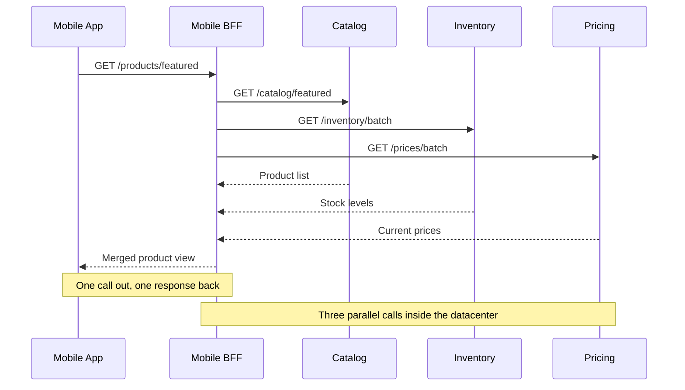
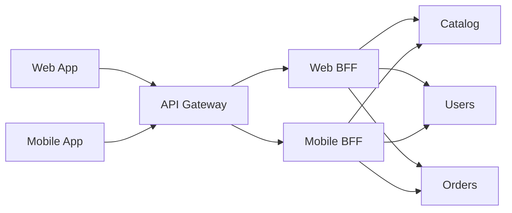
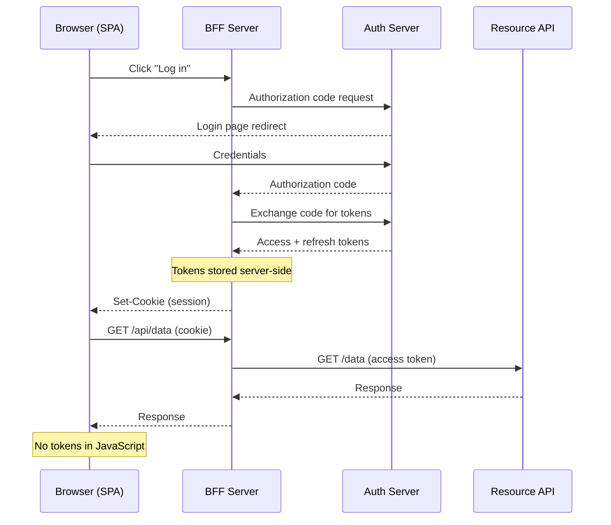
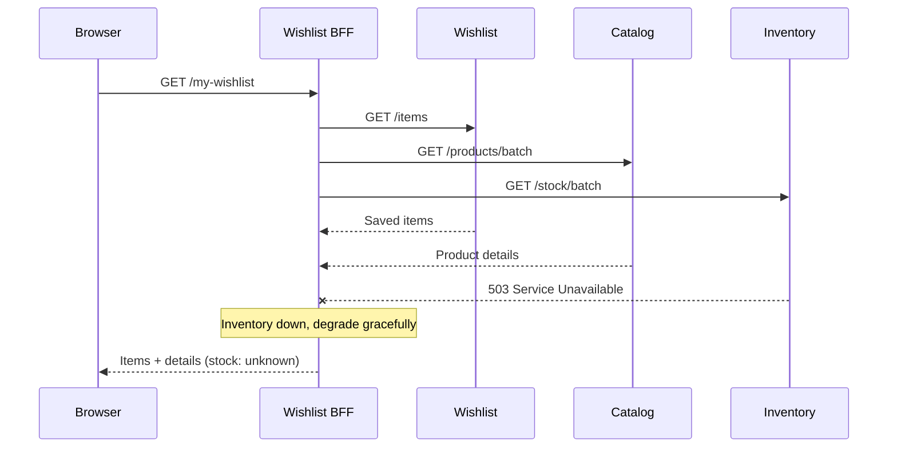

A **backend for frontend**, or BFF, is a client-specific backend layer: one backend per user experience, instead of one shared "general-purpose" backend trying to please web, mobile, desktop, and every external consumer at once. [Sam Newman][2] describes it as a single-purpose edge service for a UI or external party, and [Azure's architecture guidance][1] uses the same core idea: decouple frontend implementations from shared backend services so each interface gets something tailored to its needs. In the healthiest version, the BFF is owned by the same team as the frontend, so the API and the UI can evolve together instead of negotiating through a central platform queue.

The reason this pattern exists is painfully ordinary. A shared API backend often starts out fine when every client needs roughly the same data. Then mobile arrives, or a partner integration, or a high-latency SPA, and now one backend has to serve very different payload shapes, interaction patterns, performance constraints, and release cadences. Newman calls out the way a general-purpose API backend becomes a bottleneck, while [Microsoft's microservices guidance][3] points out the concrete symptoms of direct client-to-service communication: too many endpoints in the client, too many round trips, tighter coupling to internal service boundaries, and a larger public attack surface.

## What Problem a BFF Is Actually Solving

A BFF exists to translate backend capabilities into a client-shaped interface. That usually means some mix of orchestration, aggregation, pagination defaults, payload trimming, response reshaping, and hiding backend topology from the client. Microsoft's guidance explicitly calls out request aggregation and reduced chattiness as key benefits, especially for remote clients like mobile apps and SPAs. Newman makes the same point from the UI side: one call into the BFF often fans out to several downstream services, then comes back as a single view model the client can render.

The simplest mental model is this: the client should ask for what _that client_ needs, not for the raw internal structure of your service estate. That sounds obvious, which is why teams reliably ignore it until the mobile app is making six calls to paint one screen and everyone pretends this is "just how distributed systems work." A BFF gives you one place to compose those calls for that experience without making every client learn your backend decomposition.

A typical shape:

In that layout, the gateway layer handles generic ingress concerns, while each BFF handles client-specific composition and adaptation. Azure's example is exactly this shape: API Management handles authorization, monitoring, caching, routing, and aggregation into client-specific BFF services, with one BFF optimized for mobile and another for desktop.

## What a BFF Is Not

A BFF is not supposed to become your new shared enterprise API. [Microsoft's API gateway guidance][3] is blunt here: a single custom gateway aggregating all microservices tends to become a monolithic orchestrator, coupling everything together and violating service autonomy. Azure's BFF guidance says the BFF should only handle client-specific logic, while generic cross-cutting features like gatekeeping, routing, and rate limiting should be abstracted separately. If your "BFF" starts serving every frontend and every partner, congratulations—you rebuilt the thing this pattern was trying to escape.

That doesn't mean every concern must live outside the BFF. Newman explicitly notes that some teams keep authentication, authorization, or request logging inside the BFF because adding more upstream layers also adds latency and operational complexity. The real rule isn't "never put cross-cutting concerns in a BFF." The real rule is "don't let client-specific code and generic perimeter policy collapse into one giant, multi-tenant blob."

## BFF Versus API Gateway

| Dimension             | API gateway                       | BFF                              | GraphQL                                      |
| --------------------- | --------------------------------- | -------------------------------- | -------------------------------------------- |
| Scope                 | General-purpose ingress           | Client-specific façade           | Schema-driven query layer                    |
| Ownership             | Platform / infra team             | Frontend team (ideally)          | Varies (platform or federated)               |
| Data shaping          | Minimal (routing + passthrough)   | Aggregation, trimming, reshaping | Client-driven field selection                |
| Client coupling       | Low (serves all clients equally)  | High (one per experience)        | Medium (schema shared, queries differ)       |
| Typical use alongside | BFFs or direct services           | Thin gateway in front            | May replace BFF or live inside one           |
| Best for              | Auth, rate limiting, SSL, routing | Client-specific orchestration    | Flexible data fetching, multi-client schemas |

The cleanest distinction: an API gateway is usually a general-purpose ingress layer, while a BFF is a client-specific façade. Microsoft's docs describe the gateway as the single entry point for a group of services, responsible for routing and potentially for auth, SSL termination, caching, rate limiting, logging, and other cross-cutting concerns. The BFF pattern appears when you split that gateway layer into multiple smaller façades based on client type or business boundary so each client gets an interface tailored to its needs.

That's why many real systems use both. A thin gateway or API-management layer sits at the edge for shared concerns, and behind it sit several BFFs, one per experience or client class. Azure's reference architecture does exactly that with API Management in front of separate BFF services. This is usually the sane default because it keeps generic ingress policy in one place without forcing every client-specific adaptation into the same deployable unit.

## BFF Versus GraphQL

GraphQL can overlap with some of the reasons people introduce a BFF. Azure's architecture guidance explicitly notes that GraphQL can reduce or eliminate the need for a separate BFF layer because clients can request exactly the data they need instead of relying on predefined endpoints, and it goes further by saying that GraphQL with frontend-specific resolvers may make BFF services unnecessary in some organizations.

But that's not the same as saying "GraphQL replaces BFFs." That only follows if your problem is mostly data shaping. If your real problem is team autonomy, browser-session security, OAuth token mediation, client-owned release cadence, client-specific rate limits, or experience-specific backend workflows, GraphQL alone doesn't settle those questions. In practice, GraphQL can be the interface a BFF exposes, or the composition layer the BFF uses, but it's not automatically a substitute for the architectural boundary.

## How Many BFFs You Should Have

The most useful rule of thumb is Newman's: one experience, one BFF. He also notes that some organizations share a BFF across iOS and Android when the experience is genuinely the same and the same team owns both, but warns that as more client types accumulate behind one BFF, the temptation to bloat it grows fast. Azure makes the same trade-off explicit: if different interfaces make the same or very similar requests, a separate BFF may not be worth it; if they diverge, separating them buys clarity and performance.

Team boundaries matter almost as much as UI boundaries. Newman argues that BFFs work best when aligned around team ownership, because the UI team can evolve the BFF and the interface together without waiting on a shared backend team. Azure says much the same thing in more corporate language: frontend teams can independently manage their own BFFs, choosing language, release cadence, and priorities. That autonomy is one of the strongest reasons to adopt the pattern in the first place.

## Where BFFs Shine

BFFs are especially strong when you have multiple clients with materially different needs. Mobile is the classic example because bandwidth, latency, battery, and smaller screens often demand fewer calls and smaller payloads than desktop web. Microsoft's guidance also highlights remote SPAs and mobile apps as the scenarios where aggregation and response shaping help the most. Sam Newman goes even further and says he'd strongly consider BFFs from the outset when a system needs client-specific functionality for mobile or third parties.

They also make sense for web experiences when there's significant server-side aggregation or server-side rendering work to do. Newman notes that for desktop web, a BFF becomes useful when a larger portion of the UI is generated on the server, and that it can simplify caching because a reverse proxy can sit in front of the BFF and cache aggregated results. Azure's example similarly shows a desktop client BFF shaping pagination and other client-specific behavior independently of the mobile one.

A less discussed but valid case is external consumers. Newman explicitly mentions using BFFs for third parties and device-specific integrations when those consumers have limited ability or desire to adapt to backend changes. That makes a BFF useful as a compatibility façade for a particular partner or channel, rather than forcing the shared backend to keep old behaviors alive for everyone forever.

## Where BFFs Don't Help Much

If there's only one interface, or if multiple interfaces are making almost the same requests, the extra service may not be worth it. Azure lists those as the clearest cases where the pattern may not be suitable. Newman makes a similar point for pure web applications: if there's not much server-side aggregation to do, other UI composition techniques can work just as well without adding another backend component.

They also lose their shine when an existing GraphQL layer with frontend-specific resolvers already solves the data-shaping problem, or when a thin API gateway plus straightforward service calls is enough. Azure says both of those scenarios can make a separate BFF unnecessary. Adding a BFF in that situation isn't architectural maturity. It's just another service to page someone about at 3 a.m.

## What Should Live Inside a BFF

The safest definition is "client-specific server logic." That includes payload shaping, request aggregation, server-managed pagination defaults, view-model composition, minor workflow orchestration for one experience, and protocol adaptation between the client and downstream services. Azure's pattern guidance says the BFF should focus on logic related to a specific user experience, while Microsoft's API gateway guidance calls out request aggregation as a foundational behavior for this layer.

What should _not_ live there is broad domain logic that really belongs in shared services, or generic enterprise perimeter features that are better handled once upstream. Newman warns against using the BFF as the place where all generic concerns accumulate, and Azure says gatekeeping, rate limiting, and routing often belong in adjacent patterns rather than in the BFF itself. If every change to pricing, inventory, promotions, auth, monitoring, and partner policy lands in the BFF, then the BFF is no longer a façade. It's your application wearing a fake moustache.

## The Browser-App Version of the Pattern

For browser-based applications, BFF has a very specific modern meaning in OAuth and OIDC architecture. The current [IETF browser-based apps draft][4] describes BFF as one of the main architectural patterns for browser apps and gives it three core responsibilities: the BFF acts as a confidential OAuth client, manages access and refresh tokens in a cookie-based session so tokens aren't directly exposed to the browser, and forwards API requests to resource servers with the correct access token attached. The same document explicitly says the BFF _becomes_ the OAuth client for the frontend application.

That security property is the big reason BFF has become popular again. If tokens never reach browser JavaScript, you eliminate a whole class of token-exfiltration problems. The IETF draft says the architecture mitigates token theft scenarios precisely because there are no tokens for malicious code to steal from the browser, and because the BFF, as a confidential client, is the party that exchanges codes for tokens. [Auth0's overview][5] describes the same flow in practical terms: login goes through the backend, the backend stores tokens and issues a session cookie, and the SPA calls the backend with the cookie instead of calling the resource server directly with tokens.

That doesn't mean the browser suddenly becomes a sacred temple of safety. The same IETF guidance says malicious JavaScript running in the browser can still send requests to the BFF through the user's browser, so BFF is not a magic shield against XSS-like abuse of the user's current session. It mainly removes direct token exposure and moves OAuth duties into a more controlled server-side environment. That's a major improvement, not an absolution certificate.

## Cookie, Session, and CSRF Details That Matter

If you use the browser-app BFF model, cookie handling becomes security-critical. Auth0's BFF guidance says the session cookie should be marked `Secure` and `HttpOnly`, should be tied to the token set, and requires CSRF protection. The IETF draft is stricter and says the BFF must implement proper CSRF defenses, with `SameSite=Strict` helping in some deployments but not solving everything if sibling subdomains are considered same-site. It also explains that if you rely on CORS as part of your CSRF defense, you should require a custom request header so the browser must preflight cross-origin requests.

There's also a subtle operational trap here. The IETF draft points out that the BFF is effectively a proxy, so attackers may try to manipulate it into forwarding requests to unintended hosts. Its recommendation is to use strict outbound request controls: explicit allowlists of resource servers and tight method validation per endpoint. If you skip that and your BFF can proxy arbitrary destinations, you've built an SSRF gadget and called it architecture.

Session storage has trade-offs too. The current draft says server-side sessions give you strong control and easy revocation, but can hurt scalability because they often need sticky sessions or session replication, so they're only recommended for smaller-scale scenarios. Client-side signed or encrypted cookies remove server session storage but shift the control model toward token lifetime and token revocation. The right choice depends on scale, revocation needs, and the platform you're deploying on, not on whichever blog post was most aggressively confident.

## Performance, Aggregation, and Partial Failure

A BFF adds an extra network hop, so it's not free. Azure says to review service-level objectives carefully because latency can increase when clients no longer contact services directly, and Microsoft's API gateway guidance notes the same cost alongside the risk that a gateway can become a bottleneck or single point of failure if it's not scaled properly.

The reason BFFs still improve user experience so often is that they can remove more latency than they add. Instead of asking a mobile client or SPA to make many remote calls, a BFF can aggregate those calls inside the datacenter and return one client-shaped response. Microsoft explicitly calls out this reduction in chattiness as especially important for remote apps, and Newman recommends running downstream calls in parallel where possible to keep total call time down.

The tricky part is failure behavior. Newman's example is a good one: if a wishlist page depends on wishlist, catalog, and inventory services, do you really want the whole screen to fail when only inventory is down? His answer is basically "probably not." A BFF should often degrade gracefully, returning a partial response the client knows how to render instead of treating every downstream failure as total failure. This is one of the reasons BFFs are valuable: they let you encode experience-specific resilience policy close to the experience.

Caching belongs in this same discussion. Newman notes that a reverse proxy in front of a BFF can cache the results of aggregated calls, but the expiry of the aggregate has to respect the shortest-lived or most freshness-sensitive component in the response. Azure's example also uses API Management request caching in front of client-specific BFFs. So, yes, caching aggregated responses is useful, but it has to be done with actual cache semantics, not with the traditional method of "we'll just cache it for a bit and hope the business doesn't notice."

## Operational and Organizational Trade-Offs

Every BFF is another service. Azure's guidance says that plainly: more services mean more operational overhead, more deployments, more maintenance, and more security work. It also warns that code duplication is a probable outcome and that learning and implementing the pattern can add technical debt if the team isn't disciplined.

The reason that cost is often worth paying is autonomy. Azure says frontend teams can independently manage their BFFs and choose their own language, release cadence, and priorities. Newman argues that this is especially valuable when the UI team and downstream service teams are different groups, because the UI team can evolve its BFF and frontend together without waiting for a central API team to rebalance everyone's demands. That's usually the hidden economics of the pattern: you pay some ops cost to buy delivery speed and local decision-making.

Duplication is the price everyone notices first. Newman's advice is good and refreshingly unromantic: some duplication between BFFs is fine, and merging BFFs back into a general-purpose edge service just to avoid duplication usually recreates the original problem. If repetition becomes meaningful, then either extract a shared library or push aggregation further downstream into a domain service, but only when the abstraction is real. The usual "abstract on the third repetition" rule still applies, even when the abstraction is a service boundary instead of a helper function.

## Common Failure Modes

**The giant shared BFF.** This is the most common one because it starts from a reasonable instinct—reuse—and ends as a centralized bottleneck that every client team depends on. Both Sam Newman and Microsoft warn about this exact drift.

**The pass-through BFF that adds almost no value.** If it merely forwards requests without shaping, composing, securing, or insulating anything, then it's just another hop. Azure's guidance to keep BFF logic client-specific cuts both ways: it should contain client-specific value, not random boilerplate, but it should also not exist if there's no such value to provide.

**Treating the BFF as a safe place to dump all business logic.** That moves domain complexity to the edge, couples the experience layer to backend internals, and makes reuse harder. The BFF should be a façade with experience-specific logic, not the new home of your order system, pricing engine, or entitlement model.

**Getting the security story half right.** Moving tokens out of the browser is good; forgetting CSRF, cookie hardening, outbound allowlists, privacy implications, or rate-limit behavior is not. The IETF browser-app draft is especially useful here because it documents these operational edge cases instead of hand-waving them away.

## A Sensible Default

For most teams, the best default is a thin ingress or API-management layer for generic perimeter concerns, then one BFF per meaningfully different user experience, owned by the same team as that experience. Let the gateway handle things like routing, coarse auth, rate limiting, and observability. Let the BFF handle client-specific composition, shaping, and experience-specific resilience rules. Keep domain logic in downstream services. Use duplication sparingly and refactor only when shared behavior is genuinely stable.

If the frontend is a browser app using OAuth or OIDC, the modern secure default is the browser-app BFF model: the BFF acts as the confidential client, tokens stay server-side, the browser gets a hardened session cookie, and API calls go through the BFF. If your clients are basically identical, or GraphQL with frontend-specific resolvers already solves the shaping problem, skip the extra service. The whole point of BFF is to introduce a boundary that earns its keep, not to accumulate architecture points like a loyalty program for distributed systems.

[1]: https://learn.microsoft.com/en-us/azure/architecture/patterns/backends-for-frontends 'Backends for Frontends Pattern - Azure Architecture Center'
[2]: https://samnewman.io/patterns/architectural/bff/ 'Sam Newman - Backends For Frontends'
[3]: https://learn.microsoft.com/en-us/dotnet/architecture/microservices/architect-microservice-container-applications/direct-client-to-microservice-communication-versus-the-api-gateway-pattern 'The API gateway pattern versus direct client-to-microservice communication'
[4]: https://datatracker.ietf.org/doc/html/draft-ietf-oauth-browser-based-apps 'draft-ietf-oauth-browser-based-apps-26'
[5]: https://auth0.com/blog/the-backend-for-frontend-pattern-bff/ 'The Backend for Frontend Pattern (BFF) | Auth0'
