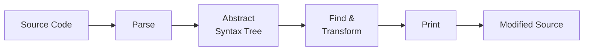
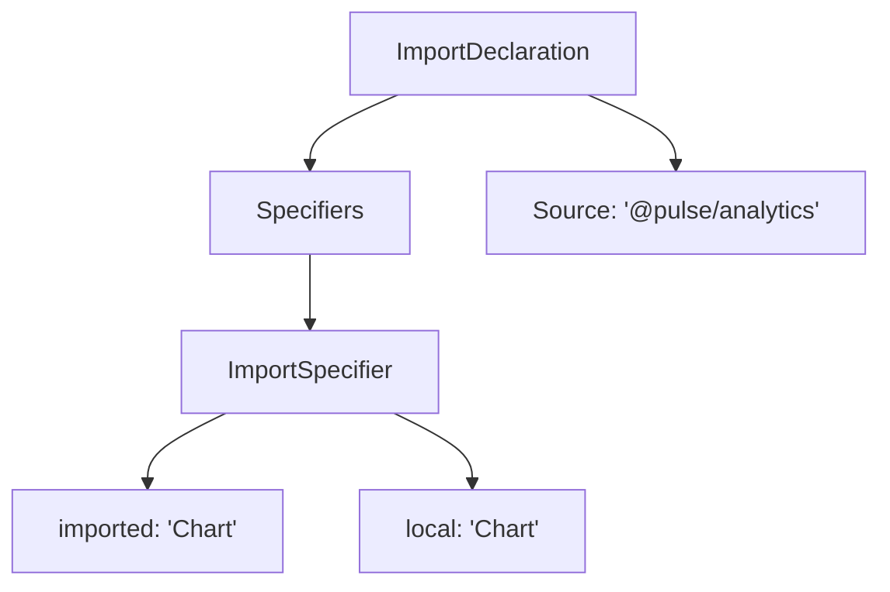

If you've ever needed to rename an import across two thousand files, your first instinct was probably find-and-replace. And for a simple rename—`oldThing` to `newThing`—that works. But the moment you need something slightly more structural—changing a named import to a default import, rewriting a function call to use a different argument order, replacing a deprecated API with one that takes different options—find-and-replace starts producing false positives, missing edge cases, and occasionally destroying template literals.

A **codemod** is an automated code transformation that operates on the _structure_ of the code rather than its text. Instead of matching strings, a codemod parses source code into an Abstract Syntax Tree, searches for nodes that match a pattern, replaces those nodes with new ones, and prints the modified tree back to source. The result is a transformation that understands the difference between `React.createClass` in an import statement and `React.createClass` in a comment.

## Why text-based transforms break

Consider a migration where you need to change every call to `analytics.track(eventName)` into `analytics.send({ event: eventName })`. A regex can handle the simple case, but real codebases have:

- Different import aliases (`import { track as logEvent }`)
- Calls that span multiple lines
- The same string `analytics.track` inside a JSX attribute, a template literal, and a comment
- Dynamic property access (`analytics[method]()`)

A regex either misses these or mangles them. An AST-based transform handles the first three naturally because it operates on the parsed structure, not the raw text. The fourth case—dynamic access—it correctly skips because the node type doesn't match. You want a tool that's precise about what it changes and honest about what it can't.

## The AST pipeline

Every codemod follows the same four-stage pipeline:



The parser reads source code and produces a tree. Each node in the tree represents a language construct—an `ImportDeclaration`, a `CallExpression`, a `JSXElement`, a `VariableDeclarator`. The transform step walks the tree, finds nodes matching a pattern, and replaces them with new nodes. The printer serializes the modified tree back to source code, preserving formatting and comments that weren't part of the transformation.

The "abstract" in **Abstract Syntax Tree** means the tree omits syntactic noise—parentheses used only for grouping, semicolons, whitespace. What remains is the logical structure of the program. That's why two files with different formatting but identical logic produce the same AST, and why a codemod can find a pattern without worrying about how many spaces someone used for indentation.

Here's what a simple import statement looks like as a tree:



When a codemod "finds all imports from `./legacy-chart`," it's searching for `ImportDeclaration` nodes whose `source.value` matches that string. When it replaces the source with `@pulse/analytics`, it's swapping one AST node for another. The printer handles converting the modified tree back to valid source code.

## jscodeshift

[jscodeshift][1] is Meta's toolkit for writing and running codemods. It wraps [recast][2] (which handles parsing and printing with format preservation) and provides a jQuery-like API for searching and transforming the AST.

A minimal codemod looks like this:

```typescript title="rename-import.ts"
import type { API, FileInfo } from 'jscodeshift';

export default function transform(file: FileInfo, api: API) {
  const j = api.jscodeshift;
  const root = j(file.source);
  // [!note `j(file.source)` parses the file and returns a traversable collection.]

  root
    .find(j.ImportDeclaration, {
      source: { value: '@old/package' },
    })
    .forEach((path) => {
      path.node.source.value = '@new/package';
    });
  // [!note Finds every import from `@old/package` and rewrites the source string.]

  return root.toSource();
}
```

You run it against a directory of files:

```bash
npx jscodeshift --parser tsx --transform rename-import.ts src/
```

jscodeshift processes files in parallel by default, so it scales to large codebases without custom batching. The `--parser tsx` flag tells recast to use a TypeScript-aware parser, which handles both `.ts` and `.tsx` files.

The API follows a pattern: `find` to locate nodes, `filter` to narrow the results, `forEach` or `replaceWith` to make changes. If you've used jQuery or D3 selections, the chaining style will feel familiar.

## A more realistic transform

Renaming a package source is the easy case. Here's something closer to real migration work—transforming a legacy API call pattern into a modern one:

```typescript title="migrate-api-calls.ts"
import type { API, FileInfo } from 'jscodeshift';

export default function transform(file: FileInfo, api: API) {
  const j = api.jscodeshift;
  const root = j(file.source);

  // Find: analytics.track("event_name", { key: value })
  // Replace: analytics.send({ event: "event_name", properties: { key: value } })
  root
    .find(j.CallExpression, {
      callee: {
        type: 'MemberExpression',
        object: { name: 'analytics' },
        property: { name: 'track' },
      },
    })
    // [!note Matches the exact shape of `analytics.track(...)` calls in the AST.]
    .forEach((path) => {
      const args = path.node.arguments;
      if (args.length < 1) return;

      const eventArg = args[0];
      const propsArg = args[1] || j.objectExpression([]);

      // Build the new call: analytics.send({ event, properties })
      path.node.callee.property.name = 'send';
      path.node.arguments = [
        j.objectExpression([
          j.property('init', j.identifier('event'), eventArg),
          j.property('init', j.identifier('properties'), propsArg),
        ]),
      ];
    });
  // [!note Restructures the arguments into a single options object.]

  return root.toSource();
}
```

This transform takes `analytics.track("page_view", { url: "/" })` and produces `analytics.send({ event: "page_view", properties: { url: "/" } })`. A regex can't reliably distinguish this from a string that happens to contain `analytics.track` or a call with a different number of arguments. The AST transform handles both cases correctly because it's operating on the code's structure, not its text.

> [!TIP] Start with the mechanical cases
> A codemod doesn't need to handle every edge case to be valuable. If it correctly transforms 80% of call sites and flags the remaining 20% for manual review, it's already saved days of work. Write the transform for the common pattern, add a `console.warn` for the patterns you can't handle automatically, and review the diff.

## The testing loop

Codemods are functions from strings to strings, which makes them straightforward to test. You write an input, run the transform, and assert on the output:

```typescript title="rename-import.test.ts"
import { describe, it, expect } from 'vitest';
import jscodeshift from 'jscodeshift';
import transform from '../rename-import';

function run(input: string): string {
  return transform(
    { source: input, path: 'test.tsx' },
    { jscodeshift, j: jscodeshift, stats: () => {}, report: () => {} },
  );
}

describe('rename-import', () => {
  it('rewrites the package source', () => {
    const input = `import { Button } from "@old/package";`;
    const output = run(input);
    expect(output).toContain('@new/package');
    expect(output).not.toContain('@old/package');
  });
  // [!note String-in, string-out. No file system, no bundler, no framework.]

  it('leaves unrelated imports alone', () => {
    const input = `import { useState } from "react";`;
    expect(run(input)).toBe(input);
  });
});
```

When a codemod produces incorrect output on a real file, copy the problematic snippet into a test case, fix the transform, and verify the test passes. Over time, your test suite accumulates a catalog of edge cases that prevents regressions as you extend the codemod.

## Institutional distribution

At companies like Meta and Google, codemods aren't a migration novelty—they're part of the standard development workflow. When an internal library introduces a breaking API change, the team that owns the library ships a codemod alongside the new version. Martin Fowler's [article on codemods][3] describes this as a cultural norm: the library author takes responsibility for migrating consumers, not the other way around.

This flips the usual upgrade dynamic. Instead of every consuming team independently figuring out how to adapt to a breaking change, the library team writes one transform that handles the migration across the entire monorepo. At Meta's scale—thousands of engineers, millions of lines of code—the alternative (filing tickets and hoping each team migrates manually) simply doesn't work.

The same pattern applies to design system migrations. When a component library renames a prop, changes a component's API, or deprecates a pattern, a codemod can update every consumer automatically. [Hypermod][4] builds on this idea, providing a platform specifically for distributing design system codemods that teams can run as part of their upgrade workflow.

The organizational insight is worth underlining: codemods shift the cost of API evolution from consumers to producers. The team making the breaking change bears the cost of writing the migration script, which is fair—they're the ones with the most context about what changed and why. This makes breaking changes _cheaper_ for the organization as a whole, which means libraries can evolve faster without leaving consumers stranded on old versions.

## When codemods earn their keep

Codemods make sense when you have a transformation that is:

- **Mechanical**: the old pattern maps to the new pattern without judgment calls.
- **Repetitive**: the same change needs to happen across dozens or hundreds of files.
- **Testable**: you can write input/output pairs that verify the transform.

They're less useful when the transformation requires understanding business logic, when the code is so inconsistent that no single pattern covers most cases, or when the number of affected files is small enough that manual edits are faster than writing the transform.

A good litmus test: if you'd describe the change as "find every X and replace it with Y, where X and Y are structural code patterns," that's a codemod. If you'd describe it as "look at each usage and decide what to do based on context," that's a human with a checklist.

## Beyond jscodeshift

jscodeshift is the most widely used tool in the JavaScript ecosystem, but it's not the only option. [ts-morph][5] provides a TypeScript-native API that's often more convenient for TypeScript-specific transforms because it understands types, not just syntax. For CSS transforms, [PostCSS][6] provides an equivalent AST-based pipeline. For HTML templates, tools like [parse5][7] offer DOM-level tree manipulation.

The underlying idea is the same everywhere: parse structured content into a tree, manipulate the tree, print it back. Once you've written one AST transform, the pattern transfers to any language or format with a parser.

We'll put this into practice in [Exercise 9](strangler-fig-and-codemods-exercise.md), where you'll write a jscodeshift codemod that transforms legacy component imports into modern package imports—the exact kind of mechanical, repetitive migration work that codemods handle well.

[1]: https://github.com/facebook/jscodeshift 'facebook/jscodeshift: A JavaScript codemod toolkit'
[2]: https://github.com/benjamn/recast 'benjamn/recast: JavaScript syntax tree transformer'
[3]: https://martinfowler.com/articles/codemods-api-refactoring.html 'Refactoring with Codemods to Automate API Changes'
[4]: https://www.hypermod.io/blog/7-automating-design-system-evolution 'Automating Design System Evolution with Codemods'
[5]: https://ts-morph.com/ 'ts-morph'
[6]: https://postcss.org/ 'PostCSS'
[7]: https://github.com/inikulin/parse5 'parse5'

---

## TL;DR

### The AST Pipeline

> Parse → find → transform → print. That's the whole idea.

```text
Source Code → Parse → Abstract Syntax Tree → Find & Transform → Print → Modified Source
```

- Text-based transforms (regex, sed) break on multiline expressions, import aliases, and content inside comments or strings.
- AST transforms understand program _structure_. They match nodes, not characters.
- The printer preserves original formatting (whitespace, quotes, semicolons) for everything it didn't touch.

---

### jscodeshift

> Meta's toolkit for writing and running AST-based code transforms at scale.

```typescript
export default function transform(file, api) {
  const j = api.jscodeshift;
  const root = j(file.source);

  root.find(j.ImportDeclaration, { source: { value: '@legacy/analytics' } }).forEach((path) => {
    path.node.source.value = '@modern/analytics';
  });

  return root.toSource();
}
```

- jQuery-like API: `find()`, `filter()`, `forEach()`, `replaceWith()`.
- Runs transforms in parallel across large codebases.
- Use AST Explorer to prototype transforms before committing to them.

---

### When Codemods Earn Their Keep

> Codemods are worth it when the transformation is mechanical, repetitive, and testable.

- **Mechanical:** The old pattern maps directly to the new pattern. No business-logic judgment required.
- **Repetitive:** Dozens to hundreds of call sites. If it's three files, do it by hand.
- **Testable:** String-in, string-out. Write input/output pairs, run the transform, compare.
- Ship codemods _with_ breaking changes. The library team that renames the API writes the codemod. Migration cost shifts from consumers to producers.
