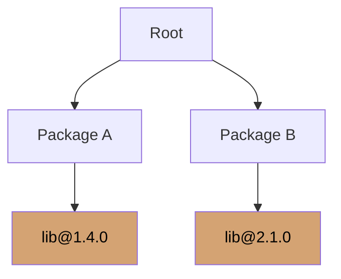

Dependencies are where architecture stops being a whiteboard and starts becoming an operations problem. In a monolith, one lockfile and one deployable artifact can hide a lot of bad habits. In a multi-package repo or any distributed frontend estate, those same habits turn into version drift, duplicate dependency trees, phantom imports from hoisting, and a flood of upgrade PRs nobody wants to review.

The fix is not "be more disciplined." The fix is to make dependency policy executable in tooling and release automation.

## The dependency problem

The [workspace package managers](/courses/enterprise-ui/workspace-package-managers) section covers _which_ tool to use and how they compare. This section covers the dependency _management_ problems that show up regardless of which tool you chose.

### Version drift

The moment different packages or teams move shared dependencies independently, your "shared stack" stops being shared. Package A is on React 18.2, Package B is on 18.3, the shell is on 18.3.1, and nobody is sure which minor version introduced the behavior change that broke the dashboard last Tuesday.

The clean answer is to make one version the default policy for widely shared dependencies and force deviations to be explicit. [pnpm][1] gives you two strong primitives for this: **catalogs**, which define reusable version ranges centrally in `pnpm-workspace.yaml`, and root-level **overrides**, which force a single version of a dependency across the entire resolution graph.

### Diamond dependencies

Package A depends on `lib@^1.0.0` through one path, Package B depends on `lib@^2.0.0` through another, and the root depends on both A and B. Sometimes the package manager can collapse that into one copy. [npm's dedupe documentation][2] shows cases where nested duplicates can be reduced to a single compatible version. Sometimes it cannot, and then you keep multiple copies.



Multiple copies are usually tolerable for stateless utility code. They are much less tolerable for framework runtimes, stateful libraries, or anything where "one instance" is part of the design assumption. Two copies of React in the same page is not a "dependency management issue." It is a production incident waiting for a customer to find it.

### Phantom dependencies

A **phantom dependency** is a package your code imports but does not declare in its own `package.json`. It "works" because another package in the repo caused it to be hoisted into a reachable location. Then someone changes an unrelated package, the hoist layout shifts, and the import breaks in CI or production with no code change in your package.

pnpm's default isolated linker creates a layout where application code outside `node_modules` cannot access undeclared dependencies. [pnpm's hoisting documentation][3] describes this semistrict behavior: packages inside `node_modules` may still see undeclared dependencies due to hoisting within the virtual store, but your application code gets a stricter default than flat-hoisted installs.

That strictness only holds if you do not undo it. Setting `shamefullyHoist` or broadly configuring `publicHoistPattern` reintroduces the same phantom dependency hazards that pnpm was designed to prevent. The option exists for compatibility with legacy code, not as a permanent operating mode.

### Update fatigue

[Dependabot's default behavior][4] is to open a separate pull request for each outdated dependency. Renovate behaves similarly unless you configure grouping. That default is fine for tiny repos and terrible for large ones. The outcome is a pile of individually correct PRs and a team that slowly learns to ignore all of them—which is exactly the opposite of the intended effect.

## Enforce a default version policy

### Catalogs and overrides

For a pnpm workspace, the cleanest setup is a root catalog plus root overrides. [Catalogs][1] centralize the allowed version ranges. Setting `catalogMode: strict` makes `pnpm add` reject versions outside the catalog. Overrides force the dependency graph onto one version where that policy makes sense.

```yaml
# pnpm-workspace.yaml
packages:
  - apps/*
  - packages/*

catalog:
  # [!note These are the blessed versions. Every package in the repo uses them unless it has a very good reason.]
  react: ^18.3.1
  react-dom: ^18.3.1
  typescript: ^5.8.0

catalogMode: strict

overrides:
  react: 'catalog:'
  react-dom: 'catalog:'
  typescript: 'catalog:'
```

The `catalog:` protocol can be used in `dependencies`, `devDependencies`, `peerDependencies`, and `overrides`, so the same central version policy drives both direct declarations and graph-wide enforcement.

### Named catalogs for staged migrations

If you genuinely need a staged migration—say, moving from React 18 to React 19 one package at a time—[named catalogs][1] are the sane exception path. One default catalog, several named catalogs for the in-progress migration:

```yaml
catalog:
  react: ^18.2.0
  react-dom: ^18.2.0

catalogs:
  react19:
    # [!note Packages that have been migrated use catalog:react19 instead of the default.]
    react: ^19.0.0
    react-dom: ^19.0.0
```

This lets you make "one version by default" the rule without pretending that no controlled exceptions will ever exist.

### The `workspace:` protocol

For internal workspace packages, use the `workspace:` protocol so local package resolution is explicit instead of opportunistic. [pnpm's workspace documentation][5] warns that plain semver ranges can resolve to the registry if the expected local version does not match, which introduces uncertainty. With `workspace:`, installation fails instead of silently substituting a registry package.

```json
{
  "dependencies": {
    "@acme/design-system": "workspace:^",
    "@acme/api-client": "workspace:^"
  }
}
```

On publish, pnpm rewrites `workspace:` specs to normal semver ranges, so consumers outside the monorepo still get ordinary packages.

## Make undeclared dependencies fail early

The simplest dependency policy is still the best one: every direct import must be backed by an explicit dependency declaration. pnpm's workspace model helps by default, since packages only get access to dependencies declared in their own `package.json`, even when there is a shared root lockfile and root `node_modules`.

That same "explicit contract" rule should apply to internal packages. [Node's package documentation][6] recommends the `exports` field for new packages, and it is explicit about encapsulation: once `exports` is defined, unlisted subpaths are encapsulated, and imports to undeclared subpaths fail with `ERR_PACKAGE_PATH_NOT_EXPORTED`.

```json
{
  "name": "@acme/design-system",
  "version": "2.4.0",
  "exports": {
    // [!note Only these three entry points are public. Everything else is encapsulated.]
    ".": "./dist/index.js",
    "./tokens": "./dist/tokens.js",
    "./react": "./dist/react.js"
  }
}
```

This is exactly the behavior you want for shared internal packages. No deep imports into private files. No accidental APIs. No "it worked because someone reached into `dist/internal.js`" and now you cannot refactor without breaking three teams.

## Automate upgrades without the noise

### Dependabot

Dependabot is the obvious starting point for native GitHub automation. [GitHub's configuration docs][7] describe how to enable version updates with a `dependabot.yml` file, and the `groups` feature lets you consolidate what would otherwise be one PR per dependency into fewer targeted PRs.

```yaml
# .github/dependabot.yml
version: 2

updates:
  - package-ecosystem: 'npm'
    directory: '/'
    schedule:
      interval: 'weekly'
    groups:
      framework:
        applies-to: version-updates
        patterns:
          - 'react'
          - 'react-dom'
          - '@types/react*'
      tooling:
        # [!note Group development tooling updates together. Nobody needs six separate PRs for ESLint plugins.]
        applies-to: version-updates
        dependency-type: 'development'
        patterns:
          - 'eslint*'
          - '@typescript-eslint/*'
          - 'prettier'
```

### Renovate

Renovate is usually the better choice when you want more control. [Its configuration docs][8] describe how grouping is done through `groupName` on `packageRules` and how `automerge` can automatically merge passing updates. The power is in scoping all of this by dependency type and update type:

```json
{
  "packageRules": [
    {
      "matchDepTypes": ["devDependencies"],
      "matchUpdateTypes": ["patch", "minor"],
      "groupName": "devDependencies (non-major)",
      "automerge": true
    },
    {
      "matchPackageNames": ["react", "react-dom"],
      "groupName": "react stack",
      // [!note Major framework upgrades are never auto-merged. Humans review these.]
      "automerge": false
    }
  ]
}
```

This lets you do something rational like "group non-major devDependencies and automerge them after CI passes" without auto-merging majors into production because someone was feeling optimistic.

### The operating rule

Let bots do the boring work, but shape the PR stream so humans only have to think when thinking is actually required. Group by scope. Auto-merge low-risk updates after tests pass. Keep major or architecture-sensitive upgrades explicitly human-reviewed. [GitHub's PR optimization docs][9] and Renovate's configuration both support that pattern.

## Versioning and release management

The [Versioning and Release Management](/courses/enterprise-ui/versioning-and-release-management) section covers semver contracts, token-based design system versioning, and Changesets fundamentals in detail. This section focuses on the release _automation_ mechanics that make Changesets work in CI.

### The changeset model

[Changesets][10] breaks release management into two phases: capturing intent at PR time and executing the release later. A changeset is a small Markdown file in `.changeset/` that records which packages changed, what kind of semver bump they need, and a human-readable summary:

```md
---
'@acme/design-system': minor
'@acme/button': patch
---

Add density tokens and expose the new compact button size.
```

This captures versioning intent next to the code review that introduced the change, instead of leaving version selection to a release engineer three weeks later who is trying to reconstruct history from commit titles.

### Fixed groups

When packages must move together, [Changesets supports fixed groups][11]. Fixed packages are versioned and published together even if some members did not change:

```json
{
  "fixed": [["@acme/design-tokens", "@acme/design-system"]]
}
```

Use this for tightly coupled pairs like tokens and the core design-system package, where partial release is more confusing than helpful. Do not apply it to everything—that just reinvents lockstep release with extra syntax.

### Automating the release flow

The standard automation uses the [Changesets GitHub Action][12] to create a "Version Packages" PR that stays up to date as changesets accumulate, and publishes when that PR is merged:

```yaml
# .github/workflows/changesets.yml
name: Release

on:
  push:
    branches: [main]

jobs:
  release:
    runs-on: ubuntu-latest
    permissions:
      contents: write
      pull-requests: write

    steps:
      - uses: actions/checkout@v5

      - uses: pnpm/action-setup@v4

      - uses: actions/setup-node@v4
        with:
          node-version: 22
          cache: pnpm

      - run: pnpm install --frozen-lockfile

      # [!note The action creates a PR to bump versions. When merged, it publishes to npm.]
      - uses: changesets/action@v1
        with:
          version: pnpm changeset version
          publish: pnpm publish -r
        env:
          GITHUB_TOKEN: ${{ secrets.GITHUB_TOKEN }}
          NPM_TOKEN: ${{ secrets.NPM_TOKEN }}
```

Use `changeset status --since=main` as a blocking CI check if you want merges to fail when no changeset is present. That enforces the discipline of recording intent at PR time rather than discovering unversioned changes at release time.

### Prereleases and snapshots

Changesets provides two distinct mechanisms for testing unreleased packages, and they serve different purposes.

**Prerelease mode** is for a real semver prerelease channel. [Changesets' prerelease documentation][13] describes how `changeset pre enter <tag>` enters prerelease mode, `changeset version` appends tags like `-next.0`, and `changeset publish` uses the tag as the npm dist tag. Prerelease versions are not satisfied by most normal semver ranges, so dependent packages often need bumps they would not need in a stable release. This is the right tool for an actual beta or canary track.

```bash
pnpm changeset pre enter canary
pnpm changeset version
pnpm changeset publish --tag canary
```

**Snapshot releases** are different. [Changesets' snapshot documentation][14] describes snapshots as testing builds that do not update real versions, producing versions like `0.0.0-canary-DATETIMESTAMP`. You run `changeset version --snapshot <tag>` and then `changeset publish --tag <tag>`.

```bash
pnpm changeset version --snapshot canary
pnpm changeset publish --tag canary
```

Snapshots are the better fit when you want a disposable build for integration testing—"build this branch and let people try it"—without putting the repo into an ongoing prerelease sequence.

The split is straightforward: use prerelease mode for an actual beta channel that behaves like a real release stream. Use snapshots when you want a throwaway build without rewriting the package history.

## A practical operating model

```mermaid
graph TD
    subgraph "Version Policy"
        Cat["Catalog<br/>(blessed versions)"]
        Over["Overrides<br/>(graph-wide enforcement)"]
        WS["workspace: protocol<br/>(explicit local resolution)"]
    end

    subgraph "Upgrade Automation"
        Bot["Renovate / Dependabot<br/>(grouped PRs)"]
        CI["CI gate<br/>(tests + audit)"]
        Auto["Auto-merge<br/>(low-risk only)"]
    end

    subgraph "Release Mechanics"
        CS["Changesets<br/>(intent capture)"]
        Action["GitHub Action<br/>(version PR + publish)"]
        Snap["Snapshots<br/>(throwaway builds)"]
    end

    Cat --> Over
    Over --> WS
    Bot --> CI
    CI --> Auto
    CS --> Action
    Action --> Snap
```



The most stable setup is boring in the best way. Use one package manager for the repo. Keep one shared lockfile. Make a default catalog for shared dependencies. Use root overrides sparingly to pin graph-wide versions that genuinely must be unified. Use `workspace:` for internal packages so local resolution is explicit. Keep hoisting conservative so undeclared dependencies stay broken instead of accidentally working.

Then automate the noise away. Dependabot or Renovate should open fewer, better-shaped PRs—not a dependency blizzard. Group updates by scope. Keep security updates enabled. Auto-merge only the classes of updates you are genuinely comfortable delegating to CI.

Treat shared packages as products. Give them explicit `exports`. Version them with semver. Require a changeset when they change. Publish through automation. Use prereleases or snapshots when you need canaries. That is how dependency management becomes predictable instead of theatrical. And predictable, tragically, is what keeps the repo alive long enough for everyone to keep arguing about architecture in the first place.

[1]: https://pnpm.io/catalogs 'Catalogs | pnpm'
[2]: https://docs.npmjs.com/cli/v8/commands/npm-dedupe 'npm-dedupe | npm Docs'
[3]: https://pnpm.io/settings 'Settings | pnpm'
[4]: https://docs.github.com/en/code-security/reference/supply-chain-security/dependabot-options-reference 'Dependabot options reference | GitHub Docs'
[5]: https://pnpm.io/workspaces 'Workspaces | pnpm'
[6]: https://nodejs.org/api/packages.html 'Packages | Node.js'
[7]: https://docs.github.com/en/code-security/how-tos/secure-your-supply-chain/secure-your-dependencies/configuring-dependabot-version-updates 'Configuring Dependabot version updates | GitHub Docs'
[8]: https://docs.renovatebot.com/configuration-options/ 'Configuration Options | Renovate Docs'
[9]: https://docs.github.com/en/code-security/tutorials/secure-your-dependencies/optimizing-pr-creation-version-updates 'Optimizing PR creation for version updates | GitHub Docs'
[10]: https://github.com/changesets/changesets/blob/main/docs/detailed-explanation.md 'Detailed explanation | Changesets'
[11]: https://github.com/changesets/changesets/blob/main/docs/fixed-packages.md 'Fixed packages | Changesets'
[12]: https://github.com/changesets/changesets/blob/main/docs/automating-changesets.md 'Automating Changesets | Changesets'
[13]: https://github.com/changesets/changesets/blob/main/docs/prereleases.md 'Prereleases | Changesets'
[14]: https://github.com/changesets/changesets/blob/main/docs/snapshot-releases.md 'Snapshot releases | Changesets'

---

## TL;DR

### pnpm Catalogs

> One place to define dependency versions for the entire monorepo.

```yaml
# pnpm-workspace.yaml
catalog:
  react: ^18.3.0
  react-dom: ^18.3.0
  typescript: ^5.5.0
  vitest: ^2.0.0
```

```json
// packages/app-a/package.json
{
  "dependencies": {
    "react": "catalog:",
    "react-dom": "catalog:"
  }
}
```

- Update React once → every package gets it.
- No more version drift across the monorepo.
- `pnpm.overrides` for forcing transitive dependency versions.
