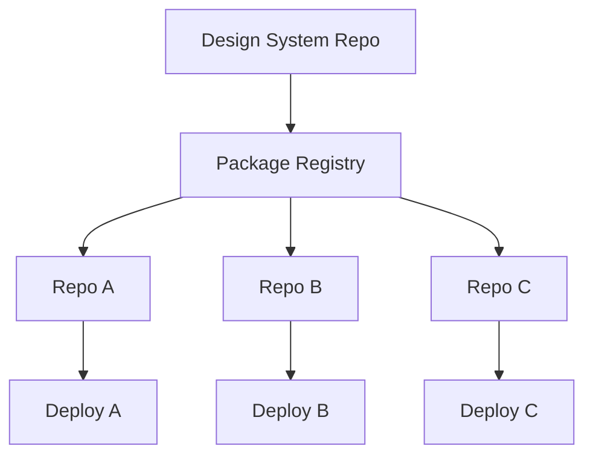

When you have one application, your design system is just… your code. A shared `Button` component, some color variables, maybe a Tailwind config. Nobody needs a governance strategy for that.

But, the moment you have multiple applications—separate repos, separate teams, separate deploy pipelines—consistency stops being automatic. Each team makes locally reasonable decisions that diverge over time. Six months later you've got three different shades of blue, two button APIs, and a Slack channel called `#design-system-help` that nobody reads.

The pattern we're looking at here is the **polyrepo with a shared design system**: each application lives in its own repository with its own pipeline and release process, and consistency is achieved by sharing versioned artifacts—components, tokens, guidelines—rather than runtime composition. This fits organizations where products are related but operationally independent, and semver contracts are preferred over shared runtime infrastructure.

## Why This Is Harder Than It Sounds

The architecture shape is straightforward:



You publish your design system to a registry. Applications consume it as a dependency. Clean, right?

In practice, the hard part isn't the architecture diagram. It's everything that happens _after_ you draw it:

- Cross-repo refactors are expensive and slow to roll out.
- Dependency update lag leads to version fragmentation—one app on v3, another still on v1.
- It's harder to enforce uniform code quality and architecture standards across repos you don't own.
- Duplicate tooling and boilerplate accumulate because each team scaffolds independently.
- Reusable code becomes invisible without deliberate platform support.

The upside is real, though: strong repo-level autonomy, independent delivery pipelines, low runtime coupling, clear ownership boundaries, and design consistency that scales through shared artifacts rather than shared infrastructure.

## Design Tokens as the Shared Foundation

The lowest-friction starting point is tokens. A design token is a named value—a color, a spacing unit, a font stack—that represents a design decision. Publish them as a dedicated package and every application consumes the same source of truth.

```css
/* @acme/design-tokens/tokens.css */
:root {
  --acme-color-primary: #2563eb;
  --acme-color-primary-hover: #1d4ed8;
  --acme-color-danger: #dc2626;
  --acme-color-surface: #ffffff;
  --acme-color-text: #0f172a;
  --acme-color-border: #e2e8f0;

  --acme-space-1: 0.25rem;
  --acme-space-2: 0.5rem;
  --acme-space-4: 1rem;
  --acme-space-6: 1.5rem;

  --acme-font-sans: 'Inter', system-ui, sans-serif;
  --acme-text-sm: 0.875rem;
  --acme-text-base: 1rem;

  --acme-radius-sm: 0.25rem;
  --acme-radius-md: 0.375rem;
  --acme-shadow-sm: 0 1px 2px rgba(0, 0, 0, 0.05);
}

[data-theme='dark'] {
  --acme-color-primary: #60a5fa;
  --acme-color-surface: #0f172a;
  --acme-color-text: #f1f5f9;
  --acme-color-border: #334155;
}
```

CSS custom properties are the right delivery mechanism here because they're framework-agnostic. A React app, a Svelte app, and a static HTML page can all consume the same token file. No build step required at the consumption site.

### Multi-format token output

If your repos need tokens in both CSS and JavaScript/TypeScript, generate all outputs from one source using **Style Dictionary**:

```javascript
// style-dictionary.config.js
module.exports = {
  source: ['tokens/**/*.json'],
  platforms: {
    css: {
      transformGroup: 'css',
      buildPath: 'dist/',
      files: [{ destination: 'tokens.css', format: 'css/variables' }],
    },
    js: {
      transformGroup: 'js',
      buildPath: 'dist/',
      files: [{ destination: 'tokens.js', format: 'javascript/es6' }],
    },
    ts: {
      transformGroup: 'js',
      buildPath: 'dist/',
      files: [{ destination: 'tokens.d.ts', format: 'typescript/es6-declarations' }],
    },
  },
};
```

One JSON source, three outputs. No hand-synchronization. The [Design Tokens Community Group (DTCG) format](https://www.designtokens.org/TR/2025.10/format/) is stabilizing as the interchange standard, so if you're starting fresh, consider authoring in that format from the beginning.

### Treating tokens as API

This is the mindset shift that matters: token _names_ and _semantic roles_ are your API surface. `--acme-color-primary` is a contract. Renaming it or changing what it means is a breaking change, same as renaming a function parameter. Publish machine-readable status metadata (`active`, `deprecated`, `deleted`) alongside your tokens so consuming teams can lint against deprecations before they become breakages.

## Shared Components

Tokens get you color and spacing consistency. Components get you interaction and layout consistency. The question is how to deliver them across repositories that might use different frameworks.

### Web Components for portability

In a polyrepo environment where teams have framework autonomy, **Web Components** reduce framework lock-in. A Lit-based component works in React, Vue, Svelte, and plain HTML:

```typescript
// @acme/ui/src/acme-button.ts
import { LitElement, html, css } from 'lit';
import { customElement, property } from 'lit/decorators.js';

@customElement('acme-button')
export class AcmeButton extends LitElement {
  @property() variant: 'primary' | 'secondary' | 'danger' = 'primary';
  @property({ type: Boolean }) disabled = false;

  static styles = css`
    button {
      font-family: var(--acme-font-sans);
      border-radius: var(--acme-radius-md);
      border: 1px solid transparent;
      padding: var(--acme-space-2) var(--acme-space-4);
      background: var(--acme-color-primary);
      color: #fff;
    }
    button:disabled {
      opacity: 0.5;
      cursor: not-allowed;
    }
    button.secondary {
      background: var(--acme-color-surface);
      color: var(--acme-color-text);
      border-color: var(--acme-color-border);
    }
    button.danger {
      background: var(--acme-color-danger);
    }
  `;

  render() {
    return html`
      <button class="${this.variant}" ?disabled=${this.disabled}>
        <slot></slot>
      </button>
    `;
  }
}
```

Consumption is just HTML:

```html
<acme-button variant="primary">Save</acme-button>
<acme-button variant="danger" disabled>Delete</acme-button>
```

Notice how the component consumes tokens through CSS custom properties. The theme contract flows _through_ the Shadow DOM boundary without any framework-specific wiring. React teams can use `@lit/react` wrappers to avoid custom-element interop friction.

The tradeoff with Web Components is real, though: Shadow DOM encapsulation means consumers can't restyle internals unless you explicitly expose them via `::part()`. That's a feature when you want strict consistency and a frustration when teams need legitimate customization. Expose minimal, sanctioned styling surfaces and document them as API.

### Tailwind presets for utility-first repos

If your repos use Tailwind, a shared preset keeps the utility class palette consistent:

```typescript
// @acme/tailwind-preset/index.ts
import type { Config } from 'tailwindcss';

export const acmePreset: Config = {
  theme: {
    extend: {
      colors: {
        primary: { DEFAULT: '#2563eb', hover: '#1d4ed8' },
        danger: '#dc2626',
        surface: { DEFAULT: '#ffffff', raised: '#f8fafc' },
      },
    },
  },
};
```

```typescript
// tailwind.config.ts in each repo
import { acmePreset } from '@acme/tailwind-preset';
import type { Config } from 'tailwindcss';

export default {
  presets: [acmePreset],
  prefix: 'cart-',
  content: ['./src/**/*.{ts,tsx,svelte,html}'],
} satisfies Config;
```

Prefix by app (`cart-`, `settings-`, `admin-`) to avoid class collisions if these surfaces ever get composed together.

## CSS Isolation

Style collisions across team boundaries are one of the most common sources of visual bugs in multi-app environments. A layered isolation strategy handles this:

**CSS Modules** for default app-level scoping—each component gets locally-scoped class names without any runtime cost:

```css
/* CartItem.module.css */
.wrapper {
  display: flex;
  gap: var(--acme-space-4);
  padding: var(--acme-space-4);
  background: var(--acme-color-surface);
  border-radius: var(--acme-radius-md);
}
```

**CSS cascade layers** for deterministic ordering—when multiple sources of styles exist (tokens, resets, app code), layers eliminate specificity guesswork:

```css
@layer tokens, reset, app;

@layer tokens {
  :root {
    --acme-color-primary: #2563eb;
  }
}

@layer reset {
  *,
  *::before,
  *::after {
    box-sizing: border-box;
    margin: 0;
  }
}
```

**Shadow DOM** for high-isolation shared components—when a component absolutely must not be affected by surrounding styles. This is the Web Components approach from above.

The combination gives you scoping at the app level, predictable cascade ordering across layers, and hard encapsulation where you need it.

## Visual Regression in CI

Every repo should run visual tests against its own components. Platform repos should _also_ run composed-view tests that verify what users actually see when multiple applications appear together.

**Chromatic** handles the isolated component case:

```json
{
  "scripts": {
    "chromatic": "chromatic --project-token=CHROMATIC_PROJECT_TOKEN"
  }
}
```

For composed views, you need a Storybook story or test page that mounts multiple application slices together:

```typescript
import { mountCart } from 'cart-mfe/mount';
import { mountHeader } from 'header-mfe/mount';
import { useEffect, useRef } from 'react';

export const ComposedDashboard = () => {
  const headerRef = useRef<HTMLDivElement>(null);
  const cartRef = useRef<HTMLDivElement>(null);

  useEffect(() => {
    const headerCleanup = mountHeader(headerRef.current!, {
      user: { name: 'Demo User' },
    });
    const cartCleanup = mountCart(cartRef.current!, {
      items: [{ id: '1', name: 'Item', price: 25 }],
    });
    return () => {
      headerCleanup.unmount();
      cartCleanup.unmount();
    };
  }, []);

  return (
    <div>
      <div ref={headerRef} />
      <div ref={cartRef} />
    </div>
  );
};
```

And **Playwright** for snapshot testing the composed result:

```typescript
import { test, expect } from '@playwright/test';

test('composed view matches snapshot', async ({ page }) => {
  await page.goto('/dashboard');
  await page.waitForSelector('[data-mfe="header"]');
  await page.waitForSelector('[data-mfe="sidebar"]');
  await expect(page).toHaveScreenshot('dashboard-composed.png', {
    maxDiffPixelRatio: 0.01,
  });
});
```

## Enforcing Consistency at Build Time

Documentation gets ignored. Lint rules don't.

### Token enforcement with Stylelint

Prevent hardcoded color values by requiring token usage:

```javascript
// .stylelintrc.js
module.exports = {
  plugins: ['stylelint-declaration-strict-value'],
  rules: {
    'scale-unlimited/declaration-strict-value': [
      ['/color/', 'background-color', 'border-color'],
      {
        ignoreValues: ['transparent', 'inherit', 'currentColor', 'none'],
        disableFix: true,
        message: 'Use var(--acme-color-*) token values.',
      },
    ],
  },
};
```

### Component policy with ESLint

Ban raw HTML elements when a design system component exists:

```javascript
module.exports = {
  create(context) {
    return {
      JSXOpeningElement(node) {
        if (node.name.name === 'button') {
          context.report({
            node,
            message: 'Use shared DS Button component instead of raw <button>.',
          });
        }
      },
    };
  },
};
```

These rules live in shared lint preset packages that every repo installs. CI enforces them. Nobody has to remember the policy—the build fails if you violate it.

## The Governance Model

The technical tooling only works if the organizational model supports it. Here's the pattern I've seen work:

A **central platform team** owns the cross-cutting contracts: tokens, theme and context schema, shared dependency policy, accessibility baseline, and the enforcement tooling (lint presets, CI templates, testing infrastructure). They treat the design system as a product with a roadmap and SLAs, not a side project that somebody maintains when they have time.

**Federated product teams** own their feature implementations within those contracts. They have full autonomy over their repos, their frameworks, their deploy schedules. The constraint is that they consume the shared tokens, use the shared components where they exist, and pass CI checks that enforce the boundaries.

A **governance board** resolves disputes about contract-level decisions and version policy exceptions. This sounds bureaucratic, but in practice it's a monthly meeting where someone asks "can we break this token name?" and the group decides whether the migration cost is worth it.

The critical governance artifacts:

- **Platform context contract**: theme, locale, directionality, density, accessibility preferences.
- **Styling precedence contract**: layer ordering and override policy.
- **Dependency sharing contract**: what's shared, how, and with which compatibility guarantees.
- **Exception policy**: owner, expiry date, and remediation path for every exception.

The principle: decentralize feature delivery, centralize contracts and enforcement tooling. Enforce with CI, not policy docs alone.

## Versioning and Migration

Version _contracts_, not just packages. Your contract surfaces include:

- Token schema and semantic meaning.
- Component APIs and sanctioned styling surfaces (`::part()` names, CSS custom property hooks).
- Theme and context APIs.
- Event and telemetry schemas used across applications.

Use semver with declared public API. Keep long compatibility windows for platform contracts—support at least N and N-1 where feasible. Publish deprecation timelines with dates and upgrade paths, not just "this is deprecated, good luck."

For the migration tooling baseline:

- **Codemods** for mechanical API and token migrations (jscodeshift for JS/TS, PostCSS plugins for CSS).
- **Lint rules** that flag deprecated tokens and anti-patterns with auto-fix paths.
- **Per-architecture migration guides**, not just package changelogs.

Atlassian's design system team is a good reference here—they invested heavily in lifecycle-based token governance with migration tooling, linting, and codemods. The lesson: enterprise migrations succeed with automation, not documentation alone.

## Quality at the Composed Level

Distributed UX quality requires layered verification:

- **Contract tests**: token availability, context shape, dependency policy checks.
- **Slice tests**: component behavior and accessibility in isolation.
- **Composed integration tests**: cross-slice routing, focus order, theme propagation.
- **Visual regression**: canonical theme, density, and contrast variants.

For accessibility, align with WCAG 2.2 and WAI-ARIA 1.2. Treat keyboard traps and focus-loss defects as release blockers. And—this is the part people miss—validate accessibility in _composed_ environments, not only in isolated Storybook stories. A component can be perfectly accessible in isolation and completely broken when mounted alongside three other applications that all fight over focus.

For release safety, canary all contract-affecting releases. Evaluate against explicit error, performance, and accessibility budgets. Keep mitigation-first incident playbooks and tested rollback paths (import-map revert, remote disable, feature flag kill switch).

## What to Measure

- **Design system version distribution** across applications—how fragmented are you?
- **Median time to adopt** a design system major or minor release.
- **Cross-repo defect rate** tied to divergent implementations.
- **Engineering effort** spent on duplicated platform work.
- **Deployment frequency and change failure rate** (standard DORA metrics).
- **Route-level performance** (TTFB, FCP, INP) for critical user journeys.

## Investment Guide

| Strategy                               | Role                                | Investment  |
| :------------------------------------- | :---------------------------------- | :---------- |
| Tokens (CSS custom properties)         | Required visual contract            | Low         |
| Style Dictionary                       | Multi-target token output           | Medium      |
| Shared components (Lit/Web Components) | Cross-repo UI consistency           | Medium–High |
| Tailwind preset with app prefix        | Utility-first standardization       | Low         |
| CSS Modules + cascade layers           | Style isolation and cascade control | Low         |
| Chromatic and Playwright               | Visual regression safety            | Medium      |
| Lint enforcement (Stylelint + ESLint)  | Contract compliance in CI           | Medium      |

## When This Pattern Fits

- Applications are operationally independent but should look and feel coherent.
- Teams need full repo and release autonomy.
- Runtime composition is unnecessary or undesirable.
- The organization can sustain a design system product team.

## When to Avoid It

- You need frequent cross-application coordinated behavior changes.
- The organization can't maintain a dedicated design system team. (Without one, the shared artifacts rot and teams route around them.)

## Lessons from the Field

**IBM Carbon**: strong on explicit migration and deprecation communication. The transferable lesson is that package reshaping needs dates, replacement paths, and consumer-specific guidance—not just a changelog entry.

**Shopify Polaris**: strategic move toward framework-agnostic boundaries with Web Components. The lesson is that Web Component boundaries can improve adoption in polyglot organizations, but transition periods fragment the source of truth unless token contracts are centralized first.

**Atlassian Design System**: lifecycle-based token governance with migration tooling, linting, and codemods at scale. The lesson is that centralized contribution control can bottleneck throughput without clear extension paths for product teams.

**GitHub Primer**: high-quality contribution and documentation standards. The lesson is that stable foundations plus rigorous review processes improve long-term consistency, even when it slows down the initial contribution cycle.

The cross-case pattern: contract clarity plus migration tooling plus operational release discipline is the durable formula. No amount of Figma polish substitutes for those three things.
