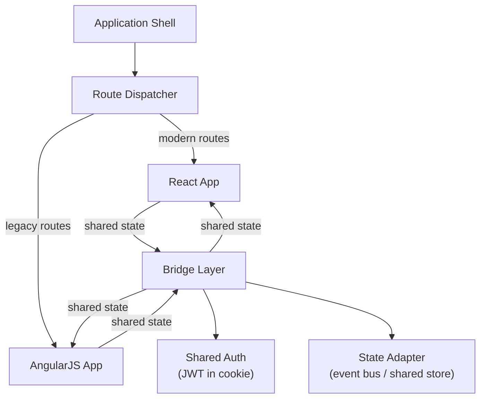
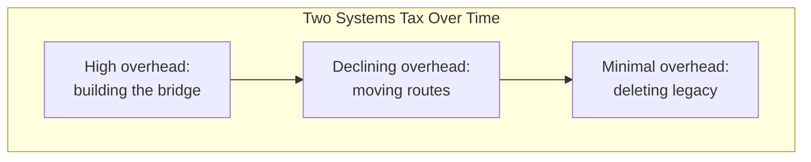
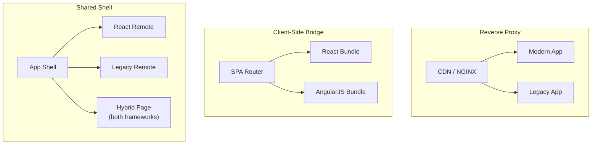

So, your application is built on a framework that's either deprecated, unsupported, or two major versions behind the current release. You'd love to be on the modern version—or a different framework entirely—but the application has hundreds of routes, dozens of contributors, and actual users who expect it to keep working while you figure this out.

This is the framework migration problem, and it's where the [strangler fig concept](strangler-fig-introduction.md) meets the messy reality of rendering cycles, shared state, and authentication tokens. The strangler fig gives you the routing strategy: put a façade in front, route incrementally, delete the old path when the new one proves itself. This section covers what happens _inside_ that façade—the bridge engineering that lets two frameworks coexist in the same application without regressing.

## The bridge layer

When you run two frameworks side by side—say, an AngularJS monolith and a modern React application—they don't naturally know about each other. They have different rendering cycles, different dependency injection systems, different expectations about who owns the DOM. The **bridge layer** is the infrastructure you build to make these two runtimes coexist without collision.



The bridge has three jobs:

- **State synchronization**: if a user updates data in a legacy component, the modern component sees the change, and vice versa.
- **Authentication sharing**: both frameworks read from the same auth token so navigation between them doesn't trigger a re-login.
- **Lifecycle coordination**: the legacy digest cycle and the modern reactive cycle don't collide or trigger infinite update loops.

The first two are solvable with well-known patterns. The third one is where the subtle bugs live.

## Dual bootstrapping

The most common bridge pattern is **dual bootstrapping**: both frameworks initialize and mount in the same page, each owning a region of the DOM. A thin shell—often framework-agnostic HTML—provides the chrome (navigation, header, footer) and mounts the active framework's root into a container `div`.

For AngularJS-to-Angular migrations specifically, the [ngUpgrade][1] library creates a hybrid mode where Angular components can be "downgraded" to work inside AngularJS templates, and AngularJS services can be "upgraded" for injection into Angular components. This is a first-party escape hatch designed for exactly this kind of gradual transition.

For migrations to React or Vue from AngularJS, the pattern usually involves wrapping the new framework's components as [Custom Elements][2] (Web Components) and rendering them inside AngularJS directives. Libraries like `react2angular` and `ngVue` automate the wrapper boilerplate. The general shape looks like this:

```typescript title="bridge/react-wrapper.directive.ts"
import { createRoot } from 'react-dom/client';
import { ModernDashboard } from '@app/dashboard';

angular.module('legacyApp').directive('modernDashboard', () => ({
  restrict: 'E',
  link: (scope, element) => {
    const root = createRoot(element[0]);
    root.render(<ModernDashboard />);
    // [!note Mounts a React component tree inside an AngularJS directive.]

    scope.$on('$destroy', () => root.unmount());
  },
  // [!note Cleans up the React root when AngularJS destroys the directive's scope.]
}));
```

The key discipline here is lifecycle cleanup. If the AngularJS scope is destroyed (the user navigates away), the React root must be unmounted. If the React component subscribes to a shared store, the subscription must be cleaned up on unmount. Leaking subscriptions or orphaned DOM nodes is the most common bug in dual-bootstrap systems, and it manifests as gradually increasing memory usage that only shows up under sustained use.

## Shared state across frameworks

When both frameworks render components that depend on the same data, you need a single source of truth that both runtimes can read from and write to. The typical approach is to externalize shared state into something framework-agnostic—a plain event bus, a shared observable, or a small store library like [nanostores](nanostores.md) that has bindings for both frameworks.

```typescript title="bridge/shared-state.ts"
import { atom } from 'nanostores';

export const currentUser = atom<User | null>(null);
export const notifications = atom<Notification[]>([]);
// [!note Framework-agnostic atoms that both React and AngularJS can subscribe to.]
```

The React side uses `useStore(currentUser)`. The AngularJS side uses a service that subscribes to the atom and triggers `$scope.$apply()` when the value changes. Both frameworks see the same value, and writes from either side propagate immediately.

> [!WARNING] Watch the digest cycle
> AngularJS's change detection runs on digest cycles, not on reactive subscriptions. When an external store updates, AngularJS won't notice unless you explicitly trigger a digest. Wrapping the subscription callback in `$scope.$apply()` handles this, but calling `$apply` during an already-running digest throws an error. Use `$scope.$applyAsync()` or check `$$phase` if you hit this—it's exactly the kind of subtle interop bug that dual bootstrapping introduces.

Authentication is a specific case of shared state with higher stakes. The standard approach is to store the auth token (usually a JWT) in an `HttpOnly` cookie or a shared `sessionStorage` key, then have both frameworks check that central store. Neither framework "owns" authentication—it's a concern of the shell or the bridge layer. This prevents the situation where navigating from a React route to a legacy route requires the user to log in again.

## The "two systems tax"

During any framework migration, your team is maintaining two rendering runtimes, two sets of tooling conventions, and two mental models for how data flows through the application. This overhead—the time spent bridging, synchronizing, debugging interop issues, and context-switching between paradigms—is the **two systems tax**.

It's a real cost, and it's the reason many migrations stall. The tax is highest at the beginning, when the bridge infrastructure is still being built and developers are learning to work across both systems. It decreases as more of the application moves to the target framework and the legacy surface area shrinks.



Teams manage the tax in a few ways:

- **Rotation model**: a portion of each sprint is dedicated to migration work, so feature velocity continues while the legacy footprint shrinks.
- **Platform team**: a dedicated group owns the bridge infrastructure and tooling, while feature teams continue shipping against whichever framework their routes use.
- **Migration-first rule**: new features go into the modern framework, and legacy code only receives bug fixes. This prevents the legacy side from growing while you're trying to shrink it.

The third rule is the most important and the most frequently violated. Every new feature that lands in the legacy codebase extends the migration timeline and increases the bridge surface area. If the migration is going to succeed, new work _must_ go into the new system. As we covered in the [strangler fig introduction](strangler-fig-introduction.md): if new work keeps flowing into the legacy code, you're not strangling it. You're feeding it vitamins.

## The 70% stall

There's a common failure mode where the most visible, high-traffic features are migrated early—the homepage, the main dashboard, the checkout flow—but the complex, low-traffic legacy core lingers. Nobody wants to touch the admin panel built in 2017. The reporting module has undocumented business logic that nobody fully understands. The settings page has a form with forty fields and custom validation that predates the current team.

This is the **70% stall**: the migration reaches a point where the remaining 30% is disproportionately harder than everything that came before, and organizational energy shifts to new features instead of finishing the job. The result is a permanent hybrid architecture—not as a deliberate choice, but as an accidental one.

Preventing the stall requires a rigorous definition of "done." The migration is not complete when the high-traffic routes work in the new framework. It's complete when the legacy application has zero routes, its dev server is shut down, its directory is deleted, and its build dependencies are removed from the project. If the definition of done doesn't include deletion, the deletion won't happen.

Teams that successfully avoid the stall tend to use **ratcheting**—build-time or lint-time rules that prevent new code from being written in the legacy style. An ESLint rule that flags imports from the legacy directory. A CI check that fails if the number of legacy files increases. A dashboard that tracks migration progress and makes the remaining work visible. These are the same architectural enforcement patterns from [Writing Our Own ESLint Rules](writing-eslint-rules.md), applied to migration tracking instead of package boundaries.

## What Etsy got right

Etsy's multi-year migration of seventeen thousand JavaScript files to TypeScript is one of the better-documented success stories. Their [engineering blog][3] describes a gradual adoption strategy driven by a few key decisions:

- They typed core utilities and shared libraries first—the **infrastructure-first** approach. Feature developers had high-quality types available from day one of their own conversions.
- They distinguished between "trusted" `.ts` files (which had accurate type signatures) and legacy `.js` files (which might have `any` everywhere). This gave developers confidence that typed code was _genuinely_ typed, not just renamed.
- They focused on actively developed areas rather than trying to convert dormant code. Files that hadn't been touched in a year could wait.
- They enabled strict TypeScript flags incrementally, ratcheting up strictness on a per-directory basis rather than flipping `strict: true` globally and drowning in errors.

The migration succeeded because it was designed to deliver value incrementally. Each converted file made the surrounding code easier to work with. Developers weren't converting files as a chore—they were improving their own working environment.

This is the same principle we discussed in [Scaling TypeScript](scaling-typescript.md): the type system is most useful when it's trustworthy, and trustworthiness comes from being strict in the places that matter rather than being permissive everywhere.

## What Lyft got wrong

A [cautionary tale][4] from Lyft illustrates the opposite trajectory. What started as a platform migration spiraled as the team tried to simultaneously redesign the data model, optimize performance, and restructure the entire application. The migration took so long that the _target_ platform became legacy before the migration finished.

This is the "double disaster" of delayed migrations: you lose velocity during the transition _and_ the destination moves out from under you. The original migration was supposed to take a few quarters. It took years. By the end, the team was stuck on an outdated system after investing enormous effort to get there.

The lesson is scope discipline. A migration should change the framework—not the data model, not the feature set, not the deployment topology, not the state management approach. If you want to change all of those things, do them sequentially. Trying to modernize everything simultaneously is how you end up building a system that's legacy before it launches.

> [!NOTE] Migration versus modernization
> "Migrate the framework" and "modernize the architecture" are different projects that happen to overlap in time. Conflating them is the single most common cause of migration failure. Move the code first. _Then_ refactor the architecture in the new framework, where you have modern tooling and a clean foundation to work with.

## Routing mechanisms for the bridge

The [strangler fig introduction](strangler-fig-introduction.md) covers the general routing concept. In framework migrations specifically, there are three common implementations:

| Mechanism                     | Where it runs                    | How it works                                                                                                                                                              |
| :---------------------------- | :------------------------------- | :------------------------------------------------------------------------------------------------------------------------------------------------------------------------ |
| **Reverse proxy**             | Infrastructure (NGINX, CDN edge) | Routes are split by URI path at the network level. The most decoupled option, but sharing session state across origins requires extra work.                               |
| **Client-side router bridge** | Application (SPA router)         | A unified router loads different framework bundles based on the URL. Preserves the single-page feel but requires careful management of global CSS and window-level state. |
| **Shared shell**              | Application (Module Federation)  | A thin, framework-agnostic shell orchestrates micro-apps. The most sophisticated option—handles hybrid pages where legacy and modern components coexist in the same view. |

The reverse proxy approach is the simplest to implement and the safest to operate. It's also the easiest to roll back: if a migrated route has problems, you change the proxy config and traffic goes back to the legacy app. The downside is that navigation between legacy and modern routes triggers full page loads, which breaks the single-page illusion.

Client-side routing preserves seamless navigation but introduces framework collision risks—CSS leaking across boundaries, global variables conflicting, event handlers interfering. If you go this route, CSS isolation through Shadow DOM, CSS Modules, or strict naming conventions is non-negotiable.

The shared shell approach, typically implemented with [Module Federation](module-federation.md), is the most flexible but also the most complex. It's the right choice when you need hybrid pages—where a legacy sidebar coexists with a modern content area during the transition—but the operational overhead is significant. Don't reach for it unless you actually need that level of granularity.



## Piloting the migration

Luca Mezzalira's advice for microfrontend transitions applies equally well to framework migrations: pilot an end-to-end flow with a single migrated route before committing to the full migration. Pick something relatively self-contained and low-risk—a settings page, a help section, an internal dashboard—and migrate it completely. Test the entire flow from development through deployment and monitoring.

The pilot validates the bridge infrastructure, surfaces infrastructure gaps (like missing shared auth), and gives the team experience with the dual-bootstrap workflow before the stakes are high. If the pilot takes two weeks, you have a realistic basis for estimating the rest. If the pilot takes two months, you've learned something important before betting the roadmap on it.

## Data architecture migration

Framework migration gets all the attention, but data architecture migration—how your application fetches, caches, and manages server state—is often the quieter, higher-leverage change. A codebase that swaps React for Vue but keeps the same verbose, boilerplate-heavy data layer hasn't modernized much. It's moved the furniture without fixing the plumbing.

### Redux to React Query

Large-scale Redux implementations tend to accumulate a specific kind of bloat: action types, action creators, thunks, reducers, selectors, and middleware—all to manage what is fundamentally _server cache_. The data isn't application state in the meaningful sense. It's a local copy of something that lives on a server, with its own staleness, invalidation, and refetching concerns.

[React Query][5] (now TanStack Query) treats server data as exactly that—a specialized cache with built-in mechanisms for invalidation, background refetching, and optimistic updates. The migration from Redux to React Query is typically conducted incrementally, one feature at a time:

- Identify a Redux "duck" (feature module) that primarily manages server data—a list of users, a set of orders, a dashboard feed.
- Rewrite the data fetching as a `useQuery` hook. The hook handles loading states, error states, caching, and refetching automatically.
- Remove the corresponding Redux actions, reducers, and selectors.
- Repeat for the next feature.

```tsx
// Before: Redux thunk + reducer + selector for fetching orders
dispatch(fetchOrders());
const orders = useSelector(selectOrders);
const isLoading = useSelector(selectOrdersLoading);

// After: React Query hook
const { data: orders, isLoading } = useQuery({
  queryKey: ['orders'],
  queryFn: () => api.getOrders(),
});
```

During the transition, both systems coexist. Legacy features continue to use Redux while new features use React Query. As more features migrate, the Redux store shrinks until it either disappears entirely or is reduced to a small store for genuinely global UI state—things like sidebar open/closed, active theme, or modal visibility—that aren't server data at all.

The scope discipline from the framework migration section applies here too. Migrate the data layer _separately_ from the framework. If you're simultaneously swapping React for something else, moving from Redux to React Query, and restructuring your API layer, you've built the Lyft failure into your project plan.

### REST to GraphQL

For applications consuming dozens of REST endpoints, the move to [GraphQL][6] provides a single aggregation layer that eliminates over-fetching (getting more fields than you need) and under-fetching (making N+1 requests to assemble one view).

The migration almost never involves rewriting the backend. Instead, a GraphQL server sits between the frontend and the existing REST APIs. The GraphQL resolvers call the REST endpoints as a data source, and the frontend gets the benefit of declarative, single-round-trip queries without anyone touching the existing services.

```text
Frontend  →  GraphQL Gateway  →  REST API A
                               →  REST API B
                               →  REST API C
```

The frontend migrates endpoint by endpoint. New views use GraphQL queries. Existing views continue hitting REST directly until someone rewrites them. The GraphQL gateway grows as more resolvers are added, and the REST-direct paths shrink. It's a strangler fig for your API layer.

The trap is migrating to GraphQL for "web-scale" cachet without a clear technical driver. If your REST APIs are well-designed and your frontend doesn't have over-fetching or N+1 problems, GraphQL adds complexity without solving a problem. Migrate because the data-fetching patterns genuinely hurt, not because the architecture deck looks cooler with a box labeled "GraphQL" in the middle.

### The SSR and Server Components frontier

The current edge of frontend modernization is the shift from client-side rendering to server-side rendering and [React Server Components](server-components-and-streaming.md). The business driver is real: heavy client-side JavaScript bundles degrade Core Web Vitals on mobile devices, and the performance cost of hydrating a large SPA on every page load is increasingly hard to justify for content-heavy pages.

Migrating to SSR or RSC is a different kind of transition than the framework swaps we've discussed. It changes _where_ code runs, not just _which_ code runs. Data fetching moves to the server. Components are classified as server or client. The mental model shifts from "one big client app" to "server-rendered by default, client-interactive where needed."

Most organizations start this transition with the pages where the performance benefit is highest—high-traffic marketing pages, product pages, or homepages—and work inward toward the more interactive, stateful sections. The [server components and streaming lecture](server-components-and-streaming.md) covers the technical model. The migration pattern is the same one we've been discussing: incremental, behind a routing layer, with both old and new implementations running simultaneously until the old path can be retired.

## Validating at scale

When the application serves millions of users, you can't afford to discover migration bugs in production. The same incremental philosophy that governs the migration itself should govern the validation.

**Shadow logic** is the safest validation technique for high-stakes migrations. Run both the legacy and modern implementations in parallel, compare their outputs, and log discrepancies—without exposing the modern path to users. The modern implementation is exercised under real production conditions, but the legacy system remains the source of truth until the shadow results prove the new path is correct.

**Staged rollouts** complement shadow logic with real user exposure. Route 1% of users to the modern implementation, monitor error rates and performance metrics, and expand incrementally. Combined with feature flags from the [deployment and release patterns lecture](deployment-and-release-patterns.md), this gives you a continuous feedback loop between migration progress and production health.

**Regression pipelines** catch visual and functional regressions before they reach production. Automated screenshot comparison, accessibility audits, and end-to-end tests should run against every migrated route in CI. The cost of these checks is trivial compared to the cost of a regression that reaches a million users.

## The shortest useful summary

Framework migration is a strangler fig with extra steps. The routing strategy is the same: put a façade in front, move one route at a time, delete the old path when the new one works. The bridge layer is the part that makes it _possible_—shared state, shared auth, lifecycle coordination. The organizational discipline is the part that makes it _finish_—new work goes into the new system, migration progress is tracked and enforced, and "done" means deletion, not dormancy.

Data architecture migration follows the same pattern—incremental, parallel, with both systems coexisting until the old path is retired. TypeScript adoption follows it too, starting with infrastructure and moving outward. The principle is always the same: controlled coexistence, gradual cutover, and deletion of the old path when the new one proves itself.

If the migration starts feeling like it has no end in sight, check for scope creep. If the easy routes are done but the hard routes keep getting deferred, check for the 70% stall. If new features keep landing in the legacy code, check for the migration-first rule. These are all management failures dressed up as technical complexity.

We'll apply these patterns hands-on in [Exercise 9](strangler-fig-and-codemods-exercise.md), where you'll set up a routing-level strangler fig and use [codemods](codemods-at-scale.md) to automate the mechanical parts of the migration.

[1]: https://angular.dev/guide/upgrade 'Upgrading from AngularJS to Angular'
[2]: https://developer.mozilla.org/en-US/docs/Web/API/Web_components 'Web Components - MDN'
[3]: https://www.etsy.com/codeascraft/etsys-journey-to-typescript "Etsy's Journey to TypeScript"
[4]: https://www.datafold.com/data-migration-guide/what-data-practitioners-wish-they-knew '7 Lessons from Data Practitioners on Migration Failures and Fixes'
[5]: https://tanstack.com/query/latest 'TanStack Query'
[6]: https://graphql.org/ 'GraphQL'

---

## Slides

### Slide: The Bridge Layer

> Two frameworks coexist — a bridge makes them talk.

- **React ↔ Angular:** `react2angular` / `angular2react` adapter directives.
- **React ↔ jQuery:** Mount React components into jQuery-managed DOM regions.
- **Any ↔ Any:** Web Components as the universal bridge — wrap framework components in custom elements.

**Shared state across frameworks:**

- Framework-agnostic stores (nanostores, vanilla JS event emitters).
- _Not_ Redux, Vuex, or any framework-specific store — those can't cross the bridge.

---

### Slide: The Two Systems Tax

> Running two frameworks simultaneously has a cost.

- Double the bundle size until migration completes.
- Two mental models for developers.
- Two sets of tooling, testing, and debugging workflows.
- Two upgrade paths to maintain.

**Managing the tax:**

- **Rotation model** — every team spends N% of sprints on migration.
- **Platform team** — dedicated team owns the bridge and migration tooling.
- **Migration-first rule** — new features are built in the new framework only.

**The 70% stall:** Most migrations stall at ~70% because the remaining 30% is the hardest code. Use a ratcheting approach — once a module is migrated, it can never go back.

```

```
