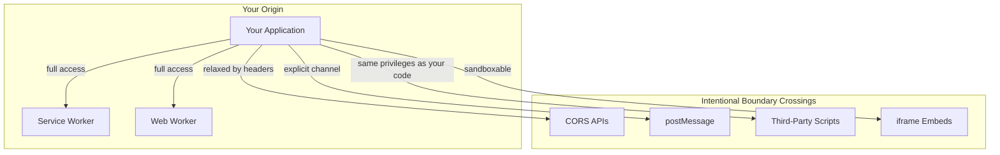
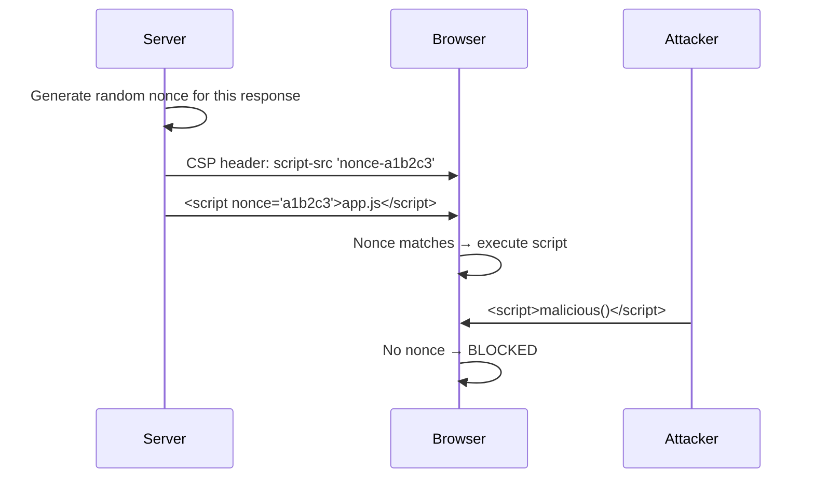
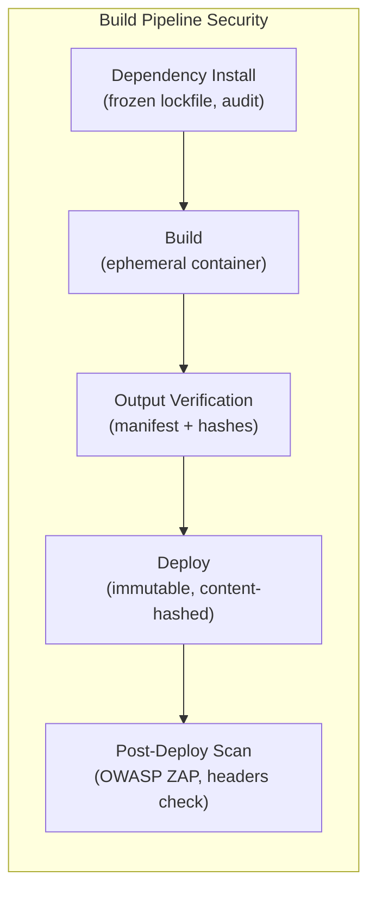
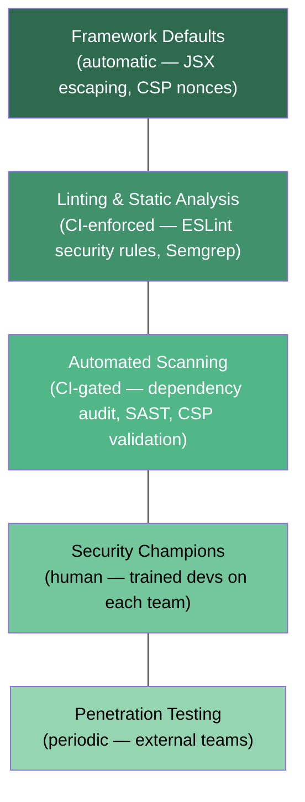

Frontend security used to be a short conversation. Escape your outputs, set some headers, do not put secrets in the bundle. That was about it. The frontend was a thin rendering layer, and the real security work happened on the server.

That is not where we are anymore. Modern enterprise frontends are thick clients. They contain business logic, authentication state, user data, and a dependency tree with a thousand transitive packages—each one a potential entry point for an attacker. The application loads scripts from multiple origins, communicates with backend services across trust boundaries, and runs third-party code with the same privileges as your own. The security posture of this system is not a checklist of headers. It is an architectural discipline.

## The Browser's Trust Model

The browser's foundational security mechanism is the **Same-Origin Policy** (SOP): code from one origin (scheme + host + port) cannot read data from another origin. `https://app.example.com` and `https://api.example.com` are different origins. `http://` and `https://` on the same host are different origins. `localhost:3000` and `localhost:3001` are different origins. The [SOP][1] is the reason a random webpage cannot read your email.

Enterprise applications routinely pierce this boundary. CORS headers allow cross-origin API calls. `postMessage` enables cross-origin iframe communication. Third-party `<script>` tags run with full access to the host page's DOM. Every one of these is an intentional weakening of the isolation model, and every one of them is a place where security assumptions can break.



The uncomfortable truth about third-party scripts is worth stating plainly: a `<script src="https://analytics.example.com/tag.js">` tag gives that script identical privileges to your own code. It can read the DOM, access `localStorage`, register event listeners on input fields, and make network requests to any origin. If the analytics provider gets compromised—or if a tag manager lets marketing inject arbitrary JavaScript—the attacker has the same access as your most senior engineer.

| Trust boundary          | Mechanism                             | What breaks when it is breached         |
| ----------------------- | ------------------------------------- | --------------------------------------- |
| **Same-origin**         | SOP, cookie scoping                   | Full DOM access, credential theft       |
| **Cross-origin API**    | CORS headers                          | Data exfiltration, CSRF                 |
| **Third-party scripts** | `<script>` tags, tag managers         | Keylogging, session hijacking, skimming |
| **iframe embeds**       | `sandbox` attribute, CSP              | Clickjacking, phishing                  |
| **Service Workers**     | Origin-scoped, intercepts all fetches | Client-side man-in-the-middle           |

## Content Security Policy

Content Security Policy (CSP) is the single most impactful security mechanism available to frontend developers. A well-configured CSP dramatically reduces the impact of XSS by telling the browser which resources it is allowed to load and execute. If an attacker injects a `<script>` tag that is not permitted by the policy, the browser blocks it.

And yet, CSP remains one of the most poorly implemented security features in enterprise applications. The usual failure mode is deploying a policy so permissive that it provides no meaningful protection, or skipping it entirely because "it was breaking things in staging."

### How CSP directives work

A CSP is a set of directives, each controlling a different resource type. The policy is delivered via an HTTP response header:

```
Content-Security-Policy:
  default-src 'self';
  script-src 'self' 'nonce-{random}' https://cdn.trusted-analytics.com;
  style-src 'self' 'unsafe-inline';
  img-src 'self' data: https://images.cdn.example.com;
  connect-src 'self' https://api.example.com wss://realtime.example.com;
  frame-src 'self' https://auth.provider.com;
  frame-ancestors 'self';
  base-uri 'self';
  form-action 'self';
```

`default-src` is the fallback for any directive not explicitly listed. `script-src` controls JavaScript sources. `connect-src` controls `fetch`, `XMLHttpRequest`, and WebSocket destinations. The browser enforces each directive independently—if a resource does not match the directive's allowlist, it is blocked and a violation is reported.

### Nonce-based CSP

The modern approach to CSP uses **nonces** rather than domain allowlists. [Google's strict CSP guidance][2] recommends this strategy because domain-based allowlists are surprisingly easy to bypass (any script on a trusted CDN becomes an attack vector), while nonces tie script execution to a specific page load.

The flow:



Every legitimate inline script includes the server-generated nonce. Any injected script without the matching nonce is blocked. The nonce changes on every response, so an attacker who discovers one nonce cannot reuse it.

The **`strict-dynamic`** keyword extends this: if a trusted script (one with a valid nonce) dynamically creates additional scripts, those are also trusted. [Google's CSP documentation][2] describes `strict-dynamic` as the mechanism that makes nonce-based CSP practical for applications that load code dynamically—including Module Federation remotes.

> [!NOTE] CSP and Server Components
> Nonce-based CSP works naturally with server-rendered frameworks (Next.js, Remix, SvelteKit) because the server generates the nonce during rendering and injects it into both the header and the script tags. For purely client-rendered SPAs, the nonce must be generated by the BFF or reverse proxy.

### CSP in microfrontend architectures

CSP becomes more complex when multiple teams deploy independently. The shell application's CSP must be permissive enough to allow all remotes, which risks weakening the policy.

The `strict-dynamic` nonce approach helps here. If the shell loads a Module Federation remote with a valid nonce, that remote's dynamically created scripts are automatically trusted. This avoids maintaining an ever-growing allowlist of remote origins in the CSP.

For iframe-based microfrontends, each iframe can have its own CSP—the strongest isolation model. The tradeoff is the communication overhead that comes with iframe boundaries.

### Deploying CSP progressively

Do not deploy a strict CSP to production on a Friday afternoon and hope for the best. The deployment should follow a progression:

- **Report-only mode first**. The `Content-Security-Policy-Report-Only` header collects violations without blocking anything. Deploy this, let it run for a week or two, and analyze what breaks.
- **Analyze violations**. Use the [Reporting API][3] or services like report-uri.com to aggregate violations. Most violations are legitimate things you forgot to allow—not attacks.
- **Tighten iteratively**. Move from permissive to strict as you resolve each violation category. Remove `unsafe-inline` from `script-src` first (replace with nonces), then tighten `connect-src`, `img-src`, and others.
- **Enforce**. Switch from `Report-Only` to enforcing once the violation rate is manageable.
- **Monitor continuously**. CSP violations should feed into your [observability pipeline](/courses/enterprise-ui/observability) as a security signal. A spike in violations after a deploy likely means a regression.

## XSS Prevention Beyond Escaping

Output escaping is the foundation of XSS prevention, and modern frameworks do it by default. React auto-escapes JSX values. Vue auto-escapes template interpolation. Svelte auto-escapes expression bindings. Angular sanitizes DOM assignments. The pattern across frameworks is consistent: safe by default, with explicitly named escape hatches (`dangerouslySetInnerHTML`, `v-html`, `{@html}`, `bypassSecurityTrustHtml`) that can be detected by static analysis and flagged in code review.

But, escaping is one layer. Enterprise applications need defense in depth.

### Trusted Types

**Trusted Types** is a browser API that provides programmatic enforcement against DOM XSS. When enabled via CSP (`require-trusted-types-for 'script'`), the browser rejects string assignments to dangerous DOM sinks—`innerHTML`, `eval`, `document.write`, `script.src`, event handler attributes—unless the value is wrapped in a Trusted Type object.

```typescript
// Define a policy that sanitizes HTML input
const sanitizePolicy = trustedTypes.createPolicy('sanitize', {
  createHTML: (input: string) => DOMPurify.sanitize(input),
  // [!note The policy is a centralized, auditable enforcement point. One place to get sanitization right.]
  createScriptURL: (input: string) => {
    const url = new URL(input);
    if (allowedHosts.includes(url.hostname)) return input;
    throw new Error(`Untrusted script URL: ${input}`);
  },
});

// The browser enforces this—raw strings are rejected
element.innerHTML = sanitizePolicy.createHTML(userContent);
```

[Trusted Types][4] are particularly valuable in enterprise applications where multiple teams contribute code and "do not use `innerHTML`" is difficult to enforce through code review alone. The policy becomes an enforcement point that works at runtime, not just at review time.

### Lesser-known XSS vectors

Two vectors deserve attention in enterprise contexts:

- **DOM clobbering**: HTML elements with `id` or `name` attributes can shadow global JavaScript variables and DOM API methods. An attacker who controls an element's `id` can override properties the application reads through the DOM. Avoid reading globals like `document.getElementById('config')` when the content might be user-controlled.
- **Mutation XSS (mXSS)**: Exploits differences between how HTML sanitizers parse content and how the browser's parser actually renders it. Input that looks clean after sanitization is mutated by the browser's parsing algorithm into executable script. [DOMPurify][5] is the most robust defense because it sanitizes in the same parser context as the browser.

## Dependency Supply Chain Security

A typical enterprise frontend application has over a thousand transitive dependencies. Each one is a potential entry point. The security of your application is bounded by the least trustworthy package in your dependency tree.

### The attack taxonomy

Supply chain attacks on the npm ecosystem have moved from theoretical to routine:

| Attack vector                 | How it works                                                      | Notable example                                |
| ----------------------------- | ----------------------------------------------------------------- | ---------------------------------------------- |
| **Typosquatting**             | Malicious package with a name similar to a popular one            | `crossenv` vs `cross-env` (2017)               |
| **Dependency confusion**      | Public package shadows an intended private package in resolution  | Alex Birsan's 2021 research (Apple, Microsoft) |
| **Maintainer compromise**     | Attacker gains access to a legitimate maintainer's npm account    | `event-stream` (2018), `ua-parser-js` (2021)   |
| **Malicious update**          | Previously legitimate package pushes a compromised version        | `colors` and `faker` (2022)                    |
| **Build script exploitation** | Malicious code in `postinstall` scripts runs during `npm install` | Various cryptocurrency miners                  |

### Lockfile discipline

The lockfile (`package-lock.json`, `pnpm-lock.yaml`, `yarn.lock`) is the single most important supply chain security artifact in your project. It pins exact versions and records integrity hashes (SHA-512) for every dependency.

```yaml
# In CI: frozen lockfile installs are non-negotiable
install:
  npm: npm ci
  # [!note npm ci refuses to modify the lockfile. If it doesn't match package.json, the build fails.]
  pnpm: pnpm install --frozen-lockfile
  yarn: yarn install --immutable
```

Every pull request that modifies the lockfile should trigger a review. Not a rubber stamp—an actual review. Tools like `lockfile-lint` can enforce policies (all packages from the official registry, no HTTP URLs, no git dependencies without integrity hashes).

### Automated auditing in CI

Dependency auditing should be a blocking gate in your [CI/CD pipeline](/courses/enterprise-ui/github-actions), not a dashboard someone checks monthly:

```yaml
# Multi-layered dependency security gate
security-audit:
  steps:
    # Known vulnerability scanning
    - run: npm audit --audit-level=high

    # Behavioral analysis—what do packages actually do?
    - run: npx socket-security audit

    # Lockfile integrity enforcement
    - run: npx lockfile-lint --path package-lock.json --type npm --allowed-hosts npm

    # License compliance (GPL in a proprietary app is a legal problem)
    - run: npx license-checker --failOn "GPL-3.0;AGPL-3.0"
    # [!note SBOM generation is increasingly required by government contracts and enterprise procurement.]

    # Software Bill of Materials
    - run: npx @cyclonedx/cyclonedx-npm --output sbom.json
```

The key distinction between layers: `npm audit` and Snyk check for _known_ CVEs—vulnerabilities that have been reported and catalogued. Behavioral analysis tools like Socket.dev analyze what packages actually _do_: filesystem access, network calls, environment variable reads, obfuscated code, install scripts. A package can have zero known CVEs and still be malicious. Both layers are necessary.

### Dependency hygiene

The tension between security (updating quickly to patch vulnerabilities) and stability (not breaking production with untested updates) requires a deliberate strategy:

- **Automated update PRs**: Renovate or Dependabot creates PRs for dependency updates. Group related updates (all `@testing-library/*` packages in one PR) to reduce review burden.
- **Update cadence**: Security patches merged immediately. Minor and major updates batched weekly, gated behind the full test suite.
- **Dependency minimization**: Regularly evaluate whether each dependency is still needed. `depcheck` identifies unused packages. Fewer dependencies mean a smaller attack surface and a smaller auditing problem.
- **SBOM generation**: A Software Bill of Materials (CycloneDX or SPDX format) provides a machine-readable inventory of every dependency. This is not optional for organizations selling to government or enterprise procurement.

## Subresource Integrity

When loading scripts or stylesheets from CDNs or third-party origins, **Subresource Integrity** (SRI) ensures the browser only executes resources whose content matches an expected cryptographic hash.

```html
<script
  src="https://cdn.example.com/vendor.js"
  integrity="sha384-oqVuAfXRKap7fdgcCY5uykM6+R9GqQ8K/uxy9rx7HNQlGYl1kPzQho1wx4JwY8wC"
  crossorigin="anonymous"
></script>
```

The browser fetches the script, computes its hash, and compares it to the `integrity` attribute. If they do not match—because the CDN was compromised, or a man-in-the-middle modified the response—the browser refuses to execute the script. [MDN's SRI documentation][6] describes the supported algorithms (`sha256`, `sha384`, `sha512`) and the verification process.

### SRI and dynamic architectures

SRI presents challenges in Module Federation and code-split architectures where bundle contents change with every deployment:

- **Module Federation remotes**: Remote container scripts change on each deploy, so a static SRI hash in the host's HTML becomes stale immediately. The practical pattern is a manifest file that maps remote entry URLs to their current hashes, updated as part of the remote's deployment pipeline. The host fetches the manifest and verifies integrity before loading the remote.
- **Dynamic `import()`**: Code-split chunks loaded via dynamic imports do not natively support SRI attributes. Build tools can generate import maps with integrity metadata, though browser support for import-map integrity is still evolving.
- **Service worker verification**: A service worker can intercept fetch requests for JavaScript chunks, verify their integrity against a signed manifest, and reject any that do not match—providing SRI-like protection for dynamic imports.

## Third-Party Script Sandboxing

Enterprise applications routinely load analytics, tag managers, A/B testing tools, customer support widgets, and advertising scripts. Each of these runs with full access to the page unless you take steps to isolate them.

### Sandboxing strategies

**iframe sandboxing** loads third-party scripts in a sandboxed iframe with restricted permissions:

```html
<iframe src="https://analytics.example.com/widget" sandbox="allow-scripts" loading="lazy"></iframe>
```

The `sandbox` attribute strips all permissions by default. Only explicitly allowed capabilities (`allow-scripts`, `allow-same-origin`, `allow-forms`) are granted. Communication with the host page happens through `postMessage`.

**Web Worker isolation** runs third-party code in a Worker thread where it has no DOM access. Libraries like [Partytown][7] take this approach, proxying DOM operations from the worker:

```html
<!-- Partytown moves third-party scripts off the main thread -->
<script type="text/partytown" src="https://analytics.example.com/tag.js"></script>
```

This improves main-thread performance (a concern covered in [Performance Budgets](/courses/enterprise-ui/performance-budgets)) while also providing a security boundary—the script cannot directly access the DOM, form inputs, or user data.

**CSP restriction** limits what third-party scripts can do even if they run in the main thread. A tight `connect-src` prevents a compromised analytics script from exfiltrating data to unexpected endpoints. A restricted `script-src` prevents it from loading additional scripts.

### Tag manager governance

Google Tag Manager and similar tag management systems are often the weakest link in enterprise frontend security because they let marketing teams inject arbitrary JavaScript without engineering review. The script that tracks button clicks today could be swapped for a keylogger tomorrow if the GTM account is compromised—or if someone adds a tag without understanding what it does.

Governance patterns:

- **CSP restrictions on GTM containers**: Limit what scripts GTM can load via CSP. This requires coordination with marketing teams.
- **Approval workflows**: Implement approval gates in the tag management platform before tags reach production.
- **Change monitoring**: Alert when tags are added or modified. Tag managers should feed into the same change management process as code deployments.
- **Server-side tagging**: Move tag execution from the browser to a server-side container. Google Tag Manager supports a server-side tagging mode that eliminates the client-side attack surface entirely. The tags never run in the user's browser.

## Security Headers

Beyond CSP, several HTTP response headers form a defense layer that is cheap to implement and expensive to omit:

| Header                         | Purpose                        | Recommended value                              |
| ------------------------------ | ------------------------------ | ---------------------------------------------- |
| `Strict-Transport-Security`    | Force HTTPS                    | `max-age=63072000; includeSubDomains; preload` |
| `X-Content-Type-Options`       | Prevent MIME sniffing          | `nosniff`                                      |
| `X-Frame-Options`              | Prevent clickjacking (legacy)  | `DENY` or `SAMEORIGIN`                         |
| `Referrer-Policy`              | Control referrer leakage       | `strict-origin-when-cross-origin`              |
| `Permissions-Policy`           | Restrict browser APIs          | `camera=(), microphone=(), geolocation=()`     |
| `Cross-Origin-Opener-Policy`   | Process isolation              | `same-origin`                                  |
| `Cross-Origin-Embedder-Policy` | Require CORP for subresources  | `require-corp`                                 |
| `Cross-Origin-Resource-Policy` | Restrict who loads your assets | `same-origin`                                  |

`Strict-Transport-Security` tells the browser to always use HTTPS for this domain, even if the user types `http://`. `X-Content-Type-Options: nosniff` prevents the browser from guessing the MIME type of a response, which stops it from executing a JSON response as JavaScript. `Permissions-Policy` restricts access to browser APIs your application does not use—camera, microphone, geolocation—so a compromised script cannot silently enable them.

### Cross-Origin Isolation

**Cross-Origin Opener Policy** (COOP) and **Cross-Origin Embedder Policy** (COEP) together enable cross-origin isolation. This places the document in its own browsing context group, which prevents Spectre-class side-channel attacks and enables `SharedArrayBuffer` and high-resolution timers.

```
Cross-Origin-Opener-Policy: same-origin
Cross-Origin-Embedder-Policy: require-corp
```

Cross-origin isolation is increasingly relevant for enterprise applications that use Web Workers with `SharedArrayBuffer` for performance-sensitive computations. The tradeoff is that `require-corp` means every cross-origin resource your page loads must explicitly opt in with a `Cross-Origin-Resource-Policy` header, which can be painful to roll out when you depend on third-party CDNs that have not added the header yet.

## Client-Side Data Protection

### What should not be in the bundle

The client-side bundle is public. Anyone with browser DevTools can read it. Minification and obfuscation are speed bumps, not barriers. This means certain things should never be there:

- **API secrets**: If a Google Maps API key is in the bundle, it can be extracted and abused. Use server-proxied requests or restrict keys by referrer and IP.
- **Feature flag configurations**: The full set of feature flags reveals unreleased features, internal experiments, and business strategy. Evaluate flags server-side or through a proxy.
- **Complete GraphQL schemas**: An introspection-enabled GraphQL endpoint exposes the entire data model, including fields the current user should not know about. Disable introspection in production.
- **Source maps**: Covered in the [observability section](/courses/enterprise-ui/observability)—never serve them to unauthenticated users.

The correct mental model is straightforward: treat the client as untrusted. Validate everything server-side. Never put sensitive logic in the frontend. Authorization checks must be enforced by the backend, regardless of what the frontend displays. Code obfuscation provides delay, not security.

## Pipeline Security

Frontend security extends beyond the running application into the [CI/CD pipeline](/courses/enterprise-ui/github-actions). A compromised build pipeline can inject malicious code into every artifact it produces, which makes it a higher-leverage target than any individual vulnerability.



The key practices:

- **Frozen lockfile installs** in CI. `npm ci`, not `npm install`. The lockfile is the contract; CI enforces it.
- **Ephemeral build environments**. Run builds in isolated containers that are destroyed after each build. Never reuse build environments across projects.
- **Secret management**. Environment variables containing API keys or signing credentials come from a secrets manager (Vault, AWS Secrets Manager), not from the repository. Secrets in `.env` files committed to git are not a configuration strategy; they are a future incident.
- **Build output verification**. Generate a signed manifest of all output files with their hashes. Verify this manifest during deployment.
- **Immutable deployments**. Use content-hashed filenames so every deployment is a new set of files. Old versions remain available for rollback without cache invalidation gymnastics.
- **Post-deployment scanning**. Run automated security scans (OWASP ZAP, Nuclei) against the deployed application as a post-deploy check.

## Security at Organizational Scale

In a large organization with dozens of frontend teams, security cannot be enforced by a single team reviewing every pull request. It has to be embedded in the architecture, the tooling, and the defaults.

### The security pyramid

The layers, from most automated to most human:



The bottom of the pyramid handles the most volume. Framework defaults that prevent XSS protect every line of code automatically. Linting rules that flag `dangerouslySetInnerHTML`, `eval`, and `document.write` catch mistakes at the editor level. Automated scanning in CI blocks compromised dependencies before they reach production. The human layers—security champions on each team and periodic penetration testing—handle the nuanced judgment calls that automation cannot.

### The design system as a security lever

The [design system](/courses/enterprise-ui/design-system-governance) is a powerful but underused security tool because it controls the components every team reaches for:

- **Input components**: Build XSS-safe input handling into the design system's form components. If the `<TextInput>` component auto-sanitizes, teams do not need to remember to do it.
- **Link components**: The design system's `<Link>` component can reject `javascript:` URLs and validate `href` values.
- **Rich text editors**: If the design system provides a rich text editor, it should use DOMPurify by default with no option to disable sanitization.

When the safe path is also the easy path, teams follow it without thinking. That is the goal.

## Compliance and Audit Readiness

Enterprise applications are subject to compliance frameworks—SOC 2, PCI DSS, HIPAA, GDPR, ISO 27001—that increasingly scrutinize frontend security practices. The frontend's contribution to audit evidence is more concrete than most teams realize:

| Framework     | Frontend-relevant requirements                                              |
| ------------- | --------------------------------------------------------------------------- |
| **SOC 2**     | Access controls, encryption in transit, logging, change management          |
| **PCI DSS**   | Input validation, XSS prevention, SRI, secure token handling                |
| **HIPAA**     | PHI never stored client-side, encryption in transit, audit logging          |
| **GDPR**      | Cookie consent, data minimization in analytics, right to erasure in storage |
| **ISO 27001** | Asset inventory (SBOM), vulnerability management, incident response         |

The practices described in this section—SBOM generation, CSP violation reporting, security header configuration, dependency audit logs, feature flag audit trails—are not just good engineering. They are audit evidence. Generating them automatically in CI means they are always current, which turns a compliance burden into a CI artifact.

[1]: https://developer.mozilla.org/en-US/docs/Web/Security/Same-origin_policy 'Same-origin policy | MDN'
[2]: https://csp.withgoogle.com/docs/strict-csp.html 'Strict CSP | Google'
[3]: https://developer.mozilla.org/en-US/docs/Web/API/Reporting_API 'Reporting API | MDN'
[4]: https://w3c.github.io/trusted-types/dist/spec/ 'Trusted Types | W3C'
[5]: https://github.com/cure53/DOMPurify 'DOMPurify | Cure53'
[6]: https://developer.mozilla.org/en-US/docs/Web/Security/Subresource_Integrity 'Subresource Integrity | MDN'
[7]: https://partytown.builder.io/ 'Partytown | Builder.io'

---

## TL;DR

### The Browser's Trust Model

> Your code runs in an environment you don't control.

- The browser executes _anything_ in a `<script>` tag — yours, an attacker's, an ad network's.
- Microfrontends make this worse: multiple teams ship code to the same origin.
- Module Federation loads remote JavaScript at runtime — a new attack surface.

**Key threats for enterprise frontends:**

- Cross-Site Scripting (XSS) via dynamic content injection
- Supply chain attacks through compromised dependencies
- Data exfiltration from shared browser context
- Script injection via federated remotes

---

### Content Security Policy

> CSP tells the browser which scripts are allowed to execute.

```http
Content-Security-Policy:
  default-src 'self';
  script-src 'self' https://cdn.example.com 'nonce-abc123';
  style-src 'self' 'unsafe-inline';
  connect-src 'self' https://api.example.com;
```

- `'self'` — only scripts from your origin.
- `nonce-abc123` — only inline scripts with this nonce (generated per-request).
- **Module Federation challenge:** Remote entry scripts come from other origins.
  - Add each remote's origin to `script-src`.
  - Or use a shared CDN origin for all remotes.

---

### Supply Chain Security

> You ship your dependencies' bugs too.

| Attack vector                 | Defense                                            |
| ----------------------------- | -------------------------------------------------- |
| Compromised npm package       | Lock files, audit in CI (`npm audit`), Snyk/Socket |
| Typosquatting                 | Scoped packages (`@yourorg/`), registry allowlists |
| Malicious postinstall scripts | `ignore-scripts` in `.npmrc`, review exceptions    |
| CDN compromise                | **Subresource Integrity (SRI)** hashes             |

```html
<script
  src="https://cdn.example.com/vendor.js"
  integrity="sha384-oqVuAfXRKap7fdgcCY5uykM6+..."
  crossorigin="anonymous"
></script>
```

- SRI: if the file changes, the browser refuses to execute it.
- Generate hashes at build time, verify at runtime.

---

### Sandboxing Third-Party Code

> Isolation strategies when you can't fully trust the code.

- **`<iframe sandbox>`** — strongest isolation, highest friction. Good for true third-party widgets.
- **Shadow DOM** — style isolation, not security isolation. A common misconception.
- **Web Workers** — runs code off the main thread, limited DOM access. Good for computation.
- **CSP per-remote** — different policies for different origins. Granular but complex.

**The principle:** Assume any remote _could_ be compromised. Limit what it can access.

- Don't put auth tokens in `localStorage` where any script on the origin can read them.
- Use `httpOnly` cookies — JavaScript can't access them at all.
- BFF pattern keeps tokens server-side.
