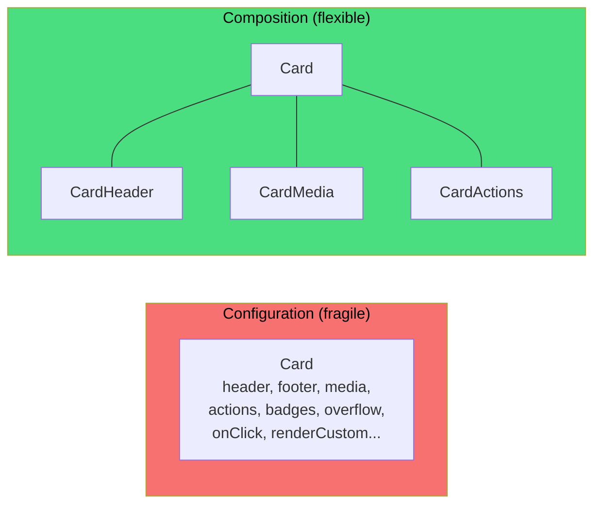
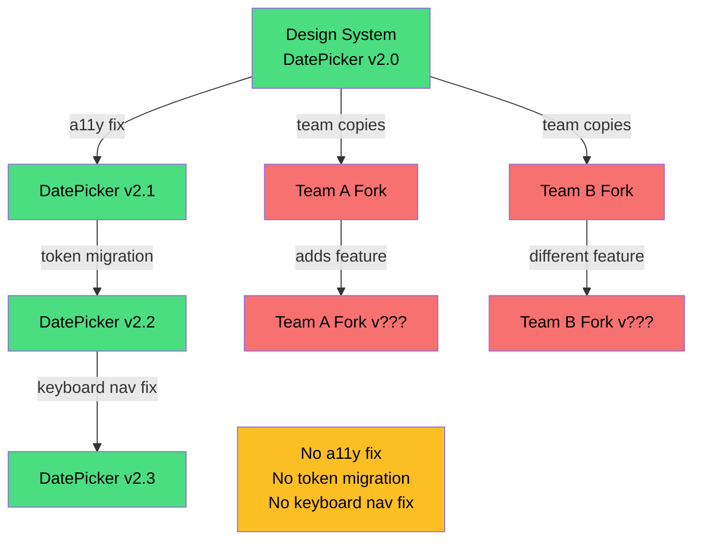
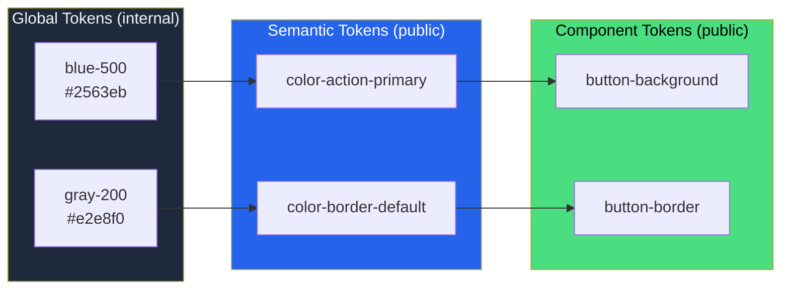
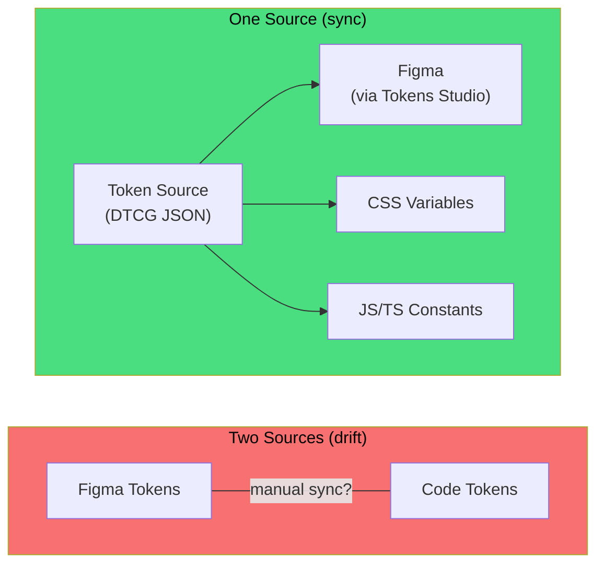
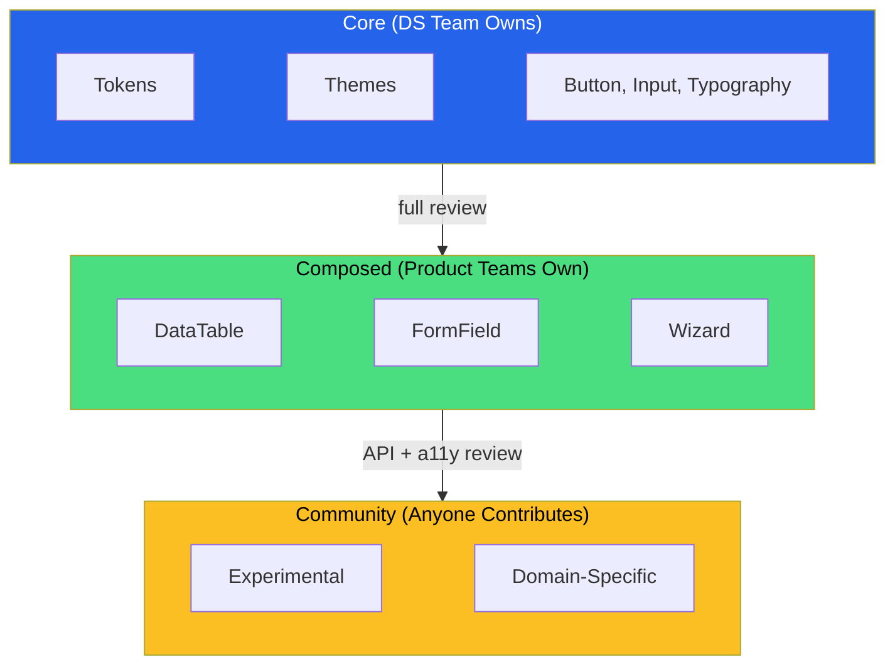

Setting up a design system is the easy part. You pick a token format, scaffold some components, wire up a Storybook, and ship a v1 to the registry. Everyone's excited. Adoption ticks up. The Slack channel is quiet in that good way.

Then six months pass.

Somebody wraps your `Button` in a `ProjectButton` because they needed one extra prop. Another team copies `Modal` into their repo because the design system version didn't support a feature they needed _last sprint_. A third team is still on v1 while everyone else moved to v3, and nobody knows why. The token file has 400 entries and at least 30 of them do the same thing. The Figma library and the code haven't matched since someone renamed a color during a rebrand.

These aren't exotic failure modes. They're the default outcome when a design system doesn't have a maintenance strategy. The architecture we covered in [Design System Governance](design-system-governance.md) and [Versioning and Release Management](versioning-and-release-management.md) gives you the foundation. This is about what breaks _after_ the foundation is laid, and the patterns that keep it from rotting.

## Component Proliferation

The most common way a design system decays is through accumulation, not neglect. Every component starts with a clear purpose. Then someone adds a variant. Then a size option. Then a `renderCustomHeader` prop. Then an `isLegacy` flag that conditionally renders a completely different component under the same name.

A `Button` with four variants and three sizes is 12 combinations. Add an icon position (left, right, none), a loading state, and a disabled state and you're at 144 permutations—most of which nobody has tested together. This is **variant explosion**, and it's the main reason design system bundle sizes grow faster than feature count.

The fix isn't to freeze the component API. It's to make the cost of a new variant visible.

**Audit before adding.** Before any new variant ships, require a brief accounting: which products need it, what existing variant it's closest to, and whether it can be achieved through composition instead. This isn't bureaucracy—it's the same "do we need this?" conversation you'd have before adding a new database table.

**Composition over configuration.** A `Card` component with twelve props for header, footer, media, actions, badges, and overflow menus is a page layout pretending to be a component.



Break it into composable pieces—`Card`, `CardHeader`, `CardMedia`, `CardActions`—and let consumers assemble what they need. The API surface stays small. The flexibility goes up. And you don't end up with a `Card` that accepts a `renderCustomEverything` function.

**Sunset aggressively.** If a variant has zero usage across all consuming applications, remove it. If two variants are functionally identical except for a padding value, merge them. Track usage metrics (more on that below) and make removal a regular part of the release cycle, not something that waits for a "cleanup sprint" that never arrives.

## Fork Culture

Forking is the immune response of a team that can't get what it needs from the system fast enough. A team needs a feature. The design system backlog is full. So they copy the component, modify it locally, and move on. Perfectly rational. Completely corrosive.

The problem with forks isn't the initial copy. It's what happens after.



Forks don't get accessibility updates. They don't get token migrations. They don't get bug fixes. They drift from the system and from each other, and six months later you have three `DatePicker` implementations with three different keyboard interaction patterns and nobody remembers which one is canonical.

You can't eliminate forking through policy alone. You have to reduce the pressure that causes it.

**Contribution pathways.** Make it possible for product teams to contribute back to the system without going through a six-week review cycle. A clear contribution guide with templates, automated checks, and a responsive review process turns forks into pull requests. The [GitHub Primer][1] team is a good reference here—they invest heavily in contribution documentation and review standards, which keeps the system growing without the core team becoming a bottleneck.

**Extension points.** Design components with sanctioned customization surfaces. CSS custom properties for theming. Slots or render props for content injection. `::part()` selectors for Web Components. If teams can customize _within_ the system, they're less likely to escape _around_ it.

**Fork registry.** When forks do happen (and they will), track them. A simple table—component name, forking team, reason, date, planned migration—makes forks visible instead of invisible. Invisible forks compound. Visible forks get addressed.

## Version Fragmentation

In a polyrepo world, design system versions fragment by default. Each team upgrades on its own schedule, and "on its own schedule" usually means "never, unless something breaks." You end up with a long tail of versions in production, which makes every design system change a question of "but which version are they on?"

The governance piece covers [versioning contracts](versioning-and-release-management.md), but the maintenance problem is different from the versioning problem. Versioning is about _what_ the numbers mean. Maintenance is about _getting people to move_.

**Track version distribution.** You can't fix fragmentation you can't see. Build a dashboard (or even a spreadsheet—start ugly) that shows which version of each design system package each application is running. Update it from CI or from registry metadata. When you can see that 40% of your applications are three majors behind, the conversation shifts from "we should probably upgrade" to "we have a measurable platform debt problem."

**Upgrade budgets.** Allocate explicit time for design system upgrades, the same way you'd allocate time for security patches. If upgrades are always "we'll get to it after the feature work," they don't happen. Some teams set a policy: you must be within one major version of current, and you have 90 days after a major release to adopt. That's not a suggestion—it's a release policy with teeth.

**Codemods for mechanical changes.** Every breaking change in a major release should ship with a codemod that handles the mechanical migration—renamed props, moved imports, deprecated tokens. [jscodeshift][2] for JavaScript and TypeScript, [PostCSS][3] plugins for CSS. The goal is to make the upgrade effort proportional to the _interesting_ changes, not the tedious ones. If 80% of an upgrade is find-and-replace, automate the find-and-replace.

**Canary releases.** Before a major version goes stable, publish a canary channel and ask two or three consuming teams to try it. This catches integration issues before they hit everyone. It also gives those teams a head start on the migration, which means they're advocates instead of skeptics when the stable release lands.

## Token Sprawl

Tokens multiply. It starts innocently—you add `color-primary-light` alongside `color-primary` because the design called for it. Then `color-primary-lighter`. Then `color-primary-subtle`. Then `color-primary-muted`. Then someone asks what the difference between "subtle" and "muted" is, and the answer is "one of them was added in Q2 and the other in Q4 by a different designer."

Token sprawl is the design system equivalent of CSS specificity wars. Each individual token seems reasonable. In aggregate, they create a system that nobody can navigate without a glossary, and the glossary is always out of date.

**Semantic over literal.** Name tokens by _role_, not by _value_. `color-text-secondary` tells you when to use it. `color-gray-400` tells you what it looks like. When a rebrand changes your gray palette, every literal reference needs manual review. Every semantic reference just works—you update the value behind `color-text-secondary` and every usage follows.

**Token tiers.** Structure tokens in layers. **Global tokens** define the raw palette (`blue-500`, `gray-200`). **Semantic tokens** map roles to globals (`color-action-primary` → `blue-500`). **Component tokens** map component-specific decisions to semantic tokens (`button-background` → `color-action-primary`). Consumers use semantic and component tokens. Global tokens are internal implementation details—not part of the public API.



Consumers use semantic and component tokens. Global tokens are internal implementation details—the raw palette that nobody should reference directly. This tiered model is exactly what the [DTCG format][4] supports through aliases. A semantic token references a global token by path, and Style Dictionary resolves the chain at build time.

**Regular audits.** Schedule a quarterly token review. Pull usage data from your codebase (grep is fine—this doesn't need a platform). Identify tokens with zero usage, tokens with near-identical values, and tokens that violate your naming convention. Remove the dead ones. Merge the duplicates. Fix the names. If you don't do this regularly, the token file becomes a geological record of every design decision anyone ever made, including the bad ones.

## API Inconsistency

When a design system grows beyond a handful of components, API inconsistency creeps in. One component uses `variant` for visual style, another uses `appearance`. One uses `onPress`, another uses `onClick`. One accepts children as a render prop, another as a slot, another as a named prop. Each component was designed by whoever built it, and they each made locally reasonable choices that collectively produce an unpredictable API surface.

This matters because inconsistency is a tax on every consumer. If I know how `Button` works, I should be able to guess how `IconButton` works. If I can't, I have to look it up every time—which means the design system is slower to use than building the component from scratch.

**Naming conventions.** Establish conventions early and enforce them. Pick one word for visual style (`variant`, not sometimes `variant` and sometimes `appearance`). Pick one pattern for event handlers (`onAction`, not a mix of `onPress` and `onClick` and `onActivate`). Pick one approach to sizes (`size="small"`, not sometimes `size="sm"` and sometimes `compact={true}`). Document these conventions in a contributor guide and lint for them in CI.

**API review checklist.** Before a new component ships, check it against the existing API patterns:

- Does it use the same prop names as similar components?
- Does it follow the same composition pattern (children, slots, render props)?
- Are the defaults consistent with the rest of the system?
- Does it handle the standard states (disabled, loading, error) the same way?

This isn't a formal review board. It's a checklist in a pull request template. Five minutes of checking prevents months of inconsistency.

**Refactor in batches.** If you've already accumulated inconsistencies, don't fix them one at a time across separate major releases. Consumers can tolerate one migration. They can't tolerate a new migration every quarter because you're fixing API inconsistencies incrementally. Group the API normalization into one coordinated release with codemods.

## Documentation Rot

Documentation that doesn't match the code is worse than no documentation, because it's _confidently_ wrong. Consumers trust it, build against it, and then file bugs when reality doesn't match what the docs said.

The usual cause is that documentation lives in a separate system from the code. The component gets updated in a pull request. The docs stay in Notion, or Confluence, or a Storybook MDX file that nobody remembered to touch.

**Colocate docs with code.** Keep component documentation in the same package as the component—MDX files next to the source, or inline in Storybook stories. When a pull request changes the component, the diff should show the doc change too. If it doesn't, the reviewer asks why.

**Autodocs as baseline.** [Storybook Autodocs][5] generates documentation from your stories and TypeScript types. It's not a substitute for written guidance—it won't tell you _when_ to use a component or _why_ one variant exists—but it guarantees that the prop table and live examples always match the code. Use Autodocs as the floor and add human-written guidance on top.

**Deprecation docs are docs.** When you deprecate a component or token, the deprecation notice _is_ documentation. It should say what to use instead, link to a migration guide, and ideally include a code example showing the before and after. A deprecation warning that says "this is deprecated" without saying what to do next is a TODO comment wearing a trench coat.

## Performance Creep

A design system's bundle footprint tends to grow monotonically. Components get added. Dependencies accumulate. Nobody removes anything because removal is scary and addition is fun.

Then one day somebody profiles a page and discovers that the design system is 40% of the JavaScript bundle, and half of that is components the page doesn't use.

**Tree-shaking by default.** Publish ESM with proper `sideEffects` annotations in `package.json`. This lets bundlers eliminate unused components at build time. If your components have side effects (global style injection, custom element registration), mark them explicitly so the bundler doesn't tree-shake them away—but be honest about what actually has side effects. Over-declaring side effects defeats the purpose.

```json
{
  "name": "@acme/react-components",
  "sideEffects": ["*.css"],
  "module": "dist/esm/index.js",
  "exports": {
    ".": {
      "import": "./dist/esm/index.js",
      "require": "./dist/cjs/index.js"
    },
    "./Button": {
      "import": "./dist/esm/Button.js"
    }
  }
}
```

**Granular entry points.** Offer per-component entry points (`@acme/ui/Button`) alongside the barrel export (`@acme/ui`). Some bundlers handle barrel exports well. Others don't. Per-component imports remove the ambiguity.

**Size budgets in CI.** Set a size budget for the design system packages and enforce it in CI. If a pull request pushes the bundle past the threshold, the build fails. This makes size regressions as visible as test failures—which means they get fixed instead of noticed three months later during a performance review.

## Responsive Components with Container Queries

CSS container queries change the maintenance equation for responsive components. Media queries respond to the _viewport_. Container queries respond to the _parent element's size_. For a design system consumed across different contexts—a card in a full-width dashboard versus the same card in a narrow sidebar—container queries let the component adapt without the consumer passing size props or wrapper classes.

This matters for maintenance because size variants are one of the fastest-growing surfaces in a design system. A `Card` with viewport-based responsive behavior works fine until someone drops it in a 300px sidebar and discovers the "desktop" layout is still rendering at full width. The usual fix is a `compact` prop, or a `size` prop, or a wrapping `<CardContainer width="narrow">`. Each one is another variant to test, document, and maintain.

Container queries eliminate that entire category of variant:

```css
/* design-system/components/card.css */
.card-container {
  container-type: inline-size;
  container-name: card;
}

@container card (min-width: 400px) {
  .card {
    flex-direction: row;
  }
  .card-image {
    width: 40%;
  }
}

@container card (max-width: 399px) {
  .card {
    flex-direction: column;
  }
  .card-image {
    width: 100%;
  }
}
```

The component queries its own container and adjusts layout accordingly. No size prop. No media query that assumes viewport width equals available width. The component is genuinely context-agnostic—it works in a 1200px main content area and a 300px sidebar without the consumer doing anything.

For design system teams, the practical shift is: adopt container queries as the default responsive mechanism for _components_, and reserve media queries for _page-level_ layout concerns. This aligns with composition-over-configuration. A component that adapts to its container is one fewer prop, one fewer variant, one fewer thing to document and test.

## Accessibility Regression

Accessibility is easy to get right on the first pass and easy to break on every subsequent one. A component ships with correct ARIA attributes, keyboard navigation, and focus management. Then someone adds a variant that skips the `aria-label`. Then a refactor breaks the tab order. Then a new feature adds a click handler to a `div` instead of a `button`.

The problem is that accessibility regressions are invisible in visual testing. The component looks fine. It just doesn't work for anyone using a keyboard or screen reader.

**Automated checks in stories.** [Storybook's accessibility addon][6] runs axe-core checks against every story. Wire it into CI so violations fail the build. This catches the low-hanging fruit: missing labels, insufficient contrast, invalid ARIA attributes.

**Keyboard interaction tests.** Automated checks can't validate interaction patterns. Write explicit tests for keyboard behavior—Tab order, Enter/Space activation, Escape to dismiss, arrow key navigation within composite widgets. These are the interaction patterns defined in the [ARIA Authoring Practices Guide][7], and they should be tested as rigorously as visual output.

```typescript
test('dropdown closes on Escape', async ({ page }) => {
  const trigger = page.getByRole('button', { name: 'Options' });
  await trigger.click();
  await expect(page.getByRole('menu')).toBeVisible();

  await page.keyboard.press('Escape');
  await expect(page.getByRole('menu')).not.toBeVisible();
  await expect(trigger).toBeFocused();
});
```

**Review new variants for a11y.** Every new variant, every new composition pattern, every new interactive state needs an accessibility review. Not a full audit—a focused check: does this variant inherit the base component's ARIA behavior? Does this new state communicate its status to assistive technology? Does this composition pattern preserve the focus order? Add it to the pull request checklist and make it someone's explicit responsibility.

## Design-Engineering Drift

Figma says the border radius is 8px. The code says `--acme-radius-md` which resolves to 6px. Both are "right" within their respective systems. Neither matches the other. This is **design-engineering drift**, and it's the single most common source of "the design system doesn't match the designs" complaints.

Drift happens because design tools and code are separate artifacts maintained by separate people on separate schedules. A designer updates a component in Figma. The change doesn't propagate to code automatically. Eventually someone notices, files a ticket, and the ticket sits in the backlog until it matters enough to fix—by which point the Figma has changed again.

**Single source of truth for tokens.** Pick one. Either tokens are authored in Figma and exported to code, or they're authored in code and imported into Figma. Not both.



The [Tokens Studio][8] plugin syncs design tokens between Figma and code repositories, using the DTCG format as the interchange layer. The direction of flow matters less than the fact that there's _one_ direction.

**Figma-to-code diffing.** Build a check (automated or manual, on a cadence) that compares Figma component specs against code output. At a minimum, check token values, spacing, and typography. You don't need pixel-perfect matching—you need to catch the drifts before they compound.

**Shared language.** When the component in Figma is called "Card / Elevated / Large" and the code component is `<Card variant="raised" size="lg">`, every conversation between design and engineering starts with a translation exercise. Use the same names. If the Figma variant is "elevated," the code prop value should be `"elevated"`, not `"raised"`. This sounds trivial. It prevents an extraordinary amount of confusion.

## The Central Team Bottleneck

A design system team that owns everything becomes a team that blocks everything. Every new component, every bug fix, every variant request flows through the same three people. The backlog grows. Response times increase. Product teams start forking (see above) because waiting isn't an option when you have a deadline.

This is the most insidious maintenance problem because the central team is doing everything _right_—they're reviewing carefully, maintaining quality, ensuring consistency—and the system is still failing because it can't keep up with demand.

**Tiered ownership.** Not every component needs the same level of central control. Define tiers:



- **Core**: tokens, themes, primitives (Button, Input, Typography). Owned and maintained by the design system team. Changes require full review.
- **Composed**: higher-level patterns built from core components (DataTable, FormField, Wizard). Owned by product teams, built using core primitives. Design system team reviews for API consistency and accessibility, but product teams drive the roadmap.
- **Community**: experimental or domain-specific components. Contributed by anyone. Minimal review. Not guaranteed to be stable or maintained. Clearly labeled as such.

This distributes the maintenance burden without abandoning quality where it matters most.

**Office hours over tickets.** A Jira ticket for "can you add an icon position prop to Button" is slow, async, and loses context. A weekly office hour where product engineers bring their design system questions, requests, and frustrations is faster and builds relationships. Most requests turn out to be "I didn't know the system could already do this" or "here's a two-line change you can make yourself with guidance."

**Inner-source model.** Treat the design system as an inner-source project. Anyone can contribute. The core team reviews and merges. Clear contributing guidelines, good `CONTRIBUTING.md`, automated checks that catch style and quality issues before review. The goal is to make contributing _easier_ than forking.

## The Contribution Pipeline

Tiered ownership and office hours reduce the bottleneck, but they don't address the most common complaint product teams have about design systems: "I submitted a request three months ago and nobody responded."

The fix is a visible, time-bounded contribution pipeline with service levels.

**The flow looks like this.** Someone files an intake with the problem they're trying to solve and evidence that it's not already addressed by the system. Triage sorts it into one of four buckets: `reject` (doesn't belong in the system), `compose` (can be built from existing primitives), `RFC` (needs design and review), or `expedite` (urgent fix to existing behavior). An RFC goes through design, engineering, and accessibility review. Implementation happens behind quality gates. The release ships with migration guidance. After release, monitor adoption and run a retrospective.

That's not particularly exotic. The part that makes it _work_ is the service levels.

**Set response targets and publish them.** Intake response within two business days. RFC first review within five business days. Non-breaking decision within ten. Breaking-change decision within fifteen, with a rollout plan. These aren't aspirational targets on an internal wiki—they're commitments. If you miss them consistently, product teams learn that the system is slow and start routing around it.

**Acceptance criteria before inclusion.** Not every request should become a component. Before something enters the system, validate reuse potential across multiple teams, test and document accessibility behavior, complete the token mapping for default and themed contexts, review the API for invalid state combinations, and write docs that include examples, anti-patterns, and migration notes.

An RFC template keeps proposals focused:

```markdown
# RFC: <proposal-title>

## Problem

## User and business impact

## Why existing DS capabilities are insufficient

## Proposed API and behavior

## Accessibility considerations

## Token and theming implications

## Migration impact

## Alternatives considered

## Rollout and rollback plan
```

If this feels heavyweight, calibrate the process to the size of the change. A new color token doesn't need an RFC. A new composite component with five interactive states does. The point is to make the contribution _path_ visible, not to make every contribution _slow_.

## Measuring System Health

You can't maintain what you can't measure. The governance piece covers [what to measure](design-system-governance.md) at the organizational level. For ongoing maintenance, focus on these operational signals:

- **Component adoption rate**: what percentage of UI in each application uses design system components versus custom implementations? Falling adoption means the system isn't keeping up with needs.
- **Version currency**: median age of the design system version across consuming applications. Rising age means upgrades are too painful.
- **Contribution rate**: how many external contributions (from product teams) land per quarter? Low contribution rate means the system is too hard to contribute to or the core team is a bottleneck.
- **Fork count**: how many known forks exist? Rising forks are the canary in the coal mine.
- **Time to integrate**: how long from "I need a new component" to "it's available in the system"? If this is measured in months, product teams will route around the system.
- **Bundle size trend**: is the system getting heavier? Track package sizes over time and correlate with component count.

None of these need a fancy dashboard on day one. A spreadsheet updated monthly is fine. The point is to _have_ the data so decisions are informed by evidence instead of vibes.

## The Enforcement Ladder

Lint rules and CI gates are the enforcement mechanism—but enforcement that arrives before the system has coverage will frustrate teams. If 30% of your UI surfaces don't have a design system equivalent, blocking raw `<button>` elements in CI means teams can't ship until you catch up. That's a recipe for `eslint-disable` everywhere, which is worse than no rule at all.

Enforcement should escalate in stages:

- **Guidance only:** docs, design reviews, and recommendations. No automation. This is where you start while the system is still filling gaps.
- **Lint warnings:** teams see the guidance in their editors and CI logs, but nothing blocks. This is education.
- **Pull request annotations:** warnings surface in code review with links to the relevant design system component or token. Reviewers notice. Authors fix.
- **Required checks:** raw hex colors fail CI. Native `<button>` elements fail CI. This only works when the system provides a real alternative for every blocked pattern.
- **Controlled exceptions with expiration dates:** when a team genuinely needs to deviate—a one-off landing page, a third-party integration with its own styles—grant a time-bounded exception with an owner, a reason, and a date by which the deviation must be resolved.

The ladder only moves one direction: up. But it moves _slowly_, and only after the system has earned the right to be strict. Enforce strictly after coverage is high enough that teams aren't blocked by missing capabilities. Before that, you're just making enemies.

## Assessing Your Maturity

Not every organization needs the same maintenance investment. A useful diagnostic is to ask where you sit on the maturity spectrum:

| Level                      | Characteristics                                    | Main Risk                              | What to Work On Next                          |
| :------------------------- | :------------------------------------------------- | :------------------------------------- | :-------------------------------------------- |
| L0: Ad Hoc                 | Repeated one-off UI decisions, no shared artifacts | Inconsistent UX and compounding rework | Establish a token baseline and publish it     |
| L1: Shared Library         | Reusable components exist, minimal governance      | Drift and fragile APIs                 | Add a contribution model and API review       |
| L2: Governed Platform      | RFCs, release notes, quality gates                 | Central team bottleneck                | Federate contributions with tiered ownership  |
| L3: Scaled Platform        | Multi-brand support, migration tooling, metrics    | Operational complexity                 | Tighten observability and automate upgrades   |
| L4: Product Infrastructure | DS runs like an internal product with SLAs         | Complacency and slower innovation      | Continuous capability reviews and deprecation |

Most organizations overestimate their level. If your components exist but nobody reviews API consistency, you're at L1 regardless of how polished the Storybook looks. If you have an RFC process but no service levels and a three-month backlog, you're still at L2 with L3 aspirations.

The maturity model isn't a ladder you climb once. Systems can regress. A reorg that disbands the design system team drops you from L3 to L1 overnight. A quarter of aggressive product work without maintenance time creates token sprawl that erodes L2 governance. Maintenance is the force that prevents regression.

## The Symptom-to-Action Map

When you know something's wrong but aren't sure where to start, match the symptom to its likely root cause:

| Symptom                            | Likely Root Cause                      | Next Action                                    |
| :--------------------------------- | :------------------------------------- | :--------------------------------------------- |
| Teams keep bypassing the DS        | Missing capabilities or slow intake    | Improve intake SLA and add extension points    |
| Upgrades are repeatedly delayed    | Migration friction too high            | Invest in codemods and release support         |
| Visual inconsistency across brands | Weak semantic token contract           | Rework theming around semantic tokens          |
| Governance queue is overloaded     | Centralized decision bottleneck        | Delegate scoped approvals and improve triage   |
| Accessibility regressions recur    | A11y not built into definition of done | Add mandatory a11y gates and manual review     |
| New components feel unpredictable  | No API consistency conventions         | Establish naming conventions and API checklist |

This isn't a flowchart. Multiple symptoms can be active at once, and the root causes overlap. But if you can identify even one symptom and address its root cause, the downstream effects tend to improve the others.

## The Maintenance Mindset

The hardest part of design system maintenance isn't any single problem. It's the shift from "building the system" to "tending the system." Building feels productive. Tending feels like janitorial work. But a design system that gets built and then left alone will drift, bloat, and eventually get replaced by another system that gets built and then left alone.

The teams that maintain design systems well treat it like infrastructure: boring, essential, and worth investing in continuously. They allocate time for deprecation and removal, not just addition. They track health metrics. They make upgrading easier than forking. They review components for API consistency the same way they review code for correctness.

A design system is a product. Products that ship once and never iterate die. The same rule applies here—it just takes longer to notice.

[1]: https://primer.style/guides/contribute 'Contributing | Primer'
[2]: https://github.com/facebook/jscodeshift 'facebook/jscodeshift: A JavaScript codemod toolkit'
[3]: https://postcss.org/ 'PostCSS - a tool for transforming CSS with JavaScript'
[4]: https://www.designtokens.org/TR/2025.10/format/ 'Design Tokens Format Module 2025.10'
[5]: https://storybook.js.org/docs/writing-docs/autodocs 'Automatic documentation and Storybook'
[6]: https://storybook.js.org/docs/8/writing-tests/accessibility-testing 'Accessibility tests'
[7]: https://www.w3.org/WAI/ARIA/apg/ 'ARIA Authoring Practices Guide'
[8]: https://tokens.studio/ 'Tokens Studio'

---

## TL;DR

### Maintaining a Design System

> The post-launch challenges.

- **Component proliferation** — too many variants. Audit ruthlessly, deprecate aggressively.
- **Fork culture** — teams copy-paste instead of contributing. Fix the contribution path.
- **Version fragmentation** — 5 apps on 5 different versions. Track adoption, set deprecation timelines.
- **Documentation rot** — docs drift from implementation. Colocate docs with code. Automate.

**Contribution pipeline:**

1. Proposal (issue/RFC) → 2. Design review → 3. Implementation → 4. Visual regression test → 5. Release

- Central team reviews for consistency and accessibility.
- Product teams contribute components they need.
- Service level: respond to proposals within N days.
