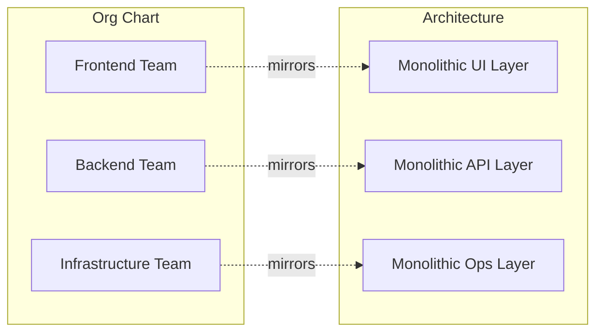
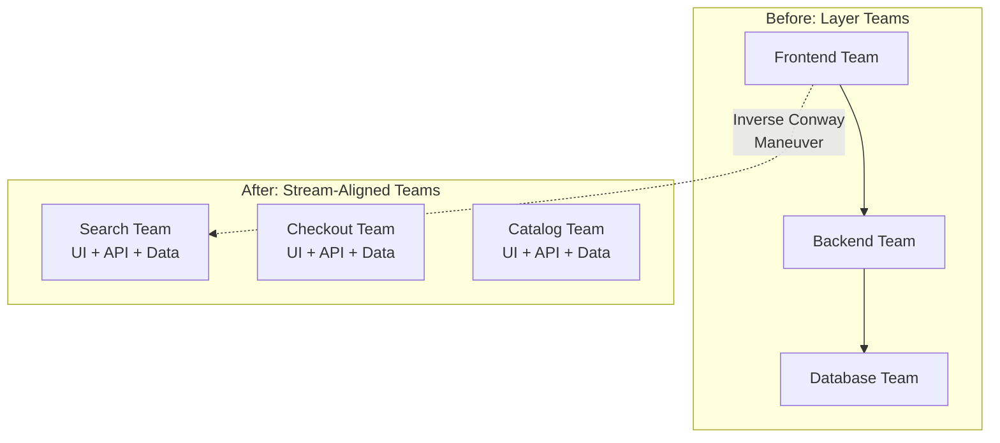
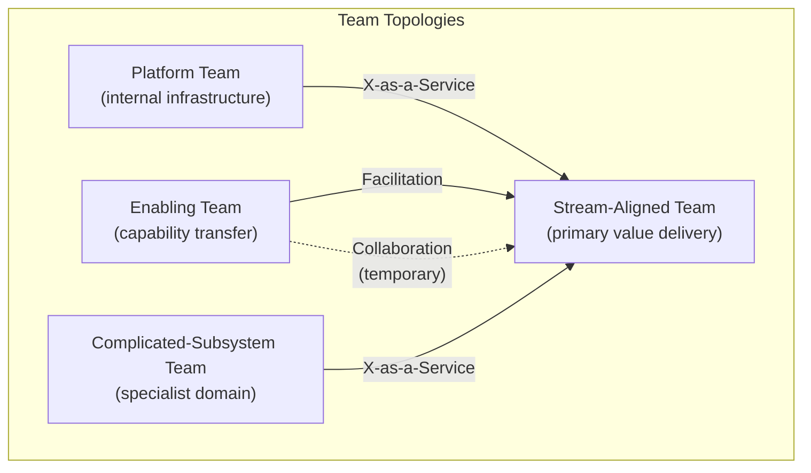
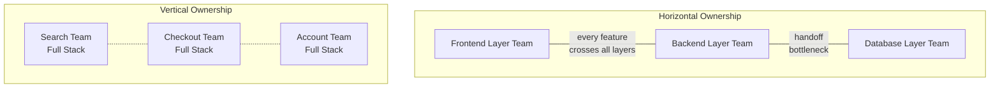
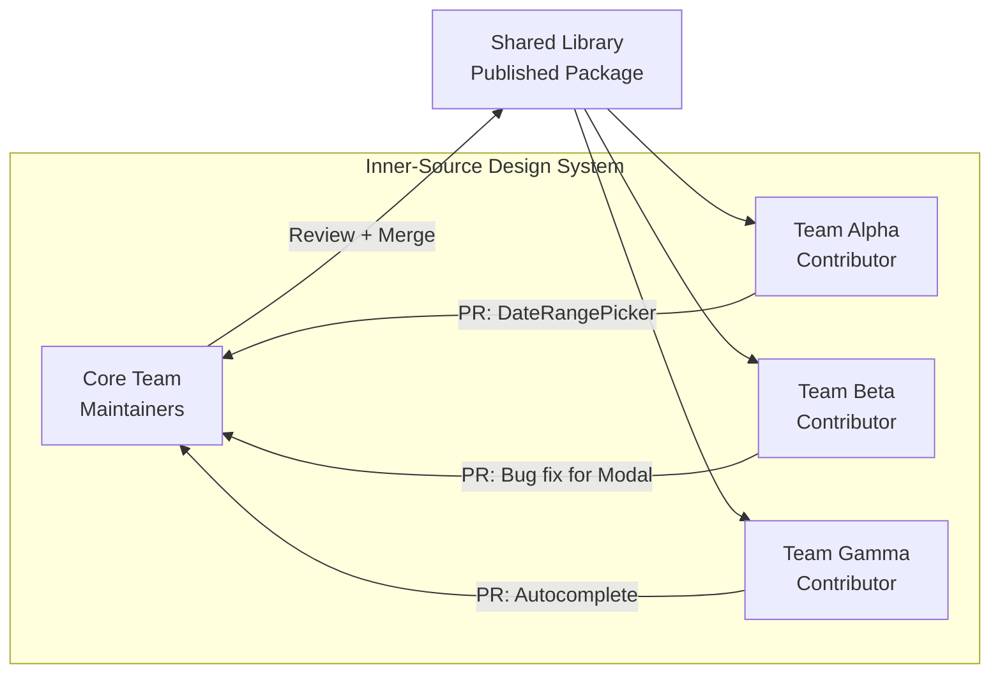
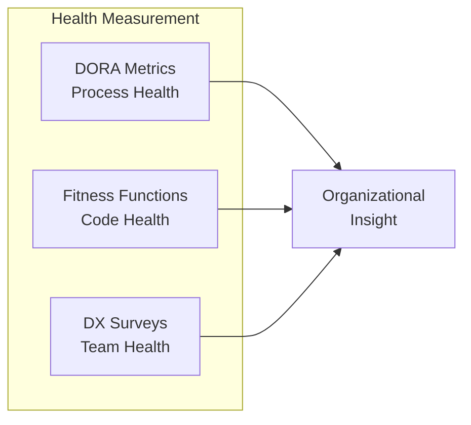

You can spend weeks designing the perfect microfrontend boundary. You can draw the cleanest dependency graph anyone has ever seen. And then the org chart will route around your architecture like water finding cracks in concrete.

We touched on [Conway's Law in the intro](monoliths-microfrontends-and-monorepos.md)—the idea that software boundaries tend to mirror communication boundaries. But, that was a paragraph. This topic deserves more, because the most consequential architecture decisions you'll make aren't about bundlers or frameworks. They're about _people_. How teams are structured, how they communicate, where ownership lives, and how decisions get documented—these forces shape your frontend architecture more than any technology choice ever will.

## Conway's Law, for Real This Time

Melvin Conway published his observation in 1968: organizations that design systems are constrained to produce designs that copy their communication structures. [Martin Fowler's writeup][1] sharpens the mechanism—software coupling is _enabled and encouraged_ by human communication. If two developers sit next to each other, their modules will become coupled through shared assumptions and hallway conversations. If they can't talk easily, their code stays decoupled by default.

This isn't metaphor. It's structural constraint.



A Harvard Business School study compared codebases produced by co-located, tightly coupled teams against those from distributed open-source communities. Tightly coupled teams produced monolithic systems. The loosely connected communities produced modular, decomposed architectures. Same problem, different communication topology, different code shape.

The most common failure mode in frontend organizations is the **layer-based team structure**: a frontend team, a backend team, a database team, and an infrastructure team. Every feature requires cross-team coordination. Every ticket bounces between Jira boards. Every standup includes the phrase "we're blocked waiting on the API team." Fowler calls this the _PresentationDomainDataLayering_ trap—the architecture is technically sound, but it fights against how features actually need to be delivered.

Amazon's two-pizza rule wasn't a staffing curiosity. It was a deliberate architectural strategy. Small autonomous teams produce small, independently deployable services because they _can only communicate with each other through explicit APIs_, not hallway conversations. Conway's Law became a tool instead of a constraint.

> [!TIP] The Six-Subsystem Prediction
> Fowler documents a telling anecdote: a technical leader appointed as architect for a distributed six-team project immediately recognized the organizational reality before writing a line of design—"There are going to be six major subsystems. I have no idea what they are going to be, but there are going to be six of them."

### The Inverse Conway Maneuver

So if org structure dictates architecture, the obvious next move is to design the org structure _first_ and let the architecture follow. That's the **Inverse Conway Maneuver**—a term coined by Jonny LeRoy and Matt Simons in 2010 and added to [ThoughtWorks' Technology Radar][2] in 2014.

Instead of drawing an architecture diagram and hoping the organization conforms, you reshape team boundaries and communication patterns to produce the architecture you want. If the goal is a modular, loosely coupled platform, you move away from a matrix model that forces dozens of handoffs and instead align small, cross-functional teams with end-to-end value streams.



ThoughtWorks documented this in practice with a 150-developer organization facing declining development speed after a failed previous transformation. The intervention was explicitly socio-technical—product delivery, organizational design, and operating model all changed together. They started with one to three pioneer teams delivering incremental value, then expanded based on what actually worked rather than organizational pressure.

The critical failure mode, per Fowler: if you have an existing system with a rigid architecture that you want to change, changing the org chart won't be an instant fix. It's more likely to produce a mismatch between developers and code that adds _more_ friction. The Inverse Conway Maneuver requires patient incremental migration, not a big-bang reorganization.

## Team Topologies

The [Team Topologies framework][3], from Matthew Skelton and Manuel Pais, provides a structured vocabulary for organizing engineering teams to optimize for fast delivery flow. Their central argument is that most organizational friction isn't a people problem—it's a structural problem. Teams are given too many responsibilities, too little support, and unclear interfaces with other teams. The result is cognitive overload.

### Cognitive Load as a Design Constraint

Skelton and Pais adapt cognitive load theory from educational psychology and apply it at the team level. Three types of load matter:

- **Intrinsic load**: the inherent complexity of the domain itself—what the team is building
- **Extraneous load**: incidental complexity from environment and tooling—deployment configuration, inconsistent tooling, build pipeline maintenance
- **Germane load**: the thinking required to solve novel domain problems—where actual value gets created

The organizational prescription: minimize intrinsic load through good domain boundaries, _eliminate_ extraneous load through platform services and automation, and maximize germane load. When teams say "there's too much to deal with," the symptom is almost always high extraneous load crowding out germane load.

A frontend team that must also manage its own Kubernetes configuration, set up its own observability pipeline, negotiate CDN configuration, and maintain its own CI/CD pipeline is carrying massive extraneous load. A platform team providing deployment-as-a-service and observability-as-a-service lets that team focus on building product.

### The Four Team Types



**Stream-aligned teams** are the primary team type. Each one is dedicated to a continuous flow of work from a specific business domain—an end-to-end slice of user value with no handoffs required. In frontend engineering, a stream-aligned team might own the entire checkout experience: the UI, the API integration layer, the A/B testing, and the observability. This is the "you build it, you run it" model, and it maps directly to [vertical microfrontends](monoliths-microfrontends-and-monorepos.md).

**Platform teams** provide shared infrastructure as an internal product. In the frontend domain, the "platform" typically includes the [design system](design-system-governance.md), build tooling, observability SDKs, and shared utility libraries. The key constraint: platform teams must treat stream-aligned teams as their _customers_. Providing too much overwhelms consuming teams, while providing too little forces them to build their own solutions.

**Enabling teams** are composed of specialists who bridge knowledge gaps. They act as temporary mentors—helping stream-aligned teams adopt new technologies like a migration from Angular to React, or the implementation of advanced accessibility standards. Unlike platform teams, which provide long-term services, enabling teams withdraw once the stream-aligned team is self-sufficient. This is facilitation, not ownership.

**Complicated-subsystem teams** manage areas so technically demanding that they require specialized expertise. Common frontend examples include teams owning real-time collaboration engines (CRDTs, WebSockets), complex data visualization libraries (D3.js, WebGL), or highly specialized accessibility infrastructure. By isolating this complexity, the organization ensures these critical components are maintained by experts while everyone else consumes them as stable interfaces.

### Three Interaction Modes

The framework defines three ways teams interact:

- **Collaboration**: two teams work closely together for a bounded time period. High bandwidth, high cost—it can't be sustained indefinitely. Use it to establish new capabilities, then transition to X-as-a-Service.
- **X-as-a-Service**: one team provides something, another consumes it through clear API contracts and documented interfaces. Low coordination cost. This is the steady state that collaboration is trying to produce.
- **Facilitation**: one team (typically enabling) helps another develop capability through coaching, pairing, or temporary embedding. The success condition is that the facilitated team no longer needs facilitation.

| Topology                  | Frontend Pattern                                   | Primary Interaction       |
| :------------------------ | :------------------------------------------------- | :------------------------ |
| **Stream-Aligned**        | Vertical microfrontends, BFF ownership             | Collaboration (temporary) |
| **Platform**              | Design system, build tooling, shared libraries     | X-as-a-Service            |
| **Enabling**              | Technology migrations, accessibility mentorship    | Facilitation              |
| **Complicated-Subsystem** | Data visualization, real-time collaboration, CRDTs | X-as-a-Service            |

## Ownership Models

The way an organization draws boundaries around its code reflects its underlying philosophy of ownership. And honestly, it predicts about 80% of the architectural debates that will happen at that company.

### Horizontal Layer Ownership

The traditional model: teams divided into "Frontend," "Backend," and "Operations." This promotes deep technical expertise within a layer, but every feature requires cross-team coordination. Every sprint planning session turns into a negotiation across Jira boards. The architecture mirrors the layers, and the release cadence mirrors the coordination overhead—which is to say, slow.

### Vertical Slice Ownership

In this model, teams are domain-aligned and cross-functional. A team responsible for "Search" owns everything required to render the search bar, fetch results via a [BFF](backends-for-frontends.md), and manage the underlying search index. This is the primary driver behind microfrontend architectures, which decompose the monolith into independently deployable units.



[Vercel's adoption of vertical microfrontends][4] is a prominent case study. They split their monolithic Next.js app into three core areas—marketing, documentation, and a logged-in dashboard—and halved build times while streamlining ownership. Each area manages its own logic and data, communicating with others only through well-defined shared packages in a monorepo. The migration was incremental: pages existed in both the original monolith and the new microfrontend simultaneously, with feature flags controlling which version received traffic. A page was removed from the monolith only after the new version had served live traffic for at least a week without errors.

IKEA found that vertical team splits worked well up to about 10–12 people per team. At that size, teams could function autonomously and deploy independently. Larger than that, and the coordination overhead started creeping back in.

> [!WARNING] Avoid layer-based team splits for microfrontends
> Martin Fowler's guidance is direct: do not organize teams by technical layers when implementing microfrontends. A separate "UI components team" or "business logic team" reintroduces the handoff friction that microfrontends are designed to eliminate. Organize around business capabilities or user journeys.

### Hybrid Models

Most mature organizations converge on a hybrid. Stream-aligned teams handle vertical feature ownership while centralized platform teams handle horizontal concerns like performance monitoring, authentication, and the core [design system](design-system-governance.md). This concentric model embeds governance within the platform itself—using interface contracts and automated tooling to enforce policy rather than relying on manual approvals.

| Model          | Team Scope                         | Benefits                                  | Tradeoffs                                 |
| :------------- | :--------------------------------- | :---------------------------------------- | :---------------------------------------- |
| **Horizontal** | Single technical layer (UI only)   | Technical consistency, specialized depth  | High coordination cost, frequent blocks   |
| **Vertical**   | Full feature slice (UI to backend) | High velocity, domain expertise, autonomy | Fragmentation risk, potential duplication |
| **Hybrid**     | Vertical squads + central platform | Balanced speed and consistency            | Requires sophisticated internal tooling   |

## The Platform Team in Microfrontend Architectures

In a microfrontend architecture, the platform team becomes especially critical. Without one, each team implements routing, state management, and observability independently. You get fragmentation instead of autonomy. The platform team's job is to make the "Golden Path" so smooth that teams choose it willingly.

What that typically includes:

- **Microfrontend scaffolding and templates**: tools to spin up a new microfrontend with all necessary configuration
- **The application shell**: routing, authentication, global navigation—the container that all microfrontends integrate with
- **CI/CD pipeline templates**: standardized build and deployment workflows
- **[Module Federation](module-federation.md) or federation tooling configuration**: consistent dependency sharing and versioning policies
- **Observability and monitoring**: centralized error tracking, performance monitoring, distributed tracing SDKs
- **The design system**: ensuring visual and behavioral consistency

Shopify's platform engineering story is instructive. They realized that giving developers "ops ownership" without proper tools led to burnout. Their solution was a layered platform model where specialized infrastructure teams manage the underlying Kubernetes clusters (over 400 of them), while application developers focus purely on their application code. The platform provides a Golden Path that accelerates delivery while maintaining a unified deployment standard. [Shopify][5] calls it a "platform of platforms"—and it works precisely because the platform team treats application teams as customers, not subordinates.

## Decision-Making Without a Chief Architect

In decentralized organizations, nobody gets to mandate every choice from on high. Decisions have to be made through transparent, discoverable frameworks. The two most effective mechanisms are Architecture Decision Records and Requests for Comments.

### Architecture Decision Records

An **ADR** is a point-in-time document that captures a significant architectural choice, the context in which it was made, and the resulting consequences. [Michael Nygard][6] created the format in 2011, and his motivation was straightforward: "One of the hardest things to track during the life of a project is the motivation behind certain decisions. A new person joining the project hears a whispered chant: 'We never touch the Arduous Module.' A team member who remembers why is a single point of failure."

The original format is five sections, and it fits on one page:

```markdown
# ADR 042: Adopt React Query for server-state management

## Status

Accepted

## Context

Our frontend makes dozens of API calls per page. Each team has
invented its own caching layer. Cache invalidation bugs account
for 30% of production incidents in the last quarter.

## Decision

We will adopt React Query (TanStack Query) as the standard for
all server-state fetching and caching. Client-only state remains
in component state or Zustand.

## Consequences

- Eliminates hand-rolled caching across six teams.
- Adds a ~12 KB dependency.
- Requires migration of existing fetch hooks (estimated: 2-3 sprints
  per team, parallelizable).
- Teams lose the ability to optimize cache behavior per-endpoint
  unless they use React Query's configuration surface.
```

To be effective, ADRs must be:

- **Specific**: one decision per record—"Adopt React Query for data fetching," not "Improve our data layer."
- **Discoverable**: stored in version control, often at `docs/architecture/decisions/` alongside the source code.
- **Immutable**: existing ADRs are never edited. If a decision changes, a new ADR is written that supersedes the previous one, preserving the historical lineage.

ADRs also help with **reversibility classification**. Categorize choices as "two-way door" decisions (easily changed) or "one-way door" decisions (high impact, hard to reverse). For two-way doors, the best practice is to decide and try fast rather than deliberate endlessly.

| Status         | Definition                                          |
| :------------- | :-------------------------------------------------- |
| **Proposed**   | Under review, not yet binding                       |
| **Accepted**   | Finalized and active—all teams follow this standard |
| **Deprecated** | No longer relevant or recommended                   |
| **Superseded** | Replaced by a newer ADR (link to the replacement)   |

### The RFC Process

While ADRs document the _outcome_, RFCs document the _process_ of reaching it. An RFC is a proposal for a major change, shared with the engineering community for asynchronous review. The format forces the author to think through the problem and alternatives _before_ bringing it to a meeting, which prevents circular discussions.

High-performing teams often adopt a "readout" style for RFC meetings. Participants spend the first 10–15 minutes reading the document in silence and writing comments. This ensures everyone has the same context and allows for more thoughtful, inclusive participation than a presentation-with-interruptions ever could. When someone disagrees, the resolution isn't "who argues louder." It's "what do our ranked priorities say the answer should be?"

## Inner-Source for Frontend Infrastructure

Shared infrastructure like design systems or utility libraries faces what you might call the bottleneck problem. A central team can't possibly keep up with feature requests from dozens of stream-aligned teams. The **inner-source** model addresses this by applying open-source contribution patterns to proprietary code.

In an inner-source design system, a core team provides foundational components and ensures visual consistency, but _any developer in the organization_ can contribute a new component or bug fix. This promotes efficient code reuse and breaks down traditional departmental silos.



### Making It Work

Inner-source without infrastructure is just optimism. The pieces that make it real:

- **`CONTRIBUTING.md`**: how to contribute, the review process, coding standards, and how to set up a local development environment. Without this, the first contribution attempt turns into a direct support request.
- **Pull request templates**: checklists ensuring every contribution follows standards for accessibility, testing, and style.
- **`CODEOWNERS` files**: automatically tagging core maintainers for reviews while allowing cross-team feedback.
- **Staging deployments**: automatic Storybook previews for every feature branch to facilitate visual review by designers.

### The 30-Day Warranty

The [InnerSource Commons][7] community codified a pattern that solves the biggest political objection to inner-source: "if we accept their code, we have to maintain it forever."

The **30-day warranty** works like this: when Team Alpha contributes a `<DateRangePicker>` to the design system, they agree to be the first responders for bugs against that component for 30 days after it ships to production. They commit to releasing a patch within two business days of a critical bug report. After 30 days, the design system team assumes full ownership.

This gives the receiving team confidence to accept contributions, and it ensures the contributing team has appropriate skin in the game. It's a small social contract, but it unblocks a huge amount of cross-team collaboration.

## Guilds, Chapters, and Communities of Practice

Maintaining technical coherence in a decentralized squad model requires social structures that transcend team boundaries. These come in a few flavors.

A **chapter** groups individuals with similar roles—such as "Frontend Engineers"—who work in different squads. The chapter lead acts as coach and mentor, focusing on career development and technical standards. This gives engineers a professional home even as they move between product missions.

A **guild** is a more informal, cross-cutting interest group that connects people across the entire organization. A "Performance Guild" or an "Accessibility Guild" might have members from dozens of different teams. They meet to share knowledge, discuss discoveries, and document best practices. The [8th Light Infrastructure Guild][8] is a good example—regular meetings to discuss operational challenges, with findings documented so the next person facing a similar problem doesn't have to start from scratch.

**Communities of Practice** focus on long-term skill development and cultural reinforcement. Internal conferences, unconferences, and rotation programs prevent the isolation that can occur in highly autonomous teams. As organizations scale, these informal coordination mechanisms often become more critical than rigid processes for maintaining innovation speed and shared knowledge.

> [!NOTE] A word about the Spotify model
> The "Spotify model" (squads, tribes, chapters, guilds) spread through the tech industry based on aspirational blog posts from 2012. [Jeremiah Lee][9], a former Spotify product manager, documented what actually happened: "Even at the time we wrote it, we weren't doing it. It was part ambition, part approximation. People have really struggled to copy something that didn't really exist." Spotify itself quietly moved toward more conventional management structures as it scaled. The vocabulary is useful. The model as commonly understood was never real. Study the _principles_ behind organizational design—Team Topologies, in particular—rather than copying a specific implementation from a conference talk.

## Technical Leadership Without Direct Authority

The role of leadership changes as frontend organizations scale. Traditional hierarchical management gives way to technical leadership without direct authority—Staff Frontend Engineers and Frontend Architects who influence through expertise, not org chart position.

A Staff Frontend Engineer solves technical problems of the highest scope and complexity. At [GitLab][10], Staff Engineers are expected to exert significant influence on the overall vision and long-range goals of their team, serving as a spokesperson for their technical area. One of their most critical functions is the proactive resolution of **architectural debt**—structural impediments that slow down the entire team's velocity.

Organizations typically choose between two models for deploying this expertise:

- **The embedded expert**: senior or staff engineers live within stream-aligned teams, providing daily technical guidance and ensuring best practices are followed on the ground.
- **The centralized platform architect**: experts are pooled in a core infrastructure group that builds tools for the entire organization, which is more efficient for scaling specialized infrastructure.

Most large organizations use a mix. The platform team builds the Golden Path, and staff engineers in stream-aligned teams push the boundaries of that platform, identifying new needs that should eventually be folded into the core.

## Measuring Whether Any of This Works

How do you know if your team structure and architecture are actually working? Velocity alone doesn't tell you. You need to look at speed, stability, and developer experience together.

### DORA Metrics for Frontend

The [DORA metrics][11] provide an objective baseline for software delivery performance. The research—from Nicole Forsgren, Jez Humble, and Gene Kim—established that software delivery performance predicts organizational performance. Their most important finding: elite performers achieve _both_ high deployment frequency _and_ low change failure rate simultaneously. Teams that deploy rarely don't have lower failure rates. They have _higher_ ones.

| Metric                              | What It Means for Frontend                                                     | Elite Benchmark        |
| :---------------------------------- | :----------------------------------------------------------------------------- | :--------------------- |
| **Deployment frequency**            | How often code ships to production per application or microfrontend            | Multiple times per day |
| **Change lead time**                | Time from PR merge to live, including CDN invalidation and promotion           | Less than one hour     |
| **Change failure rate**             | Percentage of deploys requiring rollback or causing Core Web Vitals regression | Under 5%               |
| **Failed deployment recovery time** | How quickly you can roll back a bad frontend deploy                            | Less than one hour     |

Feature flags dramatically reduce recovery time—a rollback becomes a configuration change, not a redeployment. This is one reason [deployment and release patterns](deployment-and-release-patterns.md) matter so much.

> [!TIP] Compare against yourself, not the industry
> The key principle from dora.dev: "These metrics are meaningful when compared for the same application over time." The trend matters more than the absolute number. A team going from monthly deploys to weekly deploys has made a significant improvement regardless of what "elite" looks like.

### Architectural Fitness Functions

While DORA measures the _process_, fitness functions measure the _code_. A **fitness function** is an automated mechanism that provides an objective integrity assessment of an architectural characteristic. These are the guardrails that keep your architecture honest without requiring a human reviewer to catch every drift.

Common frontend fitness functions:

- **Bundle size budgets**: CI pipelines that fail if a JavaScript bundle exceeds a specific cap. We cover this in [performance budgets](performance-budgets.md).
- **Performance gates**: automated Lighthouse CI to enforce minimum Core Web Vitals scores before merging a PR.
- **Accessibility lints**: enforcing semantic HTML and ARIA attribute presence at the build level.
- **Dependency boundary rules**: [ESLint rules](writing-eslint-rules.md) or Nx boundary constraints ensuring no circular dependencies and proper layering between packages.

### Developer Experience Surveys

Metrics can be gamed. DORA numbers can show high velocity while developers are burning out and cursing the build tooling. Developer Experience surveys capture the qualitative side—perceived productivity, frustration with tools, confidence in deployments. If DORA shows high velocity but DX surveys show high burnout, something is structurally wrong.



## Technical Debt Versus Architecture Debt

Not all debt is the same, and confusing the two leads to bad prioritization.

**Technical debt** is a local issue in the codebase—a messy component, a missing test, a function that needs refactoring. One team can fix it in a sprint or two. It shows up in pull requests and code scanners.

**Architecture debt** is systemic. Platform sprawl, fragmented data models, inconsistent authentication patterns across microfrontends, six different state management libraries because nobody wrote an ADR. Architecture debt remains invisible on traditional dashboards until it stalls a major initiative like a cloud migration or an AI integration. It requires board-level design and cross-domain governance to resolve.

|                  | Technical Debt                    | Architecture Debt                         |
| :--------------- | :-------------------------------- | :---------------------------------------- |
| **Visibility**   | Obvious in PRs and code scanners  | Silent, systemic                          |
| **Fix scope**    | Refactoring, better test coverage | Structural redesign, platform unification |
| **Primary risk** | Local bugs, slower features       | Program failure, gridlock, security gaps  |
| **Resolution**   | Team-level effort                 | Architecture boards, funding changes      |

### Advocating for Foundational Work

To successfully advocate for foundational work when leadership wants features, speak the language of the business. Instead of "the code is hard to maintain," the more effective framing is: "Every new feature in this area takes three times longer because of structural debt, costing us $15,000 in developer time every quarter."

The **70/20/10 allocation model** is a useful rule of thumb for sustainable health: 70% of resources for the roadmap, 20% for medium-term technical health, and 10% for long-term cleanup or experiments. Frame refactoring as an investment with clear ROI—show how spending one week on cleanup cuts future development time in half for a critical feature area.

## Case Studies

### Vercel: Vertical Splits in a Monorepo

[Vercel's microfrontend migration][4] split their monolithic Next.js application into three zones—marketing, documentation, and the logged-in dashboard—using Next.js Multi-Zones, [Turborepo](turborepo.md), and feature-flag-controlled traffic routing. Build times dropped over 40%. Core Web Vitals improved because each application only bundles its own dependencies. The teams can deploy independently.

The important detail: they kept everything in a monorepo. Shared components (header, footer, navigation, design tokens) were extracted into shared packages. The vertical splits gave teams deployment independence. The monorepo gave them shared code visibility and atomic migrations. This is the hybrid model in practice.

### Spotify: What Actually Happened

Spotify's "squad model" spread through the industry based on aspirational 2012 blog posts. Over time, the reality was messier. Absolute team autonomy led to architectural fragmentation—over 100 distinct systems that were difficult to integrate. The company introduced a "System Owner" role to maintain architectural integrity and gradually moved toward more conventional management structures.

The lesson isn't that autonomous teams are bad. It's that autonomy without platform investment, without shared standards, and without honest documentation of how things actually work produces fragmentation, not innovation.

### Shopify: Platform of Platforms

Shopify's restructuring focused on the ops burden on developers. Giving developers "ops ownership" without proper tools led to burnout. Their solution was a layered platform model—specialized infrastructure teams manage the underlying clusters, while application developers focus on application code. The [platform engineering blueprint][5] provides a Golden Path that accelerates delivery while maintaining a unified deployment standard.

## Putting It All Together

The evolution of frontend architecture in the enterprise is moving away from command-and-control models toward decentralized, socio-technical ecosystems. Conway's Law teaches that you can't ignore communication structures. Team Topologies provides the framework for optimizing them. Vertical slices give teams ownership. Platform teams absorb complexity. ADRs make decisions discoverable. Inner-source keeps shared infrastructure from becoming a bottleneck. And DORA metrics, fitness functions, and DX surveys give you the feedback loops to know whether any of it is actually working.

The role of the architect in this world isn't to dictate code from above. It's to facilitate the social and technical conditions that allow every team to succeed autonomously within a coherent organizational whole. That's harder than drawing a diagram. It's also the part that matters most.

[1]: https://martinfowler.com/bliki/ConwaysLaw.html "Conway's Law — Martin Fowler"
[2]: https://www.thoughtworks.com/radar/techniques/inverse-conway-maneuver 'Inverse Conway Maneuver — ThoughtWorks Technology Radar'
[3]: https://teamtopologies.com/key-concepts 'Key Concepts — Team Topologies'
[4]: https://vercel.com/blog/how-vercel-adopted-microfrontends 'How Vercel Adopted Microfrontends'
[5]: https://logz.io/blog/scaling-platform-engineering-shopify-blueprint/ "Scaling Platform Engineering: Shopify's Blueprint"
[6]: https://www.cognitect.com/blog/2011/11/15/documenting-architecture-decisions 'Documenting Architecture Decisions — Michael Nygard'
[7]: https://patterns.innersourcecommons.org/ 'InnerSource Patterns — InnerSource Commons'
[8]: https://8thlight.com/guilds 'Guilds — 8th Light'
[9]: https://www.jeremiahlee.com/posts/failed-squad-goals/ "Spotify's Failed #SquadGoals — Jeremiah Lee"
[10]: https://handbook.gitlab.com/job-families/engineering/development/frontend/staff/ 'Staff Frontend Engineer — GitLab Handbook'
[11]: https://dora.dev/guides/dora-metrics-four-keys/ 'DORA Metrics — dora.dev'

---

## TL;DR

### Conway's Law

> "Organizations which design systems are constrained to produce designs which are copies of the communication structures of these organizations."

- Tight team coupling produces monolithic code. Loose coupling produces modular architectures.
- **Inverse Conway Maneuver:** Reshape the org structure _first_ to produce the architecture you want.
- Layer-based teams (frontend team, backend team, database team) create handoff bottlenecks. Every feature crosses every layer.
- Vertical slices—one team owns search end-to-end, another owns checkout—align naturally with microfrontend boundaries.

---

### Four Team Topologies

> A vocabulary for how teams interact, not a mandate for how to organize.

| Topology                  | Purpose                          | Interaction mode          |
| ------------------------- | -------------------------------- | ------------------------- |
| **Stream-aligned**        | Delivers business value directly | Owns a vertical slice     |
| **Platform**              | Reduces cognitive load           | X-as-a-Service            |
| **Enabling**              | Transfers capability             | Collaboration (temporary) |
| **Complicated-subsystem** | Isolates specialist domain       | X-as-a-Service            |

- Platform teams must treat stream-aligned teams as _customers_, not subordinates.
- Enabling teams exist to make themselves unnecessary—they mentor, then step away.
- If a platform team is blocking feature delivery, it's not a platform team. It's a bottleneck.

---

### Architecture Decision Records

> ADRs make decisions discoverable without making them bureaucratic.

- **Status:** Proposed → Accepted → Deprecated → Superseded.
- **Context:** What forces are at play? What's the problem?
- **Decision:** What did we decide and why?
- **Consequences:** What changes? What do we gain? What do we lose?
- Store ADRs in version control alongside the code they describe. Not in Confluence. Not in Slack.
- Decisions are _immutable_. New decisions supersede old ones—they don't edit them.

---

### Measuring What Matters

> If you can't measure it, you're guessing.

| Category           | What to measure                                        | Tool / Source     |
| ------------------ | ------------------------------------------------------ | ----------------- |
| **Process health** | Deploy frequency, lead time, failure rate, MTTR (DORA) | CI/CD metrics     |
| **Code health**    | Bundle size, test coverage, dependency freshness       | Fitness functions |
| **Team health**    | Cognitive load, tooling friction, onboarding time      | DX surveys        |

- DORA metrics measure the _process_. Fitness functions measure the _code_. DX surveys measure the _people_.
- Track cognitive load in three buckets: intrinsic (domain complexity), extraneous (tooling friction), germane (novel problem-solving).
