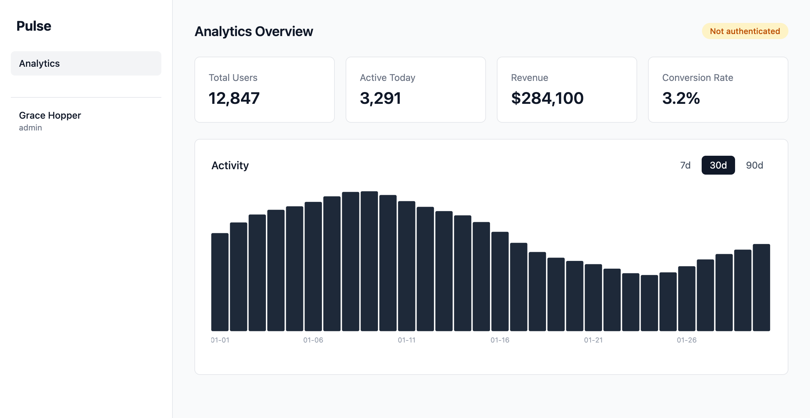
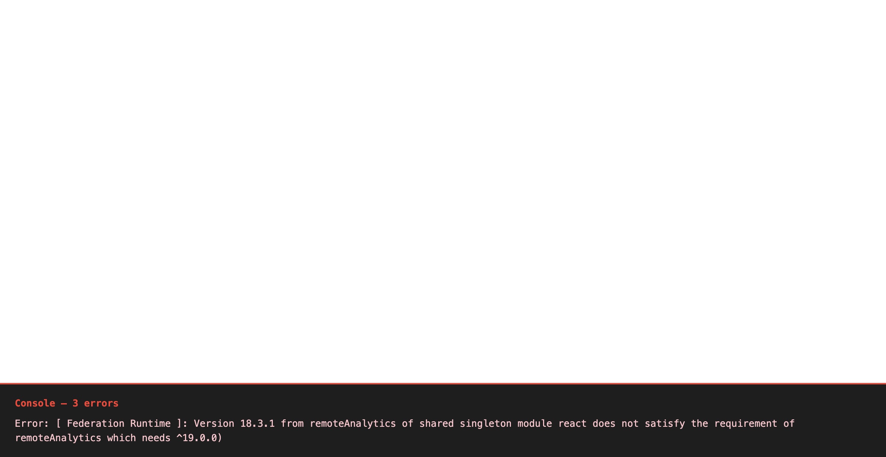
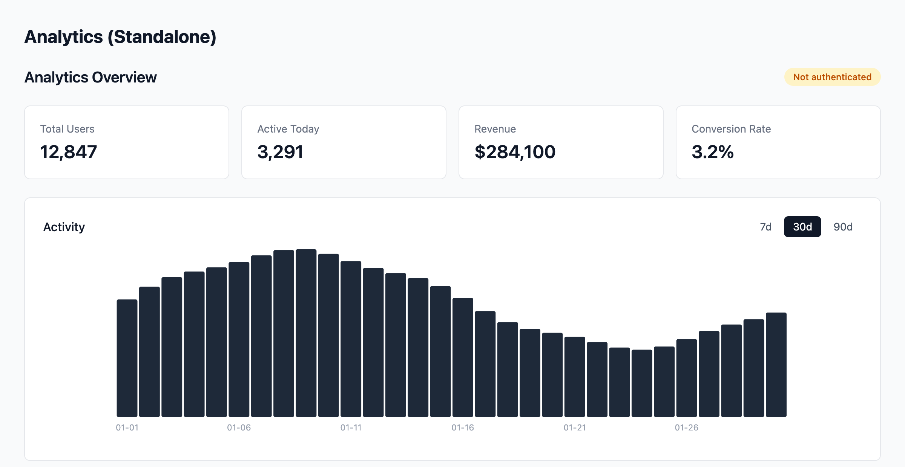

## What You're Doing

You're wiring up a host shell and a remote analytics module using Module Federation. The host application (port 3000) loads the analytics dashboard from a separately built and served remote (port 3001) at runtime. Along the way you'll configure shared dependency negotiation, discover that React Context can't cross federation boundaries, and solve the cross-boundary communication problem using nanostores.

## Why It Matters

Runtime microfrontends give teams independent builds and deploys — but they come with real operational costs. Two dev servers, remote entry manifests, shared dependency negotiation, cross-boundary state management. You need to experience those costs firsthand so you can make an informed architectural decision about whether you actually need runtime composition or whether build-time composition (Exercise 2) is the better fit.

## Prerequisites

- Node.js 20+
- pnpm 9+

## Setup

```bash
pnpm install
pnpm dev
```

Open [http://localhost:3000](http://localhost:3000) (host) and [http://localhost:3001](http://localhost:3001) (remote standalone).

---

## Step 1: Explore the Federation Setup

Start by seeing the running application, then understand how Module Federation connects the pieces.

### Explore in the Browser

1. Open [http://localhost:3000](http://localhost:3000)
2. Open DevTools → **Network** tab
3. Look for `mf-manifest.json` loading from port 3001
4. You'll also see chunk files loaded from the remote — these are the analytics dashboard's code, served from the remote's dev server

You should see the analytics dashboard loading inside the host shell. The sidebar shows **"Grace Hopper"** with **"admin"** below it in gray text, and the main area shows the analytics view with stat cards and a chart. In the Network tab, you can see `mf-manifest.json` and chunk files coming from `localhost:3001`.



> You'll also notice an amber "Not authenticated" badge in the analytics dashboard header — even though the sidebar shows a logged-in user. This is intentional. It's the bug you'll investigate in Step 3 and fix in Step 4.

Now let's look at the configuration that makes this work.

### What to Look At

1. Open `host/rsbuild.config.ts` and find the `remotes` configuration:

```typescript
remotes: {
  remoteAnalytics:
    "remoteAnalytics@http://localhost:3001/mf-manifest.json",
},
```

This tells the host where to find the remote's module manifest at runtime. The manifest (`mf-manifest.json`) is the contract between host and remote — it lists every module the remote exposes, which JavaScript chunks implement them, and which shared dependencies the remote declares. The host fetches this JSON file at runtime, before loading any remote code, so it knows what's available and can negotiate shared dependencies. This is why both dev servers must be running simultaneously: the host makes a network request to port 3001 on every page load.

> [!NOTE]
> You already saw `mf-manifest.json` in the Network tab. That request is Module Federation's runtime negotiation in action — the host and remote agree on shared dependencies and available modules before any remote code executes.

2. Open `remote-analytics/rsbuild.config.ts` and find the `exposes` configuration:

```typescript
exposes: {
  "./analytics-dashboard": "./src/analytics-dashboard",
},
```

This declares which modules the remote makes available to consumers. Think of `exposes` as the remote's public API surface — only paths listed here are importable by consumers. The key on the left (`"./analytics-dashboard"`) becomes the import path consumers use (e.g., `import("remoteAnalytics/analytics-dashboard")`), and the value on the right is the actual source file.

3. Open `host/src/app.tsx` to see the dynamic import:

```typescript
const AnalyticsDashboard = React.lazy(() => import('remoteAnalytics/analytics-dashboard'));
```

The host loads the remote's component lazily at runtime — it's not bundled into the host's build. `React.lazy` paired with a dynamic `import()` means the browser only downloads the remote's JavaScript bundles when `<AnalyticsDashboard />` first renders, not at initial page load.

4. Open `host/src/index.tsx` — notice it's just `import("./bootstrap")`. This async boundary is required for Module Federation's shared module negotiation to work. Without it, eager shared modules fail to resolve.

> [!IMPORTANT]
> **Why `index.tsx` only contains a dynamic import:** Module Federation's shared module negotiation is asynchronous — the runtime must contact all registered remotes and resolve which version of each shared dependency to use before any application code can run. If `index.tsx` imported application code synchronously, that code would execute before negotiation completed and you'd get a runtime error: `Uncaught Error: Shared module is not available for eager consumption`. The dynamic `import("./bootstrap")` defers everything until the federation runtime is ready.

### Checkpoint

You've seen the running app in the browser and understand the configuration that powers it: the host's `remotes` pointing at the manifest URL, the remote's `exposes` declaring its public modules, the lazy dynamic import in the host, and the async boundary in `index.tsx`.

---

## Step 2: Shared Dependency Negotiation

Both the host and remote use React. Without shared dependency configuration, each would bundle its own copy — which breaks hooks, context, and everything else that depends on a single React instance.

### What to Look At

1. In both `rsbuild.config.ts` files, find the `shared` configuration. Both files set `singleton: true` and `eager: true` on all shared dependencies:

```typescript
shared: {
  react: { singleton: true, eager: true },
  "react-dom": { singleton: true, eager: true },
  nanostores: { singleton: true, eager: true },
  "@nanostores/react": { singleton: true, eager: true },
  "@pulse/shared": { singleton: true, eager: true },
},
```

- **`singleton: true`** — Only one copy of React loads, even if the host and remote declare different versions. The Module Federation runtime selects the highest compatible version available and enforces that exactly one copy is used. Without this, each participant loads its own copy, which breaks anything that depends on a single module instance: React hooks, Context, and stores all fall into this category. This constraint is global — if _any_ participant declares a module as a singleton, the runtime enforces it for everyone, so a host can protect its integrity even if a remote forgets to set it.

- **`eager: true`** — Both sides load shared modules immediately. Without `eager: true`, a remote expects the _host_ to provide shared modules like React at runtime. That works when loaded through a host, but means the remote can't boot on its own — it has nowhere to get React from. `eager: true` bundles React directly into the remote's output as a self-contained fallback. The federation runtime still deduplicates at runtime when the host is present, so you won't end up with two React copies in production; `eager` just ensures standalone mode (`localhost:3001`) stays functional.

> `@nanostores/react` appears in the remote's shared config even though it isn't in the remote's `package.json` yet — this is intentional. It's pre-configured so that when you install the package in Step 4c, federation deduplication is already in place. You won't need to touch the config later.

2. **Experiment:** Add `requiredVersion` and `strictVersion` to your existing React entry in the remote's `rsbuild.config.ts`. Keep `singleton: true` and `eager: true` in place — only add the two new fields:

```typescript
shared: {
  react: {
    singleton: true,
    eager: true,
    requiredVersion: "^19.0.0",
    strictVersion: true,
  },
  // ... other shared entries unchanged
},
```

With `strictVersion: true`, Module Federation throws an error if the provided version doesn't satisfy `requiredVersion`. Using `"^19.0.0"` here will trigger the error because this project uses React 18. Stop your dev servers (`Ctrl+C`), run `pnpm dev` again, then open `http://localhost:3001`. The page will go **blank** (React never starts), and you'll see the version mismatch in **DevTools → Console**:

```
Error: [ Federation Runtime ]: Version 18.3.1 from remoteAnalytics of shared singleton module react does not satisfy the requirement of remoteAnalytics which needs ^19.0.0)
```

This is intentional — the remote rejected the available React version before any UI could render. This is how you catch version drift between independently deployed remotes.



**Remove both fields and restore the original config before continuing.** Stop your dev servers and run `pnpm dev` again to pick up the reverted config.

### Checkpoint

Console should be clean — no shared module errors. Only one copy of React is loaded. If you have React DevTools installed, you'll see a single React tree spanning both host and remote components.

> **Note on `[Federation Runtime] Warn` messages:** You may see these in the console throughout the exercise. They appear whenever a shared dependency is configured without an explicit `requiredVersion` (which is the case for most entries in our shared config). They are not errors — just informational messages from the Module Federation runtime about version negotiation. You can safely ignore them.

---

## Step 3: The Auth Context Problem

Now look at the analytics dashboard more carefully. Something is wrong.

### Spot the Bug

1. Look at the **sidebar navigation** — it shows "Grace Hopper" with role "admin". The host has auth data.
2. Look at the **analytics dashboard** header — it shows an amber **"Not authenticated"** badge. The remote does _not_ have auth data.

### Why This Happens

Open `host/src/shell/auth-provider.tsx`. The host fetches the current user from `/api/users/me` and provides it via React Context:

```typescript
const AuthContext = createContext<AuthContextType>({ ... });

export function AuthProvider({ children }) {
  // Fetches user, provides via context
  return <AuthContext.Provider value={value}>{children}</AuthContext.Provider>;
}
```

Now open `remote-analytics/src/analytics-dashboard.tsx`. Find the hardcoded auth values near the top of the component:

```typescript
// THE BUG: This component has no access to the host's auth context.
// It cannot read the current user or auth token.
// On the main branch, this is intentionally broken.
const isAuthenticated = false;
const userName: string | null = null;
```

The remote has no way to access the host's React Context. Even though `<AnalyticsDashboard />` renders _inside_ the host's `<AuthProvider>`, the component code was _built separately_. React Context doesn't cross Module Federation boundaries — the remote's React module resolution sees a different context object than the host's.

> [!IMPORTANT]
> **React Context is matched by object identity, not by type.** When the host calls `createContext(...)`, it gets back a specific JavaScript object — call it `ContextA`. When the remote's separately built bundle also calls `createContext(...)` (or imports what appears to be the same context from a shared file), it gets a _different_ JavaScript object — `ContextB`. React's `useContext` hook works by walking up the component tree to find a `<Context.Provider>` whose context object is `===` to the one passed in. The host's `<AuthContext.Provider>` provides `ContextA`; the remote's `useContext(AuthContext)` asks for `ContextB`. They never match — so the remote always reads the default value.
>
> You might think: "Export the context from `@pulse/shared` and import it in both places." Even that won't work — React Context identity is based on the _module instance_, not the type. TypeScript types are erased at compile time; at runtime, what matters is whether two pieces of code received the _same JavaScript object_. With Module Federation, unless a package is declared as a singleton shared dependency, the host and remote evaluate it independently — `createContext()` runs twice, producing two distinct objects. Moving `createContext` into a shared package doesn't help unless that package is itself a singleton shared module.

### Checkpoint

You understand why the analytics dashboard shows "Not authenticated" — React Context trees don't span federation boundaries. The host has auth data but the remote can't access it through React's built-in mechanisms.

---

## Step 4: Cross-Boundary Communication

The solution is to use a framework-agnostic state management library that both the host and remote can share. `nanostores` is already installed in `@pulse/shared` — you just need to create the store and wire it up.

### 4a: Create the Auth Store

Create a new file `shared/src/auth-store.ts` (note: `auth.ts` already exists in that directory — it holds broadcast channel utilities and is unrelated to what you need here):

> [!NOTE]
> **What is a nanostore atom?** An `atom` is the simplest primitive in nanostores — a reactive container for a single value. Calling `atom(initialValue)` returns a store object with three methods: `.get()` to read the current value, `.set(newValue)` to write a new value and notify all subscribers, and `.subscribe(callback)` to listen for changes. The `useStore` hook from `@nanostores/react` wraps `.subscribe()` in a React hook, re-rendering the component whenever the atom's value changes. The atom itself has zero React dependency — it's plain JavaScript, which is precisely why it can cross framework and federation boundaries that React-specific primitives cannot.

```typescript
import { atom } from 'nanostores';
import type { AuthContext } from './types';

export const authStore = atom<AuthContext>({
  user: null,
  isAuthenticated: false,
  token: null,
});
```

Then add the following export to `shared/src/index.ts`:

```typescript
export * from './auth-store';
```

### 4b: Write to the Store from the Host

Open `host/src/shell/auth-provider.tsx`. Import the store and update it when auth state changes.

Add a second import from `@pulse/shared` — keep it separate from the existing type-only import, since this one is a runtime value:

> TypeScript's `import type` syntax is erased entirely at compile time — it exists only for type checking and produces no JavaScript output. A runtime value like `authStore` cannot be included in an `import type` statement. Keeping them as two separate `import` lines is the clearest way to signal which imports are type-only and which carry runtime code.

```typescript
import type { User, AuthContext as AuthContextType } from '@pulse/shared';
import { authStore } from '@pulse/shared';
```

Inside the `useEffect`, write to the nanostore immediately after the two existing state calls in the `try` block:

```typescript
try {
  const response = await fetch('/api/users/me');
  const data: User = await response.json();
  setUser(data);
  setToken('mock-jwt-token-' + data.id);
  authStore.set({
    user: data,
    isAuthenticated: true,
    token: 'mock-jwt-token-' + data.id,
  });
} catch (error) {
  console.error('Failed to fetch current user:', error);
}
```

### 4c: Read from the Store in the Remote

First, add `@nanostores/react` to the remote so it can use the React bindings. In a separate terminal (not the one running `pnpm dev`), run from the repo root:

```bash
pnpm --filter @pulse/remote-analytics add @nanostores/react
```

> **Why?** pnpm uses strict module isolation — each package can only import its own declared dependencies. Even though `@pulse/shared` already depends on `@nanostores/react`, the remote needs its own declaration to resolve the import at build time. At runtime, Module Federation's singleton config ensures only one copy is loaded.

Now open `remote-analytics/src/analytics-dashboard.tsx`. Replace the hardcoded auth values with the nanostore.

Add these imports:

```typescript
import { useStore } from '@nanostores/react';
import { authStore } from '@pulse/shared';
```

Inside the component, find and delete the `// THE BUG` comment block and the two hardcoded `const` lines below it, then replace them with the nanostore:

```typescript
// Delete these five lines:
// THE BUG: This component has no access to the host's auth context.
// It cannot read the current user or auth token.
// On the main branch, this is intentionally broken.
const isAuthenticated = false;
const userName: string | null = null;
```

```typescript
// Add these three lines in their place:
const auth = useStore(authStore);
const isAuthenticated = auth.isAuthenticated;
const userName = auth.user?.name ?? null;
```

### Why This Works

Two things make this work:

1. **`@pulse/shared` is a singleton shared dependency** in both rsbuild configs. This means the host and remote share the exact same module instance of `@pulse/shared` at runtime — so the `authStore` atom created by `atom(...)` in `auth-store.ts` is the same object in both the host and the remote.

2. **`nanostores` and `@nanostores/react` are also singleton shared dependencies.** This ensures the store library and its React bindings are the same instance on both sides, so `useStore()` in the remote subscribes to the same atom the host writes to.

When the host calls `authStore.set(...)`, the remote's `useStore(authStore)` hook sees the update immediately — because they're literally the same object in memory.

> [!IMPORTANT]
> **The singleton connection is load-bearing.** Every piece of this solution depends on `@pulse/shared` being declared as a singleton shared dependency in both rsbuild configs. If it were missing from `shared`, Module Federation would bundle a separate copy of `@pulse/shared` into both the host and the remote. The host's `authStore.set(...)` would write to one atom object; the remote's `useStore(authStore)` would subscribe to a completely different atom object that never receives any updates. You'd see "Not authenticated" forever, with no error and no obvious cause. The same applies to `nanostores` itself — if the library that implements `.subscribe()` and `.set()` were duplicated, subscriptions established against one copy would be invisible to the other. All three packages — `@pulse/shared`, `nanostores`, and `@nanostores/react` — must be singletons for cross-boundary reactivity to work.

> **If the badge still says "Not authenticated"** after making these changes, check that `@pulse/shared` is listed in the `shared` config in both `rsbuild.config.ts` files. Without it, each side bundles its own copy of `@pulse/shared` and creates separate atom instances — the host writes to one atom while the remote reads from a different one.

This is the key insight: **framework-agnostic state (nanostores, BroadcastChannel, custom events) crosses boundaries that framework-specific state (React Context) cannot** — but only if the module that creates the state is shared across both sides.

Stop your dev servers (`Ctrl+C`) and run `pnpm dev` again to pick up the new file, the new export, and the newly installed dependency. Then open [http://localhost:3000](http://localhost:3000).

### Checkpoint

The analytics dashboard now shows a green **"Viewing as: Grace Hopper"** badge instead of the amber "Not authenticated" badge. The auth context flows from the host to the remote through the shared nanostore.


---

## Stretch Goals

- **BroadcastChannel alternative:** Implement the same cross-boundary communication using the browser's `BroadcastChannel` API instead of nanostores. Look at `shared/src/auth.ts` — it already defines `AUTH_CHANNEL` and an `AuthEvent` interface as a starting point. BroadcastChannel works across browser tabs too, not just federation boundaries.
- **Error boundary limitations:** Stop the remote dev server and reload the host — you'll see a blank white page, not the error boundary fallback. Check the console: you'll find `ERR_CONNECTION_REFUSED` on `mf-manifest.json` followed by a `Federation Runtime` error. This is expected behavior. Module Federation's manifest fetch is part of the eager shared module negotiation that runs _before_ React mounts. When the remote is completely unreachable, the federation runtime throws before `createRoot` is ever called — so the React `ErrorBoundary` never gets a chance to render.
- **Standalone remote:** Visit [http://localhost:3001](http://localhost:3001) directly. The analytics dashboard works independently with its own MSW mock data — it doesn't need the host at all. Notice it shows "Not authenticated" in standalone mode since there's no host to write to `authStore`.

  

---

## Solution

The completed implementation is on the `solution` branch:

```bash
git checkout solution
```

---

## What's Next

You've felt the operational overhead of runtime composition: two dev servers, remote entry manifests, shared dependency negotiation, cross-boundary state management. The natural follow-up question is: what if you consumed this same analytics module as a regular package in a monorepo — no federation, no remote entry, no shared dependency negotiation? Same product, radically simpler architecture. That's the trade-off build-time composition explores.
