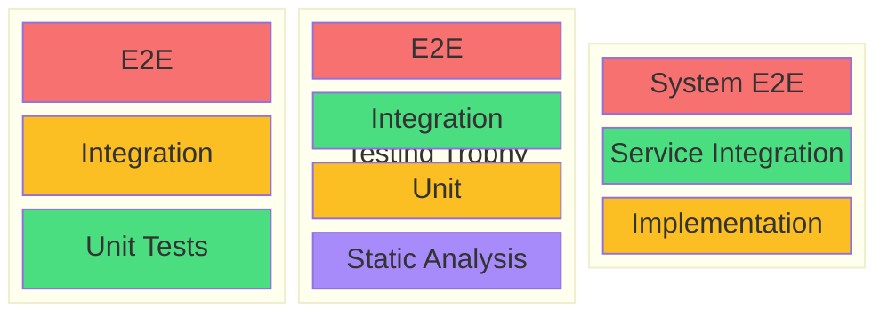
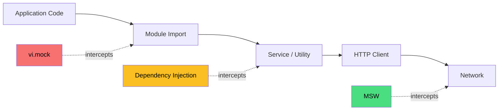
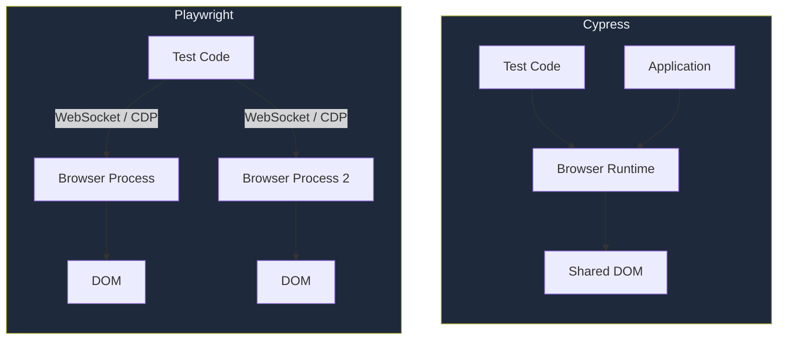
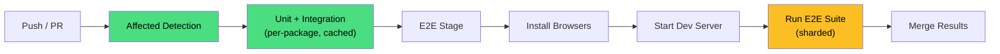
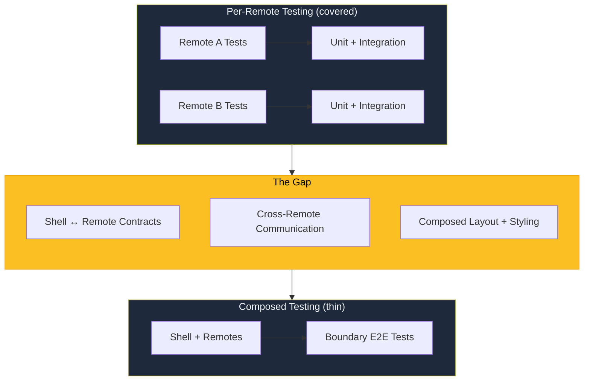

When you have one application and one team, your testing strategy is whatever the team agrees on during a standup. Unit tests for business logic. A few integration tests for the happy path. Maybe some Playwright runs before a release if someone remembers. It works.

But, the moment you have a monorepo with 50 packages, three teams shipping independently, and a user journey that touches five separately-owned modules—testing stops being a localized task and becomes an architectural concern. The question isn't "should we write tests?" The question is _what kind_ of tests, _where_ in the pipeline, and _who owns_ the suite when it starts failing at 2 AM on a Tuesday.

This piece covers the strategic layer. We already have deep coverage of [Mock Service Worker](mock-service-worker.md) for network mocking and [API Contract Testing](api-contract-testing.md) for interface stability. Here, we're talking about how those tools fit into a broader testing architecture—and the enterprise-specific patterns that don't show up in tutorials built around todo apps.

## Choosing a Test Shape

The first strategic decision is _where to allocate effort_. Three models dominate the conversation, and they disagree on the answer.

### The test pyramid

Mike Cohn's [test pyramid][1] is the oldest and most widely taught model. A broad base of unit tests. A narrower middle of integration tests. A thin peak of end-to-end tests. The philosophy is that low-level tests are fast, cheap, and precise—so you should have a lot of them. High-level tests are slow, expensive, and brittle—so you should have few.

In a logic-heavy backend or a monolith with complex business rules, the pyramid is still a reasonable default. Unit tests on pure functions and state transitions give you fast feedback with minimal infrastructure.

### The testing trophy

Guillermo Rauch captured the counterargument in one sentence: "Write tests. Not too many. Mostly integration." Kent C. Dodds formalized this as the [testing trophy][2], which adds a static analysis layer at the bottom and shifts the center of gravity from unit tests to integration tests.

The core insight is that in modern component-based frontends, the interesting bugs aren't in isolated functions—they're in _how things compose_. A `useAuth` hook might work perfectly in isolation and fail completely when wrapped in a router context and a theme provider. Integration tests that exercise components as a user would experience them catch those composition bugs. Testing Library's guiding principle—"the more your tests resemble the way your software is used, the more confidence they can give you"—is the operational expression of this philosophy.

For most single-page applications with component-driven architectures, the trophy is the better default. It trades some unit test speed for meaningfully higher confidence at the integration layer.

### The testing honeycomb

[Spotify's testing honeycomb][3] (sometimes called the testing diamond) takes a different angle entirely. In a microservice or microfrontend architecture, the individual service _is_ the unit. The interesting complexity isn't inside any one service—it's at the boundaries where services communicate. The honeycomb minimizes effort on internal implementation details and maximizes effort on integration points and contract verification.

If you're running a [Module Federation](module-federation.md) setup with independently deployed remotes, the honeycomb's emphasis on boundary testing aligns well with reality. You don't need 300 unit tests proving that a remote's internal state machine works. You need contract tests proving that the remote still honors the shell's expectations.

### Which shape fits?



The green layer is where each model concentrates effort. The shapes disagree on what that layer should be.

| Model     | Center of gravity   | Best fit                                            |
| :-------- | :------------------ | :-------------------------------------------------- |
| Pyramid   | Unit tests          | Logic-heavy backends, pure-function-heavy codebases |
| Trophy    | Integration tests   | Component-based SPAs, modern frontend applications  |
| Honeycomb | Service integration | Microfrontends, microservices, distributed systems  |

The honest answer is that most large applications need _elements of all three_. Pure business logic still deserves unit tests. Component composition deserves integration tests. Cross-service boundaries deserve contract tests. The shape tells you where to put the _most_ effort, not the _only_ effort.

> [!TIP] The inverted pyramid anti-pattern
> One shape to actively avoid: the **inverted pyramid** (sometimes called the "ice cream cone"). This is what you get when the majority of testing effort goes into manual testing and slow E2E suites, with minimal unit or integration coverage underneath. It's expensive, slow, and the first thing to collapse under pressure. If your team's test suite takes 45 minutes and most of it is Selenium, you're living in the inverted pyramid whether you intended to or not.

## Unit Tests in Enterprise Frontends

Unit tests in a large frontend aren't about testing `add(2, 3)`. They're about verifying the business logic that lives in hooks, reducers, state machines, and utility functions.

### State management as the high-value target

Reducers, store actions, and state machine transitions are the highest-confidence targets for unit tests because they're pure functions. Given state A and event B, the result is always state C. No DOM, no rendering, no async—just data transformations.

```typescript
import { describe, it, expect } from 'vitest';
import { cartReducer, initialState } from './cart-reducer';

describe('cartReducer', () => {
  it('adds an item to an empty cart', () => {
    const result = cartReducer(initialState, {
      type: 'ADD_ITEM',
      payload: { id: 'sku-1', name: 'Widget', price: 25, quantity: 1 },
    });

    expect(result.items).toHaveLength(1);
    expect(result.total).toBe(25);
  });

  it('increments quantity for duplicate items', () => {
    const stateWithItem = cartReducer(initialState, {
      type: 'ADD_ITEM',
      payload: { id: 'sku-1', name: 'Widget', price: 25, quantity: 1 },
    });
    const result = cartReducer(stateWithItem, {
      type: 'ADD_ITEM',
      payload: { id: 'sku-1', name: 'Widget', price: 25, quantity: 1 },
    });

    expect(result.items).toHaveLength(1);
    expect(result.items[0].quantity).toBe(2);
    expect(result.total).toBe(50);
  });
});
```

This is the kind of logic that deserves exhaustive unit testing. State transitions in a checkout flow, permission calculations in an RBAC system, price computations in a billing module—these are deterministic, critical, and cheap to test. Teams that achieve high coverage on state transitions tend to ship fewer "the total was wrong" incidents.

### The mocking question

The mocking strategy you choose has a direct effect on how long your test suite stays useful. There's a spectrum, and each position on it trades something.

**Module-level mocking** (`jest.mock`, `vi.mock`) replaces an entire module with a fake. It's fast and easy and also the most likely to produce stale mocks—tests that pass because the mock no longer matches reality, not because the code works. If you mock a module and then the module's API changes, nothing breaks in the test. That's the failure mode.

**Dependency injection** passes dependencies as arguments, making swaps explicit and type-safe. The tradeoff is architectural overhead—your code needs to accept its dependencies rather than importing them directly. For services and utilities, this is often the right call. For React components, it can feel like over-engineering.

**Network-level interception** via [Mock Service Worker](mock-service-worker.md) sits between your application and the network. The application code runs exactly as it does in production. MSW intercepts at the Service Worker layer in the browser and at the `http` module level in Node.js. This is the right default for anything that makes API calls, because the mock is realistic, the application code is untouched, and the same handler set works across unit tests, integration tests, Storybook, and local development.

The difference is where the interception happens:



The further right you intercept, the more production-like the test—but the more infrastructure you need. MSW sits at the network boundary, which means the application's entire code path runs exactly as it does in production.

The pattern I've seen work best in large codebases: use MSW for all API mocking, use dependency injection for complex service-level logic, and reach for `vi.mock` only for true leaf-node dependencies like date libraries or random number generators where the alternative is worse.

## Integration Tests as the Confidence Layer

Integration tests verify that components, hooks, and state modules compose correctly. In a large application, this is where most of the high-value bugs hide—not in individual units, but in the seams between them.

[Testing Library][4] codifies the right philosophy: interact with the DOM the way a user would. Query by role, label, and text—not by CSS class or test ID. Fire real events. Assert on visible outcomes. If you're reaching into component internals to check state values, you're testing the implementation, not the behavior. That distinction is the difference between tests that survive refactoring and tests that break every time someone renames a variable.

The practical rule for enterprise integration tests: test _features_, not _components_. A "search and filter" integration test exercises the input field, the debounce hook, the API call (intercepted by MSW), the state update, and the results rendering—all in one flow. That's the composition you actually need to verify.

```typescript
import { render, screen, waitFor } from '@testing-library/react';
import userEvent from '@testing-library/user-event';
import { UserSearch } from './user-search';

it('filters users by search term', async () => {
  const user = userEvent.setup();
  render(<UserSearch />);

  await user.type(screen.getByRole('searchbox'), 'Ada');

  await waitFor(() => {
    expect(screen.getByText('Ada Lovelace')).toBeInTheDocument();
    expect(screen.queryByText('Alan Turing')).not.toBeInTheDocument();
  });
});
```

No mocking of component internals. No inspection of hook state. Just "type a name, see the right results." That test will survive a refactor from Redux to Zustand, a migration from Axios to `fetch`, and a complete rewrite of the debounce logic—because it tests the contract, not the machinery.

## End-to-End Testing at Scale

E2E tests run the full application in a real browser. They're the most expensive tests you can write—slowest to run, most infrastructure to maintain, most prone to flakiness—and also the only tests that verify the entire stack assembled. The goal isn't to cover everything. It's to cover the **critical user journeys** that, if broken, would cause real business damage.

### Playwright versus Cypress

The two dominant E2E frameworks represent fundamentally different architectural decisions.

**Cypress** runs inside the browser's execution loop. Tests and the application share the same JavaScript runtime. This produces excellent debugging ergonomics—you can observe application state directly, and Cypress's automatic waiting is intuitive. The limitation is the browser's security sandbox. Multi-tab testing, cross-origin navigation, and anything that requires controlling browser behavior from _outside_ the tab are architecturally constrained.

**Playwright** communicates with browsers via the [Chrome DevTools Protocol][5] over WebSocket. It runs out-of-process, which means it can manage multiple browser contexts, tabs, and domains natively. It supports Chromium, Firefox, and WebKit (Safari) from a single API. It has first-class parallel execution with worker-based sharding. And it doesn't require a paid cloud service for CI parallelism.

The architectural difference looks like this:



Cypress shares a runtime with the application—great for observability, limiting for multi-context scenarios. Playwright controls browsers from outside, which means it can manage multiple contexts, tabs, and even different browser engines simultaneously.

For enterprise-scale testing—where you need cross-browser coverage, parallel execution across dozens of CI nodes, and multi-domain user journeys—Playwright's architecture scales better. Cypress's in-browser model is great for developer experience on smaller suites, but you'll outgrow it once your E2E suite exceeds a few dozen tests and needs to run in under ten minutes.

### Structuring E2E for maintainability

A large E2E suite rots fast without structural patterns. The **Page Object Model** abstracts page-level interactions into classes, so test logic is separated from DOM selectors. But in component-based architectures, the **Component Object Model** is often a better fit—it treats reusable UI fragments (navigation bars, data tables, modals) as composable objects that can be used across multiple page-level tests.

```typescript
// Component object for a shared data table
class DataTable {
  constructor(private page: Page) {}

  async rowCount() {
    return this.page.getByRole('row').count() - 1; // subtract header
  }

  async cellText(row: number, column: string) {
    return this.page
      .getByRole('row')
      .nth(row + 1)
      .getByRole('cell', { name: column })
      .textContent();
  }

  async sortBy(column: string) {
    await this.page.getByRole('columnheader', { name: column }).click();
  }
}

// Used across multiple test files
test('users table sorts by name', async ({ page }) => {
  await page.goto('/users');
  const table = new DataTable(page);

  await table.sortBy('Name');
  const firstCell = await table.cellText(0, 'Name');
  expect(firstCell).toBe('Ada Lovelace');
});
```

When the data table's HTML structure changes, you update one class. Every test that uses it keeps working. That's the difference between a maintainable E2E suite and a pile of duplicated selectors that someone abandons after the third refactor.

### Flakiness is a strategic problem

A test with 99% reliability sounds fine. A suite of 200 tests at 99% reliability each will produce at least one false failure in 87% of runs. At enterprise scale, flakiness isn't an annoyance—it's the thing that makes teams stop trusting the test suite and start merging without green CI.

The defenses:

- **Deterministic selectors.** Use `getByRole`, `getByLabel`, or `data-testid` attributes. Never rely on CSS classes, tag indices, or XPath expressions that break when someone reorders a `div`.
- **Test isolation.** Each test gets a fresh browser context, fresh session state, and unique test data. No shared database state between tests. No "test B depends on what test A created."
- **Retry budgets.** Allow retries for transient infrastructure failures (network timeouts, browser startup race conditions), but _log every retry_. If a test needs retries to pass reliably, it has a bug—the retry is a bandage, not a fix. Track retry rates and investigate tests that retry frequently.
- **Parallel sharding.** Split the suite across multiple CI workers to keep total execution time under ten minutes. Playwright's `--shard` flag handles this natively.

## Visual Regression Testing

Functional tests tell you the button works. Visual regression tests tell you the button doesn't look like it survived a CSS earthquake.

Visual regression testing captures screenshots of UI states and compares them pixel-by-pixel against approved baselines. It catches layout shifts, broken alignment, color regressions, and z-index problems that functional tests completely miss—because functional tests don't look at the screen.

**Chromatic** is the standard tool for Storybook-driven workflows. It captures every story as a visual snapshot and diffs against the previous baseline. When a visual change is detected, it surfaces in the pull request for review. Intentional changes get approved. Unintentional changes block merge. The key advantage over raw screenshot diffing is that Chromatic's algorithms handle anti-aliasing differences and subpixel rendering noise, so you don't drown in false positives.

For page-level visual testing in E2E flows, Playwright has built-in [screenshot comparison][6]:

```typescript
test('dashboard renders correctly', async ({ page }) => {
  await page.goto('/dashboard');
  await page.waitForSelector('[data-loaded="true"]');

  await expect(page).toHaveScreenshot('dashboard.png', {
    maxDiffPixelRatio: 0.01,
  });
});
```

The workflow integration matters as much as the tool. Visual diffs should appear in pull requests, not in a separate tool that nobody checks. Designers and engineers should both be able to review and approve changes. And the baseline update process should be explicit—accidentally updating baselines when they shouldn't be updated is how visual regressions get permanently baked into the codebase.

## Enterprise-Specific Testing Patterns

Large applications have testing requirements that most tutorials don't cover, because most tutorials aren't built for software that handles real money, real compliance, or real access control.

### RBAC and permission testing

If your application has role-based access control, you need to test the permission boundaries—not just the happy path. A **permission matrix** maps roles to allowed actions:

| Role   | Create | Read | Update | Delete |
| :----- | :----- | :--- | :----- | :----- |
| Admin  | Yes    | Yes  | Yes    | Yes    |
| Editor | Yes    | Yes  | Yes    | No     |
| Viewer | No     | Yes  | No     | No     |

The important tests aren't the "admin can do everything" tests. Those are easy and rarely fail. The important tests are the **negative scenarios**: does the Viewer role _actually_ see a disabled delete button? Does the API call return a 403, not a 500? If a Viewer somehow navigates to `/admin/users/delete/42`, does the route guard redirect them, or does it render a broken page?

Automate RBAC tests across all primary roles for critical features. Run them on every release. The bugs that slip through permission boundaries tend to be the ones that end up in security incident reports.

### Multi-tenant isolation

For SaaS platforms, multi-tenancy testing verifies that Tenant A cannot access Tenant B's data. This sounds obvious, and it is, until someone writes a query that forgets to include the `tenant_id` filter.

The testing pattern is to create test scenarios with two tenants and verify strict data isolation:

```typescript
test('tenant A cannot access tenant B resources', async ({ request }) => {
  const tenantAToken = await authenticate('tenant-a-user');
  const response = await request.get('/api/projects/tenant-b-project-id', {
    headers: { Authorization: `Bearer ${tenantAToken}` },
  });

  expect(response.status()).toBe(403);
});
```

These tests belong in your integration suite, not just in E2E. By the time a tenant isolation failure reaches E2E, the damage is architectural.

### Internationalization

i18n testing goes beyond "did the translation string load." Enterprise i18n has three failure modes that functional tests won't catch:

- **Expansion testing**: German and Finnish strings can be 30–40% longer than English. A button that says "Submit" in English says "Einreichen" in German, and if the container has a fixed width, the text overflows or wraps in ugly ways. Visual regression tests with locale-switched snapshots catch this.
- **Right-to-left mirroring**: Arabic and Hebrew trigger RTL layout. Navigation flips. Icons mirror. Text alignment reverses. A component that looks perfect in English can be completely broken in Arabic if the CSS doesn't handle `direction: rtl` correctly.
- **Locale-specific formatting**: Dates, currencies, and numbers render differently. `$1,234.56` in the US is `1.234,56 €` in Germany. If your formatting logic uses hardcoded separators instead of `Intl.NumberFormat`, it's wrong in half the world.

### Accessibility as a testing layer

Accessibility testing is not optional in enterprise software—it's often legally required. Automated tools like [axe-core][7] catch roughly 30–50% of WCAG violations: missing ARIA labels, insufficient color contrast, invalid roles. Integrate axe into both component stories and E2E tests:

```typescript
import AxeBuilder from '@axe-core/playwright';

test('dashboard has no critical a11y violations', async ({ page }) => {
  await page.goto('/dashboard');
  const results = await new AxeBuilder({ page }).analyze();

  expect(results.violations.filter((v) => v.impact === 'critical')).toHaveLength(0);
});
```

But automated checks only catch the mechanical violations. Keyboard navigation, focus management, and screen reader behavior require explicit interaction tests. Can you tab through the entire form? Does focus return to the trigger when a modal closes? Does the screen reader announce status changes? These need to be written as tests, not hoped for as outcomes.

## Monorepo Testing Strategies

### Affected detection

A monorepo with 50+ packages might have thousands of tests. Running all of them on every pull request is wasteful and slow. The solution is **affected detection**—analyzing the dependency graph to determine which packages changed and running only their tests plus the tests of packages that depend on them.

[Turborepo](turborepo.md) handles this through its task graph and caching. If a package's inputs haven't changed since the last successful test run, the cached result is reused. In practice, this reduces a 20-minute full test suite to 2–3 minutes for most pull requests.

Nx takes a more explicit approach with `nx affected:test`, which uses its project graph to identify impacted packages. Both tools achieve the same goal: fast CI feedback without sacrificing coverage for changed code.

### Shared test infrastructure

Centralizing test utilities prevents every team from reinventing mock data and render helpers:

```text
packages/
  test-utilities/
    fixtures/
      user.factory.ts
      product.factory.ts
    mocks/
      handlers.ts
    helpers/
      render-with-providers.tsx
```

Factory functions generate fresh, valid test data for each test. Shared MSW handlers provide consistent API behavior across all test suites. A `renderWithProviders` helper wraps components in the theme, auth, router, and query client providers they need—so individual tests don't each build their own slightly-different provider stack.

The rule: mock _external_ APIs with MSW. Test _internal_ package interactions authentically. If `@acme/ui` depends on `@acme/tokens`, don't mock the tokens package—import it and test the real integration. Mocking your own internal packages defeats the purpose of having a monorepo.

### Test organization

Where tests live affects how they run:

- **Unit tests**: colocated with source (`Button.test.tsx` next to `Button.tsx`). Discovered automatically by Vitest or Jest.
- **Integration tests**: in a `__tests__/` directory at the package root, emphasizing cross-module flows within that package.
- **E2E tests**: in a dedicated `e2e/` package or `apps/app-name-e2e/` directory. Centralized because they exercise the composed application, not individual packages.

This separation matters for CI performance:



Unit and integration tests run per-package with affected detection—only changed packages and their dependents get tested. E2E tests run against the composed application in a separate CI stage with browser installation and a running dev server.

## The Microfrontend Testing Gap

Microfrontends create a specific testing problem that neither unit tests nor traditional E2E tests address cleanly. Each remote can be tested in isolation—its components render, its state manages correctly, its API calls return the right data. But the _composed_ application introduces integration seams that don't exist in any single remote's test suite.



The gap shows up in three places:

- **Shell-to-remote contracts.** Does the shell still provide the props, context, and theme tokens the remote expects? Version drift between shell and remote is the most common source of production failures in Module Federation setups.
- **Cross-remote communication.** If two remotes share state through [Nanostores](nanostores.md), [BroadcastChannel](broadcast-channel.md), or custom events, who tests that the messages are compatible?
- **Composed layout and styling.** A remote that looks correct in standalone mode can break when rendered inside the shell's layout—z-index collisions, CSS variable overrides, and conflicting global styles are invisible until the remotes are composed.

[Contract testing](api-contract-testing.md) handles the first gap. The shell declares what it expects from each remote, and each remote verifies it can satisfy those expectations. For the second and third gaps, you need composed integration tests—a small number of Playwright tests that load the shell with its remotes and verify the critical integration seams. These are _not_ full E2E journey tests. They're boundary tests: does the remote mount? Does it receive the theme? Does cross-remote navigation work? Does shared state propagate?

Keep this composed suite small. Its purpose is to catch integration failures, not to retest every feature that the per-remote suites already cover.

## Vitest versus Jest

If you're starting a new project or migrating a monorepo's test infrastructure, the test runner choice matters for developer experience and CI cost.

**Jest** has been the default for years. It has comprehensive features, a huge ecosystem of matchers and plugins, and near-universal familiarity. It also runs CommonJS by default, uses its own module transform pipeline, and can be slow in large monorepos because it doesn't share configuration with your build tooling.

**Vitest** is built on Vite, which means it uses the same bundler and module resolution as your development and production builds. No behavioral discrepancies between "how the test runner resolves imports" and "how the app actually resolves imports." It supports native ESM, runs 5–10x faster than Jest in most benchmarks, uses less memory (which matters when you're running thousands of tests in parallel on CI), and offers a near-identical API so migration is mostly mechanical.

For monorepos, Vitest's speed advantage compounds. A test suite that takes 8 minutes with Jest might take 2 minutes with Vitest—and when that suite runs on every push across dozens of packages, the CI cost savings add up.

The migration path is straightforward: replace `jest` with `vitest` in your test files, swap `jest.fn()` for `vi.fn()`, update the config file, and run the suite. Most tests work without changes because the assertion and mocking APIs are intentionally compatible.

## Test Data and Environments

### Test data management

Enterprise tests often need complex, multi-stage state that's tedious to set up and dangerous to share between tests.

**Factory functions** generate fresh, valid data objects for each test. No shared fixtures. No "test user 42" that seven different test files all depend on in slightly different states. Each test creates what it needs and tears it down when it's done.

**API seeding** creates backend state through the application's own API rather than direct database manipulation. This is slower but more realistic—if the API validates data on the way in, your test data passes the same validation. Direct database inserts skip validation, which means your test data might be subtly invalid in ways that produce different behavior than production.

**Data masking** is a compliance requirement when using production data snapshots in staging or testing environments. If your test fixtures contain real customer names, email addresses, or financial data, that's a data privacy violation waiting to happen. Anonymize before the data leaves production.

### Ephemeral environments

Shared staging environments are the single biggest bottleneck in enterprise testing pipelines. Two teams deploying to the same staging environment at the same time contaminate each other's tests. A broken deploy blocks everyone until someone fixes it or rolls back. The queue of "waiting for staging" is where velocity goes to die.

**Ephemeral environments**—short-lived, isolated copies of the full stack provisioned for each pull request—eliminate the bottleneck. Each PR gets its own frontend, backend, and database. Tests run in isolation. No queueing. No contamination. When the PR merges or closes, the environment is torn down.

The infrastructure cost is real, but the engineering velocity gain usually justifies it. Teams with ephemeral environments consistently ship faster because they're never blocked waiting for a shared resource.

## Test Governance

At scale, _who owns what_ matters as much as _what you test_. Without clear ownership, test failures become nobody's problem, flaky tests accumulate, and the suite gradually becomes a thing that everyone ignores.

A workable governance model:

- **Package teams own their unit and integration tests.** If a test in `@acme/checkout` fails, the checkout team investigates. Not the platform team. Not the QA team. The team that owns the code owns the tests.
- **A platform team owns the testing infrastructure.** Shared utilities, CI configuration, browser installation, test runner upgrades, and the affected detection pipeline. They make it easy for teams to write good tests. They don't write the tests for them.
- **E2E tests for critical journeys have explicit owners.** The "checkout completes successfully" E2E test isn't owned by "everyone." It's owned by the checkout team, who are responsible for keeping it green and updating it when the journey changes.
- **Quarantine, don't delete, flaky tests.** Tag tests with `@quarantine` and exclude them from blocking merges. Track them in a dashboard. Investigate and fix them on a cadence. A quarantined test is a known problem. A deleted test is a lost investment.

The overarching principle: testing at scale is an organizational problem, not just a technical one. The tools are the easy part. The hard part is making sure that when a test fails, someone cares enough to fix it—and has the context to do so quickly.

[1]: https://www.mountaingoatsoftware.com/blog/the-forgotten-layer-of-the-test-automation-pyramid 'The Forgotten Layer of the Test Automation Pyramid'
[2]: https://kentcdodds.com/blog/the-testing-trophy-and-testing-classifications 'The Testing Trophy and Testing Classifications'
[3]: https://engineering.atspotify.com/2018/01/testing-of-microservices/ 'Testing of Microservices - Spotify Engineering'
[4]: https://testing-library.com/docs/guiding-principles 'Guiding Principles | Testing Library'
[5]: https://chromedevtools.github.io/devtools-protocol/ 'Chrome DevTools Protocol'
[6]: https://playwright.dev/docs/test-snapshots 'Visual comparisons | Playwright'
[7]: https://www.deque.com/axe/ 'axe - Accessibility Testing Tools'

---

## Slides

### Slide: Test Shapes

> Three models for how much of each test type to write.

| Model                 | Shape | Emphasis                                     |
| --------------------- | ----- | -------------------------------------------- |
| **Test Pyramid**      | △     | Lots of unit, fewer integration, minimal E2E |
| **Testing Trophy**    | 🏆    | Heavy integration, moderate unit and E2E     |
| **Testing Honeycomb** | ⬡     | Integration-first for microservices          |

**For microfrontends:** The trophy model tends to work best.

- Unit test business logic and state management.
- Integration test composed UI with MSW-mocked APIs.
- E2E test critical cross-remote user flows only (they're slow and flaky).
- Contract test API boundaries between remotes and BFF.

---

### Slide: Visual Regression Testing

> Catch unintended visual changes automatically.

- **Chromatic** — Storybook-based, captures every story as a baseline.
- **Playwright screenshots** — capture pages at key states, diff against baselines.
- **Percy** — cross-browser visual snapshots in CI.

**In a design system context:**

- Every component variant gets a visual baseline.
- PRs that change component styles show visual diffs in the review.
- Prevents "I changed a token and accidentally broke 47 components."
