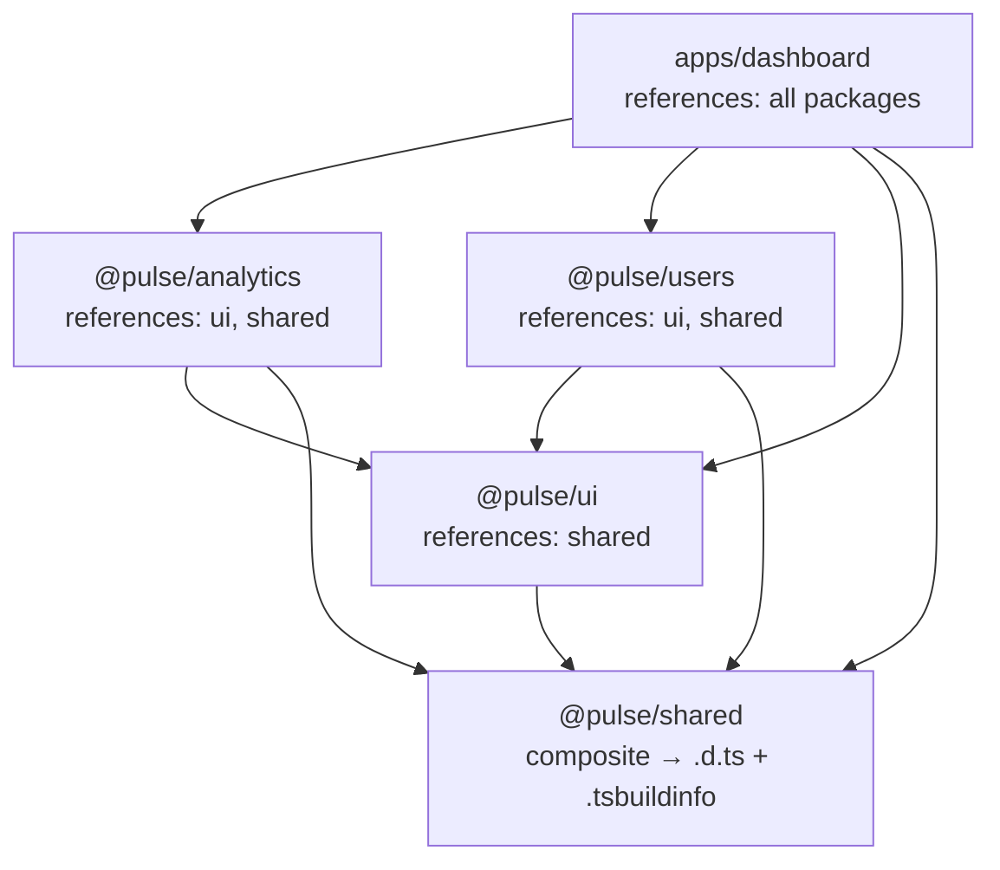
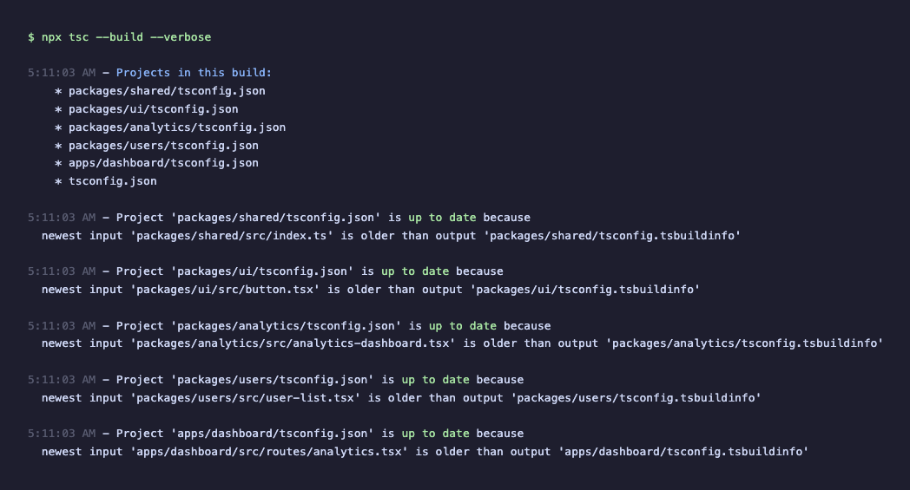
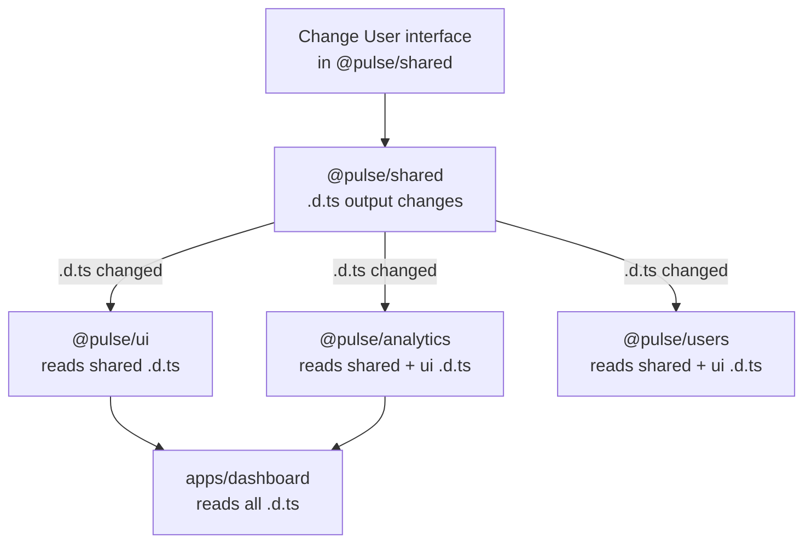

## What You're Doing

TypeScript currently checks each package independently with no incremental checking across package boundaries. Changing a type in `@pulse/shared` forces a full recheck of every package that imports it. You're going to add `composite: true` and `references` arrays to each package's `tsconfig.json` so TypeScript can track cross-package dependencies and skip rechecking packages whose inputs haven't changed.

## Why It Matters

In a monorepo with 5 packages, a full typecheck takes a few seconds. In a monorepo with 50 packages, it takes minutes. TypeScript's project references feature (the `composite` + `references` combination) enables incremental compilation: TypeScript generates `.tsbuildinfo` files that record what was checked and what the results were. On the next run, it only rechecks packages whose source files or upstream declaration files have changed. This is the difference between a typecheck that blocks your workflow and one you barely notice.

## Prerequisites

- Node.js 20+
- pnpm 9+

## Setup

You should be continuing from where Exercise 4 left off. If you need to catch up:

```bash
git checkout 04-typescript-start
pnpm install
```

## Measure the Baseline

Run the typecheck to see how long it takes without project references.

Run the typecheck across all packages:

```bash
pnpm turbo typecheck
```

Note the total time. Every package runs `tsc --noEmit` independently. There is no incremental state — each run starts from scratch.

> [!NOTE] `tsc --noEmit` and `tsc --build`
> `tsc --noEmit` runs the type checker against a single project and reports errors, but produces no output files — no `.js`, no `.d.ts`, no `.tsbuildinfo`. It is a one-shot validation pass that starts from scratch every time. `tsc --build` (or `tsc -b`) is project-aware and incremental: it reads the `references` array in `tsconfig.json`, builds projects in dependency order, generates declaration files and `.tsbuildinfo` metadata, and on subsequent runs skips any project whose inputs have not changed. The key difference is that `--build` understands the relationship between projects in a monorepo, while `--noEmit` treats each invocation as an isolated type check with no memory of previous runs. You will switch from `--noEmit` to `--build` later in this exercise to unlock incremental cross-package type checking.

Run it again:

```bash
pnpm turbo typecheck
```

Turborepo caches the result, so the second run is fast. But this is Turborepo's cache, not TypeScript's. If you change a type in `@pulse/shared`, Turborepo invalidates the cache for every downstream package and TypeScript rechecks them all from scratch.

> [!NOTE] Turborepo caching vs. TypeScript incremental builds
> These are complementary, not redundant. Turborepo caches task-level results — if the inputs to `@pulse/analytics:typecheck` haven't changed, it replays the result. But when inputs _do_ change, Turborepo runs the full typecheck command from scratch. TypeScript's incremental builds (via `.tsbuildinfo`) cache at a finer grain — individual file-level type information. Even when Turborepo decides a typecheck needs to re-run, TypeScript can skip files within that package that haven't changed. Together, they minimize work at two different levels.

### Checkpoint

You've measured the baseline typecheck time. Every package checks independently with no incremental state.

## How Project References Work

TypeScript project references create a build graph that mirrors your package dependencies. Each package generates `.d.ts` declaration files that downstream packages read instead of re-parsing source. When an upstream package's declarations haven't changed, downstream packages skip their recheck entirely.



## Add `composite: true` to Each Package

The `composite` flag tells TypeScript that this project is part of a larger build and should generate the metadata needed for incremental compilation.

Open `packages/shared/tsconfig.json`. It should look something like:

```json title="packages/shared/tsconfig.json"
{
  "extends": "../../tsconfig.base.json",
  "compilerOptions": {
    "outDir": "./dist",
    "rootDir": "./src"
  },
  "include": ["src"]
}
```

Add `"composite": true` and `"declaration": true` to `compilerOptions`:

```jsonc title="packages/shared/tsconfig.json" {4,5}
{
  "extends": "../../tsconfig.base.json",
  "compilerOptions": {
    "composite": true,
    "declaration": true,
    // [!note These two fields enable incremental cross-package type checking.]
    "outDir": "./dist",
    "rootDir": "./src",
  },
  "include": ["src"],
}
```

> [!IMPORTANT] `composite: true` requires `declaration: true`
> When a package is composite, TypeScript generates `.d.ts` declaration files alongside its output. Downstream packages read these declarations instead of re-parsing the source files. This is what makes incremental cross-package checking possible — TypeScript compares the current declaration output against the previous run's `.tsbuildinfo` and only rechecks if the declarations changed. Without `declaration: true`, TypeScript has no stable artifact to compare against.

> [!NOTE] Declaration files
> A `.d.ts` file contains the type signatures of every exported function, class, interface, and variable, but no implementation code — no function bodies, no expressions, no runtime logic. When TypeScript type-checks a file that imports from another package, it reads the declaration file instead of re-parsing and re-analyzing the full source code. This is dramatically faster because declaration files are smaller and already fully resolved — no type inference needed. In a monorepo with `composite: true`, TypeScript generates these declaration files automatically and uses them as the "contract" between projects: if a declaration file has not changed since the last build, downstream projects can skip rechecking entirely.

The `"composite": true` and `"declaration": true` lines are the only changes—everything else in each `tsconfig.json` stays the same.

Repeat for every package. Add `"composite": true` and `"declaration": true` to:

- `packages/ui/tsconfig.json`
- `packages/analytics/tsconfig.json`
- `packages/users/tsconfig.json`
- `apps/dashboard/tsconfig.json`

> [!NOTE] `composite` also enforces stricter project hygiene
> When you enable it, TypeScript requires that every file matched by `include` is actually part of the compilation — no stray files. It also requires `rootDir` to be set so declaration file paths are predictable. If you see errors about files not being included in the compilation, check your `include` patterns. This strictness is intentional: it ensures each project has well-defined boundaries, which is exactly what you want in a monorepo.

## Add `references` Arrays

References tell TypeScript which other projects a package depends on. This mirrors the dependency graph in your `package.json` files.

`packages/shared/tsconfig.json` needs no references. It's a leaf package with no internal dependencies:

```json title="packages/shared/tsconfig.json"
{
  "extends": "../../tsconfig.base.json",
  "compilerOptions": {
    "composite": true,
    "declaration": true,
    "outDir": "./dist",
    "rootDir": "./src"
  },
  "include": ["src"]
}
```

`packages/ui/tsconfig.json` references `@pulse/shared`:

```jsonc title="packages/ui/tsconfig.json" {10}
{
  "extends": "../../tsconfig.base.json",
  "compilerOptions": {
    "composite": true,
    "declaration": true,
    "outDir": "./dist",
    "rootDir": "./src",
  },
  "include": ["src"],
  // [!note Declares the TypeScript-level dependency on @pulse/shared.]
  "references": [{ "path": "../shared" }],
}
```

`packages/analytics/tsconfig.json` references `@pulse/ui` and `@pulse/shared`:

```jsonc title="packages/analytics/tsconfig.json" {10-12}
{
  "extends": "../../tsconfig.base.json",
  "compilerOptions": {
    "composite": true,
    "declaration": true,
    "outDir": "./dist",
    "rootDir": "./src",
  },
  "include": ["src"],
  "references": [
    { "path": "../ui" },
    // [!note Mirror the dependencies from package.json so tsc builds in the right order.]
    { "path": "../shared" },
  ],
}
```

`packages/users/tsconfig.json` gets the same references as analytics:

```jsonc title="packages/users/tsconfig.json" {10-12}
{
  "extends": "../../tsconfig.base.json",
  "compilerOptions": {
    "composite": true,
    "declaration": true,
    "outDir": "./dist",
    "rootDir": "./src",
  },
  "include": ["src"],
  "references": [
    { "path": "../ui" },
    // [!note Same references as analytics — both feature packages depend on ui and shared.]
    { "path": "../shared" },
  ],
}
```

`apps/dashboard/tsconfig.json` references all packages:

```jsonc title="apps/dashboard/tsconfig.json" {10-14}
{
  "extends": "../../tsconfig.base.json",
  "compilerOptions": {
    "composite": true,
    "declaration": true,
    "outDir": "./dist",
    "rootDir": "./src",
  },
  "include": ["src"],
  "references": [
    { "path": "../../packages/analytics" },
    { "path": "../../packages/users" },
    { "path": "../../packages/ui" },
    // [!note The dashboard references all four packages since it imports from each one.]
    { "path": "../../packages/shared" },
  ],
}
```

> [!IMPORTANT] References must match your actual dependency graph
> If `packages/analytics/package.json` lists `@pulse/ui` as a dependency, then `packages/analytics/tsconfig.json` must include `{ "path": "../ui" }` in its references. A mismatch means TypeScript either misses a dependency (leading to stale type information) or declares one that doesn't exist (leading to unnecessary rechecks). The references array is the TypeScript-level mirror of your `package.json` dependencies.

## Create a Root Build Configuration

Create or update `tsconfig.json` at the repository root so `tsc --build` knows about all projects:

```jsonc title="tsconfig.json" {2-8}
{
  "files": [],
  // [!note No files to compile here — this is just an entry point for tsc --build.]
  "references": [
    { "path": "packages/shared" },
    { "path": "packages/ui" },
    { "path": "packages/analytics" },
    { "path": "packages/users" },
    { "path": "apps/dashboard" },
  ],
}
```

> [!NOTE] `"files": []` is intentional
> The root `tsconfig.json` doesn't compile any files itself — it only acts as an entry point that tells `tsc --build` which projects exist. The `files: []` prevents TypeScript from trying to compile anything in the root directory. Each project's own `tsconfig.json` (with its `include` pattern) determines what gets compiled.

## Run `tsc --build`

Run the TypeScript build from the root:

```bash
npx tsc --build
```

TypeScript processes each project in dependency order: `@pulse/shared` first (no dependencies), then `@pulse/ui`, then `@pulse/analytics` and `@pulse/users` (which can run in parallel since neither depends on the other), then `apps/dashboard` last.

Check for `.tsbuildinfo` files:

```bash
ls packages/shared/*.tsbuildinfo
ls packages/ui/*.tsbuildinfo
ls packages/analytics/*.tsbuildinfo
```

Each package now has a `.tsbuildinfo` file that records the compilation state.

Run `tsc --build` again:

```bash
npx tsc --build
```

The second run should be noticeably faster. TypeScript reads each `.tsbuildinfo` file, compares it against the current source, and skips projects where nothing has changed.

### Checkpoint

`tsc --build` completes successfully. Each package has a `.tsbuildinfo` file. The second run is faster because TypeScript uses incremental state.




## Test Incremental Rechecking

When you change a type in `@pulse/shared`, the cascade flows through the reference graph. Only packages with a dependency path to the changed package get rechecked — everything else is skipped.



Open `packages/shared/src/types.ts` and add a new field to the `User` interface:

```typescript title="packages/shared/src/types.ts" {8}
export interface User {
  id: string;
  name: string;
  email: string;
  role: 'admin' | 'member' | 'viewer';
  avatar?: string;
  createdAt: string;
  department?: string;
  // [!note Adding a new exported field changes the .d.ts output and triggers downstream rechecks.]
}
```

Run `tsc --build` and watch the output:

```bash
npx tsc --build --verbose
```

The `--verbose` flag shows which projects are being checked and which are being skipped. You should see:

- `@pulse/shared` — rechecked (source changed)
- `@pulse/ui` — rechecked (depends on `@pulse/shared`, whose declarations changed)
- `@pulse/analytics` — rechecked (same reason)
- `@pulse/users` — rechecked (same reason)
- `@pulse/dashboard` — rechecked (depends on everything)

> [!NOTE] Why everything rechecks when you change a shared type
> The `User` interface is exported from `@pulse/shared`, which means the generated `.d.ts` file changes. Every project that references `@pulse/shared` reads these declarations, so their input hash changes too. This is correct — a type change in shared code could introduce errors anywhere. But if you change a _non-exported_ implementation detail in `@pulse/shared` (like a private helper function), the declarations don't change, and downstream projects skip the recheck entirely.

Now make a change that doesn't affect the public API. Open `packages/ui/src/button.tsx` and add a comment:

```typescript
// Internal styling update
```

Run `tsc --build --verbose` again. This time, only `@pulse/ui` and its dependents should recheck. `@pulse/shared` is skipped because it didn't change.

Revert both changes when you're done.

### Checkpoint

Changing a type in `@pulse/shared` causes all downstream packages to recheck. Changing an internal file in `@pulse/ui` only rechecks `@pulse/ui` and its dependents, not `@pulse/shared`. Incremental checking works.

## Solution

If you need to catch up, the completed state for this exercise is available on the `05-linting-start` branch:

```bash
git checkout 05-linting-start
pnpm install
```

## Stretch Goals

- **Measure the speedup:** Add 10 more interfaces to `@pulse/shared/src/types.ts`, run `tsc --build` to populate the cache, then change one interface and run `tsc --build --verbose` again. With more projects and more types, the incremental speedup becomes more dramatic.
- **`declarationMap`:** Add `"declarationMap": true` to `compilerOptions`. This generates `.d.ts.map` files that let your editor "Go to Definition" on a type from `@pulse/shared` and jump to the actual `.ts` source, not the `.d.ts` output.
- **Path aliases:** Configure path aliases in `tsconfig.base.json` so `@pulse/shared` resolves cleanly without relative paths. Check that both `tsc --build` and Vite resolve the aliases correctly.

## What's Next

TypeScript now checks incrementally across package boundaries. But nothing prevents code from violating those boundaries — you can still import internal files from another package, and there's no enforcement of the dependency graph at the lint level. In the next exercise, you'll configure `eslint-plugin-boundaries` to catch architectural violations before they reach code review.
