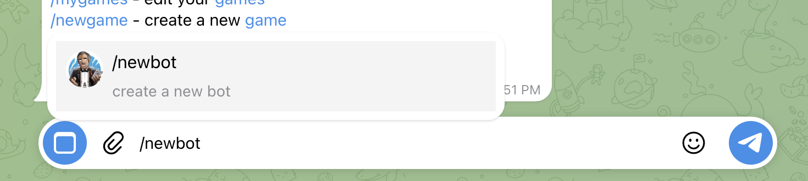
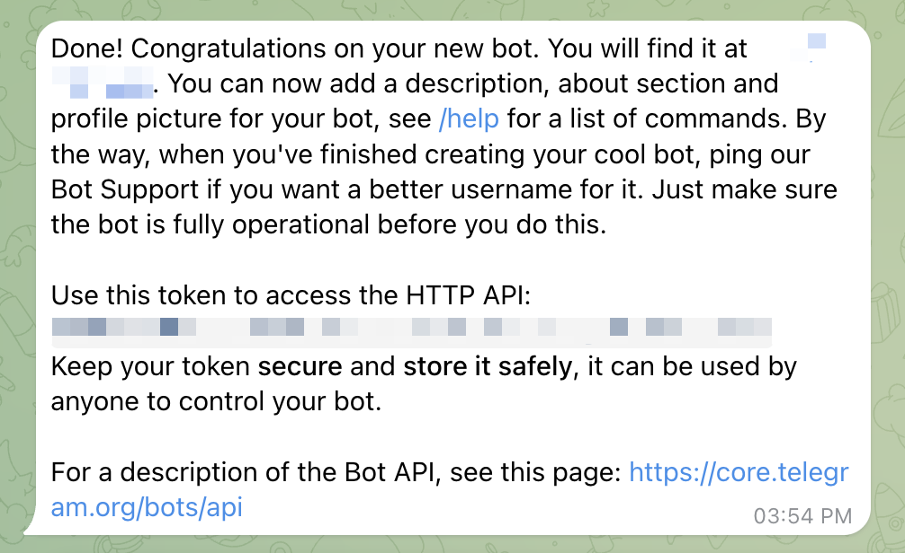
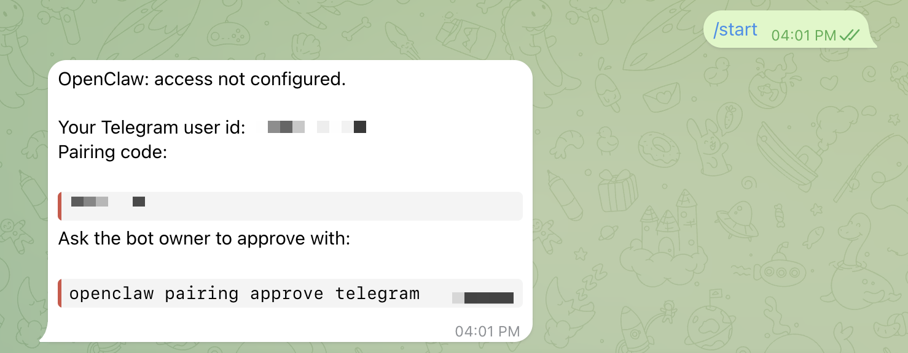

First, we're going to go find [BotFather](https://t.me/BotFather) on Telegram and then we're going to use the `/newbot` command.



You'll be asked to give your bot a name and then—subsequently—a username. When that is all set up, you'll get a token that you can use.



> [!WARNING]
> Anyone with that token can control your bot. Keep it secret and don't paste it into public chats or commit it to a repository.

From there, we'll use that token to set it up in OpenClaw as a channel.

```bash
openclaw channels add --channel telegram --token <YOUR_BOT_TOKEN>
```

Once you message your bot for the first time, you'll see that it's still going to need to be paired.



Run the approval command from the message on the machine hosting OpenClaw. Once we've done that, we should be good to go.

If other people may communicate with the agent, configure `session.dmScope` to `"per-channel-peer"`.

Once you can talk to your bot, read [Choosing a DM Policy](choosing-a-dm-policy.md) to decide who else should be able to.
