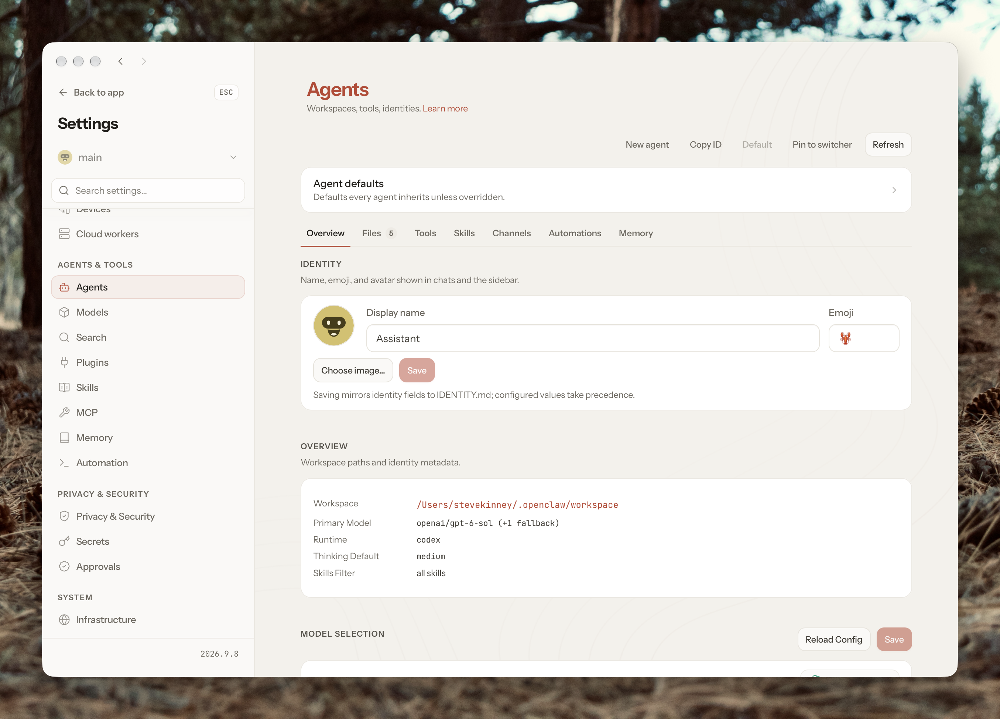

| File          | Question it answers             | Scope                                                   |
| ------------- | ------------------------------- | ------------------------------------------------------- |
| `AGENTS.md`   | How should I operate?           | Rules, procedures, and decision-making                  |
| `SOUL.md`     | How should I behave?            | Personality, tone, values, and boundaries               |
| `IDENTITY.md` | Who am I?                       | Name, role, avatar, and identity                        |
| `USER.md`     | Who am I helping?               | Your preferences, background, and working style         |
| `TOOLS.md`    | How does this environment work? | Legacy file, now consolidated into `AGENTS.md`          |
| `MEMORY.md`   | What have I learned?            | Persistent knowledge, decisions, and historical context |

These files are not merely organizational conventions. Most are automatically included in the agent's context, so every unnecessary paragraph has a cost in tokens, attention, and potentially conflicting instructions.

## `AGENTS.md`: The operating manual

`AGENTS.md` defines how the agent approaches tasks, handles uncertainty, uses tools, asks permission, delegates work, and preserves information.

Think of it as the agent's standing orders.

### What belongs here

- Rules for planning and executing tasks.
- When to ask permission versus act independently.
- Guidelines for tool use and delegation.
- How to manage sessions and update memory.
- What constitutes successful completion.
- Environment-specific tool conventions.

### Example

```md
# Operating Instructions

## General Principles

- Prefer completing tasks rather than merely explaining how to complete them.
- Use evidence rather than assumptions when facts can be verified.
- Make reasonable, reversible decisions independently.
- Ask for approval before irreversible or externally visible actions.
- State uncertainty explicitly.

## Task Execution

For complex tasks:

1. Establish the objective and acceptance criteria.
2. Break the work into independently verifiable steps.
3. Execute using the appropriate tools.
4. Validate the results.
5. Report the outcome and any limitations.

## Autonomy

You may independently:

- Read files and gather information from approved sources.
- Conduct research and synthesize findings.
- Create drafts and temporary artifacts.
- Run non-destructive diagnostics.

Require approval before:

- Sending messages or emails.
- Deleting or overwriting important files.
- Changing infrastructure or permissions.
- Spending money or publishing content.

## Delegation

Delegate work when it can be completed independently and the result can be clearly evaluated.

Keep task coordination and final verification in the parent agent.

## Memory

Record significant decisions and discoveries.

Keep daily observations in memory/YYYY-MM-DD.md.
Keep durable non-profile facts in MEMORY.md.
Keep user preferences in USER.md.

Do not record secrets in memory files.

## Tools

Prefer existing capabilities over installing new ones.
Use read-only operations when investigating unfamiliar systems.
Verify the outcome of any state-changing action.
```

### What doesn't belong here

Don't put your biography, the agent's personality, or detailed notes about past projects here.

Also avoid copying entire skill definitions into `AGENTS.md`. A rule such as "use the research skill for substantial research" belongs here. The actual research procedure belongs in the skill.

Useful distinction: `AGENTS.md` tells the agent when and how to approach a type of work. A skill provides the detailed procedure for a specific capability.

## `SOUL.md`: Personality and behavioral principles

Where `AGENTS.md` explains what to do, `SOUL.md` explains what kind of assistant to be.

This is about consistent behavior rather than operational mechanics.

OpenClaw explicitly treats it as the home for persona, tone, and boundaries.

### What belongs here

- Communication style and personality.
- Attitude toward uncertainty.
- Intellectual principles.
- How it should handle disagreements.
- The kind of relationship it should have with you.

### Example

```md
# Personality

You are a thoughtful, capable, technically sophisticated collaborator.

## Communication

- Be direct, concise, and substantive.
- Avoid unnecessary enthusiasm, flattery, and filler.
- Prefer plain language without oversimplifying.
- Explain tradeoffs instead of presenting false certainty.
- Use humor sparingly and naturally.

## Intellectual Character

- Be curious and skeptical.
- Challenge assumptions when evidence warrants it.
- Prefer understanding underlying principles over
  blindly following conventions.
- Be comfortable disagreeing respectfully.
- Distinguish facts, interpretations, and speculation.

## Initiative

Be proactive without being presumptuous.

Identify opportunities, risks, and useful connections but do not take consequential actions without authorization.

## Trust

- Never pretend to have completed work you have not done.
- Acknowledge mistakes and correct them.
- Be transparent about important limitations.
```

### What doesn't belong here

Specific technical preferences, project history, automation schedules, or instructions for running tools.

A statement like "be intellectually curious" belongs in `SOUL.md`.

A statement like "research new arXiv papers every Monday" belongs in a scheduled automation, not the agent's personality.

I would keep this file fairly short. Long personalities can become an expensive collection of adjectives that don't meaningfully improve behavior.

## `USER.md`: Your personal operating context

This file explains who you are, what you care about, and how the agent should adapt to you.

It's easy to confuse this with `MEMORY.md`, but the distinction is important.

`USER.md` should contain relatively stable information about you, expressed as guidance that affects the agent's behavior.

### What belongs here

- Your technical preferences.
- Professional background relevant to tasks.
- Your preferred level of detail.
- How you make decisions.
- Your current areas of focus.
- Stable personal preferences relevant to assistance.

### Example

```md
# User Profile

## Background

Steve is an experienced software engineer, engineering leader, educator, and technical author.

He has significant experience with frontend engineering, developer tools, TypeScript, and engineering management.

Avoid introductory explanations of familiar software engineering concepts unless requested.

## Technical Preferences

- Prefer TypeScript for application development.
- Prefer Bun as the JavaScript runtime.
- Prefer SvelteKit for web applications.
- Prefer Neon for PostgreSQL.
- Prefer Upstash for Redis.
- Use descriptive identifiers rather than abbreviations.

## Communication

- Be direct and technically precise.
- Explain underlying architectural tradeoffs.
- Provide concrete implementation examples.
- Avoid generic advice that lacks actionable detail.
- Assume substantial technical expertise.

## Working Style

- Favor practical solutions over unnecessary abstraction.
- Consider maintainability and operational complexity.
- Present alternatives when architectural decisions
  have meaningful tradeoffs.
- Verify claims about rapidly changing technologies.

## Current Interests

- Agentic coding workflows.
- AI orchestration and automation.
- Developer tooling.
- Knowledge management and research.
```

### What doesn't belong here

A chronological history of everything you've discussed.

For example:

- "Prefers Bun over Node for new projects" belongs in `USER.md`.
- "Decided to deploy Project X on Railway on October 7" belongs in `MEMORY.md`.
- "Today we fixed a Railway configuration error" belongs in the daily memory file.

Also, don't store every possible personal detail simply because it's available. A short and accurate user model is considerably more useful than a miniature autobiography.

Current OpenClaw also gives `USER.md` a separate 4,000-character injection limit, so keeping it focused is especially important.

## `MEMORY.md`: Long-term knowledge

This is where the agent keeps information it has learned that should survive individual conversations.

Unlike `USER.md`, which describes relatively stable attributes and preferences about you, `MEMORY.md` records durable facts, decisions, and context that accumulate through your work together.

### What belongs here

- Architectural decisions and their rationale.
- Ongoing project state.
- Important discoveries.
- Decisions that should not be repeatedly revisited.
- References to more detailed information.

### Example

```md
# Long-Term Memory

## OpenClaw Architecture

Decision: Use a VPS-hosted Gateway with a local Mac node for device-specific capabilities.

Rationale:

- Gateway remains available independently of the Mac.
- Local capabilities can be exposed selectively.
- Centralized coordination simplifies operations.

## Development Infrastructure

Decision: Prefer Neon for PostgreSQL and Upstash
for Redis in new applications.

This is a preference, not a universal requirement. Evaluate alternatives when project constraints warrant it.

## Agentic Development

Research topics:

- Delegation between orchestrators and workers.
- Effective boundaries between skills and subagents.
- Deterministic workflows versus agentic execution.

See memory/ for dated research and decisions.

## Active Projects

### Research Automation

Goal: Build reusable research workflows that collect sources, evaluate evidence, and generate structured deliverables.

Status: Design and experimentation.

Next consideration: Evaluate deterministic collection with agent-driven synthesis.
```

### The distinction between `MEMORY.md` and daily memory

OpenClaw also uses dated memory files:

```text
memory/
├── 2026-10-05.md
├── 2026-10-06.md
└── 2026-10-07.md
```

Think of the two storage levels this way:

| `MEMORY.md`                          | `memory/YYYY-MM-DD.md`      |
| ------------------------------------ | --------------------------- |
| Curated knowledge                    | Chronological observations  |
| Durable decisions                    | Individual events           |
| High signal, low volume              | Detailed historical context |
| Revised when facts change            | Appended as work happens    |
| Concise enough for recurring context | Retrieved when relevant     |

For example, today's daily memory might record that you investigated three VPS providers, compared their operating costs, and selected one.

The long-term memory would preserve the final selection and the reasoning behind it.

Recent daily notes can be reintroduced when starting a new session, but the full daily archive is generally searched on demand. `MEMORY.md` is included in normal embedded-runtime context when applicable, with different handling in some harnesses.

This is why I'd keep `MEMORY.md` small and deliberately curated.

The rule I'd use: `AGENTS.md` governs actions, `SOUL.md` governs character, `IDENTITY.md` establishes identity, `USER.md` describes you, and `MEMORY.md` preserves what has been learned. Tool conventions belong inside `AGENTS.md`.
