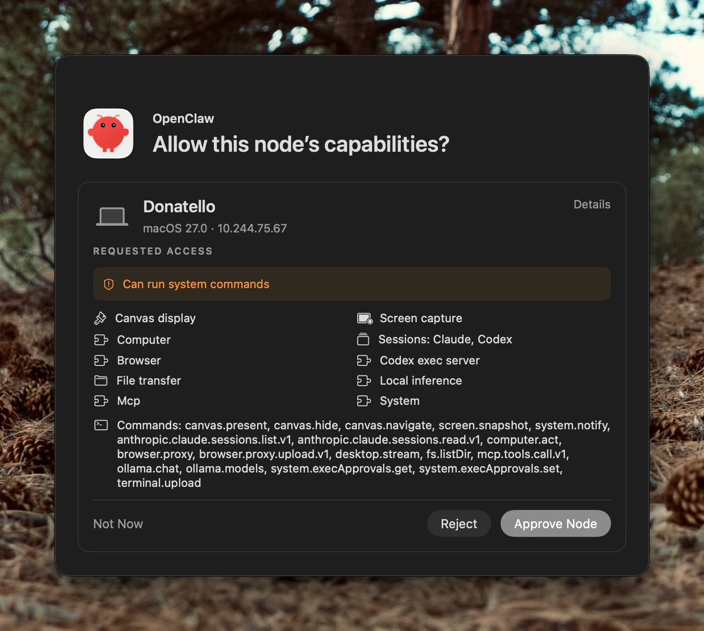

So far, everything has run on a single machine. A common next step is to put the **Gateway** on an always-on server and keep your Mac as a **node**: a machine that connects _to_ the Gateway and offers it capabilities that have to happen on the Mac, like running a command, driving a browser, or taking a screenshot.

The split looks like this:

- **The Gateway is the coordinator.** It receives channel messages, runs the agent, talks to your model provider, and owns sessions, credentials, and state.
- **The node is a capability provider.** It isn't a second Gateway or an independent assistant. (And "node" here is an OpenClaw role—it has nothing to do with the Node.js runtime.)

The Mac opens an outbound WebSocket to the Gateway, and that one connection carries traffic in both directions. That means your laptop never has to expose a command server to the internet.

> [!WARNING] Pairing extends the Gateway's reach into your Mac
> Once a node is approved, a compromised Gateway can ask it to do whatever you allowed. Putting the Gateway on a server improves availability; it doesn't protect the Mac. Keep the approved capability set small.

## Before You Start

You'll need:

- A remote Gateway that is already running, with authentication turned on.
- A private way to reach it. This lesson assumes Tailscale Serve, with your Mac signed in to the same tailnet. If you haven't set that up, start with [Connecting to Your OpenClaw Securely with Tailscale](connecting-securely-with-tailscale.md). An SSH tunnel works too, and there's a note on it in step 3.
- The Gateway credential (token or password) you set up when you deployed it.

Keep three questions separate, because passing one doesn't answer the others:

| Question                           | Layer                     |
| ---------------------------------- | ------------------------- |
| Can this Mac reach the Gateway?    | Network access            |
| Is this device allowed to connect? | Authentication            |
| What may it actually do?           | Tool and execution policy |

## Step 1: Confirm the Gateway Is Healthy and Private

On the machine running the Gateway, check that it's up and listening only on loopback, with Tailscale Serve publishing it privately:

```sh
openclaw config set gateway.bind loopback
openclaw config set gateway.tailscale.mode serve
openclaw gateway restart
openclaw gateway status
tailscale serve status
```

The Gateway's ordinary listener stays on `127.0.0.1:18789`, and Serve publishes HTTPS on port 443. Don't open port 18789 to the public internet to make the Mac connect—keeping that listener private is the entire point.

Use `serve`, not `funnel`. Funnel makes the endpoint public, which is the wrong choice here.

`tailscale serve status` should show a hostname that looks something like this. You'll use it in a moment.

```text
https://gateway-host.your-tailnet.ts.net
```

## Step 2: Set an Execution Policy on the Mac First

**Do this before you pair.** Out of the box, a node's local exec approvals default to `full` with `ask` turned off. A node that connects before its policy is written will run commands without asking.

On the Mac, apply a conservative starting policy:

```sh
openclaw approvals set --stdin <<'JSON'
{
  "version": 1,
  "defaults": {
    "security": "allowlist",
    "ask": "always",
    "askFallback": "deny",
    "autoAllowSkills": false
  },
  "agents": {}
}
JSON
```

Then read it back to make sure it took:

```sh
openclaw approvals get
```

A few things worth knowing:

- With no target flag, `approvals` reads and writes the **local** document, which is what you want on the Mac.
- `set` **replaces** the whole document. On a machine that already has rules, run `openclaw approvals get` first and preserve what's there.
- An approval policy is not a filesystem sandbox. An approved command runs with whatever access your macOS account has.
- For what `security`, `ask`, and `askFallback` mean, and how approvals reach you, see [Security and Approvals](security-and-approvals.md#layer-3-exec-approvals).

## Step 3: Choose How to Connect the Mac

Pick **one** of these. The desktop app already embeds the node runtime, so running a separate headless node next to it gives one machine two identities.

- **The macOS app** is the better choice when you want native features like notifications, screen capture, or computer control alongside command execution.
- **A headless node** is the better choice for a machine with no desktop session.

> [!NOTE] Using an SSH tunnel instead of Tailscale
> If you'd rather tunnel to a loopback-bound Gateway, forward a local port on the Mac to it, then connect to that forwarded port instead of the Tailscale hostname:
>
> ```sh
> ssh -N -o ExitOnForwardFailure=yes \
>   -L 127.0.0.1:18790:127.0.0.1:18789 \
>   openclaw@gateway-host
> ```

### Option A: The macOS App

1. Open the OpenClaw app and go to **Settings → Connection**.
2. Choose **Remote (another host)**.
3. Select **Direct (ws/wss)**.
4. Enter your Gateway address, using `wss://`:

   ```text
   wss://gateway-host.your-tailnet.ts.net
   ```

5. Enter the Gateway credential.
6. Run the connection test.

Use the **primary remote connection** for the node relationship. Adding a saved Gateway dashboard is a different thing—that just bookmarks the Control UI and doesn't make your Mac a node.

### Option B: A Headless Node

1. Install the CLI without running onboarding. You're installing a node host, not a second Gateway:

   ```sh
   curl -fsSL -o openclaw-install.sh https://openclaw.ai/install.sh
   less openclaw-install.sh
   bash openclaw-install.sh --no-onboard
   ```

2. On the Gateway's **Devices** page, create a setup link. It looks like `oc-pair://<setup-code>`.

   > [!WARNING]
   > Treat the setup link like a password. Don't paste it into chat and don't commit it.

3. Run the node in the foreground using that link:

   ```sh
   openclaw node run --pair "oc-pair://<setup-code>" --display-name "MacBook"
   ```

4. Once the foreground connection works, install it as a background service. Use the same hostname, port, and TLS settings so it matches the saved connection:

   ```sh
   openclaw node install --host gateway-host.your-tailnet.ts.net --port 443 --tls --display-name "MacBook"
   openclaw node start
   openclaw node status
   ```

Leave `--commands` off for now. It narrows the advertised command set, but it also disables skill publication, plugin tools, MCP servers, computer use, and worker hosting.

## Step 4: Approve the Node

Connecting isn't the same as being trusted. There are two separate approvals:

| Approval         | What it decides                                    |
| ---------------- | -------------------------------------------------- |
| Device approval  | Is this device identity allowed to connect at all? |
| Command approval | Which advertised capabilities may it provide?      |

When the node asks for its capabilities, you'll see a prompt like this.



Read it before you click anything:

- **The node's name and platform** at the top should be the machine you meant to pair.
- **Requested access** is the headline. "Can run system commands" is the big one, and it's the reason Step 2 came first.
- **The capability list** (canvas, screen capture, browser, file transfer, MCP, and so on) is what the node is _asking_ to offer.
- **The command list** at the bottom is the exact set of operations it advertises.

Those are claims, not grants. A capability only works at the intersection of what the node advertises, what you approve, the Gateway's policy, your local execution policy, and what macOS permits. Choose **Approve Node** to proceed, **Reject** to refuse, or **Not Now** to decide later.

You can do the same thing from the Gateway's command line. The two request IDs are different, so copy the right one each time:

```sh
openclaw devices list
openclaw devices approve "<device-request-id>"
# reconnect the node, then:
openclaw nodes pending
openclaw nodes approve "<node-request-id>"
```

Some enrollment paths approve both stages for you, so don't be surprised if you only see one prompt. If the node later asks for more capabilities, expect to be asked again.

## Step 5: Verify the Connection

On the Gateway, confirm the node is connected and look at what it was approved for:

```sh
openclaw nodes status
openclaw nodes describe --node "<node-id>"
```

When you refer to a node in configuration, use its **node ID** rather than its display name.

Then check that the Mac has the tools you expect. This looks for executables without running them:

```sh
openclaw nodes invoke --node "<node-id>" --command system.which \
  --params '{"bins":["git","node","bun"]}'
```

If you chose the app and want native features, macOS will also ask for its own permissions for features like screen capture. Grant only the ones you intend to use. A healthy connection says nothing about whether those are available.

## Step 6: Send Work to the Node on Purpose

Connecting a node does **not** send commands to it. By default, `host=auto` won't pick the node for you. To run something on the Mac, say so explicitly:

```text
/exec host=node security=allowlist node=<node-id>
```

To make the node the default for a session, set `tools.exec.host=node`. If more than one node can run commands, choose a target per call or bind exec to one.

An offline target is **rejected, not redirected**. If your Mac is asleep, the command fails instead of quietly running on the server. That's what you want.

> [!NOTE] Want a coding agent on your Mac?
> A paired node doesn't make ACP run on it. ACP harnesses run on the Gateway host. Native Codex can use a node, and [ACP and Mac Nodes](acpx-runtime-plugin.md#acp-and-mac-nodes) covers what works and what doesn't.

## Step 7: Run an Acceptance Test

A connectivity check isn't enough. Prove the failure mode works too:

1. Ask the agent for something that needs the Mac, like listing a folder on your laptop. It should succeed.
2. Disconnect the Mac on purpose: quit the app, stop the node service, or turn off Tailscale.
3. Ask for a task that only needs the Gateway. It should still work.
4. Ask for the Mac task again. The agent should tell you the node is unavailable instead of falling back to another machine.

A saved pairing record doesn't mean the node is connected right now, so design your workflows to report a missing node rather than assume one.

## Troubleshooting

| Symptom                                     | First thing to check                                          |
| ------------------------------------------- | ------------------------------------------------------------- |
| The Mac can't connect                       | Gateway health, the endpoint, Tailscale, and authentication   |
| The Control UI works but Mac features don't | Whether the node is connected and which commands you approved |
| A command runs on the server                | The `exec` host and node selection                            |
| A command is denied                         | Gateway tool policy, local approvals, and session overrides   |
| Screen capture or computer control fails    | macOS permissions                                             |

These commands cover most investigations:

```sh
openclaw gateway status
openclaw nodes status
openclaw nodes pending
openclaw logs --follow
```

## Removing a Node

To revoke a node, run this on the Gateway:

```sh
openclaw nodes remove --node "<node-id>"
```

That revokes the device's `node` role and disconnects its node-role sessions. If the same device holds other roles, those need to be revoked separately.

> [!NOTE] Commands and flags change
> The flags above match OpenClaw `2026.9.8`. If a command doesn't behave the way it's described here, run it with `--help` and check the [OpenClaw documentation](https://docs.openclaw.ai).
