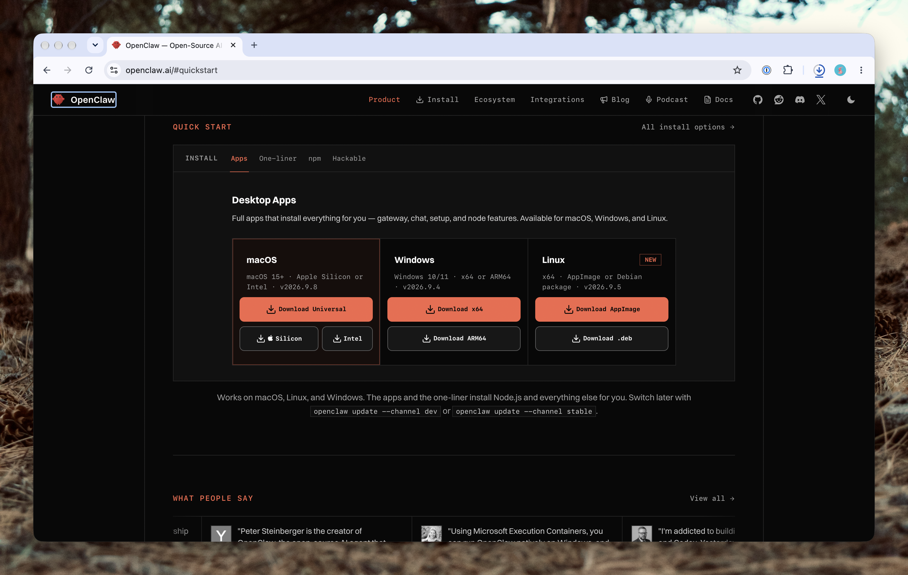
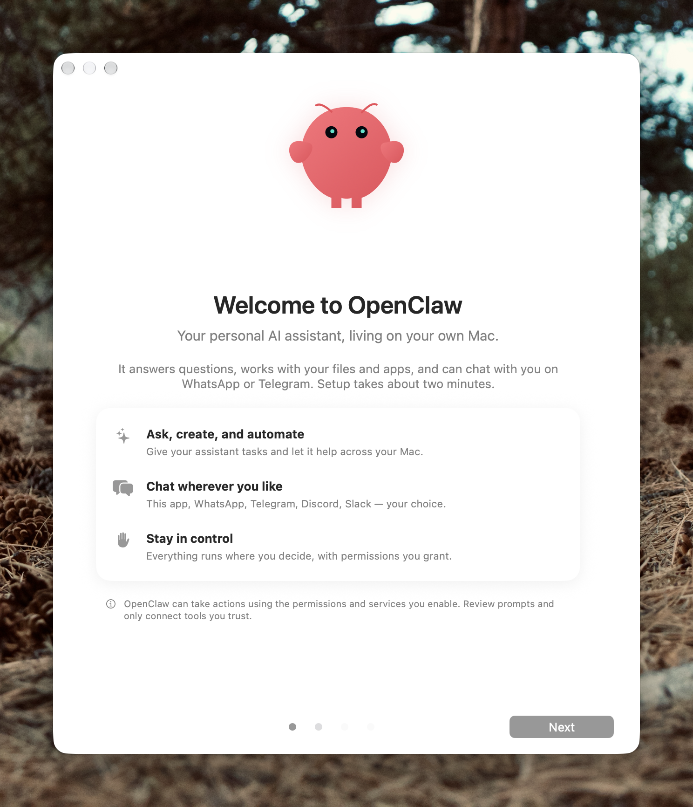
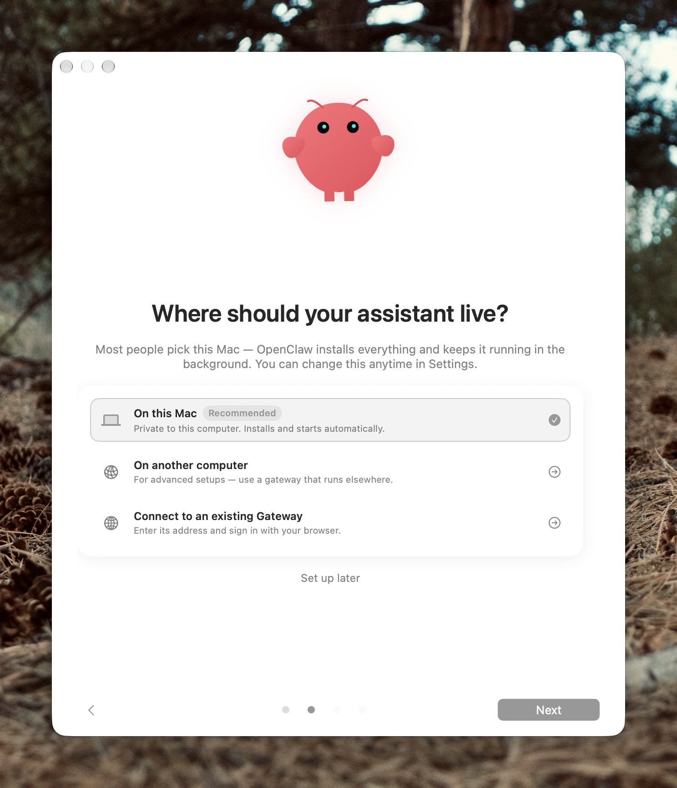
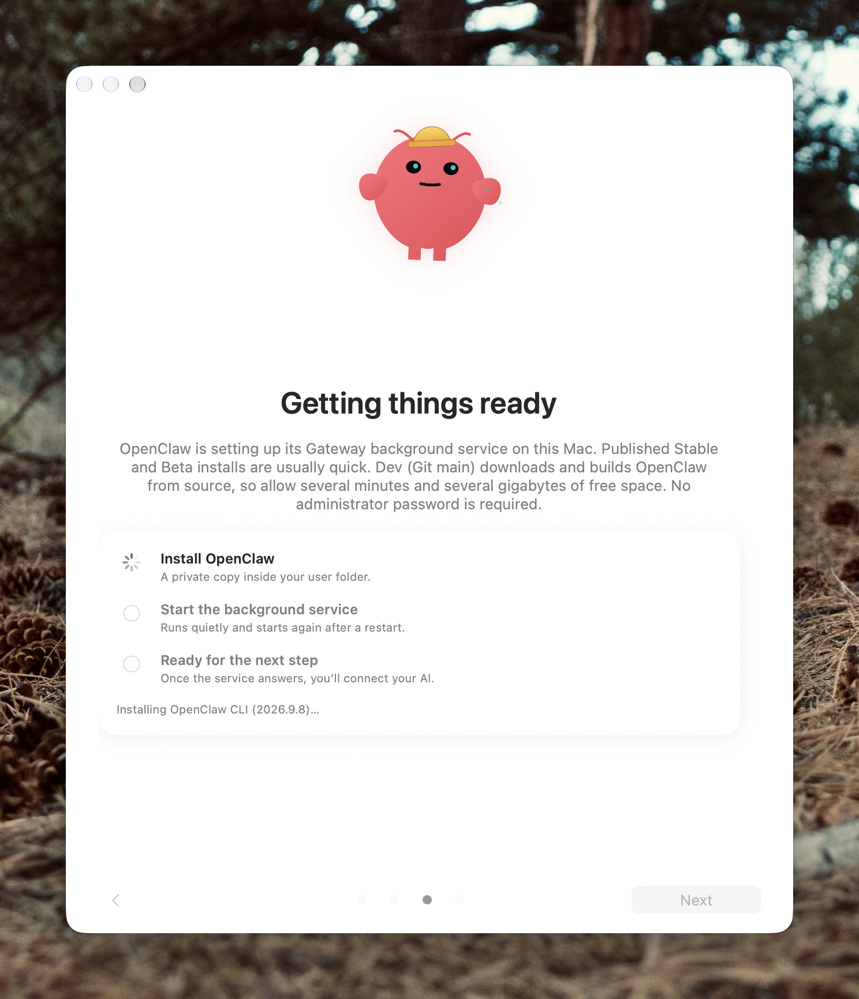
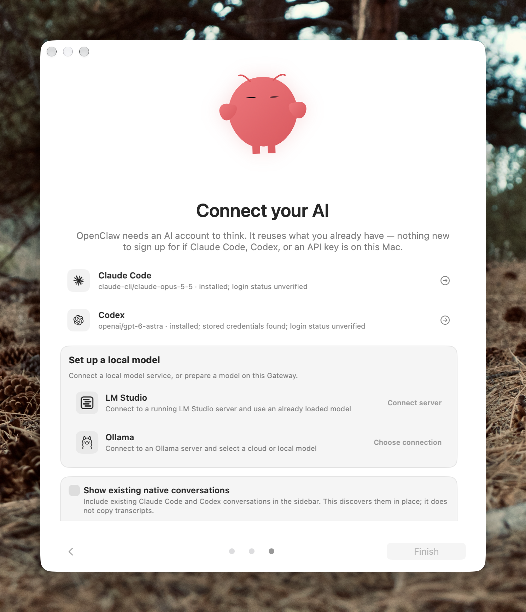
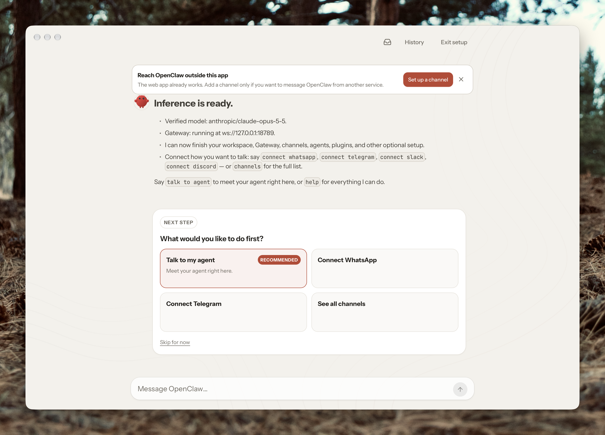

You can download the application from the [OpenClaw website](https://openclaw.ai).



Alternatively, you can run this from the command line:

```sh
curl -fsSL https://openclaw.ai/install.sh | bash
```

If we hop over to the desktop application, we'll see something that looks like this.



You can use the application to install OpenClaw onto your computer or connect to a remote OpenClaw gateway. For our purposes, we'll install it locally on this machine.



It will then go ahead and get itself all installed and configured.



You can go ahead and let it cook—it'll take a bit before it's ready. It's also installing the CLI and the background agent so that OpenClaw will continue working even when you've closed the application—as long as your computer is running.

Once that's rocking and rolling, you can go through the process of connecting it to our model provider of choice.



And once you've done that—you should be ready to rock and roll.



My advice at this point is to run `openclaw doctor` or `openclaw doctor --fix` to have it audit your setup and make any adjustments.
