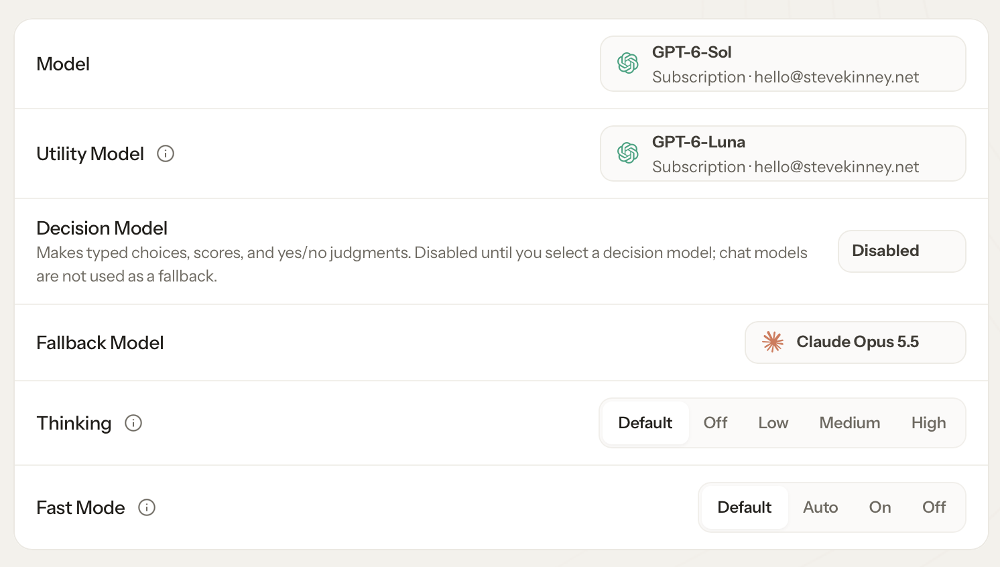

Once we've finished up with [installation](installation.md), we're going to want to do a little of setup in order to get our OpenClaw instance rocking.

The first thing we're going to want to do is set up which models we're going to use. This, of course, is a personal decision—but, here are some sensible defaults.



## Tweaking Your Security Settings

**Optional**: Out of the box, OpenClaw has full access to run commands. One thing you _might_ want to consider doing is to have it ask you for permission before running anything that isn't on an allowlist.

```bash
openclaw exec-policy preset cautious
```

Run this on the machine where the Gateway runs. [Security and Approvals](security-and-approvals.md) explains what it changes, how approval requests reach you, and the rest of OpenClaw's safety controls.
